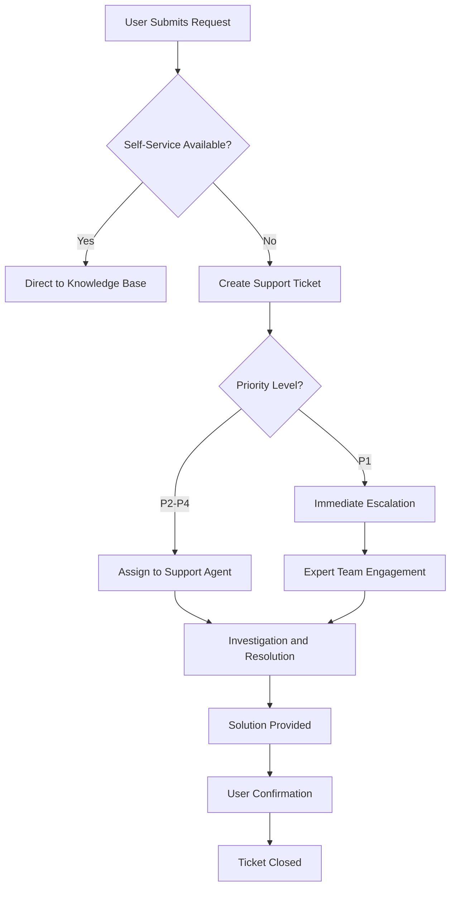

# A014 - Collaboration Platform Training Materials

**WBS:** 1.1.2.2.2  
**Task:** Set Up Collaboration Platforms and Tools - Training Component  
**Date:** August 8, 2025  
**Version:** 1.0

## Executive Summary

This document provides comprehensive training materials for collaboration platforms and tools within the ICT Governance Framework. The materials are designed to ensure effective adoption, proper usage, and compliance with governance policies across all user groups.

## Table of Contents

1. [Training Program Overview](#training-program-overview)
2. [Learning Paths by Role](#learning-paths-by-role)
3. [Platform-Specific Training Modules](#platform-specific-training-modules)
4. [Hands-On Exercises](#hands-on-exercises)
5. [Assessment and Certification](#assessment-and-certification)
6. [Training Resources](#training-resources)
7. [Support and Help Desk](#support-and-help-desk)
8. [Training Delivery Methods](#training-delivery-methods)
9. [Training Schedule](#training-schedule)
10. [Success Metrics](#success-metrics)

## Training Program Overview

### Training Objectives

1. **Platform Proficiency** - Users can effectively use collaboration platforms
2. **Governance Compliance** - Users understand and follow governance policies
3. **Security Awareness** - Users apply security best practices
4. **Productivity Enhancement** - Users leverage platforms for improved efficiency
5. **Change Adoption** - Users embrace new tools and processes

### Training Principles

- **Role-Based Learning** - Content tailored to specific job functions
- **Progressive Complexity** - Building from basic to advanced concepts
- **Practical Application** - Hands-on exercises and real scenarios
- **Continuous Learning** - Ongoing updates and refresher training
- **Multi-Modal Delivery** - Various learning formats to suit preferences

### Target Audiences

| Audience | Size | Priority | Training Depth |
|----------|------|----------|----------------|
| **Executive Leadership** | 15 | High | Strategic overview |
| **ICT Governance Council** | 25 | Critical | Comprehensive |
| **Domain Owners** | 50 | High | Advanced |
| **Technology Stewards** | 100 | High | Technical deep-dive |
| **Technology Custodians** | 200 | Medium | Operational focus |
| **General IT Staff** | 500 | Medium | Standard user |
| **Business Users** | 2000 | Low | Basic usage |
| **External Partners** | 100 | Low | Limited access |

## Learning Paths by Role

### 1. Executive Leadership Path

**Duration:** 4 hours (2 sessions)  
**Format:** Executive briefings and demonstrations

#### Module 1: Strategic Overview (2 hours)
- **Governance Platform Value Proposition**
  - Business benefits and ROI
  - Strategic alignment with organizational goals
  - Competitive advantages
  - Risk mitigation

- **Platform Ecosystem Overview**
  - High-level architecture
  - Integration points
  - Governance controls
  - Compliance features

#### Module 2: Executive Dashboard and Reporting (2 hours)
- **Governance Dashboards**
  - Key performance indicators
  - Compliance metrics
  - Risk indicators
  - Trend analysis

- **Executive Reporting**
  - Automated report generation
  - Custom report creation
  - Data interpretation
  - Decision support

### 2. ICT Governance Council Path

**Duration:** 16 hours (4 sessions)  
**Format:** Interactive workshops and simulations

#### Module 1: Governance Framework Integration (4 hours)
- **Platform Governance Model**
  - Governance structure within platforms
  - Decision-making processes
  - Escalation procedures
  - Accountability frameworks

- **Policy Implementation**
  - Policy enforcement mechanisms
  - Compliance monitoring
  - Exception management
  - Audit trails

#### Module 2: Strategic Platform Management (4 hours)
- **Platform Strategy Development**
  - Platform roadmap planning
  - Technology evaluation
  - Vendor management
  - Investment decisions

- **Risk and Compliance Management**
  - Risk assessment frameworks
  - Compliance monitoring
  - Incident response
  - Regulatory requirements

#### Module 3: Performance Monitoring (4 hours)
- **Metrics and KPIs**
  - Platform performance metrics
  - User adoption tracking
  - Compliance measurements
  - ROI analysis

- **Continuous Improvement**
  - Feedback collection
  - Process optimization
  - Technology updates
  - Best practice sharing

#### Module 4: Governance Simulation (4 hours)
- **Scenario-Based Exercises**
  - Policy violation scenarios
  - Security incident response
  - Platform failure recovery
  - Compliance audit simulation

### 3. Domain Owners Path

**Duration:** 12 hours (3 sessions)  
**Format:** Technical workshops and case studies

#### Module 1: Domain-Specific Platform Management (4 hours)
- **Platform Administration**
  - User management
  - Permission configuration
  - Content organization
  - Workflow setup

- **Domain Governance Implementation**
  - Domain-specific policies
  - Compliance requirements
  - Risk management
  - Performance monitoring

#### Module 2: Advanced Configuration (4 hours)
- **Custom Solutions Development**
  - Power Platform applications
  - Workflow automation
  - Integration development
  - Custom reporting

- **Security and Compliance**
  - Security configuration
  - Data protection
  - Access controls
  - Audit preparation

#### Module 3: Team Leadership and Training (4 hours)
- **Team Management**
  - User onboarding
  - Training delivery
  - Performance monitoring
  - Issue resolution

- **Change Management**
  - Change communication
  - Adoption strategies
  - Resistance management
  - Success measurement

### 4. Technology Stewards Path

**Duration:** 20 hours (5 sessions)  
**Format:** Technical deep-dive and hands-on labs

#### Module 1: Platform Architecture (4 hours)
- **Technical Architecture**
  - Platform components
  - Integration patterns
  - Data flows
  - Security models

- **Infrastructure Requirements**
  - System requirements
  - Network configuration
  - Performance optimization
  - Scalability planning

#### Module 2: Advanced Administration (4 hours)
- **System Configuration**
  - Advanced settings
  - Custom configurations
  - Performance tuning
  - Troubleshooting

- **Automation and Scripting**
  - PowerShell automation
  - API integration
  - Workflow development
  - Monitoring scripts

#### Module 3: Security Implementation (4 hours)
- **Security Configuration**
  - Identity management
  - Access controls
  - Data protection
  - Threat detection

- **Compliance Management**
  - Compliance frameworks
  - Audit preparation
  - Evidence collection
  - Reporting automation

#### Module 4: Integration Development (4 hours)
- **API Development**
  - REST API usage
  - Custom connectors
  - Data integration
  - Error handling

- **Custom Solutions**
  - Power Platform development
  - SharePoint customization
  - Teams app development
  - DevOps extensions

#### Module 5: Monitoring and Optimization (4 hours)
- **Performance Monitoring**
  - Monitoring tools
  - Performance metrics
  - Capacity planning
  - Optimization techniques

- **Troubleshooting and Support**
  - Issue diagnosis
  - Problem resolution
  - Escalation procedures
  - Documentation

## Platform-Specific Training Modules

### Microsoft Teams Training

#### Basic User Training (2 hours)
```markdown
# Microsoft Teams Fundamentals

## Learning Objectives
- Navigate Teams interface effectively
- Participate in team conversations
- Join and manage meetings
- Share files and collaborate

## Module Content

### 1. Teams Interface Overview (30 minutes)
- Teams navigation
- Activity feed
- Chat functionality
- Calendar integration

### 2. Team Collaboration (45 minutes)
- Joining teams and channels
- Posting messages and replies
- @mentions and notifications
- File sharing and co-authoring

### 3. Meetings and Calls (30 minutes)
- Scheduling meetings
- Joining meetings
- Screen sharing
- Recording meetings

### 4. Governance and Best Practices (15 minutes)
- Naming conventions
- Information classification
- External sharing policies
- Security considerations

## Hands-On Exercise
Create a project team, add members, schedule a meeting, and share a document for collaboration.

## Assessment
- 10-question quiz on Teams functionality
- Practical demonstration of key features
```

#### Advanced User Training (4 hours)
```markdown
# Microsoft Teams Advanced Features

## Learning Objectives
- Configure advanced team settings
- Develop custom solutions
- Implement governance controls
- Optimize team productivity

## Module Content

### 1. Advanced Team Management (60 minutes)
- Team templates and policies
- Channel moderation
- Guest access management
- Team analytics

### 2. Apps and Integration (60 minutes)
- Installing and configuring apps
- Custom app development
- Power Platform integration
- Third-party connectors

### 3. Advanced Meeting Features (60 minutes)
- Live events and webinars
- Breakout rooms
- Meeting policies
- Recording management

### 4. Governance and Compliance (60 minutes)
- Information barriers
- Retention policies
- eDiscovery
- Compliance reporting

## Hands-On Lab
Build a custom Teams app using Power Platform and implement governance controls.
```

### SharePoint Online Training

#### Document Management Training (3 hours)
```markdown
# SharePoint Document Management

## Learning Objectives
- Organize documents effectively
- Implement version control
- Configure permissions
- Automate workflows

## Module Content

### 1. Site and Library Structure (45 minutes)
- Site hierarchy planning
- Document library creation
- Folder organization
- Metadata implementation

### 2. Document Lifecycle Management (60 minutes)
- Version control
- Check-in/check-out
- Approval workflows
- Retention policies

### 3. Permissions and Security (45 minutes)
- Permission inheritance
- Unique permissions
- External sharing
- Access reviews

### 4. Search and Discovery (30 minutes)
- Search configuration
- Metadata-driven search
- Content types
- Managed properties

## Practical Exercise
Set up a document library with proper metadata, permissions, and approval workflow.
```

### Azure DevOps Training

#### Project Management Training (4 hours)
```markdown
# Azure DevOps Project Management

## Learning Objectives
- Set up development projects
- Manage work items and sprints
- Configure CI/CD pipelines
- Implement governance controls

## Module Content

### 1. Project Setup (60 minutes)
- Project creation and configuration
- Team setup and permissions
- Area and iteration paths
- Work item customization

### 2. Agile Planning (60 minutes)
- Backlog management
- Sprint planning
- Kanban boards
- Reporting and analytics

### 3. Source Control (60 minutes)
- Git repository setup
- Branching strategies
- Pull request workflows
- Code review processes

### 4. CI/CD Implementation (60 minutes)
- Build pipeline creation
- Release pipeline setup
- Deployment strategies
- Monitoring and alerts

## Lab Exercise
Create a complete DevOps project with work items, repository, and CI/CD pipeline.
```

## Hands-On Exercises

### Exercise 1: Governance Team Setup

**Objective:** Create a complete governance team structure with proper channels and permissions.

**Duration:** 90 minutes

**Steps:**
1. **Team Creation (20 minutes)**
   ```powershell
   # Create ICT Governance team
   New-Team -DisplayName "ICT Governance Council" `
            -Description "Strategic governance oversight" `
            -Visibility Private
   ```

2. **Channel Configuration (30 minutes)**
   - Create standard channels (Policies, Metrics, Issues)
   - Configure channel settings and permissions
   - Add channel descriptions and welcome messages

3. **Member Management (20 minutes)**
   - Add team owners and members
   - Configure guest access policies
   - Set up external user access

4. **Integration Setup (20 minutes)**
   - Connect SharePoint document library
   - Add Power BI dashboard tab
   - Configure notification settings

**Deliverable:** Fully configured governance team ready for use

### Exercise 2: Document Library Implementation

**Objective:** Set up a governance document library with proper metadata and workflows.

**Duration:** 120 minutes

**Steps:**
1. **Library Creation (30 minutes)**
   - Create document library structure
   - Configure content types
   - Set up metadata columns

2. **Permission Configuration (30 minutes)**
   - Implement role-based permissions
   - Configure external sharing settings
   - Set up access reviews

3. **Workflow Implementation (45 minutes)**
   - Create approval workflow
   - Configure retention policies
   - Set up automated notifications

4. **Testing and Validation (15 minutes)**
   - Test document upload and approval
   - Verify permission inheritance
   - Validate workflow functionality

**Deliverable:** Production-ready document management system

### Exercise 3: DevOps Project Setup

**Objective:** Create a complete DevOps project for governance automation.

**Duration:** 150 minutes

**Steps:**
1. **Project Initialization (30 minutes)**
   - Create Azure DevOps project
   - Configure project settings
   - Set up team structure

2. **Repository Setup (45 minutes)**
   - Initialize Git repository
   - Create branch policies
   - Configure security settings

3. **Work Item Configuration (30 minutes)**
   - Create custom work item types
   - Configure process templates
   - Set up area and iteration paths

4. **Pipeline Development (45 minutes)**
   - Create build pipeline
   - Configure release pipeline
   - Set up automated testing

**Deliverable:** Complete DevOps environment for governance projects

## Assessment and Certification

### Assessment Framework

#### Knowledge Assessment
- **Multiple Choice Questions** - Platform functionality and features
- **Scenario-Based Questions** - Governance policy application
- **Technical Questions** - Configuration and troubleshooting

#### Practical Assessment
- **Hands-On Demonstrations** - Platform usage and configuration
- **Project Assignments** - Real-world implementation tasks
- **Peer Reviews** - Collaborative assessment approach

### Certification Levels

#### Level 1: Basic User Certification
**Requirements:**
- Complete basic training modules
- Pass knowledge assessment (80% minimum)
- Demonstrate core platform usage

**Validity:** 12 months

#### Level 2: Advanced User Certification
**Requirements:**
- Complete advanced training modules
- Pass comprehensive assessment (85% minimum)
- Complete practical project assignment

**Validity:** 18 months

#### Level 3: Platform Administrator Certification
**Requirements:**
- Complete all training modules
- Pass expert-level assessment (90% minimum)
- Demonstrate advanced configuration skills
- Complete mentoring assignment

**Validity:** 24 months

### Assessment Templates

#### Knowledge Assessment Template
```json
{
  "assessmentName": "Teams Basic User Assessment",
  "duration": 30,
  "passingScore": 80,
  "questions": [
    {
      "id": 1,
      "type": "multipleChoice",
      "question": "What is the primary purpose of Teams channels?",
      "options": [
        "A) Private messaging between users",
        "B) Organizing conversations by topic or project",
        "C) Storing files and documents",
        "D) Managing user permissions"
      ],
      "correctAnswer": "B",
      "explanation": "Channels organize team conversations around specific topics, projects, or departments."
    },
    {
      "id": 2,
      "type": "scenario",
      "question": "A team member shares a confidential document in a public channel. What should you do?",
      "options": [
        "A) Ignore it as it's not your responsibility",
        "B) Download the document for your records",
        "C) Notify the team owner immediately",
        "D) Share it with other team members"
      ],
      "correctAnswer": "C",
      "explanation": "Confidential documents should not be shared in public channels. The team owner should be notified to take appropriate action."
    }
  ]
}
```

#### Practical Assessment Rubric
```markdown
# Practical Assessment Rubric

## Teams Configuration Assessment

### Criteria 1: Team Setup (25 points)
- **Excellent (23-25):** Team created with proper naming, description, and privacy settings
- **Good (18-22):** Team created with minor configuration issues
- **Satisfactory (13-17):** Team created but missing key configurations
- **Needs Improvement (0-12):** Team not properly created or major issues

### Criteria 2: Channel Management (25 points)
- **Excellent (23-25):** All required channels created with proper settings and descriptions
- **Good (18-22):** Most channels created correctly with minor issues
- **Satisfactory (13-17):** Some channels created but missing configurations
- **Needs Improvement (0-12):** Channels not properly configured

### Criteria 3: Permission Configuration (25 points)
- **Excellent (23-25):** Permissions properly configured according to governance requirements
- **Good (18-22):** Permissions mostly correct with minor issues
- **Satisfactory (13-17):** Basic permissions set but some gaps
- **Needs Improvement (0-12):** Permissions not properly configured

### Criteria 4: Integration Setup (25 points)
- **Excellent (23-25):** All required integrations working correctly
- **Good (18-22):** Most integrations working with minor issues
- **Satisfactory (13-17):** Some integrations working
- **Needs Improvement (0-12):** Integrations not working or not configured

**Total Score: ___/100**
**Pass/Fail: ___** (Pass = 80+)
```

## Training Resources

### 1. Digital Learning Platform

#### Learning Management System Features
- **Course Catalog** - Organized by role and platform
- **Progress Tracking** - Individual and team progress monitoring
- **Certification Management** - Automated certificate generation
- **Resource Library** - Centralized training materials
- **Discussion Forums** - Peer learning and support

#### Content Types
- **Video Tutorials** - Step-by-step demonstrations
- **Interactive Simulations** - Hands-on practice environments
- **Documentation** - Comprehensive guides and references
- **Webinar Recordings** - Expert-led training sessions
- **Quick Reference Cards** - Printable job aids

### 2. Training Materials Library

#### Video Content
```markdown
# Video Training Library

## Microsoft Teams
- Teams Fundamentals (15 minutes)
- Advanced Teams Features (25 minutes)
- Teams Administration (30 minutes)
- Teams Security and Compliance (20 minutes)

## SharePoint Online
- SharePoint Basics (20 minutes)
- Document Management (30 minutes)
- Site Administration (35 minutes)
- SharePoint Security (25 minutes)

## Azure DevOps
- DevOps Overview (15 minutes)
- Project Management (40 minutes)
- Source Control (30 minutes)
- CI/CD Pipelines (45 minutes)

## Power Platform
- Power Platform Introduction (20 minutes)
- Power Apps Development (60 minutes)
- Power Automate Workflows (45 minutes)
- Power BI Reporting (50 minutes)
```

#### Documentation Library
- **User Guides** - Step-by-step instructions for common tasks
- **Administrator Guides** - Advanced configuration and management
- **Best Practices** - Recommended approaches and standards
- **Troubleshooting Guides** - Common issues and solutions
- **Policy Documents** - Governance policies and procedures

#### Quick Reference Materials
```markdown
# Teams Quick Reference Card

## Essential Shortcuts
- Ctrl + N: Start new chat
- Ctrl + Shift + M: Mute/unmute in meeting
- Ctrl + Shift + O: Turn camera on/off
- Ctrl + E: Search

## Channel Best Practices
- Use descriptive channel names
- Pin important messages
- Use @mentions sparingly
- Follow naming conventions

## Security Reminders
- Verify external participants
- Use appropriate sharing settings
- Report suspicious activity
- Follow data classification guidelines
```

### 3. Interactive Learning Tools

#### Virtual Labs
- **Sandbox Environments** - Safe practice environments
- **Guided Tutorials** - Step-by-step interactive guides
- **Scenario Simulations** - Real-world problem solving
- **Assessment Labs** - Practical skill evaluation

#### Mobile Learning App
```json
{
  "appName": "ICT Governance Learning",
  "features": [
    "Offline content access",
    "Push notifications for new content",
    "Progress synchronization",
    "Quick reference lookup",
    "Assessment taking",
    "Discussion forums"
  ],
  "platforms": ["iOS", "Android", "Windows"],
  "integration": "Learning Management System"
}
```

## Support and Help Desk

### 1. Support Structure

#### Tier 1: Self-Service Support
- **Knowledge Base** - Searchable articles and FAQs
- **Video Library** - How-to videos and tutorials
- **Community Forums** - Peer-to-peer support
- **Chatbot** - Automated assistance for common questions

#### Tier 2: Help Desk Support
- **Email Support** - governance-help@company.com
- **Phone Support** - 1-800-GOV-HELP
- **Live Chat** - Real-time assistance during business hours
- **Ticket System** - Formal issue tracking and resolution

#### Tier 3: Expert Support
- **Platform Specialists** - Deep technical expertise
- **Governance Consultants** - Policy and process guidance
- **Escalation Team** - Complex issue resolution
- **Vendor Support** - Direct Microsoft support channel

### 2. Support Procedures

#### Issue Classification
```markdown
# Support Issue Classification

## Priority 1: Critical (Response: 1 hour)
- Platform outages affecting multiple users
- Security incidents or breaches
- Data loss or corruption
- Compliance violations

## Priority 2: High (Response: 4 hours)
- Single user unable to access platform
- Feature not working as expected
- Performance issues
- Configuration problems

## Priority 3: Medium (Response: 1 business day)
- Training requests
- How-to questions
- Feature requests
- Documentation updates

## Priority 4: Low (Response: 3 business days)
- General inquiries
- Enhancement suggestions
- Best practice guidance
- Non-urgent documentation
```

#### Support Workflow


### 3. Knowledge Management

#### Knowledge Base Structure
```
Knowledge Base/
├── Getting Started/
│   ├── Platform Overview
│   ├── Account Setup
│   └── First Steps
├── How-To Guides/
│   ├── Teams/
│   ├── SharePoint/
│   ├── DevOps/
│   └── Power Platform/
├── Troubleshooting/
│   ├── Common Issues
│   ├── Error Messages
│   └── Performance Problems
├── Governance/
│   ├── Policies
│   ├── Procedures
│   └── Compliance
└── Advanced Topics/
    ├── Administration
    ├── Customization
    └── Integration
```

## Training Delivery Methods

### 1. Instructor-Led Training

#### Classroom Training
- **Format:** In-person workshops and seminars
- **Duration:** 2-8 hours per session
- **Capacity:** 15-25 participants
- **Benefits:** Direct interaction, immediate Q&A, hands-on practice

#### Virtual Instructor-Led Training (VILT)
- **Format:** Live online sessions via Teams
- **Duration:** 1-4 hours per session
- **Capacity:** 50-100 participants
- **Benefits:** Remote accessibility, recording capability, cost-effective

### 2. Self-Paced Learning

#### E-Learning Modules
- **Format:** Interactive online courses
- **Duration:** 15-60 minutes per module
- **Accessibility:** 24/7 availability
- **Benefits:** Flexible scheduling, personalized pace, progress tracking

#### Microlearning
- **Format:** Bite-sized learning content
- **Duration:** 3-10 minutes per topic
- **Delivery:** Mobile app, email, notifications
- **Benefits:** Just-in-time learning, high retention, minimal time commitment

### 3. Blended Learning

#### Flipped Classroom
- **Pre-Work:** Self-paced online modules
- **Classroom:** Interactive exercises and discussions
- **Follow-Up:** Additional resources and assessments
- **Benefits:** Optimized face-to-face time, better preparation, improved outcomes

#### Cohort-Based Learning
- **Format:** Small group learning with peer interaction
- **Duration:** 4-6 weeks with weekly sessions
- **Structure:** Combination of self-study and group activities
- **Benefits:** Peer learning, accountability, community building

### 4. On-the-Job Training

#### Mentoring Program
- **Structure:** Experienced users mentor new users
- **Duration:** 3-6 months
- **Activities:** Regular check-ins, guided practice, feedback
- **Benefits:** Personalized support, real-world application, knowledge transfer

#### Job Shadowing
- **Format:** Observing experienced users in their daily work
- **Duration:** 1-2 days
- **Focus:** Practical application and best practices
- **Benefits:** Real-world context, immediate application, relationship building

## Training Schedule

### 1. Implementation Phase Schedule

#### Week 1-2: Leadership Training
```markdown
# Leadership Training Schedule

## Week 1
### Monday: Executive Leadership Session 1
- Time: 9:00 AM - 11:00 AM
- Audience: C-Suite and Senior Leadership
- Topic: Strategic Overview and Value Proposition

### Wednesday: ICT Governance Council Session 1
- Time: 1:00 PM - 5:00 PM
- Audience: Governance Council Members
- Topic: Governance Framework Integration

### Friday: Domain Owners Session 1
- Time: 9:00 AM - 1:00 PM
- Audience: Domain Owners and Senior Managers
- Topic: Domain-Specific Platform Management

## Week 2
### Tuesday: Executive Leadership Session 2
- Time: 9:00 AM - 11:00 AM
- Audience: C-Suite and Senior Leadership
- Topic: Executive Dashboard and Reporting

### Thursday: ICT Governance Council Session 2
- Time: 1:00 PM - 5:00 PM
- Audience: Governance Council Members
- Topic: Strategic Platform Management
```

#### Week 3-6: Technical Training
```markdown
# Technical Training Schedule

## Week 3-4: Technology Stewards
### Sessions: 5 sessions × 4 hours each
- Session 1: Platform Architecture
- Session 2: Advanced Administration
- Session 3: Security Implementation
- Session 4: Integration Development
- Session 5: Monitoring and Optimization

## Week 5-6: Technology Custodians
### Sessions: 3 sessions × 3 hours each
- Session 1: Operational Platform Management
- Session 2: User Support and Training
- Session 3: Compliance and Monitoring
```

#### Week 7-10: User Training
```markdown
# User Training Schedule

## Week 7-8: IT Staff Training
### Format: Multiple sessions to accommodate all staff
- Teams Fundamentals: 2 hours
- SharePoint Basics: 2 hours
- DevOps Overview: 2 hours
- Governance Compliance: 1 hour

## Week 9-10: Business User Training
### Format: Department-by-department rollout
- Basic Platform Usage: 1.5 hours
- Governance Awareness: 0.5 hours
- Q&A and Support: 0.5 hours
```

### 2. Ongoing Training Schedule

#### Monthly Training Calendar
```markdown
# Monthly Training Calendar

## Week 1: New User Onboarding
- Monday: Teams Fundamentals
- Wednesday: SharePoint Basics
- Friday: Governance Overview

## Week 2: Advanced Skills
- Tuesday: Teams Administration
- Thursday: SharePoint Advanced Features

## Week 3: Specialized Topics
- Monday: DevOps Project Management
- Wednesday: Power Platform Development
- Friday: Security and Compliance

## Week 4: Refresher and Updates
- Tuesday: Platform Updates and New Features
- Thursday: Best Practices Review
- Friday: Q&A and Open Forum
```

#### Quarterly Deep Dives
- **Q1:** Teams Advanced Features and Administration
- **Q2:** SharePoint Governance and Compliance
- **Q3:** DevOps Automation and Integration
- **Q4:** Power Platform Development and Analytics

### 3. Just-in-Time Training

#### Trigger-Based Training
- **New Employee Onboarding** - Within first week
- **Role Changes** - Within 48 hours of role change
- **Platform Updates** - Within 2 weeks of major updates
- **Compliance Issues** - Immediate training for affected users

#### Seasonal Training
- **Annual Governance Review** - January
- **Security Awareness Month** - October
- **Platform Optimization** - April and September
- **Year-End Compliance** - November

## Success Metrics

### 1. Training Effectiveness Metrics

#### Completion Rates
- **Target:** >95% completion for mandatory training
- **Measurement:** LMS tracking and reporting
- **Frequency:** Monthly reporting

#### Assessment Scores
- **Target:** >85% average score on assessments
- **Measurement:** Automated assessment scoring
- **Frequency:** After each assessment

#### Knowledge Retention
- **Target:** >80% retention after 6 months
- **Measurement:** Follow-up assessments
- **Frequency:** Bi-annual testing

### 2. Adoption Metrics

#### Platform Usage
- **Target:** >90% of trained users actively using platforms
- **Measurement:** Platform analytics and usage reports
- **Frequency:** Monthly monitoring

#### Feature Utilization
- **Target:** >70% utilization of core features
- **Measurement:** Feature usage analytics
- **Frequency:** Quarterly analysis

#### Support Ticket Reduction
- **Target:** 50% reduction in basic support tickets
- **Measurement:** Help desk ticket analysis
- **Frequency:** Monthly reporting

### 3. Satisfaction Metrics

#### Training Satisfaction
- **Target:** >4.0/5.0 average satisfaction rating
- **Measurement:** Post-training surveys
- **Frequency:** After each training session

#### Trainer Effectiveness
- **Target:** >4.2/5.0 average trainer rating
- **Measurement:** Trainer evaluation surveys
- **Frequency:** After each training session

#### Content Quality
- **Target:** >4.0/5.0 average content rating
- **Measurement:** Content evaluation surveys
- **Frequency:** Quarterly content review

### 4. Business Impact Metrics

#### Productivity Improvement
- **Target:** 20% improvement in collaboration efficiency
- **Measurement:** Time-to-completion metrics for collaborative tasks
- **Frequency:** Quarterly measurement

#### Compliance Adherence
- **Target:** >95% compliance with governance policies
- **Measurement:** Compliance audit results
- **Frequency:** Monthly compliance checks

#### Cost Savings
- **Target:** 15% reduction in training costs through automation
- **Measurement:** Training cost analysis
- **Frequency:** Annual cost review

### 5. Continuous Improvement

#### Feedback Collection
```json
{
  "feedbackMethods": [
    {
      "method": "Post-Training Surveys",
      "frequency": "After each session",
      "questions": [
        "Content relevance and quality",
        "Trainer effectiveness",
        "Learning objectives achievement",
        "Improvement suggestions"
      ]
    },
    {
      "method": "Focus Groups",
      "frequency": "Quarterly",
      "participants": "Representative user groups",
      "topics": [
        "Training program effectiveness",
        "Content gaps and needs",
        "Delivery method preferences",
        "Support requirements"
      ]
    },
    {
      "method": "Usage Analytics",
      "frequency": "Monthly",
      "metrics": [
        "Platform adoption rates",
        "Feature utilization",
        "Support ticket trends",
        "Performance improvements"
      ]
    }
  ]
}
```

#### Training Program Updates
- **Content Updates** - Quarterly based on platform changes
- **Method Improvements** - Bi-annual based on feedback analysis
- **Technology Enhancements** - Annual LMS and tool upgrades
- **Curriculum Revision** - Annual comprehensive review

---

**Document Control:**
- **Owner:** ICT Governance Training Manager
- **Approved By:** ICT Governance Council
- **Review Date:** Quarterly
- **Version Control:** Maintained in SharePoint with version history