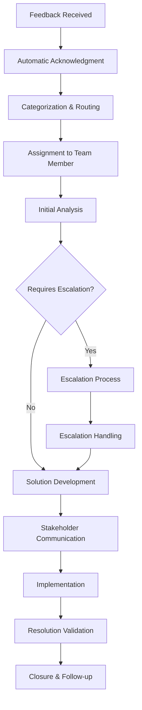

# A016 - Feedback and Escalation Mechanisms Implementation Guide

## Document Information
- **Document Title:** A016 - Feedback and Escalation Mechanisms Implementation Guide
- **Version:** 1.0
- **Date:** 2024-01-15
- **Status:** Active
- **Related Framework:** A016-Feedback-Escalation-Mechanisms-Framework.md
- **Document Owner:** Technology Stewards

## Executive Summary

This implementation guide provides detailed technical and operational instructions for deploying the A016 Feedback and Escalation Mechanisms Framework. It includes step-by-step procedures, technical configurations, automation scripts, and operational guidelines to ensure successful implementation and operation of the feedback and escalation systems.

## Table of Contents
1. [Pre-Implementation Requirements](#pre-implementation-requirements)
2. [Technology Platform Setup](#technology-platform-setup)
3. [Process Implementation](#process-implementation)
4. [SLA Configuration](#sla-configuration)
5. [Training and Change Management](#training-and-change-management)
6. [Testing and Validation](#testing-and-validation)
7. [Go-Live and Support](#go-live-and-support)
8. [Monitoring and Optimization](#monitoring-and-optimization)

## Pre-Implementation Requirements

### 1. Infrastructure Prerequisites

#### 1.1 Microsoft 365 Environment
**Required Licenses:**
- Microsoft 365 E3 or E5 licenses for all users
- Power Platform licenses (Power Apps, Power Automate, Power BI)
- SharePoint Online with sufficient storage
- Teams with advanced features enabled
- Exchange Online with sufficient mailbox storage

**Required Permissions:**
- Global Administrator access for initial setup
- SharePoint Administrator for site collection creation
- Power Platform Administrator for app deployment
- Teams Administrator for integration setup
- Exchange Administrator for mail flow configuration

#### 1.2 Azure Environment
**Required Services:**
- Azure Active Directory Premium P1 or P2
- Azure Logic Apps for advanced automation
- Azure Monitor for logging and analytics
- Azure Key Vault for secure configuration storage
- Azure Application Insights for performance monitoring

**Required Permissions:**
- Azure Subscription Contributor access
- Azure AD Global Administrator
- Resource Group Contributor for deployment
- Key Vault Administrator for secret management
- Monitor Contributor for analytics setup

### 2. Organizational Prerequisites

#### 2.1 Governance Structure
**Required Roles:**
- ICT Governance Council established and operational
- Domain Owners identified and assigned
- Technology Stewards appointed and trained
- Technology Custodians designated and available
- Stakeholder representatives identified

**Required Processes:**
- Basic ICT governance processes operational
- Escalation hierarchy defined and communicated
- Communication channels established
- Change management processes in place
- Training and support capabilities available

#### 2.2 Stakeholder Readiness
**Stakeholder Preparation:**
- Executive sponsorship confirmed and active
- Stakeholder expectations set and aligned
- Communication plan developed and approved
- Training schedule planned and resourced
- Change management support available

## Technology Platform Setup

### 1. Microsoft Power Platform Configuration

#### 1.1 Power Apps Application Development

**Feedback Collection App Setup:**
```powershell
# PowerShell script for Power Apps environment setup
# Connect to Power Platform
Install-Module -Name Microsoft.PowerApps.Administration.PowerShell
Install-Module -Name Microsoft.PowerApps.PowerShell

# Connect to Power Platform
Add-PowerAppsAccount

# Create new environment for feedback system
$environmentName = "ICT-Governance-Feedback"
$displayName = "ICT Governance Feedback and Escalation"
$location = "unitedstates"
$environmentType = "Production"

New-AdminPowerAppEnvironment -DisplayName $displayName -LocationName $location -EnvironmentSku $environmentType

# Set environment variables
$environmentId = (Get-AdminPowerAppEnvironment | Where-Object {$_.DisplayName -eq $displayName}).EnvironmentName

# Create Dataverse database
New-AdminPowerAppCdsDatabase -EnvironmentName $environmentId -CurrencyName "USD" -LanguageName "1033"
```

**Data Model Configuration:**
```json
{
  "entities": [
    {
      "name": "Feedback",
      "fields": [
        {"name": "FeedbackId", "type": "uniqueidentifier", "primaryKey": true},
        {"name": "Title", "type": "text", "maxLength": 255, "required": true},
        {"name": "Description", "type": "text", "maxLength": 4000, "required": true},
        {"name": "Category", "type": "choice", "options": ["Policy", "Process", "Technology", "Service"]},
        {"name": "Priority", "type": "choice", "options": ["Critical", "High", "Medium", "Low"]},
        {"name": "SubmittedBy", "type": "lookup", "relatedEntity": "User"},
        {"name": "SubmittedDate", "type": "datetime", "required": true},
        {"name": "Status", "type": "choice", "options": ["New", "InProgress", "Escalated", "Resolved", "Closed"]},
        {"name": "AssignedTo", "type": "lookup", "relatedEntity": "User"},
        {"name": "ExpectedResolution", "type": "datetime"},
        {"name": "ActualResolution", "type": "datetime"},
        {"name": "SatisfactionRating", "type": "number", "min": 1, "max": 5},
        {"name": "ResolutionNotes", "type": "text", "maxLength": 4000}
      ]
    },
    {
      "name": "Escalation",
      "fields": [
        {"name": "EscalationId", "type": "uniqueidentifier", "primaryKey": true},
        {"name": "FeedbackId", "type": "lookup", "relatedEntity": "Feedback", "required": true},
        {"name": "EscalationLevel", "type": "number", "required": true},
        {"name": "EscalatedTo", "type": "lookup", "relatedEntity": "User", "required": true},
        {"name": "EscalatedBy", "type": "lookup", "relatedEntity": "User", "required": true},
        {"name": "EscalationDate", "type": "datetime", "required": true},
        {"name": "EscalationReason", "type": "text", "maxLength": 1000, "required": true},
        {"name": "Status", "type": "choice", "options": ["Active", "Resolved", "Transferred"]},
        {"name": "ResolutionDate", "type": "datetime"},
        {"name": "ResolutionNotes", "type": "text", "maxLength": 4000}
      ]
    }
  ]
}
```

#### 1.2 Power Automate Workflow Configuration

**Feedback Processing Workflow:**
```json
{
  "definition": {
    "triggers": {
      "when_feedback_submitted": {
        "type": "CommonDataServiceV2",
        "inputs": {
          "entityName": "feedback",
          "scope": "Organization"
        }
      }
    },
    "actions": {
      "send_acknowledgment": {
        "type": "Office365Outlook",
        "inputs": {
          "to": "@{triggerOutputs()?['body/submittedby']}",
          "subject": "Feedback Received - Tracking #@{triggerOutputs()?['body/feedbackid']}",
          "body": "Thank you for your feedback. We have received your submission and will respond within our SLA timeframes."
        }
      },
      "assign_to_team": {
        "type": "CommonDataServiceV2",
        "inputs": {
          "entityName": "feedback",
          "recordId": "@{triggerOutputs()?['body/feedbackid']}",
          "item": {
            "assignedto": "@{variables('assignedUser')}",
            "status": "InProgress"
          }
        }
      },
      "create_teams_notification": {
        "type": "MicrosoftTeams",
        "inputs": {
          "recipient": "@{variables('teamChannel')}",
          "message": "New feedback received: @{triggerOutputs()?['body/title']}"
        }
      }
    }
  }
}
```

**Escalation Automation Workflow:**
```json
{
  "definition": {
    "triggers": {
      "sla_breach_check": {
        "type": "Recurrence",
        "inputs": {
          "frequency": "Hour",
          "interval": 1
        }
      }
    },
    "actions": {
      "get_overdue_feedback": {
        "type": "CommonDataServiceV2",
        "inputs": {
          "entityName": "feedback",
          "fetchXml": "<fetch><entity name='feedback'><filter><condition attribute='status' operator='ne' value='Resolved'/><condition attribute='expectedresolution' operator='lt' value='@{utcNow()}'/></filter></entity></fetch>"
        }
      },
      "for_each_overdue": {
        "type": "Foreach",
        "foreach": "@outputs('get_overdue_feedback')?['body/value']",
        "actions": {
          "create_escalation": {
            "type": "CommonDataServiceV2",
            "inputs": {
              "entityName": "escalation",
              "item": {
                "feedbackid": "@{items('for_each_overdue')?['feedbackid']}",
                "escalationlevel": "@{add(coalesce(items('for_each_overdue')?['escalationlevel'], 0), 1)}",
                "escalatedto": "@{variables('nextLevelAssignee')}",
                "escalationreason": "SLA breach - automatic escalation"
              }
            }
          }
        }
      }
    }
  }
}
```

### 2. SharePoint Configuration

#### 2.1 Site Collection Setup

**Site Creation Script:**
```powershell
# SharePoint site creation for feedback management
Connect-PnPOnline -Url "https://yourtenant-admin.sharepoint.com" -Interactive

# Create site collection
$siteUrl = "https://yourtenant.sharepoint.com/sites/ICTGovernanceFeedback"
$siteTitle = "ICT Governance Feedback and Escalation"
$siteTemplate = "SITEPAGEPUBLISHING#0"

New-PnPSite -Type TeamSite -Title $siteTitle -Url $siteUrl -Owner "admin@yourtenant.com"

# Connect to new site
Connect-PnPOnline -Url $siteUrl -Interactive

# Create document libraries
New-PnPList -Title "Feedback Documentation" -Template DocumentLibrary
New-PnPList -Title "Escalation Records" -Template DocumentLibrary
New-PnPList -Title "SLA Reports" -Template DocumentLibrary
New-PnPList -Title "Training Materials" -Template DocumentLibrary

# Create custom lists
New-PnPList -Title "Feedback Categories" -Template GenericList
New-PnPList -Title "Escalation Contacts" -Template GenericList
New-PnPList -Title "SLA Thresholds" -Template GenericList
```

#### 2.2 Permission Configuration

**Permission Setup:**
```powershell
# Set up permission groups
New-PnPGroup -Title "Feedback Administrators" -Description "Full access to feedback system"
New-PnPGroup -Title "Feedback Managers" -Description "Manage feedback and escalations"
New-PnPGroup -Title "Feedback Contributors" -Description "Submit and view own feedback"
New-PnPGroup -Title "Feedback Viewers" -Description "Read-only access to feedback reports"

# Assign permissions
Set-PnPGroupPermissions -Identity "Feedback Administrators" -AddRole "Full Control"
Set-PnPGroupPermissions -Identity "Feedback Managers" -AddRole "Contribute"
Set-PnPGroupPermissions -Identity "Feedback Contributors" -AddRole "Read"
Set-PnPGroupPermissions -Identity "Feedback Viewers" -AddRole "Read"

# Add users to groups
Add-PnPUserToGroup -LoginName "admin@yourtenant.com" -Identity "Feedback Administrators"
Add-PnPUserToGroup -LoginName "manager@yourtenant.com" -Identity "Feedback Managers"
```

### 3. Power BI Dashboard Configuration

#### 3.1 Data Source Configuration

**Power BI Data Model:**
```json
{
  "dataSources": [
    {
      "name": "FeedbackDataverse",
      "type": "CommonDataService",
      "connectionString": "https://yourtenant.crm.dynamics.com/",
      "tables": ["feedback", "escalation", "user"]
    },
    {
      "name": "SharePointLists",
      "type": "SharePoint",
      "connectionString": "https://yourtenant.sharepoint.com/sites/ICTGovernanceFeedback",
      "lists": ["Feedback Categories", "SLA Thresholds"]
    }
  ],
  "relationships": [
    {
      "fromTable": "feedback",
      "fromColumn": "feedbackid",
      "toTable": "escalation",
      "toColumn": "feedbackid",
      "cardinality": "OneToMany"
    }
  ]
}
```

**Key Measures:**
```dax
-- SLA Compliance Rate
SLA Compliance Rate = 
DIVIDE(
    COUNTROWS(
        FILTER(
            feedback,
            feedback[ActualResolution] <= feedback[ExpectedResolution]
        )
    ),
    COUNTROWS(feedback),
    0
)

-- Average Response Time
Average Response Time = 
AVERAGE(
    DATEDIFF(
        feedback[SubmittedDate],
        feedback[FirstResponseDate],
        HOUR
    )
)

-- Escalation Rate
Escalation Rate = 
DIVIDE(
    DISTINCTCOUNT(escalation[FeedbackId]),
    COUNTROWS(feedback),
    0
)

-- Stakeholder Satisfaction
Average Satisfaction = 
AVERAGE(feedback[SatisfactionRating])
```

## Process Implementation

### 1. Feedback Collection Process

#### 1.1 Intake Process Configuration

**Automated Intake Workflow:**
1. **Form Submission Validation**
   - Required field validation
   - Category and priority assignment
   - Duplicate detection and prevention
   - Attachment validation and storage

2. **Initial Processing**
   - Unique tracking number generation
   - Automatic acknowledgment email
   - Initial categorization and routing
   - SLA timer initiation

3. **Assignment and Notification**
   - Automatic assignment based on category
   - Team notification via Teams/email
   - Calendar appointment creation
   - Status tracking initialization

#### 1.2 Response Process Configuration

**Response Workflow Steps:**


### 2. Escalation Process Implementation

#### 2.1 Escalation Trigger Configuration

**Automatic Escalation Rules:**
```json
{
  "escalationRules": [
    {
      "name": "SLA Breach Escalation",
      "trigger": "SLA_BREACH",
      "conditions": [
        {
          "field": "ExpectedResolution",
          "operator": "LESS_THAN",
          "value": "NOW()"
        },
        {
          "field": "Status",
          "operator": "NOT_EQUAL",
          "value": "Resolved"
        }
      ],
      "action": "ESCALATE_TO_NEXT_LEVEL"
    },
    {
      "name": "Critical Priority Escalation",
      "trigger": "PRIORITY_BASED",
      "conditions": [
        {
          "field": "Priority",
          "operator": "EQUAL",
          "value": "Critical"
        },
        {
          "field": "TimeSinceSubmission",
          "operator": "GREATER_THAN",
          "value": "2_HOURS"
        }
      ],
      "action": "ESCALATE_TO_DOMAIN_OWNER"
    }
  ]
}
```

#### 2.2 Escalation Hierarchy Configuration

**Escalation Matrix:**
| Level | Role | Responsibility | SLA |
|-------|------|----------------|-----|
| 1 | Technology Custodian | Initial response and basic resolution | 2-72 hours |
| 2 | Technology Steward | Complex issue resolution | 4-24 hours |
| 3 | Domain Owner | Strategic decisions and resource allocation | 8-48 hours |
| 4 | ICT Governance Council | Framework-level decisions | 24-72 hours |
| 5 | Executive Leadership | Business-critical escalations | 48-120 hours |

## SLA Configuration

### 1. SLA Framework Setup

#### 1.1 SLA Threshold Configuration

**SLA Configuration Table:**
```sql
-- SLA Thresholds Table Structure
CREATE TABLE SLAThresholds (
    Id UNIQUEIDENTIFIER PRIMARY KEY,
    Priority NVARCHAR(50) NOT NULL,
    AcknowledgmentTime INT NOT NULL, -- in minutes
    FirstResponseTime INT NOT NULL, -- in hours
    ResolutionTime INT NOT NULL, -- in hours
    EscalationTrigger INT NOT NULL, -- in hours
    IsActive BIT DEFAULT 1,
    CreatedDate DATETIME2 DEFAULT GETDATE(),
    ModifiedDate DATETIME2 DEFAULT GETDATE()
);

-- Insert default SLA thresholds
INSERT INTO SLAThresholds (Id, Priority, AcknowledgmentTime, FirstResponseTime, ResolutionTime, EscalationTrigger)
VALUES 
    (NEWID(), 'Critical', 15, 2, 8, 2),
    (NEWID(), 'High', 15, 8, 24, 8),
    (NEWID(), 'Medium', 15, 24, 120, 24),
    (NEWID(), 'Low', 15, 72, 240, 72);
```

#### 1.2 SLA Monitoring Configuration

**SLA Monitoring Workflow:**
```json
{
  "monitoring": {
    "frequency": "Every 15 minutes",
    "checks": [
      {
        "name": "Acknowledgment SLA",
        "query": "SELECT * FROM Feedback WHERE AcknowledgmentSent IS NULL AND DATEDIFF(minute, SubmittedDate, GETDATE()) > AcknowledgmentSLA",
        "action": "SEND_ALERT"
      },
      {
        "name": "Response SLA",
        "query": "SELECT * FROM Feedback WHERE FirstResponseDate IS NULL AND DATEDIFF(hour, SubmittedDate, GETDATE()) > ResponseSLA",
        "action": "ESCALATE"
      },
      {
        "name": "Resolution SLA",
        "query": "SELECT * FROM Feedback WHERE Status != 'Resolved' AND DATEDIFF(hour, SubmittedDate, GETDATE()) > ResolutionSLA",
        "action": "ESCALATE"
      }
    ]
  }
}
```

### 2. SLA Reporting Configuration

#### 2.1 Real-Time Dashboard Setup

**Dashboard Configuration:**
```json
{
  "dashboards": [
    {
      "name": "SLA Performance Dashboard",
      "refreshRate": "5 minutes",
      "widgets": [
        {
          "type": "KPI",
          "title": "Overall SLA Compliance",
          "measure": "SLA Compliance Rate",
          "target": 95,
          "format": "percentage"
        },
        {
          "type": "Chart",
          "title": "Response Time Trends",
          "chartType": "line",
          "xAxis": "Date",
          "yAxis": "Average Response Time"
        },
        {
          "type": "Table",
          "title": "SLA Breaches",
          "columns": ["FeedbackId", "Priority", "SubmittedDate", "SLABreach", "AssignedTo"]
        }
      ]
    }
  ]
}
```

## Training and Change Management

### 1. Training Program Implementation

#### 1.1 Role-Based Training Modules

**Training Curriculum:**
```json
{
  "trainingModules": [
    {
      "name": "Feedback System Overview",
      "audience": "All Stakeholders",
      "duration": "30 minutes",
      "format": "Online",
      "content": [
        "System introduction and benefits",
        "How to submit feedback",
        "Tracking and status updates",
        "Escalation process overview"
      ]
    },
    {
      "name": "Feedback Management",
      "audience": "Technology Custodians",
      "duration": "2 hours",
      "format": "Instructor-led",
      "content": [
        "Intake and processing procedures",
        "Response standards and templates",
        "SLA management and monitoring",
        "Escalation triggers and procedures"
      ]
    },
    {
      "name": "Escalation Handling",
      "audience": "Technology Stewards, Domain Owners",
      "duration": "1.5 hours",
      "format": "Workshop",
      "content": [
        "Escalation assessment and prioritization",
        "Stakeholder communication strategies",
        "Resolution planning and execution",
        "Quality assurance and follow-up"
      ]
    }
  ]
}
```

#### 1.2 Training Delivery Schedule

**Implementation Training Schedule:**
```
Week 1-2: System Administrator Training
- Platform configuration and management
- Workflow setup and customization
- Reporting and analytics configuration

Week 3-4: Core Team Training
- Technology Stewards and Domain Owners
- Process training and role responsibilities
- Escalation handling and decision making

Week 5-6: Operational Team Training
- Technology Custodians and support staff
- Daily operations and SLA management
- Customer service and communication

Week 7-8: Stakeholder Training
- End-user training sessions
- Feedback submission and tracking
- Expectations and service levels
```

### 2. Change Management Strategy

#### 2.1 Communication Plan

**Communication Timeline:**
```
Pre-Implementation (4 weeks before):
- Executive announcement and sponsorship
- Stakeholder awareness sessions
- Benefits and value proposition communication
- Training schedule announcement

Implementation (During rollout):
- Daily status updates to core team
- Weekly progress reports to stakeholders
- Issue resolution and communication
- Success story sharing

Post-Implementation (4 weeks after):
- Performance reporting and metrics
- Stakeholder feedback collection
- Process refinement communication
- Continuous improvement planning
```

#### 2.2 Resistance Management

**Change Resistance Mitigation:**
```json
{
  "resistanceFactors": [
    {
      "factor": "Technology Adoption",
      "mitigation": [
        "Comprehensive training programs",
        "User-friendly interface design",
        "Ongoing technical support",
        "Gradual feature rollout"
      ]
    },
    {
      "factor": "Process Changes",
      "mitigation": [
        "Clear process documentation",
        "Hands-on training and practice",
        "Change champion network",
        "Regular feedback and adjustment"
      ]
    },
    {
      "factor": "Workload Concerns",
      "mitigation": [
        "Automation of routine tasks",
        "Efficiency improvements demonstration",
        "Resource allocation planning",
        "Workload monitoring and adjustment"
      ]
    }
  ]
}
```

## Testing and Validation

### 1. Testing Strategy

#### 1.1 Testing Phases

**Phase 1: Unit Testing**
- Individual component functionality
- Data validation and processing
- Workflow logic verification
- Integration point testing

**Phase 2: System Integration Testing**
- End-to-end workflow testing
- Cross-system integration validation
- Performance and load testing
- Security and access control testing

**Phase 3: User Acceptance Testing**
- Stakeholder scenario testing
- Usability and experience validation
- Training effectiveness assessment
- Process compliance verification

#### 1.2 Test Scenarios

**Critical Test Scenarios:**
```json
{
  "testScenarios": [
    {
      "name": "Feedback Submission and Processing",
      "steps": [
        "Submit feedback through web portal",
        "Verify automatic acknowledgment",
        "Confirm routing and assignment",
        "Validate SLA timer initiation"
      ],
      "expectedResults": [
        "Feedback recorded in system",
        "Acknowledgment email sent within 15 minutes",
        "Assigned to appropriate team member",
        "SLA countdown started"
      ]
    },
    {
      "name": "Automatic Escalation",
      "steps": [
        "Create feedback with critical priority",
        "Wait for SLA breach condition",
        "Verify escalation trigger",
        "Confirm escalation notification"
      ],
      "expectedResults": [
        "Escalation created automatically",
        "Next level assignee notified",
        "Escalation recorded in system",
        "Stakeholder informed of escalation"
      ]
    }
  ]
}
```

### 2. Validation Criteria

#### 2.1 Functional Validation

**Validation Checklist:**
- [ ] Feedback submission works across all channels
- [ ] Automatic acknowledgment sent within SLA
- [ ] Routing and assignment functions correctly
- [ ] Escalation triggers work as designed
- [ ] SLA monitoring and alerting operational
- [ ] Reporting and analytics accurate
- [ ] Integration with existing systems functional
- [ ] Security and access controls effective

#### 2.2 Performance Validation

**Performance Criteria:**
- Response time < 3 seconds for form submission
- System availability > 99.5%
- Concurrent user support > 100 users
- Data processing latency < 30 seconds
- Report generation time < 60 seconds

## Go-Live and Support

### 1. Go-Live Strategy

#### 1.1 Phased Rollout Plan

**Phase 1: Pilot Group (Week 1-2)**
- Limited stakeholder group (20-30 users)
- Core functionality testing
- Feedback collection and refinement
- Issue identification and resolution

**Phase 2: Department Rollout (Week 3-6)**
- Department-by-department rollout
- Expanded functionality deployment
- Training delivery and support
- Process refinement and optimization

**Phase 3: Organization-wide (Week 7-8)**
- Full organizational deployment
- Complete functionality available
- Comprehensive support and training
- Performance monitoring and optimization

#### 1.2 Go-Live Checklist

**Pre-Go-Live Checklist:**
- [ ] All systems tested and validated
- [ ] Training completed for all user groups
- [ ] Support processes and resources ready
- [ ] Communication plan executed
- [ ] Rollback procedures documented and tested
- [ ] Performance monitoring configured
- [ ] Issue escalation procedures established
- [ ] Success criteria defined and measurable

### 2. Support Strategy

#### 2.1 Support Structure

**Support Tiers:**
```
Tier 1: Help Desk Support
- Basic user questions and guidance
- Password resets and access issues
- Form submission assistance
- Status inquiry support

Tier 2: Technical Support
- System configuration issues
- Workflow troubleshooting
- Integration problems
- Performance issues

Tier 3: Development Support
- Complex technical issues
- System modifications
- Integration development
- Performance optimization
```

#### 2.2 Support Procedures

**Support Process:**
1. **Issue Intake**
   - Multiple support channels (email, phone, portal)
   - Issue categorization and prioritization
   - Initial triage and assignment
   - Stakeholder communication

2. **Issue Resolution**
   - Root cause analysis
   - Solution development and testing
   - Implementation and validation
   - Stakeholder notification

3. **Issue Closure**
   - Resolution confirmation
   - Satisfaction assessment
   - Documentation update
   - Knowledge base enhancement

## Monitoring and Optimization

### 1. Performance Monitoring

#### 1.1 Key Metrics Monitoring

**Real-Time Monitoring:**
```json
{
  "monitoringMetrics": [
    {
      "category": "System Performance",
      "metrics": [
        "Response time",
        "System availability",
        "Error rates",
        "Concurrent users"
      ],
      "alertThresholds": {
        "responseTime": "> 5 seconds",
        "availability": "< 99%",
        "errorRate": "> 1%",
        "concurrentUsers": "> 150"
      }
    },
    {
      "category": "SLA Performance",
      "metrics": [
        "Acknowledgment SLA compliance",
        "Response SLA compliance",
        "Resolution SLA compliance",
        "Escalation rates"
      ],
      "alertThresholds": {
        "acknowledgmentSLA": "< 95%",
        "responseSLA": "< 90%",
        "resolutionSLA": "< 85%",
        "escalationRate": "> 20%"
      }
    }
  ]
}
```

#### 1.2 Monitoring Dashboard

**Dashboard Configuration:**
- Real-time system health indicators
- SLA performance metrics
- Stakeholder satisfaction scores
- Volume and trend analysis
- Alert and notification status

### 2. Continuous Optimization

#### 2.1 Performance Optimization

**Optimization Areas:**
- System performance tuning
- Workflow efficiency improvements
- User experience enhancements
- Integration optimization
- Resource allocation optimization

#### 2.2 Process Improvement

**Improvement Process:**
1. **Performance Analysis**
   - Regular performance reviews
   - Stakeholder feedback analysis
   - Trend identification and assessment
   - Benchmark comparison

2. **Improvement Planning**
   - Opportunity identification and prioritization
   - Solution development and validation
   - Implementation planning and scheduling
   - Resource allocation and approval

3. **Implementation and Validation**
   - Change implementation and testing
   - Performance measurement and validation
   - Stakeholder communication and training
   - Success measurement and reporting

## Conclusion

This implementation guide provides comprehensive instructions for deploying the A016 Feedback and Escalation Mechanisms Framework. Success depends on careful planning, systematic execution, and continuous monitoring and improvement.

**Key Success Factors:**
- Executive sponsorship and stakeholder engagement
- Comprehensive training and change management
- Robust technical implementation and testing
- Effective monitoring and continuous improvement
- Strong support and maintenance processes

**Next Steps:**
1. Review and approve implementation plan
2. Secure resources and stakeholder commitment
3. Begin pre-implementation activities
4. Execute phased implementation plan
5. Monitor performance and optimize continuously

---

**Document Owner:** Technology Stewards  
**Implementation Team:** ICT Governance Office  
**Document Version:** 1.0  
**Last Updated:** 2024-01-15  
**Next Review:** Monthly during implementation, quarterly post-implementation