# A036: Governance Processes and Workflows

**Document Reference:** A036  
**Version:** 1.0  
**Date:** December 2024  
**Status:** Final  
**Classification:** Internal  
**Owner:** ICT Governance Council  
**Approved By:** Strategic Governance Council  

---

## Executive Summary

This document defines the detailed governance processes, workflows, decision points, and approval mechanisms that operationalize the ICT Governance Framework. It serves as the comprehensive operational guide for all governance activities, ensuring consistent, efficient, and effective governance across all technology domains.

The processes outlined here transform the strategic governance framework into actionable workflows that enable:
- **Streamlined Decision-Making:** Clear decision paths with defined authority levels
- **Consistent Governance:** Standardized processes across all technology domains
- **Efficient Operations:** Optimized workflows that minimize bureaucracy while maintaining control
- **Transparent Accountability:** Clear roles, responsibilities, and audit trails
- **Continuous Improvement:** Built-in feedback loops and performance measurement

**Key Process Areas:**
- Strategic Planning and Portfolio Management
- Technology Selection and Standardization
- Architecture Review and Approval
- Risk Management and Compliance
- Change Management and Release Control
- Innovation and Emerging Technology Evaluation
- Performance Monitoring and Continuous Improvement

---

## 1. Governance Process Architecture

### 1.1 Process Framework Overview

The governance processes are organized into seven core process areas, each with defined workflows, decision points, and approval mechanisms:

```
Strategic Layer (SGC)
├── Strategic Planning & Portfolio Management
├── Policy Development & Standards Management
└── Performance Oversight & Continuous Improvement

Operational Layer (Domain Owners)
├── Technology Selection & Standardization
├── Architecture Review & Approval
├── Risk Management & Compliance
└── Innovation & Emerging Technology Evaluation

Execution Layer (Technology Stewards)
├── Change Management & Release Control
├── Operational Risk Management
└── Performance Monitoring & Reporting
```

### 1.2 Process Integration Model

All governance processes are integrated through:
- **Unified Governance Platform:** Single system for all governance activities
- **Shared Data Model:** Common data structures across all processes
- **Integrated Workflows:** Seamless handoffs between process areas
- **Consolidated Reporting:** Unified dashboards and metrics
- **Cross-Process Dependencies:** Automated dependency management

### 1.3 Decision Authority Framework

| Decision Level | Authority | Scope | Approval Required |
|---|---|---|---|
| **Strategic** | Strategic Governance Council | Enterprise-wide impact, >$500K, Policy changes | SGC Majority Vote |
| **Tactical** | Domain Owners | Domain-specific, $50K-$500K, Standards | Domain Owner + 1 Peer |
| **Operational** | Technology Stewards | Day-to-day operations, <$50K | Technology Steward |
| **Emergency** | On-Call Authority | Critical incidents, Security breaches | Post-incident review |

---

## 2. Strategic Planning and Portfolio Management Processes

### 2.1 Annual Strategic Planning Process

**Objective:** Align technology strategy with business objectives and establish annual governance priorities

#### 2.1.1 Process Workflow

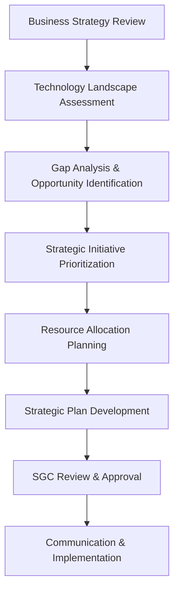

#### 2.1.2 Detailed Process Steps

**Phase 1: Business Strategy Review (Weeks 1-2)**
1. **Business Strategy Analysis**
   - Review annual business strategy and objectives
   - Identify technology enablement requirements
   - Assess market trends and competitive landscape
   - **Decision Point:** Confirm business alignment requirements
   - **Approval:** Business Strategy Committee

2. **Stakeholder Engagement**
   - Conduct stakeholder interviews and surveys
   - Facilitate strategic planning workshops
   - Gather requirements from business units
   - **Decision Point:** Validate stakeholder requirements
   - **Approval:** Domain Owners

**Phase 2: Technology Assessment (Weeks 3-4)**
1. **Current State Assessment**
   - Evaluate existing technology portfolio
   - Assess capability maturity levels
   - Identify technical debt and risks
   - **Decision Point:** Confirm current state baseline
   - **Approval:** Technology Stewards

2. **Future State Visioning**
   - Define target technology architecture
   - Identify emerging technology opportunities
   - Assess industry best practices
   - **Decision Point:** Approve future state vision
   - **Approval:** SGC

**Phase 3: Strategic Planning (Weeks 5-6)**
1. **Gap Analysis**
   - Compare current vs. future state
   - Identify capability gaps and opportunities
   - Prioritize improvement initiatives
   - **Decision Point:** Confirm gap analysis findings
   - **Approval:** Domain Owners

2. **Strategic Plan Development**
   - Develop strategic initiatives roadmap
   - Define success metrics and KPIs
   - Create resource allocation plan
   - **Decision Point:** Approve strategic plan
   - **Approval:** SGC

#### 2.1.3 Decision Points and Criteria

| Decision Point | Criteria | Authority | Documentation |
|---|---|---|---|
| Business Alignment | Strategic fit score >7/10 | Business Strategy Committee | Business Case Template |
| Technology Feasibility | Technical risk score <5/10 | Technology Stewards | Technical Assessment |
| Resource Allocation | ROI >20%, Payback <3 years | SGC | Financial Analysis |
| Strategic Approval | Overall score >8/10 | SGC | Strategic Plan Document |

### 2.2 Technology Investment Management Process

**Objective:** Ensure technology investments deliver measurable business value and align with strategic objectives

#### 2.2.1 Investment Evaluation Workflow

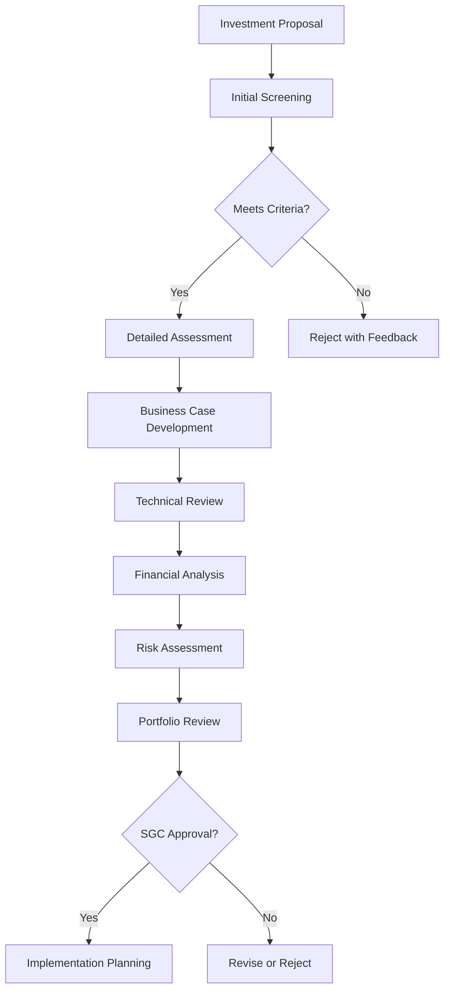

#### 2.2.2 Investment Categories and Approval Thresholds

| Investment Category | Threshold | Approval Authority | Review Process |
|---|---|---|---|
| **Strategic Initiatives** | >$500K | SGC | Full governance review |
| **Operational Improvements** | $50K-$500K | Domain Owner + Peer | Streamlined review |
| **Maintenance & Support** | <$50K | Technology Steward | Simplified approval |
| **Emergency/Security** | Any amount | Emergency Authority | Post-approval review |

#### 2.2.3 Business Value Quantification Process

**Step 1: Value Framework Application**
- Apply Business Value Quantification Framework
- Calculate financial metrics (ROI, NPV, Payback)
- Assess strategic value (innovation, capability)
- Evaluate risk-adjusted returns

**Step 2: Peer Review Process**
- Independent review by domain peers
- Financial validation by finance team
- Technical validation by architecture team
- **Decision Point:** Approve value assessment
- **Approval:** Domain Owner + Finance

**Step 3: Portfolio Optimization**
- Compare against other investments
- Optimize resource allocation
- Balance risk and return
- **Decision Point:** Include in portfolio
- **Approval:** SGC

---

## 3. Technology Selection and Standardization Processes

### 3.1 Technology Evaluation and Selection Process

**Objective:** Ensure technology selections align with architecture standards and business requirements

#### 3.1.1 Technology Selection Workflow

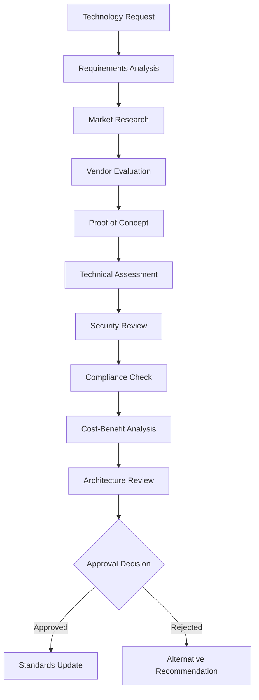

#### 3.1.2 Evaluation Criteria Framework

**Technical Criteria (40%)**
- Functional requirements compliance
- Performance and scalability
- Integration capabilities
- Security features
- Technical architecture alignment

**Business Criteria (30%)**
- Business value delivery
- Cost-effectiveness
- Implementation timeline
- User experience
- Strategic alignment

**Risk Criteria (20%)**
- Vendor stability and support
- Technology maturity
- Implementation risk
- Operational risk
- Compliance risk

**Innovation Criteria (10%)**
- Future roadmap alignment
- Emerging technology adoption
- Competitive advantage
- Innovation potential

#### 3.1.3 Decision Points and Approval Process

**Level 1: Initial Screening**
- **Criteria:** Basic requirements compliance
- **Authority:** Technology Steward
- **Timeline:** 2 business days
- **Documentation:** Requirements checklist

**Level 2: Technical Evaluation**
- **Criteria:** Technical fit score >7/10
- **Authority:** Domain Owner
- **Timeline:** 1-2 weeks
- **Documentation:** Technical assessment report

**Level 3: Strategic Approval**
- **Criteria:** Overall score >8/10, Strategic alignment
- **Authority:** SGC (for strategic technologies)
- **Timeline:** 2-4 weeks
- **Documentation:** Complete evaluation package

### 3.2 Technology Standards Management Process

**Objective:** Maintain current, relevant, and effective technology standards

#### 3.2.1 Standards Lifecycle Management

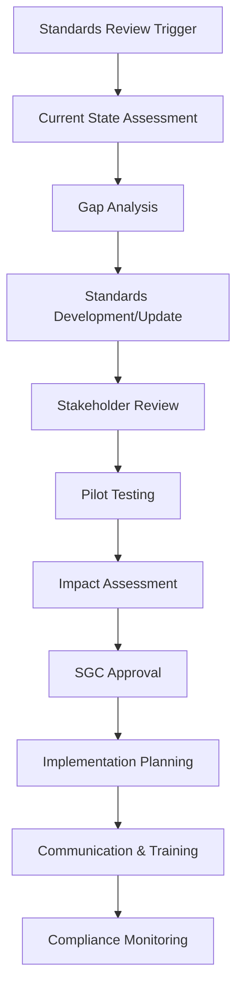

#### 3.2.2 Standards Categories and Review Cycles

| Standards Category | Review Cycle | Owner | Approval Authority |
|---|---|---|---|
| **Architecture Standards** | Annual | Enterprise Architect | SGC |
| **Security Standards** | Semi-annual | Security Domain Owner | SGC |
| **Data Standards** | Annual | Data Domain Owner | Domain Owner |
| **Integration Standards** | Annual | Integration Domain Owner | Domain Owner |
| **Development Standards** | Quarterly | Application Domain Owner | Domain Owner |

---

## 4. Architecture Review and Approval Processes

### 4.1 Architecture Review Process

**Objective:** Ensure all technology solutions align with enterprise architecture standards and principles

#### 4.1.1 Architecture Review Workflow

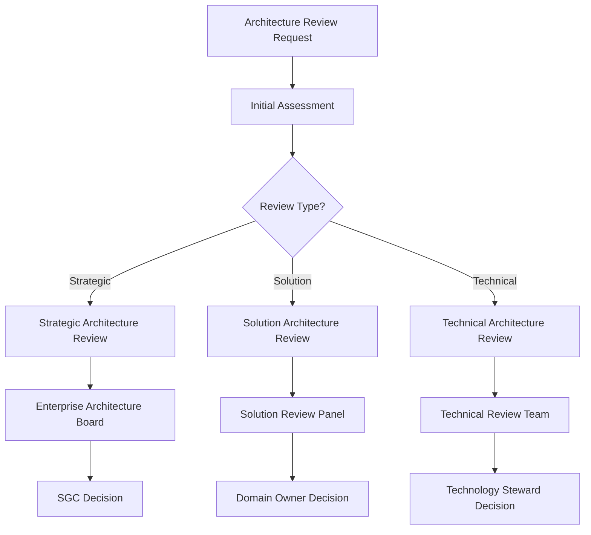

#### 4.1.2 Review Types and Criteria

**Strategic Architecture Review**
- **Scope:** Enterprise-wide impact, new domains
- **Criteria:** Strategic alignment, architectural principles compliance
- **Authority:** Enterprise Architecture Board → SGC
- **Timeline:** 4-6 weeks

**Solution Architecture Review**
- **Scope:** Major applications, significant integrations
- **Criteria:** Solution design quality, standards compliance
- **Authority:** Solution Review Panel → Domain Owner
- **Timeline:** 2-3 weeks

**Technical Architecture Review**
- **Scope:** Component-level designs, technical implementations
- **Criteria:** Technical standards compliance, best practices
- **Authority:** Technical Review Team → Technology Steward
- **Timeline:** 1 week

#### 4.1.3 Architecture Review Board Structure

**Enterprise Architecture Board**
- **Chair:** Chief Architect
- **Members:** Domain Architects, Business Representatives
- **Frequency:** Monthly
- **Quorum:** 60% of members
- **Decision:** Consensus or majority vote

**Solution Review Panel**
- **Chair:** Domain Architect
- **Members:** Senior Technical Leads, Security Representative
- **Frequency:** Bi-weekly
- **Decision:** Panel consensus

**Technical Review Team**
- **Chair:** Lead Technical Architect
- **Members:** Subject Matter Experts
- **Frequency:** Weekly
- **Decision:** Technical lead approval

### 4.2 Architecture Exception Process

**Objective:** Manage deviations from architecture standards while maintaining governance control

#### 4.2.1 Exception Request Workflow

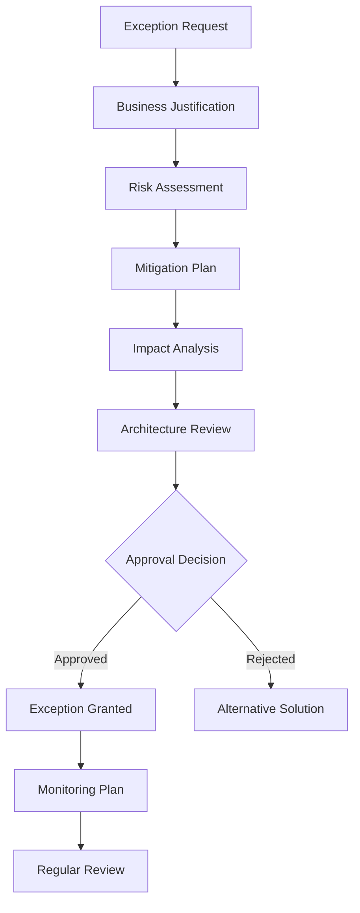

#### 4.2.2 Exception Categories and Approval Authority

| Exception Type | Business Impact | Approval Authority | Review Frequency |
|---|---|---|---|
| **Strategic Exception** | High | SGC | Quarterly |
| **Tactical Exception** | Medium | Domain Owner | Monthly |
| **Technical Exception** | Low | Technology Steward | As needed |
| **Emergency Exception** | Critical | Emergency Authority | Immediate + Post-review |

---

## 5. Risk Management and Compliance Processes

### 5.1 Integrated Risk Management Process

**Objective:** Identify, assess, and mitigate technology risks using quantitative FAIR methodology

#### 5.1.1 Risk Management Workflow

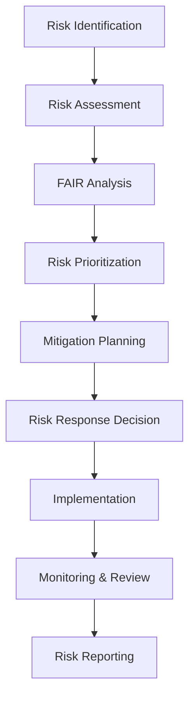

#### 5.1.2 FAIR-Based Risk Assessment Process

**Step 1: Risk Scenario Definition**
- Identify threat actors and motivations
- Define asset vulnerabilities
- Establish impact scenarios
- **Decision Point:** Validate risk scenarios
- **Approval:** Risk Owner

**Step 2: Quantitative Analysis**
- Assess threat event frequency
- Evaluate vulnerability likelihood
- Calculate loss magnitude
- **Decision Point:** Approve risk quantification
- **Approval:** Domain Owner

**Step 3: Risk Prioritization**
- Calculate risk exposure values
- Compare against risk appetite
- Prioritize mitigation efforts
- **Decision Point:** Approve risk priorities
- **Approval:** SGC

#### 5.1.3 Risk Response Strategies

| Risk Level | Response Strategy | Authority | Timeline |
|---|---|---|---|
| **Critical (>$1M)** | Immediate mitigation | SGC | 24-48 hours |
| **High ($100K-$1M)** | Planned mitigation | Domain Owner | 1-2 weeks |
| **Medium ($10K-$100K)** | Monitored mitigation | Technology Steward | 1 month |
| **Low (<$10K)** | Accept or monitor | Technology Steward | Quarterly review |

### 5.2 Compliance Management Process

**Objective:** Ensure continuous compliance with regulatory requirements and industry standards

#### 5.2.1 Compliance Monitoring Workflow

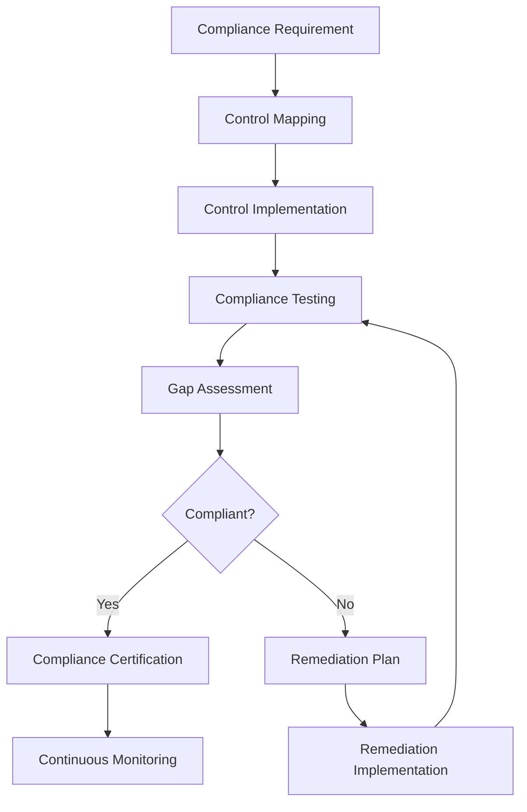

#### 5.2.2 Compliance Framework Integration

**Regulatory Compliance**
- GDPR, CCPA (Data Protection)
- SOX, PCI DSS (Financial)
- HIPAA (Healthcare)
- Industry-specific regulations

**Standards Compliance**
- ISO 27001 (Information Security)
- ISO 38500 (IT Governance)
- COBIT 2019 (IT Management)
- ITIL 4 (Service Management)

#### 5.2.3 Compliance Reporting and Escalation

**Compliance Dashboard**
- Real-time compliance status
- Control effectiveness metrics
- Gap analysis and trends
- Remediation progress tracking

**Escalation Triggers**
- Critical compliance gaps
- Failed audit findings
- Regulatory violations
- Control failures

---

## 6. Change Management and Release Control Processes

### 6.1 Change Management Process

**Objective:** Manage technology changes while minimizing risk and ensuring business continuity

#### 6.1.1 Change Management Workflow

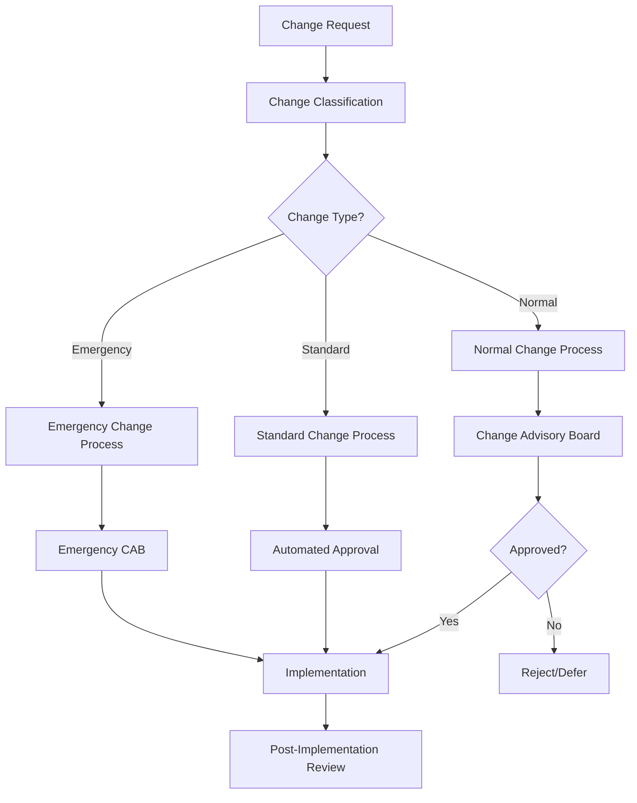

#### 6.1.2 Change Categories and Approval Process

**Emergency Changes**
- **Criteria:** Critical system failure, security incident
- **Approval:** Emergency Change Authority
- **Timeline:** Immediate
- **Review:** Post-implementation CAB review

**Standard Changes**
- **Criteria:** Pre-approved, low-risk, routine
- **Approval:** Automated based on criteria
- **Timeline:** Immediate upon request
- **Review:** Periodic effectiveness review

**Normal Changes**
- **Criteria:** All other changes
- **Approval:** Change Advisory Board
- **Timeline:** Weekly CAB meeting
- **Review:** Standard CAB process

#### 6.1.3 Change Advisory Board (CAB) Structure

**CAB Composition**
- **Chair:** Change Manager
- **Core Members:** Domain Representatives, Security, Operations
- **Extended Members:** Business Representatives (as needed)

**CAB Decision Criteria**
- Business impact assessment
- Technical risk evaluation
- Resource availability
- Implementation timeline
- Rollback plan adequacy

### 6.2 Release Management Process

**Objective:** Coordinate and control the deployment of technology changes into production

#### 6.2.1 Release Planning Workflow

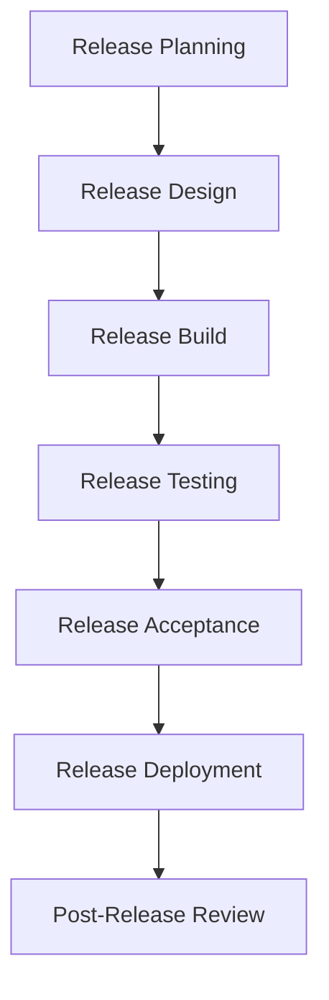

#### 6.2.2 Release Types and Approval Gates

| Release Type | Scope | Approval Gates | Authority |
|---|---|---|---|
| **Major Release** | Significant functionality | Design, Build, Test, Deploy | SGC |
| **Minor Release** | Incremental changes | Build, Test, Deploy | Domain Owner |
| **Patch Release** | Bug fixes, security | Test, Deploy | Technology Steward |
| **Hotfix Release** | Critical fixes | Emergency approval | Emergency Authority |

---

## 7. Innovation and Emerging Technology Processes

### 7.1 Innovation Pipeline Management Process

**Objective:** Systematically evaluate and adopt emerging technologies that create business value

#### 7.1.1 Innovation Evaluation Workflow

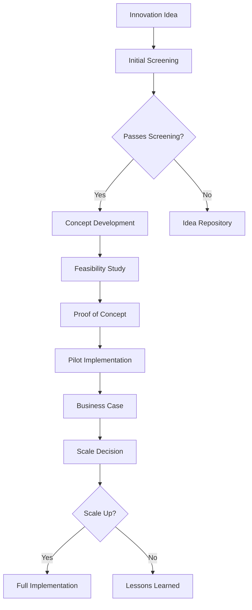

#### 7.1.2 Innovation Governance Framework

**Innovation Zones**
- **Zone 1 (Core):** Proven technologies, low risk
- **Zone 2 (Adjacent):** Extensions of core, medium risk
- **Zone 3 (Transformational):** Breakthrough technologies, high risk

**Innovation Investment Allocation**
- Zone 1: 70% of innovation budget
- Zone 2: 20% of innovation budget
- Zone 3: 10% of innovation budget

#### 7.1.3 Innovation Decision Gates

**Gate 1: Idea Screening**
- **Criteria:** Strategic alignment, feasibility
- **Authority:** Innovation Committee
- **Timeline:** 1 week

**Gate 2: Concept Approval**
- **Criteria:** Business potential, technical viability
- **Authority:** Domain Owner
- **Timeline:** 2 weeks

**Gate 3: Pilot Approval**
- **Criteria:** Proof of concept success
- **Authority:** SGC (for Zone 3), Domain Owner (Zone 1-2)
- **Timeline:** 4 weeks

**Gate 4: Scale Decision**
- **Criteria:** Pilot results, business case
- **Authority:** SGC
- **Timeline:** 6 weeks

### 7.2 Emerging Technology Assessment Process

**Objective:** Proactively assess emerging technologies for strategic opportunities

#### 7.2.1 Technology Radar Process

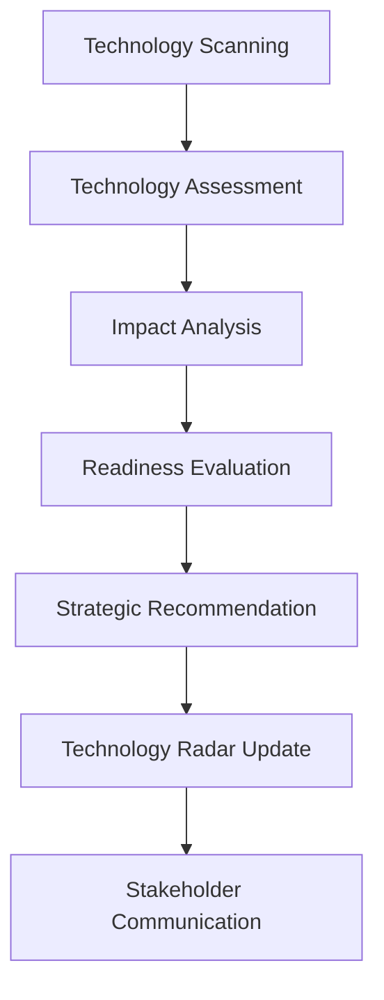

#### 7.2.2 Technology Radar Categories

**Adopt**
- Technologies ready for production use
- Proven value and low risk
- Recommended for immediate adoption

**Trial**
- Technologies worth pursuing
- Pilot projects recommended
- Monitor for production readiness

**Assess**
- Technologies to understand and evaluate
- Potential future value
- Research and experimentation

**Hold**
- Technologies to avoid or phase out
- High risk or limited value
- Not recommended for new projects

---

## 8. Performance Management and Continuous Improvement Processes

### 8.1 Governance Performance Management Process

**Objective:** Continuously monitor and improve governance effectiveness and maturity

#### 8.1.1 Performance Monitoring Workflow

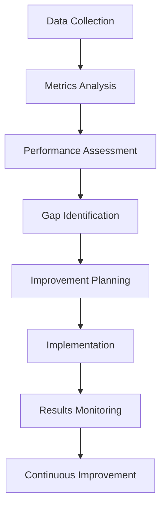

#### 8.1.2 Governance Metrics Framework

**Effectiveness Metrics**
- Process cycle times
- Decision quality scores
- Stakeholder satisfaction
- Compliance rates

**Efficiency Metrics**
- Resource utilization
- Cost per transaction
- Automation rates
- Error rates

**Maturity Metrics**
- Capability maturity levels
- Process standardization
- Tool integration
- Knowledge management

#### 8.1.3 Performance Review Cycles

**Daily Monitoring**
- Operational metrics
- System performance
- Incident tracking
- Compliance status

**Weekly Reviews**
- Process performance
- Resource utilization
- Issue resolution
- Stakeholder feedback

**Monthly Assessments**
- Governance effectiveness
- Maturity progression
- Improvement initiatives
- Strategic alignment

**Quarterly Reviews**
- Comprehensive performance review
- Governance maturity assessment
- Strategic planning updates
- Stakeholder engagement

### 8.2 Continuous Improvement Process

**Objective:** Systematically improve governance processes and capabilities

#### 8.2.1 Improvement Identification

**Sources of Improvement Opportunities**
- Performance metrics analysis
- Stakeholder feedback
- Process audits
- Benchmarking studies
- Industry best practices

**Improvement Prioritization Criteria**
- Business impact potential
- Implementation complexity
- Resource requirements
- Risk considerations
- Strategic alignment

#### 8.2.2 Improvement Implementation Process

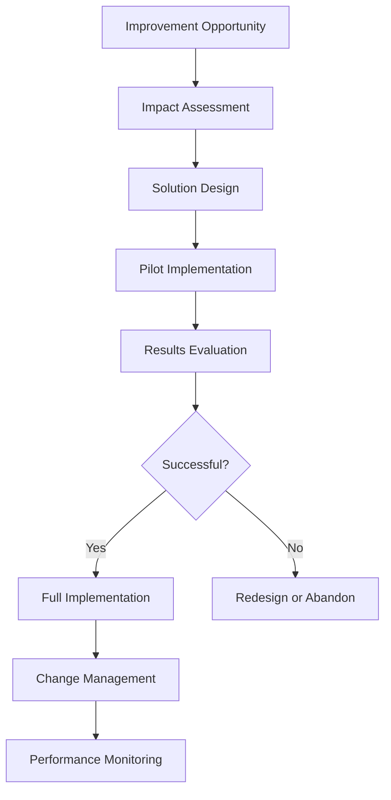

---

## 9. Process Integration and Orchestration

### 9.1 Cross-Process Dependencies

**Process Integration Matrix**

| Process | Dependencies | Inputs | Outputs |
|---|---|---|---|
| Strategic Planning | All processes | Business strategy, Performance data | Strategic priorities, Resource allocation |
| Technology Selection | Architecture Review, Risk Management | Requirements, Standards | Approved technologies, Updated standards |
| Architecture Review | Technology Selection, Change Management | Design documents, Standards | Architecture decisions, Exceptions |
| Risk Management | All processes | Risk data, Controls | Risk assessments, Mitigation plans |
| Change Management | All processes | Change requests, Approvals | Implemented changes, Performance data |
| Innovation Management | Strategic Planning, Technology Selection | Innovation ideas, Market research | Innovation pipeline, Technology recommendations |

### 9.2 Workflow Orchestration

**Automated Workflow Triggers**
- Process initiation based on events
- Automatic routing and approvals
- Escalation management
- Status notifications
- Performance tracking

**Integration Points**
- Shared data repositories
- Common approval workflows
- Unified reporting
- Cross-process metrics
- Stakeholder notifications

### 9.3 Exception Handling

**Exception Types**
- Process deviations
- Approval delays
- Resource constraints
- Technical failures
- Compliance issues

**Exception Resolution Process**
1. Exception detection and logging
2. Impact assessment
3. Resolution planning
4. Stakeholder notification
5. Resolution implementation
6. Process improvement

---

## 10. Governance Tools and Technology

### 10.1 Unified Governance Platform

**Platform Capabilities**
- Process workflow management
- Document and artifact management
- Approval and decision tracking
- Performance monitoring and reporting
- Integration with enterprise systems
- Mobile access and notifications

**Core Components**
- Workflow engine
- Document repository
- Approval management
- Reporting and analytics
- Integration layer
- User interface

### 10.2 Supporting Tools and Systems

**Enterprise Architecture Tools**
- Architecture modeling and documentation
- Standards repository
- Impact analysis
- Compliance tracking

**Risk Management Tools**
- Risk assessment and quantification
- Control monitoring
- Compliance reporting
- Incident management

**Project and Portfolio Management**
- Project tracking and reporting
- Resource management
- Financial tracking
- Performance monitoring

### 10.3 Data Management and Analytics

**Governance Data Model**
- Master data management
- Data quality standards
- Integration patterns
- Analytics requirements

**Performance Analytics**
- Real-time dashboards
- Trend analysis
- Predictive analytics
- Benchmarking reports

---

## 11. Training and Change Management

### 11.1 Governance Training Program

**Training Components**
- Process overview and objectives
- Role-specific responsibilities
- Tool usage and navigation
- Decision-making criteria
- Escalation procedures

**Training Delivery Methods**
- Instructor-led sessions
- Online learning modules
- Hands-on workshops
- Mentoring programs
- Reference materials

### 11.2 Change Management Strategy

**Change Management Approach**
- Stakeholder engagement
- Communication planning
- Training and support
- Performance monitoring
- Continuous improvement

**Success Factors**
- Executive sponsorship
- Clear communication
- Adequate training
- User support
- Performance measurement

---

## 12. Monitoring and Measurement

### 12.1 Process Performance Metrics

**Key Performance Indicators**

| Metric Category | KPI | Target | Measurement Method |
|---|---|---|---|
| **Process Efficiency** | Average cycle time | <5 days | Workflow tracking |
| **Decision Quality** | Decision reversal rate | <5% | Decision tracking |
| **Stakeholder Satisfaction** | Satisfaction score | >4.0/5.0 | Regular surveys |
| **Compliance** | Compliance rate | >95% | Audit results |
| **Innovation** | Innovation adoption rate | >20% annually | Innovation tracking |

### 12.2 Governance Maturity Assessment

**Maturity Levels**
- **Level 1 (Initial):** Ad hoc processes
- **Level 2 (Managed):** Documented processes
- **Level 3 (Defined):** Standardized processes
- **Level 4 (Quantitatively Managed):** Measured processes
- **Level 5 (Optimizing):** Continuously improving processes

**Assessment Frequency**
- Annual comprehensive assessment
- Quarterly progress reviews
- Monthly process evaluations
- Continuous monitoring

### 12.3 Reporting and Communication

**Reporting Framework**
- Executive dashboards
- Operational reports
- Performance scorecards
- Compliance reports
- Stakeholder communications

**Communication Channels**
- Governance portal
- Regular meetings
- Email notifications
- Mobile alerts
- Training sessions

---

## 13. Conclusion and Implementation

### 13.1 Implementation Roadmap

**Phase 1: Foundation (Months 1-3)**
- Establish core processes
- Deploy governance platform
- Train initial users
- Begin performance monitoring

**Phase 2: Expansion (Months 4-6)**
- Implement all process areas
- Integrate supporting tools
- Expand user base
- Optimize workflows

**Phase 3: Optimization (Months 7-12)**
- Continuous improvement
- Advanced analytics
- Automation enhancement
- Maturity advancement

### 13.2 Success Factors

**Critical Success Factors**
- Executive commitment and sponsorship
- Clear roles and responsibilities
- Adequate resources and training
- Effective communication and change management
- Continuous monitoring and improvement

**Risk Mitigation**
- Phased implementation approach
- Regular stakeholder engagement
- Comprehensive training program
- Performance monitoring and adjustment
- Change management support

### 13.3 Expected Outcomes

**Short-term (3-6 months)**
- Standardized governance processes
- Improved decision-making speed
- Enhanced transparency and accountability
- Reduced governance overhead

**Medium-term (6-12 months)**
- Increased governance maturity
- Better risk management
- Improved compliance rates
- Enhanced stakeholder satisfaction

**Long-term (12+ months)**
- Optimized governance performance
- Strategic business enablement
- Continuous innovation
- Competitive advantage

---

**Document Control**
- **Next Review Date:** June 2025
- **Review Frequency:** Annual
- **Document Owner:** ICT Governance Council
- **Approval Authority:** Strategic Governance Council

*This document establishes the operational foundation for effective ICT governance, enabling the organization to achieve its strategic technology objectives while maintaining appropriate risk management and compliance.*