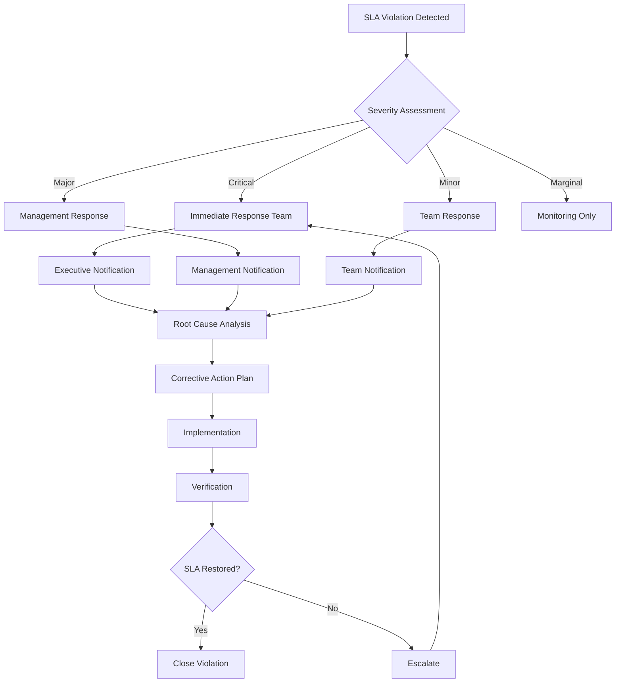

# Governance Service Level Agreements (SLAs) Framework

## Executive Summary

This document establishes comprehensive Service Level Agreements (SLAs) for ICT Governance operations, defining performance standards, response times, and accountability measures for governance processes, compliance monitoring, and incident response.

## SLA Framework Overview

### Purpose
- Define measurable performance standards for governance operations
- Establish clear response time commitments for stakeholders
- Provide accountability framework for governance processes
- Enable continuous improvement through performance measurement

### Scope
This SLA framework covers:
- **Governance Process SLAs**: Decision-making, approvals, and reviews
- **Compliance Monitoring SLAs**: Violation detection and response
- **Security Incident SLAs**: Security event response and resolution
- **Service Delivery SLAs**: Governance service provision
- **Communication SLAs**: Stakeholder notification and reporting

## Governance Process SLAs

### 1. Decision-Making and Approval SLAs

#### 1.1 ICT Governance Council Decisions
| Decision Type | Response Time SLA | Resolution SLA | Escalation Trigger |
|---------------|-------------------|----------------|-------------------|
| **Emergency Decisions** | < 2 hours | < 8 hours | 1 hour no response |
| **Critical Technology Approvals** | < 24 hours | < 72 hours | 12 hours no response |
| **Standard Technology Requests** | < 3 business days | < 10 business days | 5 business days no response |
| **Policy Changes** | < 5 business days | < 15 business days | 7 business days no response |
| **Budget Approvals** | < 5 business days | < 20 business days | 10 business days no response |

#### 1.2 Architecture Review Board SLAs
| Review Type | Initial Review SLA | Decision SLA | Feedback SLA |
|-------------|-------------------|--------------|--------------|
| **Tier 1 Critical Systems** | < 24 hours | < 48 hours | < 24 hours |
| **Tier 2 Important Systems** | < 48 hours | < 5 business days | < 48 hours |
| **Tier 3 Standard Systems** | < 5 business days | < 10 business days | < 3 business days |
| **Infrastructure Changes** | < 48 hours | < 5 business days | < 48 hours |

#### 1.3 Exception Request Processing
| Exception Type | Assessment SLA | Approval SLA | Implementation SLA |
|----------------|----------------|--------------|-------------------|
| **Security Exceptions** | < 4 hours | < 24 hours | < 48 hours |
| **Compliance Exceptions** | < 24 hours | < 72 hours | < 5 business days |
| **Process Exceptions** | < 48 hours | < 5 business days | < 10 business days |
| **Emergency Exceptions** | < 1 hour | < 4 hours | < 8 hours |

### 2. Compliance Monitoring SLAs

#### 2.1 Violation Detection SLAs
| Violation Severity | Detection Time SLA | Alert Generation SLA | Initial Assessment SLA |
|-------------------|-------------------|---------------------|----------------------|
| **Critical** | < 2 minutes | < 30 seconds | < 5 minutes |
| **High** | < 5 minutes | < 1 minute | < 15 minutes |
| **Medium** | < 15 minutes | < 2 minutes | < 1 hour |
| **Low** | < 1 hour | < 5 minutes | < 4 hours |

#### 2.2 Compliance Response SLAs
| Response Action | Critical SLA | High SLA | Medium SLA | Low SLA |
|----------------|--------------|----------|------------|---------|
| **Initial Response** | < 5 minutes | < 15 minutes | < 1 hour | < 4 hours |
| **Containment** | < 15 minutes | < 1 hour | < 4 hours | < 24 hours |
| **Investigation** | < 30 minutes | < 2 hours | < 8 hours | < 48 hours |
| **Resolution** | < 2 hours | < 8 hours | < 24 hours | < 72 hours |
| **Documentation** | < 4 hours | < 24 hours | < 48 hours | < 5 business days |

#### 2.3 Compliance Reporting SLAs
| Report Type | Generation SLA | Distribution SLA | Review SLA |
|-------------|----------------|------------------|------------|
| **Real-time Dashboards** | < 30 seconds | Immediate | Continuous |
| **Daily Compliance Reports** | < 1 hour after EOD | < 2 hours after generation | Next business day |
| **Weekly Executive Reports** | < 4 hours on Monday | < 8 hours after generation | Within 48 hours |
| **Monthly Governance Reports** | < 24 hours on 1st | < 48 hours after generation | Within 5 business days |
| **Quarterly Board Reports** | < 5 business days | < 24 hours after generation | Within 10 business days |

### 3. Security Incident Response SLAs

#### 3.1 Incident Classification and Response Times
| Incident Severity | Classification SLA | Initial Response SLA | Escalation SLA | Resolution SLA |
|------------------|-------------------|---------------------|----------------|----------------|
| **P1 - Critical** | < 5 minutes | < 10 minutes | 15 minutes | < 4 hours |
| **P2 - High** | < 15 minutes | < 30 minutes | 1 hour | < 8 hours |
| **P3 - Medium** | < 1 hour | < 2 hours | 4 hours | < 24 hours |
| **P4 - Low** | < 4 hours | < 8 hours | 24 hours | < 72 hours |

#### 3.2 Security Incident Communication SLAs
| Stakeholder Group | P1 Notification | P2 Notification | P3 Notification | P4 Notification |
|------------------|----------------|----------------|----------------|----------------|
| **CISO** | < 2 minutes | < 15 minutes | < 1 hour | < 4 hours |
| **Security Team** | < 1 minute | < 5 minutes | < 30 minutes | < 2 hours |
| **Governance Council** | < 15 minutes | < 1 hour | < 4 hours | < 24 hours |
| **Domain Owners** | < 5 minutes | < 30 minutes | < 2 hours | < 8 hours |
| **Affected Users** | < 30 minutes | < 2 hours | < 8 hours | < 24 hours |
| **Executive Leadership** | < 30 minutes | < 4 hours | < 24 hours | As needed |

### 4. Service Delivery SLAs

#### 4.1 Governance Service Provision
| Service | Availability SLA | Response Time SLA | Resolution SLA |
|---------|------------------|-------------------|----------------|
| **Governance Portal** | 99.9% | < 2 seconds | < 4 hours |
| **Policy Management System** | 99.5% | < 3 seconds | < 8 hours |
| **Compliance Dashboard** | 99.9% | < 1 second | < 2 hours |
| **Risk Management Platform** | 99.5% | < 2 seconds | < 4 hours |
| **Reporting Services** | 99.0% | < 5 seconds | < 24 hours |

#### 4.2 Support and Assistance SLAs
| Support Type | Response SLA | Resolution SLA | Escalation Trigger |
|-------------|--------------|----------------|-------------------|
| **Critical Issues** | < 15 minutes | < 2 hours | 30 minutes no response |
| **High Priority** | < 1 hour | < 8 hours | 2 hours no response |
| **Standard Requests** | < 4 hours | < 24 hours | 8 hours no response |
| **General Inquiries** | < 24 hours | < 72 hours | 48 hours no response |

#### 4.3 Training and Onboarding SLAs
| Training Type | Scheduling SLA | Delivery SLA | Follow-up SLA |
|--------------|----------------|--------------|---------------|
| **Emergency Training** | < 4 hours | < 24 hours | < 48 hours |
| **Role-based Training** | < 5 business days | < 10 business days | < 5 business days |
| **General Awareness** | < 10 business days | < 20 business days | < 10 business days |
| **Specialized Training** | < 15 business days | < 30 business days | < 15 business days |

### 5. Communication and Reporting SLAs

#### 5.1 Stakeholder Communication SLAs
| Communication Type | Preparation SLA | Distribution SLA | Response Expected |
|-------------------|----------------|------------------|-------------------|
| **Emergency Notifications** | < 15 minutes | < 5 minutes | Immediate acknowledgment |
| **Critical Updates** | < 1 hour | < 15 minutes | Within 2 hours |
| **Regular Updates** | < 4 hours | < 1 hour | Within 24 hours |
| **Scheduled Communications** | 24 hours advance | On schedule | As requested |

#### 5.2 Meeting and Review SLAs
| Meeting Type | Scheduling SLA | Preparation SLA | Minutes Distribution |
|-------------|----------------|----------------|---------------------|
| **Emergency Meetings** | < 2 hours | < 1 hour | < 4 hours |
| **Governance Council** | 5 business days advance | 48 hours advance | < 24 hours |
| **Domain Reviews** | 3 business days advance | 24 hours advance | < 48 hours |
| **Stakeholder Forums** | 10 business days advance | 5 business days advance | < 72 hours |

## SLA Monitoring and Measurement

### 6. Performance Measurement Framework

#### 6.1 SLA Metrics and Targets
| SLA Category | Key Metrics | Target Performance | Measurement Frequency |
|-------------|-------------|-------------------|----------------------|
| **Response Times** | Average response time by category | > 95% within SLA | Real-time |
| **Resolution Times** | Average resolution time by severity | > 90% within SLA | Daily |
| **Availability** | System uptime percentage | > 99.5% | Continuous |
| **Quality** | First-time resolution rate | > 85% | Weekly |
| **Satisfaction** | Stakeholder satisfaction score | > 4.0/5.0 | Monthly |

#### 6.2 SLA Reporting Dashboard
```json
{
  "sla_dashboard": {
    "real_time_metrics": [
      {
        "metric": "current_sla_performance",
        "query": "SLAMetrics_CL | where TimeGenerated > ago(1h) | summarize avg(PerformanceScore_d) by SLACategory_s",
        "target": 95,
        "unit": "%"
      },
      {
        "metric": "active_sla_violations",
        "query": "SLAViolations_CL | where Status_s == 'Active' | count",
        "target": 0,
        "unit": "count"
      }
    ],
    "trend_analysis": [
      {
        "metric": "sla_performance_trend",
        "query": "SLAMetrics_CL | where TimeGenerated > ago(30d) | summarize avg(PerformanceScore_d) by bin(TimeGenerated, 1d)",
        "visualization": "line_chart"
      }
    ]
  }
}
```

### 7. SLA Violation Management

#### 7.1 Violation Classification
| Violation Severity | Definition | Response Required | Escalation |
|-------------------|------------|-------------------|------------|
| **Critical** | > 50% SLA miss or critical service impact | Immediate action plan | Executive notification |
| **Major** | 25-50% SLA miss or significant impact | Action plan within 4 hours | Management notification |
| **Minor** | 10-25% SLA miss or limited impact | Action plan within 24 hours | Team notification |
| **Marginal** | < 10% SLA miss | Monitoring and trending | Internal tracking |

#### 7.2 Violation Response Process


#### 7.3 Continuous Improvement Process
| Improvement Activity | Frequency | Responsibility | Deliverable |
|---------------------|-----------|----------------|-------------|
| **SLA Performance Review** | Weekly | Service Owners | Performance Report |
| **Trend Analysis** | Monthly | Governance Office | Trend Analysis Report |
| **SLA Optimization** | Quarterly | Governance Council | SLA Updates |
| **Stakeholder Feedback** | Quarterly | All Stakeholders | Feedback Summary |
| **Annual SLA Review** | Annually | Executive Leadership | SLA Framework Update |

## Governance and Accountability

### 8. SLA Governance Structure

#### 8.1 Roles and Responsibilities
| Role | SLA Responsibilities | Accountability |
|------|---------------------|----------------|
| **Governance Council** | SLA approval and oversight | Strategic SLA performance |
| **Service Owners** | SLA delivery and performance | Operational SLA compliance |
| **Domain Owners** | Domain-specific SLA management | Domain SLA performance |
| **Technology Stewards** | Technical SLA implementation | Technical SLA delivery |
| **Quality Assurance** | SLA monitoring and reporting | SLA measurement accuracy |

#### 8.2 SLA Review and Approval Process
```yaml
sla_governance_process:
  - stage: "SLA Development"
    responsibility: "Service Owners"
    timeline: "2 weeks"
    deliverable: "Draft SLA"
    
  - stage: "Stakeholder Review"
    responsibility: "Domain Owners"
    timeline: "1 week"
    deliverable: "Review Comments"
    
  - stage: "Technical Validation"
    responsibility: "Technology Stewards"
    timeline: "1 week"
    deliverable: "Technical Feasibility"
    
  - stage: "Governance Approval"
    responsibility: "Governance Council"
    timeline: "1 week"
    deliverable: "Approved SLA"
    
  - stage: "Implementation"
    responsibility: "All Stakeholders"
    timeline: "2 weeks"
    deliverable: "Active SLA"
```

### 9. SLA Enforcement and Penalties

#### 9.1 Performance Incentives
| Performance Level | Recognition | Incentive |
|------------------|-------------|-----------|
| **Exceeds SLA (>105%)** | Excellence Award | Performance Bonus |
| **Meets SLA (95-105%)** | Standard Recognition | Standard Compensation |
| **Below SLA (85-95%)** | Improvement Plan | Performance Review |
| **Fails SLA (<85%)** | Corrective Action | Performance Improvement Plan |

#### 9.2 Vendor SLA Management
| Vendor Performance | Action Required | Contract Impact |
|-------------------|----------------|-----------------|
| **Consistent SLA Achievement** | Preferred vendor status | Contract renewal priority |
| **Occasional SLA Miss** | Performance discussion | Standard contract terms |
| **Frequent SLA Violations** | Improvement plan required | Contract review |
| **Persistent SLA Failure** | Contract termination consideration | Penalty clauses invoked |

## Implementation and Rollout

### 10. SLA Implementation Plan

#### Phase 1: Foundation (Weeks 1-4)
- [ ] Establish SLA measurement infrastructure
- [ ] Define baseline performance metrics
- [ ] Implement SLA monitoring dashboards
- [ ] Train stakeholders on SLA framework
- [ ] Begin SLA performance tracking

#### Phase 2: Operationalization (Weeks 5-8)
- [ ] Deploy automated SLA monitoring
- [ ] Implement violation alerting
- [ ] Establish response procedures
- [ ] Begin regular SLA reporting
- [ ] Conduct first SLA review cycle

#### Phase 3: Optimization (Weeks 9-12)
- [ ] Analyze SLA performance trends
- [ ] Optimize SLA targets based on data
- [ ] Implement continuous improvement
- [ ] Enhance stakeholder communication
- [ ] Establish long-term SLA governance

#### Phase 4: Maturity (Weeks 13-16)
- [ ] Achieve consistent SLA performance
- [ ] Implement predictive SLA analytics
- [ ] Establish SLA excellence program
- [ ] Complete stakeholder satisfaction assessment
- [ ] Document lessons learned and best practices

## Success Criteria and Benefits

### 11. Implementation Success Metrics

#### 11.1 Quantitative Success Criteria
- [ ] 95% SLA achievement rate across all categories
- [ ] 50% reduction in response times
- [ ] 75% improvement in stakeholder satisfaction
- [ ] 90% reduction in SLA violations
- [ ] 100% SLA monitoring coverage

#### 11.2 Qualitative Benefits
- [ ] Clear performance expectations for all stakeholders
- [ ] Improved accountability and responsibility
- [ ] Enhanced service quality and reliability
- [ ] Better stakeholder communication and trust
- [ ] Continuous improvement culture establishment

#### 11.3 Business Impact
- [ ] Reduced governance operational costs
- [ ] Improved compliance and risk management
- [ ] Enhanced stakeholder confidence
- [ ] Better decision-making speed and quality
- [ ] Increased organizational agility

---

## Conclusion

This Governance SLAs Framework establishes clear, measurable performance standards for all governance operations. By defining specific response times, resolution targets, and accountability measures, the organization can ensure consistent, high-quality governance service delivery while maintaining stakeholder confidence and regulatory compliance.

**Key Benefits:**
- **Clear Expectations**: Defined performance standards for all stakeholders
- **Improved Accountability**: Measurable responsibility assignments
- **Enhanced Service Quality**: Consistent, reliable governance services
- **Better Communication**: Structured stakeholder engagement
- **Continuous Improvement**: Data-driven optimization opportunities

**Next Steps:**
1. Review and approve SLA framework
2. Implement SLA monitoring infrastructure
3. Train stakeholders on SLA requirements
4. Begin SLA performance measurement
5. Establish regular SLA review and improvement cycles

---

*Framework Owner: ICT Governance Office*  
*Service Owner: Governance Operations Team*  
*Document Version: 1.0*  
*Last Updated: 2024-12-19*  
*Next Review: Quarterly*