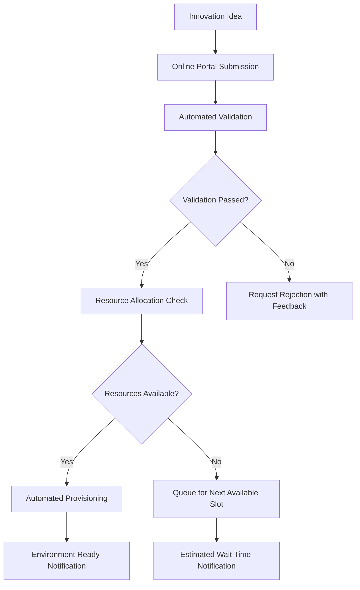
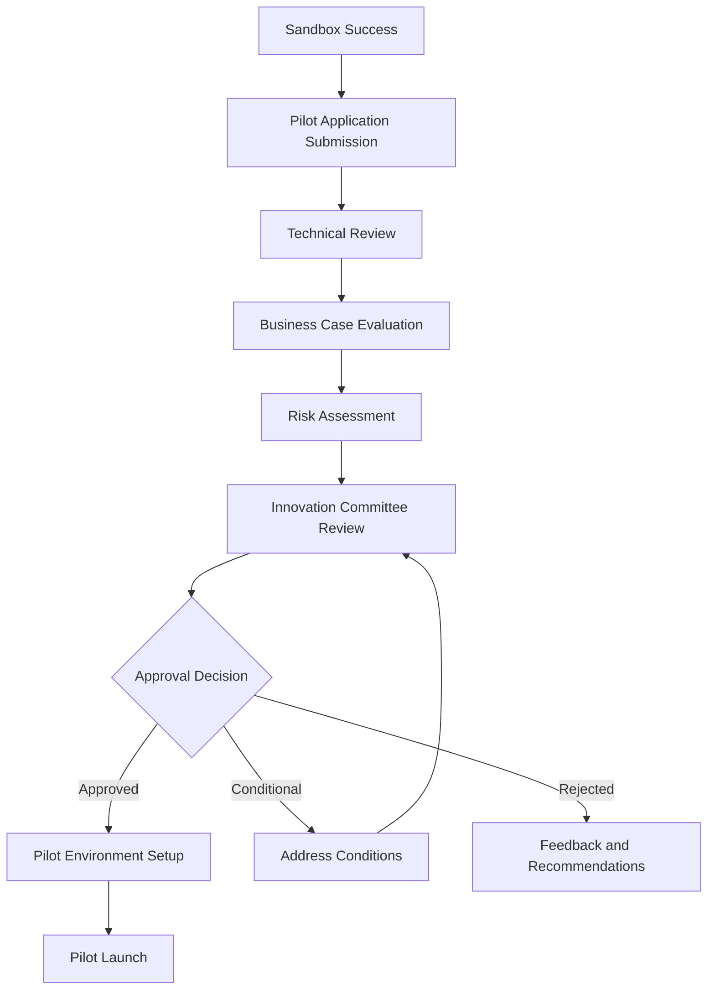
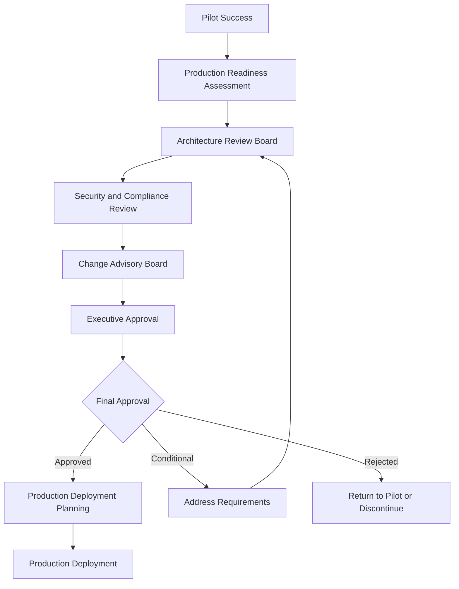

# Innovation Governance Procedures
## Operational Procedures for Three-Zone Innovation Governance Model

---

## Executive Summary

This document establishes the operational procedures for managing innovation initiatives across the three-zone innovation governance model. It provides detailed workflows, approval processes, evaluation criteria, and management procedures necessary to operationalize the innovation governance framework effectively.

**Procedure Objectives:**
- Define clear operational workflows for each innovation zone
- Establish approval processes and decision criteria
- Create evaluation and progression procedures
- Implement monitoring and reporting processes
- Ensure compliance with governance requirements

---

## Zone 1: Innovation Sandbox Procedures

### Sandbox Access and Provisioning Procedures

#### Self-Service Request Process

#### Sandbox Request Form Requirements
**Basic Information:**
- Project Name and Description
- Business Justification (100-word minimum)
- Expected Duration (maximum 90 days)
- Resource Requirements (compute, storage, network)
- Data Requirements (synthetic data only)

**Technical Requirements:**
- Operating System Preference
- Development Tools and Frameworks
- Integration Requirements (if any)
- Performance Expectations
- Security Considerations

**Approval Criteria:**
- Valid employee credentials
- Reasonable resource requirements
- Compliance with sandbox limitations
- No production data access requested
- Clear project objectives

#### Automated Provisioning Workflow
1. **Request Validation:** System validates user credentials and request parameters
2. **Resource Check:** Automated verification of resource availability
3. **Environment Creation:** Deployment using predefined templates
4. **Access Configuration:** User access setup with appropriate permissions
5. **Monitoring Setup:** Automated monitoring and alerting configuration
6. **User Notification:** Email notification with access details and guidelines

### Sandbox Management Procedures

#### Daily Operations
**Automated Monitoring:**
- Resource utilization tracking
- Security event monitoring
- Cost accumulation tracking
- Performance metrics collection
- Compliance status verification

**User Support:**
- Self-service documentation portal
- Automated troubleshooting guides
- Escalation to technical support team
- Community forum for peer support
- Regular tips and best practices communication

#### Weekly Reviews
**Resource Optimization:**
- Identification of underutilized resources
- Recommendations for resource adjustments
- Cost optimization suggestions
- Performance improvement opportunities
- Security posture assessment

**Usage Analytics:**
- Sandbox utilization patterns
- Popular development tools and frameworks
- Common integration requirements
- Success rate tracking
- User satisfaction metrics

#### Monthly Assessments
**Portfolio Review:**
- Active sandbox inventory
- Project progression tracking
- Resource allocation efficiency
- Cost analysis and trends
- Success story identification

**Process Improvement:**
- User feedback analysis
- Process bottleneck identification
- Automation enhancement opportunities
- Policy adjustment recommendations
- Training needs assessment

### Sandbox Progression Procedures

#### 30-Day Checkpoint
**Evaluation Criteria:**
- Technical progress demonstration
- Initial user feedback collection
- Basic performance validation
- Security compliance verification
- Resource utilization assessment

**Required Deliverables:**
- Progress report (2-page maximum)
- Working prototype demonstration
- Initial user feedback summary
- Technical architecture overview
- Next phase planning

**Decision Outcomes:**
- Continue in sandbox (extend up to 90 days)
- Progress to pilot evaluation
- Modify scope or approach
- Discontinue project
- Request additional resources

#### 60-Day Review
**Comprehensive Assessment:**
- Business value potential evaluation
- Technical feasibility confirmation
- User adoption indicators
- Integration complexity assessment
- Risk and mitigation analysis

**Progression Readiness Checklist:**
- [ ] Working prototype completed
- [ ] User feedback collected and analyzed
- [ ] Performance benchmarks achieved
- [ ] Security assessment passed
- [ ] Business case refined and quantified
- [ ] Pilot phase planning completed

#### 90-Day Final Evaluation
**Mandatory Outcomes:**
- Final project report
- Lessons learned documentation
- Technology evaluation summary
- Recommendation for next steps
- Knowledge transfer completion

**Progression Options:**
- Advance to Zone 2 (Pilot)
- Return to ideation for refinement
- Archive as completed research
- Transition to external development
- Discontinue with lessons learned

---

## Zone 2: Innovation Pilot Procedures

### Pilot Approval and Setup Procedures

#### Formal Application Process

#### Pilot Application Requirements
**Executive Summary:**
- Project overview and objectives
- Business value proposition
- Success criteria and metrics
- Resource requirements and timeline
- Risk assessment and mitigation

**Technical Documentation:**
- Detailed architecture design
- Integration requirements and approach
- Security and compliance plan
- Performance and scalability requirements
- Data management and privacy plan

**Business Case:**
- Market analysis and opportunity
- Cost-benefit analysis with ROI projections
- Implementation timeline and milestones
- Resource allocation and budget
- Success metrics and measurement plan

**Risk Management:**
- Comprehensive risk register
- Risk mitigation strategies
- Contingency planning
- Compliance requirements
- Security considerations

#### Innovation Committee Review Process
**Committee Composition:**
- Chief Technology Officer (Chair)
- Chief Information Officer
- Chief Security Officer
- Business Unit Representatives
- Innovation Program Manager
- Subject Matter Experts (as needed)

**Review Criteria:**
- Strategic alignment (weight: 25%)
- Business value potential (weight: 25%)
- Technical feasibility (weight: 20%)
- Risk assessment (weight: 15%)
- Resource requirements (weight: 15%)

**Decision Timeline:**
- Application submission deadline: 1st of each month
- Committee review: 2nd week of each month
- Decision notification: 3rd week of each month
- Environment setup: 4th week of each month

### Pilot Management Procedures

#### Pilot Launch Process
1. **Environment Provisioning:** Automated deployment of pilot infrastructure
2. **Security Configuration:** Implementation of enhanced security controls
3. **Data Integration Setup:** Configuration of approved data connections
4. **User Access Management:** Provision of user accounts and permissions
5. **Monitoring Implementation:** Deployment of comprehensive monitoring
6. **Stakeholder Notification:** Communication to all relevant stakeholders

#### Ongoing Management
**Weekly Status Reviews:**
- Progress against milestones
- Resource utilization analysis
- User adoption tracking
- Performance metrics review
- Issue identification and resolution

**Monthly Steering Committee Updates:**
- Comprehensive progress report
- Business value realization tracking
- Risk register updates
- Resource requirement adjustments
- Timeline and milestone updates

**Quarterly Business Reviews:**
- Strategic alignment assessment
- ROI realization tracking
- Market condition updates
- Competitive landscape analysis
- Continuation decision making

### Pilot Evaluation and Progression

#### 60-Day Milestone Review
**Evaluation Focus:**
- Initial business value demonstration
- User adoption rate assessment
- Technical performance validation
- Integration success measurement
- Risk mitigation effectiveness

**Required Deliverables:**
- Interim business value report
- User adoption and feedback analysis
- Technical performance assessment
- Integration testing results
- Updated risk assessment

**Decision Options:**
- Continue pilot as planned
- Modify scope or approach
- Accelerate to production planning
- Extend pilot duration
- Discontinue with lessons learned

#### 120-Day Comprehensive Assessment
**Business Value Evaluation:**
- Quantified business benefits achieved
- ROI calculation and projection
- Market impact assessment
- Competitive advantage analysis
- Scalability potential evaluation

**Technical Readiness Assessment:**
- System performance and reliability
- Integration stability and effectiveness
- Security posture validation
- Scalability testing results
- Operational readiness evaluation

**User Adoption Analysis:**
- Adoption rate achievement
- User satisfaction measurement
- Training effectiveness assessment
- Support requirement analysis
- Change management success

#### 180-Day Production Readiness Review
**Comprehensive Evaluation:**
- Business case validation
- Technical architecture review
- Security and compliance audit
- Operational readiness assessment
- Change management preparation

**Production Readiness Criteria:**
- [ ] Business value targets achieved
- [ ] User adoption goals met (minimum 70%)
- [ ] Technical performance requirements satisfied
- [ ] Security and compliance validation completed
- [ ] Operational procedures documented
- [ ] Support processes established
- [ ] Change management plan approved
- [ ] Production environment design completed

---

## Zone 3: Innovation Production Procedures

### Production Approval and Deployment

#### Production Readiness Assessment

#### Architecture Review Board (ARB) Process
**Review Scope:**
- Enterprise architecture alignment
- Integration architecture validation
- Performance and scalability assessment
- Security architecture review
- Compliance and regulatory alignment

**Review Criteria:**
- Adherence to enterprise architecture standards
- Integration with existing systems
- Performance and scalability requirements
- Security and privacy controls
- Operational supportability

**Required Documentation:**
- Detailed technical architecture
- Integration specifications
- Performance test results
- Security assessment report
- Operational runbook

#### Change Advisory Board (CAB) Process
**Change Classification:**
- Standard change (pre-approved)
- Normal change (requires approval)
- Emergency change (expedited process)
- Major change (executive approval required)

**Change Assessment Criteria:**
- Business impact analysis
- Technical risk assessment
- Resource requirement validation
- Timeline and dependency analysis
- Rollback and contingency planning

**Approval Requirements:**
- Change request documentation
- Impact assessment report
- Implementation plan
- Testing and validation plan
- Rollback procedures

### Production Deployment Procedures

#### Phased Deployment Approach
**Phase 1: Limited Production (Weeks 1-2)**
- Deploy to limited user group (10% of target users)
- Intensive monitoring and support
- Daily performance and stability reviews
- User feedback collection and analysis
- Issue identification and resolution

**Phase 2: Expanded Deployment (Weeks 3-4)**
- Expand to broader user group (50% of target users)
- Continued monitoring and optimization
- Performance tuning and adjustment
- Training and support scaling
- Process refinement and improvement

**Phase 3: Full Production (Weeks 5-6)**
- Complete deployment to all target users
- Full operational support activation
- Comprehensive monitoring implementation
- Business value measurement initiation
- Continuous improvement process establishment

#### Production Support Procedures
**Incident Management:**
- 24/7 monitoring and alerting
- Tiered support structure (L1, L2, L3)
- Escalation procedures and timelines
- Root cause analysis and resolution
- Post-incident review and improvement

**Change Management:**
- Regular maintenance windows
- Change approval and testing procedures
- Deployment automation and validation
- Rollback procedures and testing
- Communication and notification processes

**Performance Management:**
- Continuous performance monitoring
- Capacity planning and optimization
- Performance tuning and adjustment
- SLA monitoring and reporting
- Proactive issue identification

### Production Optimization and Evolution

#### Continuous Improvement Process
**Monthly Performance Reviews:**
- Business value realization tracking
- User satisfaction measurement
- Performance metrics analysis
- Cost optimization opportunities
- Enhancement requirement identification

**Quarterly Strategic Assessments:**
- Strategic alignment validation
- Market condition impact analysis
- Competitive landscape assessment
- Technology evolution planning
- Investment optimization decisions

**Annual Innovation Reviews:**
- Comprehensive value realization assessment
- Technology refresh planning
- Strategic roadmap alignment
- Lessons learned documentation
- Best practice identification and sharing

---

## Cross-Zone Governance Procedures

### Innovation Portfolio Management

#### Portfolio Oversight Structure
**Innovation Steering Committee:**
- Executive sponsorship and strategic direction
- Resource allocation and prioritization
- Portfolio performance monitoring
- Strategic alignment validation
- Investment decision making

**Technology Innovation Council:**
- Technical oversight and guidance
- Architecture and standards compliance
- Technology evaluation and selection
- Integration planning and coordination
- Technical risk management

**Innovation Program Office:**
- Day-to-day program management
- Process standardization and improvement
- Metrics collection and reporting
- Training and capability development
- Knowledge management and sharing

#### Portfolio Management Processes
**Monthly Portfolio Reviews:**
- Project status and progress tracking
- Resource utilization and allocation
- Risk register updates and mitigation
- Budget tracking and forecasting
- Success story identification

**Quarterly Strategic Alignment:**
- Strategic objective alignment assessment
- Market condition impact analysis
- Competitive landscape evaluation
- Technology trend assessment
- Portfolio optimization decisions

**Annual Portfolio Planning:**
- Strategic roadmap development
- Budget allocation and planning
- Capability development planning
- Resource capacity planning
- Success metrics definition

### Innovation Metrics and Reporting

#### Key Performance Indicators (KPIs)
**Innovation Velocity Metrics:**
- Average time from idea to sandbox (target: <5 days)
- Sandbox to pilot progression rate (target: >30%)
- Pilot to production progression rate (target: >60%)
- Average time to market (target: <12 months)

**Business Value Metrics:**
- Total innovation portfolio value (target: $2M+ annually)
- Average ROI per innovation (target: >200%)
- Cost per successful innovation (target: <$50K)
- Strategic alignment percentage (target: >80%)

**Operational Excellence Metrics:**
- Resource utilization efficiency (target: >75%)
- User satisfaction score (target: >4.0/5.0)
- Compliance rate (target: 100%)
- Security incident rate (target: <1 per quarter)

#### Reporting Framework
**Weekly Operational Reports:**
- Active project status summary
- Resource utilization dashboard
- Issue and risk register updates
- Cost tracking and forecasting
- User activity and satisfaction

**Monthly Executive Dashboard:**
- Portfolio performance summary
- Business value realization tracking
- Strategic alignment assessment
- Resource allocation optimization
- Success story highlights

**Quarterly Board Reports:**
- Strategic impact assessment
- Financial performance analysis
- Competitive advantage evaluation
- Market opportunity analysis
- Investment recommendation

### Risk Management Procedures

#### Innovation Risk Categories
**Technical Risks:**
- Technology obsolescence
- Integration complexity
- Performance limitations
- Security vulnerabilities
- Scalability constraints

**Business Risks:**
- Market condition changes
- Competitive response
- Resource constraints
- Stakeholder alignment
- Value realization delays

**Governance Risks:**
- Compliance failures
- Process inefficiencies
- Decision delays
- Cultural resistance
- Knowledge loss

#### Risk Management Process
**Risk Identification:**
- Regular risk assessment workshops
- Stakeholder feedback collection
- Industry trend monitoring
- Competitive intelligence gathering
- Technical evaluation and testing

**Risk Assessment:**
- Probability and impact evaluation
- Risk scoring and prioritization
- Mitigation strategy development
- Contingency planning
- Resource requirement assessment

**Risk Mitigation:**
- Proactive mitigation implementation
- Regular monitoring and review
- Escalation procedures and triggers
- Contingency plan activation
- Lessons learned capture

### Compliance and Audit Procedures

#### Compliance Monitoring
**Automated Compliance Checks:**
- Policy adherence validation
- Security control verification
- Data protection compliance
- Regulatory requirement monitoring
- Audit trail maintenance

**Regular Compliance Reviews:**
- Monthly compliance dashboard updates
- Quarterly compliance assessments
- Annual compliance audits
- Exception reporting and resolution
- Continuous improvement implementation

#### Audit Support Procedures
**Audit Preparation:**
- Documentation collection and organization
- Evidence compilation and validation
- Process walkthrough preparation
- Stakeholder interview coordination
- Remediation planning

**Audit Execution:**
- Auditor access and support
- Documentation and evidence provision
- Process demonstration and explanation
- Issue identification and acknowledgment
- Corrective action planning

**Post-Audit Activities:**
- Finding analysis and prioritization
- Corrective action implementation
- Process improvement initiatives
- Follow-up audit preparation
- Lessons learned documentation

---

## Training and Communication Procedures

### Training Program Structure

#### Role-Based Training Curriculum
**Innovation Team Members:**
- Innovation governance framework overview
- Zone-specific procedures and requirements
- Technology evaluation and assessment
- Business case development
- Risk management and mitigation

**Innovation Committee Members:**
- Strategic decision making
- Portfolio management principles
- Risk assessment and evaluation
- Business value measurement
- Stakeholder engagement

**Technical Support Staff:**
- Infrastructure management and monitoring
- Security and compliance requirements
- Troubleshooting and problem resolution
- Performance optimization
- User support and training

#### Training Delivery Methods
**Online Learning Modules:**
- Self-paced interactive training
- Video demonstrations and tutorials
- Knowledge assessments and certification
- Resource libraries and documentation
- Community forums and discussion

**Instructor-Led Training:**
- Workshop-style interactive sessions
- Hands-on laboratory exercises
- Case study analysis and discussion
- Best practice sharing
- Q&A and problem-solving sessions

**On-the-Job Training:**
- Mentoring and coaching programs
- Shadow experienced team members
- Gradual responsibility increase
- Regular feedback and guidance
- Performance evaluation and improvement

### Communication Framework

#### Communication Channels
**Internal Communications:**
- Innovation portal and dashboard
- Regular newsletter and updates
- Team meetings and reviews
- Success story sharing
- Lessons learned documentation

**Stakeholder Communications:**
- Executive briefings and reports
- Business unit updates
- User community engagement
- Vendor and partner communications
- Industry and professional networking

#### Communication Schedule
**Daily Communications:**
- Operational status updates
- Issue and incident notifications
- Resource availability alerts
- User support communications
- Team coordination messages

**Weekly Communications:**
- Progress reports and summaries
- Resource utilization updates
- Success story highlights
- Training and development opportunities
- Community engagement activities

**Monthly Communications:**
- Executive dashboard updates
- Portfolio performance reports
- Strategic alignment assessments
- Market and competitive intelligence
- Innovation showcase events

**Quarterly Communications:**
- Comprehensive performance reviews
- Strategic planning updates
- Industry trend analysis
- Best practice sharing
- Annual planning communications

---

## Conclusion

These comprehensive innovation governance procedures provide the operational foundation for successfully implementing and managing the three-zone innovation governance model. The procedures ensure that innovation initiatives progress through appropriate governance controls while maintaining the agility and creativity necessary for successful innovation.

**Key Success Factors:**
- **Clear Processes:** Well-defined procedures that are easy to understand and follow
- **Appropriate Controls:** Governance controls that are proportional to risk and impact
- **Efficient Workflows:** Streamlined processes that minimize bureaucracy
- **Continuous Improvement:** Regular assessment and optimization of procedures
- **Stakeholder Engagement:** Active involvement of all relevant stakeholders

Through consistent application of these procedures, organizations can achieve innovation excellence while maintaining governance effectiveness and organizational alignment.

---

*Document Version: 1.0*  
*Document Owner: Innovation Program Office*  
*Next Review: Quarterly*  
*Last Updated: [Current Date]*