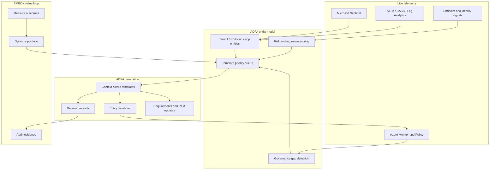
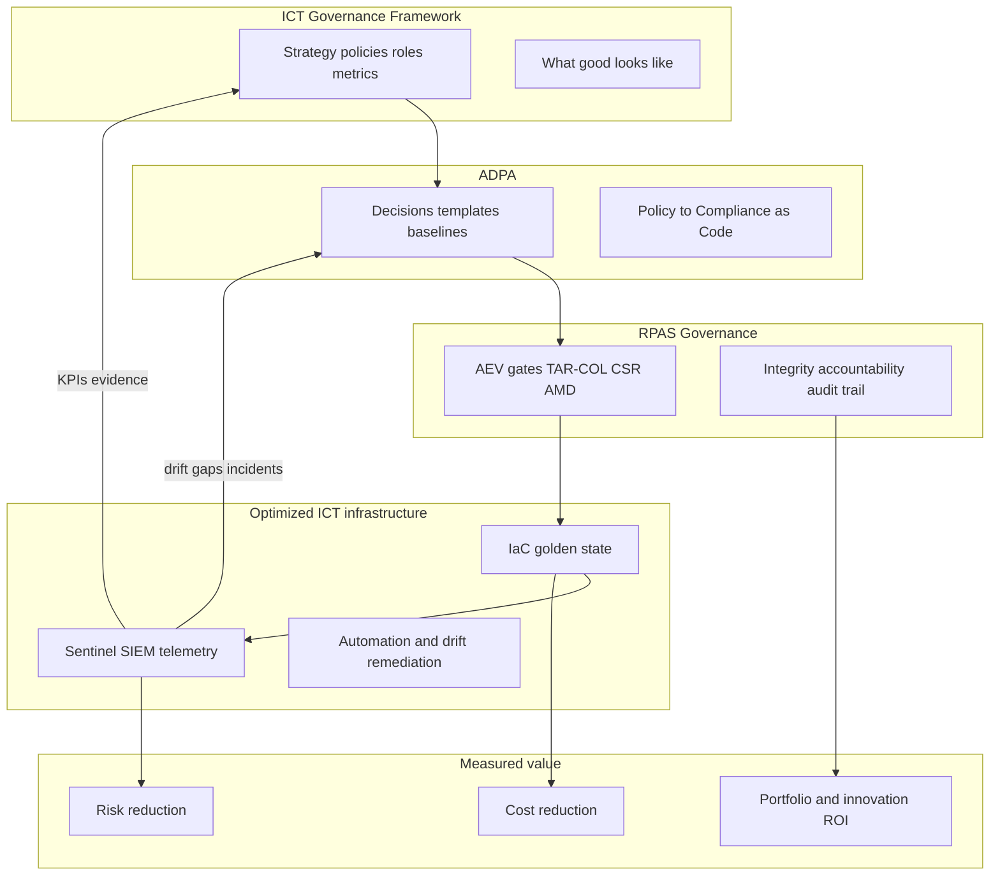
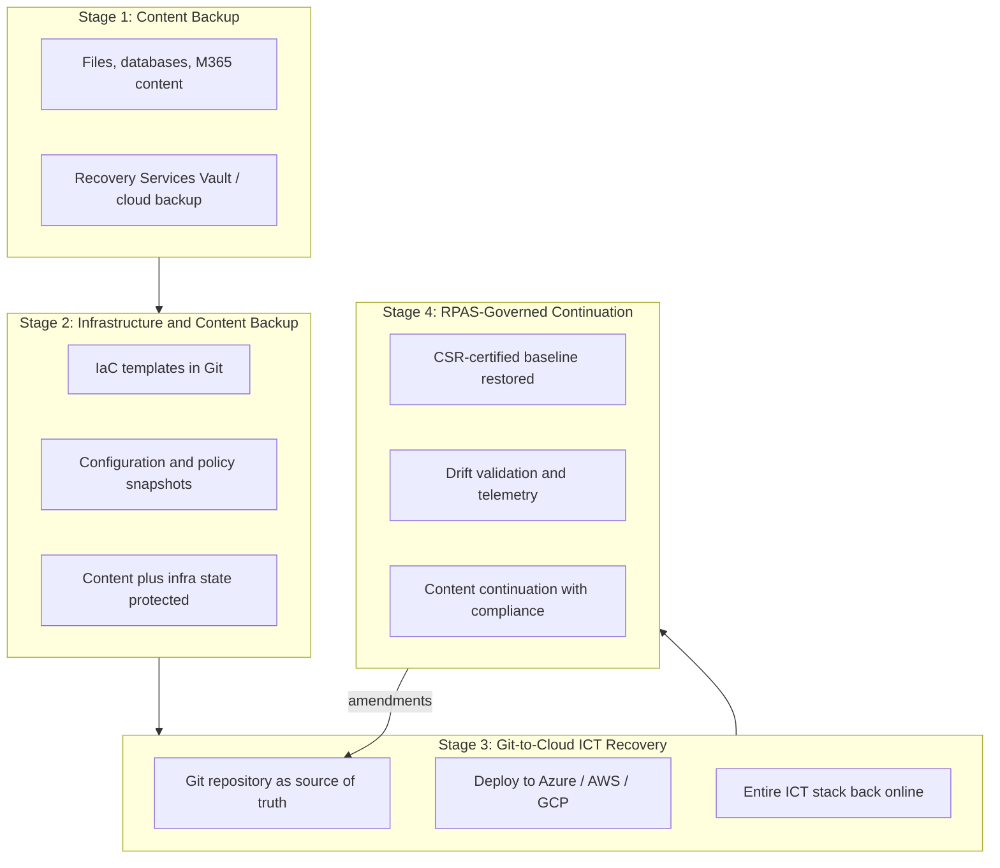

# Multi-Cloud Multi-Tenant ICT Governance Framework

[](https://github.com/CBA-Consult/ICT-Governance-Framework-Application/actions/workflows/pester.yml)
[](https://github.com/CBA-Consult/ICT-Governance-Framework-Application/actions/workflows/rpas-aev-validation.yml)
[](https://github.com/CBA-Consult/ICT-Governance-Framework-Application/actions/workflows/rpas-governance.yml)

A comprehensive governance framework, documentation library, automation tooling, and web application for managing ICT governance across multi-tenant, multi-cloud environments. Built on the CBA Consult IT Management Framework, it provides policies, blueprints, validation pipelines, and operational tooling for AWS, Azure, Google Cloud Platform, and hybrid deployments.

**[Table of Contents](docs/Table-of-Contents.md)** | **[Documentation Hub](docs/README.md)** | **[Repository Guide](docs/REPOSITORY-GUIDE.md)**

## Quick Start

| Audience | Start here |
|----------|------------|
| New to the project | [Project scope and objectives](docs/project-management/A001-Project-Scope-and-Objectives.md) |
| Governance teams | [Core ICT Governance Framework](docs/governance-framework/core-framework/ICT-Governance-Framework.md) |
| Improvement priorities | [Improvement focus areas](docs/compliance/ICT-Governance-Framework-Improvement-Focus-Areas.md) |
| ISO standards alignment | [ISO Standards Library](docs/compliance/ISO/README.md) — inventory, crosswalks, [2026 reassessment](docs/compliance/ISO/ISO-Standards-Reassessment-2026.md) |
| RPAS / agent governance | [RPAS Governance](#rpas-governance), [ADPA module](adpa/README.md), and [Integration Guide](docs/implementation/guides/ADPA-ICT-Governance-Integration-Guide.md) |
| Client / service providers | [Business Continuity Services](#business-continuity-services) |
| Implementers | [Implementation summary](docs/implementation/summaries/IMPLEMENTATION-SUMMARY.md) |
| Security / compliance operators | [Privileged access governance](#privileged-access-governance-jit--break-glass), [Web application](#web-application), and [Seven-Pillar Implementation Plan](docs/implementation/guides/Enterprise-Security-Seven-Pillar-Implementation-Plan.md) |
| Developers | [Web application README](ict-governance-framework/README.md) and [Developer guide](DEVELOPER.md) |
| Contributors | [Contributing guidelines](CONTRIBUTING.md) |

## Overview

The framework addresses governance across complex tenant communities with varying security, compliance, and service requirements. It combines structured documentation, Infrastructure as Code templates, PowerShell automation, RPAS governance validation, and an interactive web portal.

**Core capabilities:**

- **Multi-tenant architecture governance** — tenant isolation, classification, and resource segregation
- **Cross-cloud management** — unified policies with platform-specific implementation guidance
- **Automated lifecycle management** — tenant onboarding, operations, and secure offboarding
- **Compliance automation** — tenant-specific regulatory monitoring and reporting
- **Cost optimization** — multi-tenant cost allocation, budgets, and chargeback
- **Drift detection** — compare deployed infrastructure against approved governance baselines
- **RPAS asset register** — multi-cloud inventory with DR posture, CASB shadow-IT discovery, and validation workflows (Gate B)
- **Privileged access governance** — JIT elevation and Break Glass emergency procedures with immutable ledger audit trails, decoupled from asset inventory views
- **ADPA integration** — ADPA bridges the ICT Governance Framework to Compliance as Code and governance automation (see [ADPA as the governance bridge](#adpa-as-the-governance-bridge))
- **Business continuity** — staged path from content backup to full ICT recovery from Git across multi-cloud (see [Business Continuity Services](#business-continuity-services))

## Repository Structure

```
ICT-Governance-Framework-Application/
├── docs/                          # Primary documentation (policies, architecture, implementation)
├── adpa/                          # ADPA product module (templates, entities, generation, systematics)
├── governance/                    # RPAS-CM governance baseline and validation artifacts
├── ict-governance-framework/      # Web application, APIs, and frontend dashboard
├── azure-automation/              # PowerShell modules and Azure governance automation
├── blueprint-templates/           # Bicep/ARM templates and policy blueprints
├── Azure-IaC-Governance/          # Azure IaC governance patterns and templates
├── framework-evaluation/          # Framework assessment tools
├── generated-documents/           # Auto-generated documentation and templates
├── src/                           # Shared source modules (e.g. document generation)
├── tests/                         # Pester and Playwright test suites
├── .github/workflows/             # CI/CD, RPAS validation, and security scanning
├── README.md                      # This file
├── DEVELOPER.md                   # Local development and testing guide
└── LICENSE                        # MIT License
```

For a detailed breakdown by role and document category, see the [Repository Guide](docs/REPOSITORY-GUIDE.md).

## Framework Components

### Core framework documents

1. **[Multi-Cloud Multi-Tenant ICT Governance Framework](docs/governance-framework/core-framework/Multi-Cloud-Multi-Tenant-ICT-Governance-Framework.md)** — Multi-tenant governance structure, tenant lifecycle, and cross-cloud operations
2. **[ICT Governance Framework](docs/governance-framework/core-framework/ICT-Governance-Framework.md)** — Primary governance framework document
3. **[Strategic and Tactical IT Governance Overview](docs/governance-framework/core-framework/Strategic-Tactical-IT-Governance-Overview.md)** — Strategic vs. tactical governance tasks, roles, and escalation
4. **[Target Governance Framework](docs/governance-framework/target-framework/Target-Governance-Framework.md)** — Enhanced practices aligned with ISO/IEC 38500, ITIL 4, COBIT 2019, CMMI, and FAIR

### Infrastructure and automation

5. **[Multi-Tenant Infrastructure Blueprint](blueprint-templates/infrastructure-blueprints/multi-tenant-infrastructure.bicep)** — Bicep template for tenant-isolated infrastructure with security controls
6. **[Azure Automation](azure-automation/)** — PowerShell modules for policy compliance, dashboards, and governance reporting
7. **[Tenant Lifecycle Automation](ict-governance-framework/tenant-lifecycle-automation.js)** — Application-level tenant lifecycle management

### Integration and monitoring

8. **[IaC and Version Control Integration](docs/architecture/integration/ICT-Governance-IaC-Integration.md)** — Integrating governance with IaC and version control
9. **[Governance Metrics](docs/governance-framework/metrics/ICT-Governance-Metrics.md)** — KPIs, dashboards, and reporting mechanisms
10. **[Zero Trust Maturity Model](docs/architecture/target-state/Zero-Trust-Maturity-Model.md)** — Zero Trust assessment across six pillars

### RPAS governance baseline

11. **[RPAS-CM Core Framework](governance/RPAS.md)** — Authoritative guardrails, naming conventions, and versioning (CSR-42, v2.3.0)
12. **[RPAS Integration](governance/rpas/README.md)** — Project binding, checksum drift detection, and validation scripts
13. **[RPAS Governance Integration Guide](docs/implementation/guides/RPAS-Governance-Integration-Guide.md)** — Local registration, AEV validation, and CI enforcement

## Key Features

### Multi-tenant governance

- Four-tiered governance structure: Strategic Governance Council, Tenant Domain Owners, Cloud Platform Stewards, and Tenant Service Managers
- Tenant classifications: Enterprise, Government, Healthcare, Financial, and Standard
- Isolation models: Silo, Pool, and Hybrid
- Service tiers: Premium, Standard, and Basic with differentiated SLAs

### Cross-cloud operations

- Unified governance across AWS, Azure, GCP, and emerging platforms
- Platform-agnostic policies with cloud-specific implementation guidance
- Standardized patterns for multi-cloud tenant distribution

### Security and compliance

- Zero Trust architecture with tenant-specific security controls
- Support for GDPR, HIPAA, SOX, PCI-DSS, FedRAMP, and ISO 27001
- **NIST CSF 2.0: NOT CERTIFIED** — live governance capabilities documented; evidence-backed alignment in progress ([Security Governance & NIST CSF 2.0 Alignment](#security-governance--nist-csf-20-alignment) · [review](docs/compliance/NIST-CSF-2.0-Compliance-Review.md))
- Automated remediation and proactive security monitoring
- **JIT elevation** — time-bounded privileged access tokens for standard governance mutations, enforced via `X-JIT-Context` middleware on protected API routes
- **Break Glass emergency access** — out-of-band activation when identity infrastructure is degraded, with webhook alerting, trend analytics, and manual cryptographic reconciliation

## Security Governance & NIST CSF 2.0 Alignment

This platform implements a **live, audit-ready governance system** aligned with **NIST CSF 2.0**, extending beyond static compliance into **continuous, provable security operations**.

### Key Capabilities

- **Closed-loop SecOps lifecycle**
  - Detection → Incident → Lifecycle → Resolution with SLA enforcement
  - Full audit traceability using `correlation_id`

- **MITRE ATT&CK integration**
  - Incidents enriched with tactics and techniques
  - Standardized threat classification across all telemetry

- **FAIR quantitative risk model**
  - Real-time ALE (Annual Loss Expectancy)
  - Scenario-based financial risk modeling
  - Event-driven recalculation on incident ingest and resolution

- **Driver-level risk attribution**
  - Risk changes explained via telemetry (e.g. `mitre_technique_T1003` → Credential Dumping)
  - Exposed in both SecOps and Executive dashboards

- **Adaptive risk calibration (Phase 4)**
  - Automatic TEF adjustment based on observed incident frequency
  - Bounded, damped model updates (learning rate, ± caps)
  - MITRE severity weighting tuned dynamically

- **Calibration governance & auditability**
  - Full calibration log with `previous_value → new_value`
  - Model stability classification (Stable / Moderate / Adjusting)
  - Configurable parameters exposed in API and evidence export

- **Executive / CISO dashboards (G-A2)**
  - Risk posture (MODERATE → CRITICAL) derived from ALE
  - Top drivers, scenario impact, 24h trend
  - Calibration visibility (model stability, drift, confidence)
  - Drill-down into SecOps Console

- **Audit Evidence Pack (Phase 3 + P4-D1)**
  - Exportable JSON with:
    - Incident lifecycle trace
    - FAIR calculations and telemetry drivers
    - MITRE mappings
    - Calibration state and adjustment history
  - Automated verification (`npm run export:audit-evidence`)

### NIST CSF 2.0 Coverage (Summary)

| Function | Status |
|---------|--------|
| Identify (ID) | ✅ Asset register + CASB integration |
| Protect (PR) | ✅ Identity (JIT), Devices |
| Detect (DE) | ✅ Continuous monitoring + XDR-aligned |
| Respond (RS) | ✅ Closed-loop incident lifecycle |
| Recover (RC) | 🟡 DR validation (Sprint D) |
| Govern (GV) | ✅ FAIR + calibration + executive dashboards |

> **Note:** This implementation provides **evidence-backed alignment** with NIST CSF 2.0 but does not claim formal certification. See the [NIST CSF 2.0 Compliance Review](docs/compliance/NIST-CSF-2.0-Compliance-Review.md).

## RPAS Governance

The repository embeds the **Regulated Process Assurance System — Cloud Master (RPAS-CM)** baseline under [`governance/`](governance/README.md). RPAS-CM is a portable, project-agnostic governance envelope that ensures AI agents and automation operate with integrity, accountability, and deterministic auditability.

It combines **mechanical validation** (Atomic Execution & Validation — AEV) with **semantic governance assurance** (ADPA guardrails) into a single enforceable lifecycle: *Proposal → Decision → Execution*.

### What RPAS provides

- **Identity and standards** — Canonical naming conventions, versioning, and artifact prefixes (`TAR`, `COL`, `CSR`, `AMD`)
- **Safety protocols** — AEV gate logic and five governance guardrails (G1–G5)
- **Audit integrity** — Mandatory amendment logging, append-only lineage, and CSR-certified baselines
- **Operational boundaries** — Explicit rules for data tiers, authority boundaries, and orchestration
- **Drift detection** — Checksum-based validation of the committed governance baseline

### Core methodology documents

| Document | Purpose |
|----------|---------|
| [RPAS.md](governance/RPAS.md) | Core framework, guardrails (G1–G5), and naming conventions |
| [RPAS-TAR.md](governance/RPAS-TAR.md) | Traceability, Authority & Responsibility |
| [RPAS-COL.md](governance/RPAS-COL.md) | Collision-prevention protocol |
| [RPAS-TAR-COL.md](governance/RPAS-TAR-COL.md) | Combined TAR/COL matrix |
| [RPAS-ESC.md](governance/RPAS-ESC.md) | Escalation procedures |
| [RPAS-HIL.md](governance/RPAS-HIL.md) | Human-in-the-loop requirements |
| [RPAS-OPM.md](governance/RPAS-OPM.md) | Operational management |
| [RPAS-PRE.md](governance/RPAS-PRE.md) | Pre-execution checks |
| [RPAS-TCL.md](governance/RPAS-TCL.md) | Traceability control logic |
| [CONTRIBUTING.md](governance/CONTRIBUTING.md) | RPAS contribution and amendment rules |

Amendment records (`AMD-*.md`) and release notes (`v2.x.x-Release-Notes.md`) document state transitions and hardening history.

### Repository layout

```
governance/
├── RPAS*.md                       # Core methodology definitions
├── AMD-*.md                       # Amendment records
├── visuals/                       # Governance flow diagrams
├── security/archive/              # Remediation records
└── rpas/                          # Project integration scaffold
    ├── artifacts/                 # ADPA, ARM, and AEV control metadata
    ├── hooks/                     # Pre-commit hook templates
    ├── scripts/                   # Registration and validation tooling
    ├── manifest.json              # Baseline version and required files
    ├── project.binding.json       # Project-specific RPAS binding
    └── governance_checksum.json   # Committed checksum for drift detection
```

The current integration mode is **`in-repo`** — ADPA systematics, RPAS governance, framework documentation, Compliance as Code, and the web application are a single product repository. The `adpa/` module is the canonical source for policy alignment, templates, entity catalog, and document generation.

```bash
npm run adpa:validate      # Validate ADPA project structure
npm run adpa:list          # List ICT framework templates
npm run adpa:generate -- policy-alignment --var entityId=tenant-01
npm run adpa:prioritize    # Telemetry → template priority queue (demo)
```

See [adpa/README.md](adpa/README.md) and [ADPA Integration Guide](docs/implementation/guides/ADPA-ICT-Governance-Integration-Guide.md).

### Commands

Run from the repository root:

```bash
npm run governance:register    # Install local registration state and pre-commit hook
npm run governance:validate    # Validate required files, bindings, and checksum
npm run governance:checksum    # Refresh checksum after intentional baseline changes
```

### Enforcement

| Layer | What it checks |
|-------|----------------|
| **Local registration** | Writes `governance/rpas/.state/registration.json` and installs the pre-commit hook template |
| **AEV validation** | Required RPAS files, project binding, ADPA/ARM/AEV artifacts, and checksum integrity |
| **CI (GitHub Actions)** | [RPAS AEV Validation](.github/workflows/rpas-aev-validation.yml) and [RPAS Governance Validation](.github/workflows/rpas-governance.yml) run on every push and pull request |

If the checksum is stale after a baseline change, run `npm run governance:checksum` and commit the updated `governance_checksum.json` before validation will pass.

### The five guardrails (G1–G5)

1. **G1 — Authority Boundary** — AI proposes, humans decide, systems execute
2. **G2 — Lifecycle Integrity** — Every state transition follows the ritual sequence
3. **G3 — Evidence & Lineage** — Every artifact is fully traceable and append-only
4. **G4 — Determinism** — Execution is predictable, idempotent, and replay-safe
5. **G5 — Read vs. Act** — Experience tiers may observe and advise; only the Orchestrator may act

See [RPAS.md](governance/RPAS.md) for the full guardrail definitions and [RPAS Governance Integration Guide](docs/implementation/guides/RPAS-Governance-Integration-Guide.md) for setup and upgrade instructions.

### ADPA as the governance bridge

**ADPA** (Architecture Decision and Policy Alignment) is the translation layer between human-readable governance and machine-enforceable compliance. It connects the **ICT Governance Framework** — policies, standards, and strategic intent — to **Compliance as Code** and **governance automation** so that decisions made in the framework become traceable, testable, and continuously enforced.

```mermaid
flowchart LR
    subgraph framework [ICT Governance Framework]
        POL[Policies and Standards]
        DEC[Architecture Decisions]
        REQ[Compliance Requirements]
    end

    subgraph adpa [ADPA Bridge]
        DOC[ADPA Documents]
        TPL[Templates and Schemas]
        META[TAR-COL Traceability]
        BASE[Entity Baselines]
    end

    subgraph codified [Compliance as Code]
        IAC[IaC Templates]
        PAC[Policy-as-Code]
        CSR[CSR-Certified Baselines]
        CHECK[Automated Validation]
    end

    subgraph automation [Governance Automation]
        CI[CI/CD and AEV Gates]
        AZ[Azure Automation]
        DRIFT[Drift Detection]
        TELEM[Telemetry Compliance]
    end

    framework --> adpa
    adpa --> codified
    codified --> automation
    automation -->|feedback| adpa
    automation -->|evidence| framework
```



#### What ADPA translates

| From (ICT Governance Framework) | Through ADPA | To (Compliance as Code) | Enforced by (Governance Automation) |
|--------------------------------|--------------|-------------------------|-------------------------------------|
| Governance policies and standards | Policy alignment documents | Azure Policy, Bicep modules, M365DSC config | Pipeline validation, policy compliance scans |
| Architecture decisions | ADPA decision records with evidence metadata | Reference architectures, approved IaC patterns | Architecture validation in CI/CD |
| Regulatory and compliance requirements | Requirement traceability templates | Compliance controls in code, entity baselines | Continuous compliance monitoring, audit reports |
| Change and amendment rituals | RPAS `TAR-COL` metadata and AMD records | Version-controlled baseline updates | AEV gates, checksum validation, pre-commit hooks |
| Entity definitions (tenant, workload, subscription) | Certified golden-state baselines | Per-entity IaC and configuration state | Drift detection, telemetry comparison, remediation workflows |

Without ADPA, governance documents and automated enforcement remain disconnected. ADPA ensures every codified control traces back to an approved decision, every automation action produces auditable evidence, and every drift event can be classified against a known baseline.

#### Integration layers

| Layer | Role | Current foundation |
|-------|------|--------------------|
| **ICT Governance Framework** | Strategic and tactical policies, roles, and compliance frameworks | [`docs/governance-framework/`](docs/governance-framework/core-framework/ICT-Governance-Framework.md), [`docs/policies/`](docs/policies/governance/ICT-Governance-Policies.md) |
| **ADPA bridge** | Decision records, policy alignment, traceability, and baseline certification | [ADPA module](adpa/README.md), [ADPA control artifact](governance/rpas/artifacts/ADPA.control.json), [ADPA templates](adpa/templates/), [generated documents](generated-documents/) |
| **Compliance as Code** | Codified policies, infrastructure templates, and certified baselines | [`blueprint-templates/`](blueprint-templates/), [IaC integration guide](docs/architecture/integration/ICT-Governance-IaC-Integration.md), [CSR-42 baseline](governance/rpas/artifacts/CSR-42.json) |
| **Governance automation** | Automated validation, monitoring, drift detection, and remediation | [`azure-automation/`](azure-automation/), [RPAS validation scripts](governance/rpas/scripts/), [continuous compliance monitoring](azure-automation/Continuous-Compliance-Monitoring.ps1) |
| **Entity baseline** | Certified golden state per governed entity | [Governance checksum](governance/rpas/governance_checksum.json), IaC golden state, [Aspire manifest drift](governance/rpas/scripts/Test-RpasDependencyDrift.ps1) |
| **Telemetry compliance** | Real-time signals compared against baselines | [Real-time monitoring summary](docs/implementation/summaries/Real-Time-Monitoring-Implementation-Summary.md), [Critical violations dashboard](Real-Time-Critical-Violations-Dashboard.json) |

#### Drift taxonomy

RPAS-CM classifies deviations using a formal [drift taxonomy](governance/rpas/scripts/drift-taxonomy.md):

- **Governance drift** — cryptographic ledger / checksum mismatch against the committed baseline
- **Architectural drift** — Aspire manifest or dependency topology changes
- **Process drift** — AEV gate or ritual sequence violations
- **Documentation drift** — metadata or traceability field mismatches
- **Observability drift** — telemetry gaps or missing instrumentation
- **Security drift** — attack surface or Zero Trust posture changes

Each drift type maps to a change-request path and, where applicable, a remediation workflow.

#### Real-time compliance from telemetry

Telemetry feeds (Azure Monitor, Log Analytics, Sentinel, CASB/SIEM, endpoint inventory, and IaC validation) are being integrated to close the loop between **static baselines** and **live environment state**:

1. **Baseline establishment** — ADPA documents and templates define the approved entity state (IaC, M365 config, app catalog)
2. **Continuous scanning** — Policy compliance, resource graph queries, configuration scans, and security telemetry compare live state to baseline
3. **Drift classification** — Deviations are categorized (configuration, resource, access, security, compliance, application/Shadow IT)
4. **Real-time alerting** — Violations surface through dashboards and multi-channel alerts with defined SLAs (critical: < 2 min detection)
5. **Governed remediation** — Changes flow back through PR-based IaC updates and RPAS amendment rituals

See also: [IaC integration guide](docs/architecture/integration/ICT-Governance-IaC-Integration.md), [Microsoft365DSC integration](docs/architecture/integration/Integrating%20Microsoft365DSC.md), and [real-time compliance monitoring framework](docs/compliance/monitoring/).

#### Roadmap focus

Active integration work targets:

- Strengthening ADPA as the canonical bridge from framework policies to Compliance as Code artifacts
- Binding ADPA document generation to RPAS `TAR-COL` traceability and amendment rituals
- Extending entity baselines from repository-level checksums to per-tenant/per-workload golden states
- Closing the loop: telemetry drift → ADPA-classified change request → codified remediation → automation
- Unifying governance, compliance, and telemetry signals in the web dashboard
- Binding ADPA template selection to live SIEM/Sentinel signals so generation prioritizes highest-value governance gaps

#### ADPA templates and PMBOK value delivery

ADPA document generation aligns with **PMBOK value-delivery principles** (outcomes over outputs, continuous value assessment, stakeholder-defined success). Templates are not produced for documentation volume — each artifact must trace to measurable value, an approved decision, or a compliance obligation.

**Recommended ADPA template pack** (mapped to the ICT Governance Framework):

| Template | Source framework document | PMBOK alignment | Primary value outcome |
|----------|---------------------------|-----------------|----------------------|
| Framework charter | ICT Governance Framework | Benefits / stakeholder | Strategic alignment and governed scope |
| Multi-tenant governance | Multi-Cloud Multi-Tenant Framework | Resource / stakeholder | Tenant isolation and SLA-backed service tiers |
| Operating model | Strategic & Tactical Overview | Team / stakeholder | Clear authority and escalation (RPAS TAR) |
| Target state | Target Governance Framework | Planning / uncertainty | Gap closure toward industry benchmarks |
| Policy alignment | ICT Governance Policies | Quality / delivery | Policy → Compliance as Code traceability |
| RACI & authority | Roles & Responsibilities | Team / stakeholder | Non-overlapping accountability |
| KPI catalog | ICT Governance Metrics | Measurement / uncertainty | Quantified governance effectiveness |
| Compliance-as-code map | IaC Integration guide | Delivery / planning | Automated enforcement of approved controls |
| ISO 38500 crosswalk | ISO/IEC 38500 Standards | Quality / stakeholder | Conformance evidence for audit |
| Zero Trust assessment | Zero Trust Maturity Model | Uncertainty / measurement | Risk-informed security investment |

Template outputs carry **TAR-COL metadata** (`governance/schemas/rpas-tar-col.schema.json`) and tie to the [value realization plan](generated-documents/core-analysis/value-realization-plan.md) categories: cost reduction, risk reduction, revenue enablement, and strategic capability.

#### Telemetry-guided ADPA generation (SIEM / Sentinel)

When **entities** (tenants, workloads, subscriptions, applications, identities) and **template priorities** are derived from live telemetry rather than static inventories alone, ADPA shifts from reactive documentation to **evidence-led governance**.



**How Sentinel and SIEM guide the system**

| Telemetry signal | Entity or scope discovered | ADPA template triggered | Governance action |
|------------------|---------------------------|-------------------------|-------------------|
| Shadow IT / unsanctioned SaaS (CASB + Sentinel) | Application entity | Policy alignment, Zero Trust assessment | Approve, block, or procure via governance workflow |
| Repeated policy violations (Azure Policy + Sentinel) | Workload / subscription entity | Compliance-as-code map, KPI catalog update | Codify remediation in IaC; amend baseline (AMD) |
| Incident correlation (Sentinel incidents / alerts) | Affected tenant and identity entities | Architecture decision record, risk register | Harden controls; link to CSR baseline |
| Compliance drift (continuous monitoring) | Configuration entity | Policy alignment, ISO crosswalk | PR-based IaC fix with AEV gates |
| Observability gaps (missing logs / connectors) | Platform entity | Framework charter section, operating model | Close instrumentation gap; resolve observability drift |
| High-risk exception patterns | Domain owner entity | RACI template, stakeholder communication | Escalate per RPAS-ESC; human-in-the-loop approval |

Entity baselines are **hydrated from telemetry**: discovery sources (Defender for Cloud Apps, Sentinel, resource graph) populate the governed entity catalog; ADPA compares live posture to certified golden state and classifies drift using the [drift taxonomy](governance/rpas/scripts/drift-taxonomy.md). Connectors are defined in the [enterprise connectors guide](ict-governance-framework/docs/ENTERPRISE-CONNECTORS.md) (`sentinel`, `defender-cloud-apps`).

**Generation rules (target behaviour)**

1. **Sense** — Ingest incidents, alerts, discovery events, and compliance scan results from Sentinel/SIEM (integration requirement [IR-008](docs/architecture/integration/A027-Integration-Requirements-and-Constraints.md)).
2. **Classify** — Map signals to entity type, drift category, and severity (critical detection target: &lt; 2 minutes per [real-time monitoring](docs/implementation/summaries/Real-Time-Monitoring-Implementation-Summary.md)).
3. **Prioritize** — Rank ADPA template generation by value at risk, regulatory exposure, and stakeholder impact (PMBOK portfolio lens).
4. **Generate** — Produce only the templates needed for the classified gap; attach TAR-COL traceability and link to source telemetry event IDs.
5. **Certify** — Route material changes through RPAS amendment rituals and CSR baseline updates.
6. **Measure** — Feed outcomes into governance KPIs and [value realization](generated-documents/core-analysis/value-realization-plan.md) dashboards.

#### Value creation proposition (telemetry-informed ADPA)

Telemetry-guided ADPA closes the gap between **governance intent** and **operational reality**, converting SIEM/Sentinel evidence into auditable decisions and codified remediation — the differentiator described in the business case ($2.3M annual value target, 94% ROI).

| Value category | Without telemetry-guided ADPA | With Sentinel/SIEM-guided ADPA | How value is measured |
|----------------|------------------------------|--------------------------------|----------------------|
| **Cost reduction** | Manual discovery, stale inventories, duplicate assessments | Auto-prioritized templates; generate only where drift or shadow IT is proven | Hours saved on assessment; FTE redeployment ([value plan](generated-documents/core-analysis/value-realization-plan.md) — process automation $450K) |
| **Risk reduction** | Late detection; documentation disconnected from incidents | Incident-linked decision records; baselines updated from real attack paths | Incident rate, MTTR, governance-related security cost ($150K target) |
| **Compliance efficiency** | Periodic audits; reactive remediation | Continuous drift → ADPA change request → IaC fix loop | Compliance automation %; audit prep time ($280K target) |
| **Strategic capability** | Static framework docs; maturity guesses | Live Zero Trust and policy-gap assessments from telemetry | Maturity score improvement; portfolio value realization rate |
| **Stakeholder confidence** | Reports lag reality | Real-time dashboards with traceable ADPA evidence | Stakeholder satisfaction; policy compliance rate (&gt;95% KPI) |

**PMBOK value-delivery chain**

| PMBOK principle (7th/8th ed.) | ADPA + telemetry manifestation |
|-------------------------------|-------------------------------|
| Focus on value | Template queue ordered by value-at-risk from live signals |
| Be a steward | Entities and baselines reflect actual estate, not aspirational diagrams |
| Recognize complexity | Multi-source correlation (Sentinel + CASB + Policy) before generation |
| Demonstrate leadership | Executive KPI catalog fed by measured outcomes |
| Tailor based on context | Per-tenant / per-workload templates from entity classification |
| Build quality into deliverables | TAR-COL metadata and AEV gates on every generated artifact |
| Optimize risk responses | Drift severity drives template type and escalation path |

**One-sentence value proposition:** *ADPA turns Sentinel and SIEM telemetry into governed entities, prioritized templates, and certified baselines — so every governance artifact is generated because the live environment proved it was needed, and every remediation can be traced to measurable value.*

#### Infrastructure optimization, cost of inaction, and unified value proposition

The **ICT Governance Framework**, **ADPA**, and **RPAS** form a single value system — not three parallel initiatives. Together they turn infrastructure optimization from local, project-by-project effort into portfolio-wide, auditable, continuously enforced governance.



| Layer | Role in optimization | Value it unlocks |
|-------|---------------------|----------------|
| **ICT Governance Framework** | Defines *what* to govern — policies, tenant models, Zero Trust, metrics, ISO 38500 alignment | Strategic alignment; stops undifferentiated spend |
| **ADPA** | Translates intent into traceable decisions, templates, entity baselines, and Compliance as Code | Closes the policy-to-code gap; evidence-led change |
| **RPAS** | Certifies every change as attributable and replay-safe (CSR-42, AEV, TAR-COL, AMD) | Prevents governance theatre; audit-ready lineage |

##### Value in optimizing ICT infrastructure

Infrastructure optimization in this framework is not only cost reduction on cloud resources. It means:

1. **Standardized golden state** — approved Bicep/IaC patterns, tenant isolation, policy-as-code ([`blueprint-templates/`](blueprint-templates/))
2. **Continuous posture vs baseline** — drift detection, Sentinel/SIEM correlation, compliance scans
3. **Governed change** — amendments through RPAS; remediation via PR-based IaC, not ad-hoc console changes
4. **Recoverable estate** — Git as recovery source; CSR-certified baselines for DR and ransomware scenarios

The [business case](generated-documents/core-analysis/business-case.md) targets **$2.3M annual value at 94% ROI** on $1.275M investment:

| Value bucket | Annual target | Infrastructure optimization angle |
|--------------|---------------|----------------------------------|
| Cost reduction | $1.2M (52%) | Automation, resource redeployment, compliance efficiency |
| Revenue / portfolio | $900K (39%) | 25% ICT investment ROI improvement; faster time-to-value |
| Strategic | $200K (9%) | Maturity positioning, stakeholder trust |

See the [value realization plan](generated-documents/core-analysis/value-realization-plan.md) for targets within cost reduction: process automation ($450K), resource optimization ($320K), compliance automation ($280K), and risk/incident reduction ($150K).

##### Hidden costs of inaction

The business case models **Status Quo (Do Nothing)** explicitly:

| Metric | Do-nothing outcome |
|--------|-------------------|
| Annual value | **−$650K** (continued value leakage) |
| 5-year NPV | **−$2.75M** |
| Risk | High — worsening governance and regulatory pressure |

The $650K is *accounted* leakage. **Hidden costs** — often unbudgeted — compound on top:

| Hidden cost | Evidence in current-state analysis | Impact |
|-------------|-----------------------------------|--------|
| **Operational drag** | 2,400 manual governance hours/month; 14-day decision cycle; 30% effort on non-value work | Teams firefight instead of standardize; every deployment reinvents approvals |
| **Portfolio waste** | 35% of ICT investments lack justification; 15% portfolio value leakage | Cloud sprawl, duplicate tools, ungoverned workload retirement |
| **Risk and incident tax** | $180K/year governance-related security issues; 23 audit findings (800 remediation hours) | Response cost, reputational damage, regulatory exposure |
| **Drift and shadow estate** | Shadow IT, config drift, observability gaps | Live estate diverges from approved baseline until breach or audit |
| **Recovery exposure** | Git-to-cloud recovery designed but not end-to-end validated | RTO/RPO targets fail silently until a real event |
| **Governance credibility gap** | Bootstrap ADPA (`SET_ME`); mock dashboards in some paths | Client trust risk; invalid compliance assessment if presented as production-ready |

> **Practical formula:** Hidden cost ≈ accounted leakage ($650K) + incident/audit tax + drift remediation surge + delayed projects + failed recovery events.

The [framework evaluation methodology](framework-evaluation/analysis-and-improvement-framework.md) includes **estimate cost of inaction** in gap analysis because unmaintained governance gaps accelerate under regulatory and threat pressure.

##### Value proposition by pillar

**ICT Governance Framework — *know what to optimize***

- ISO 38500 Evaluate–Direct–Monitor model
- Multi-tenant classification, Zero Trust maturity, governance KPIs (&gt;95% policy compliance target)
- Core policies for technology selection, security, and architecture review

**ADPA — *turn intent into executable, traceable artifacts***

- Policy alignment → Azure Policy, Bicep, M365DSC
- Entity baselines per tenant, workload, and subscription
- Telemetry-guided template generation — Sentinel/SIEM prioritizes where governance artifacts and remediations are needed

**RPAS — *make optimization safe, auditable, and repeatable***

- Guardrails G1–G5 (humans decide, systems execute, append-only lineage)
- AEV gates, checksum drift detection, CSR-42 certified baseline
- AMD amendment records; ransomware recovery via `Restore-RpasBaseline.ps1`

##### Combined value proposition

**Executive summary:** Optimizing ICT infrastructure under the ICT Governance Framework, with ADPA as the policy-to-code bridge and RPAS as the assurance layer, converts **$650K+ annual value leakage** into **$2.3M annual measurable value** — through automated compliance, fewer incidents, portfolio ROI improvement, and recoverable multi-cloud estates. Inaction does not save money; it defers cost into incidents, audits, drift remediation, and failed recovery events (modeled **−$2.75M five-year NPV**).

**Technical summary:** *The framework defines the golden state, ADPA codifies and prioritizes it from live telemetry, RPAS certifies every change, and automation keeps production aligned — so infrastructure optimization is continuous, provable, and reversible.*

| Dimension | Inaction / siloed tooling | ICT GF + ADPA + RPAS |
|-----------|----------------------------|----------------------|
| Policy enforcement | Manual reviews, periodic audits | Compliance as Code + continuous scan |
| Change control | Tickets and email | AMD + AEV + PR-based IaC |
| Incident → improvement | Post-mortem slides | Sentinel signal → ADPA decision → baseline update |
| Drift | Discovered at audit or outage | Classified in minutes; governed remediation |
| Recovery | Restore backups to unknown config | Git + CSR baseline to known governed state |
| Audit evidence | Scattered, reconstructed | TAR-COL lineage, append-only AMD |
| Value measurement | Aspirational | KPI catalog tied to value realization plan |

##### Production readiness note

The platform has transitioned from static compliance scaffolding to a **live, adaptive governance system** (SecOps loop, FAIR risk, calibration, executive dashboards). Formal NIST CSF 2.0 certification remains pending — see [Gate A remediation](docs/compliance/ICT-Governance-Framework-Improvement-Focus-Areas.md) for remaining items (CASB persistence, DR validation, Phase 3 attestation).

## Business Continuity Services

The framework delivers **Business Continuity Services** as a staged client offering — from protecting content alone, through combined infrastructure and content backup, to **rebuilding the entire ICT estate from a Git repository** across Azure, AWS, GCP, and hybrid clouds under RPAS governance.

The Git repository is the **authoritative recovery source**: governance documents, Compliance as Code templates, automation scripts, tenant configuration, and application definitions together describe not just *what to restore* but *how the full ICT infrastructure should be running*.



### Continuity maturity stages

| Stage | Service scope | Recovery question answered | Framework support |
|-------|---------------|---------------------------|-------------------|
| **1. Content backup** | Files, databases, SaaS content | *Can we restore the data?* | [Recovery Services Vault](blueprint-templates/infrastructure-blueprints/multi-tenant-infrastructure.bicep), [tenant backup config](ict-governance-framework/config/sample-tenant-config.json) |
| **2. Infrastructure and content backup** | IaC definitions, policies, configs, plus content | *Can we restore data **and** the infrastructure that serves it?* | [`blueprint-templates/`](blueprint-templates/), [`Azure-IaC-Governance/`](Azure-IaC-Governance/), [M365DSC integration](docs/architecture/integration/Integrating%20Microsoft365DSC.md) |
| **3. Full ICT recovery from Git** | Entire ICT estate redeployed from version-controlled repo to target clouds | *Can the **whole ICT infrastructure** be back up and running from Git?* | [IaC integration guide](docs/architecture/integration/ICT-Governance-IaC-Integration.md), [`azure-automation/`](azure-automation/), [multi-tenant blueprint](blueprint-templates/infrastructure-blueprints/multi-tenant-infrastructure.bicep), CI/CD workflows |
| **4. RPAS-governed continuation** | Stateful, compliant, telemetry-validated operations post-recovery | *Does recovered infrastructure remain **governed, certified, and continuous**?* | RPAS/AEV gates, ADPA baselines, [drift detection](governance/rpas/scripts/drift-taxonomy.md), [real-time monitoring](docs/implementation/summaries/Real-Time-Monitoring-Implementation-Summary.md) |

Clients advance through these stages without disruptive replatforming — each stage extends the previous one.

### Git repository as the ICT recovery source

When infrastructure and governance live in Git, disaster recovery becomes **reproducible deployment** rather than manual rebuild. The repository holds everything needed to reconstruct the ICT estate:

```
recovery-source/  (this repository)
├── docs/                          # Governance policies and procedures
├── governance/                    # RPAS baseline, amendments, CSR certification
├── blueprint-templates/           # Bicep/ARM — Azure infrastructure
├── Azure-IaC-Governance/          # Azure governance patterns
├── azure-automation/              # PowerShell deployment and compliance scripts
├── ict-governance-framework/      # Application platform and APIs
├── generated-documents/           # ADPA-generated client and project artifacts
└── .github/workflows/             # CI/CD pipelines for validated deployment
```

**Multi-cloud recovery flow:**

1. **Checkout** — Clone the certified Git baseline (CSR-tagged release or main branch)
2. **Validate** — Run RPAS/AEV gates and Compliance as Code checks before any deployment
3. **Deploy infrastructure** — Apply Bicep/Terraform templates to Azure, AWS, or GCP targets
4. **Restore configuration** — Apply M365DSC tenant config, policies, and tenant settings from code
5. **Restore content** — Replay content backups into the newly provisioned infrastructure
6. **Verify** — Drift detection and telemetry confirm the live estate matches the governed baseline
7. **Continue** — Content continuation service keeps operations running under RPAS control

This model means recovery is not dependent on a single cloud region or vendor — the **same Git repo** can rebuild ICT infrastructure wherever the client needs it.

### Content continuation service

At the highest maturity stage, **content continuation** goes beyond backup:

- **Stateful recovery** — restored environments rejoin the RPAS-governed baseline, not an ungoverned snapshot
- **Governance-preserving failover** — amendment records, CSR lineage, and compliance evidence survive region or cloud transitions
- **Resilient multi-tenant cloud** — tenant-isolated infrastructure with backup/DR, geo-redundancy, and tiered SLAs (Premium, Standard, Basic)
- **Real-time continuity assurance** — telemetry confirms content, controls, and compliance posture during and after recovery
- **Audit-ready evidence** — every recovery action produces traceable ADPA/RPAS evidence

Target objectives: **RTO ≤ 4 hours**, **RPO ≤ 1 hour**, with compliance drift detected within 30 minutes of configuration change ([NFR backup/recovery](docs/project-management/requirements/A030-Non-Functional-Requirements-Document.md)).

### Service provider delivery path

For MSPs and cloud providers offering Business Continuity Services to clients:

1. **Protect** — Enable content backup and Recovery Services Vault per tenant
2. **Codify** — Move infrastructure, policies, and configuration into Git with ADPA traceability
3. **Automate** — CI/CD pipelines deploy and validate across cloud targets from the repository
4. **Govern** — RPAS lifecycle rituals certify baselines and control amendments
5. **Assure** — Content continuation SLAs, dashboards, and governed recovery playbooks

See [multi-tenant implementation guide](docs/implementation/multi-cloud-multi-tenant-implementation.md), [business continuity testing](azure-automation/Test-ZeroTrustDeployment.ps1), and [IaC management](docs/architecture/infrastructure/IaC%20Infrastructure%20as%20Code%20Management.md).

### Example: ransomware attack and full state recovery

The following summarises how the **RPAS Rollback & Recovery Service** responds when a client suffers a ransomware attack. The [full walkthrough](docs/implementation/guides/RPAS-Rollback-Recovery-Ransomware-Example.md) includes timelines, commands, and audit deliverables.

**Scenario:** Contoso Health (Enterprise Healthcare tenant) — phishing email triggers ransomware that encrypts synced M365 files and attempts lateral movement to Azure VMs. Last certified baseline: **CSR-42**.

| Phase | Time | Action |
|-------|------|--------|
| **Detect** | T+0–15 min | CASB ransomware policy, Sentinel correlation, and continuous compliance monitoring raise critical alerts; human team isolates VM, revokes sessions, opens AMD record |
| **Assess** | T+15–45 min | RPAS drift taxonomy classifies security, configuration, and governance drift; team selects **full state recovery** to CSR-42 rather than in-place repair |
| **RPAS rollback** | T+45–90 min | `Restore-RpasBaseline.ps1 -CsrId CSR-42` restores Git to last SAFE-certified commit; AEV gates validate checksum and artifact integrity |
| **Git-to-cloud rebuild** | T+90 min–3 h | Deploy clean infrastructure to recovery region from Bicep/M365DSC in repo; restore VM/DB from Recovery Services Vault; restore M365 content from pre-encryption backup |
| **Verify & continue** | T+3–4 h | Drift reports, policy scans, and telemetry confirm baseline match; traffic fails over; content continuation resumes under RPAS control |
| **Post-incident** | T+4 h+ | AMD closure, ADPA hardening decisions, audit-ready evidence package for client and regulators |

**Recovery outcome:** RTO ~3.5 h (target ≤ 4 h), RPO ~45 min (target ≤ 1 h) — entire ICT estate back online from Git with governed, certified, auditable state.

```powershell
# Core rollback command — restore last certified RPAS baseline
./governance/rpas/scripts/Restore-RpasBaseline.ps1 -CsrId CSR-42

# Validate before redeployment
npm run governance:validate

# Confirm no remaining drift after recovery
./governance/rpas/scripts/New-RpasDriftReport.ps1
```

## Web Application

The [`ict-governance-framework/`](ict-governance-framework/) directory contains the interactive governance portal — a **Next.js** frontend (`:3000`) backed by an **Express** API (`:4000`) and **PostgreSQL** persistence.

### Capabilities

- Role-based access control, user management, and audit logging
- Secure score, CISO executive, and compliance dashboards (live FAIR ALE, risk drivers, calibration panel)
- Document management, workflows, and reporting
- Gate A governance incident ingestion and measurement-plan KPI patching
- Gate B RPAS asset register (DR sync, CASB shadow-IT ingest, validation promotion)
- JIT elevation and Break Glass emergency consoles with immutable privileged-action ledgers
- REST APIs for Defender, CASB, governance data, and enterprise integrations

### Audit domain separation

The portal treats **infrastructure posture** and **human authority events** as separate audit boundaries — a design aligned with NIS2 evidence presentation:

| Domain | What it tracks | UI surface |
|--------|----------------|------------|
| **Assets** | Infrastructure objects — tenant, origin, DR posture, CASB refs, RTO/RPO | [`/asset-register`](http://localhost:3000/asset-register) |
| **JIT elevation** | Standard operators requesting time-bounded privileged tokens | [`/jit-elevation`](http://localhost:3000/jit-elevation) |
| **Break Glass** | Out-of-band emergency windows, trend exposure, manual reconciliation | [`/break-glass`](http://localhost:3000/break-glass) |

Regulators reviewing configuration state use the **Asset Register**. Evaluating control effectiveness and systemic integrity pivots to the **JIT / Break Glass ledgers** — not per-asset audit drawers.

### Key routes

| Route | Menu | Purpose |
|-------|------|---------|
| `/asset-register` | Compliance → Asset Register | RPAS inventory: DR status, shadow IT, validation posture |
| `/jit-elevation` | Security → JIT Elevation | Create JIT tickets, browse ledger, view privileged actions |
| `/break-glass` | Security → Break Glass Console | Emergency ticket war-room, trend chart, cryptographic sweep |
| `/compliance-dashboard` | Compliance | Compliance posture overview |
| `/ciso-dashboard` | Security → CISO Dashboard | Executive security metrics |

### Prerequisites

- Node.js 16+
- PostgreSQL 12+

### Quick setup

```bash
cd ict-governance-framework
npm install
cp .env.example .env          # database, JWT, JIT, and Break Glass secrets
createdb ict_governance_framework
npm run setup-db
npm run setup-users           # dashboard roles and dev login (see app README)
npm run setup:governance
npm run setup:assets
npm run setup:jit-ledger

# Terminal 1 — API
npm run server                # http://localhost:4000

# Terminal 2 — frontend
npm run dev                   # http://localhost:3000
```

Default dev credentials are created by `setup-users` (see [web application README](ict-governance-framework/README.md)).

### Privileged access governance (JIT & Break Glass)

**JIT elevation** issues short-lived context tokens for protected mutations (asset promote/sync, governance incidents, measurement-plan patches). When `JIT_ENFORCEMENT_ENABLED=true`, callers must pass `X-JIT-Context: Bearer <token>` after `POST /api/auth/jit/elevate`.

**Break Glass** is an out-of-band emergency path when cloud identity is unavailable. Activation uses `POST /api/auth/jit/emergency/activate` with the configured system secret — not exposed in the UI. Optional `BREAK_GLASS_ALERT_WEBHOOK_URL` dispatches Slack-shaped alerts on activation.

| API | Method | Purpose |
|-----|--------|---------|
| `/api/auth/jit/elevate` | POST | Create standard JIT elevation ticket |
| `/api/auth/jit/ledger` | GET | List ledger tickets (`?category=jit` or `break_glass`) |
| `/api/auth/jit/ledger/:ticketId/actions` | GET | Privileged action log for a ticket |
| `/api/auth/jit/emergency/activate` | POST | Break Glass activation (system secret) |
| `/api/auth/jit/emergency/revoke` | POST | Revoke active emergency ticket |
| `/api/auth/jit/emergency/reconcile` | POST | Manual cryptographic audit sweep |
| `/api/analytics/break-glass/trend` | GET | Break Glass exposure trend (integrity KPI input) |

Ledger tables: `jit_elevation_ledger`, `privileged_action_logs` (see [`sql/jit_ledger.sql`](ict-governance-framework/sql/jit_ledger.sql)).

### Verification scripts

Run from `ict-governance-framework/` after the database is configured:

```bash
npm run verify:jit              # JIT enforcement middleware
npm run verify:break-glass      # Emergency activation lifecycle
npm run verify:analytics        # Break Glass trend reconciliation
npm run verify:manual-audit     # Manual ledger cryptographic sweep
npm run verify:assets           # Asset register API
npm run verify:casb-ingest      # CASB shadow-IT webhook ingest
npm run verify:secops           # SecOps loop (MITRE, timeline, FAIR)
npm run verify:calibration      # FAIR model calibration
npm run export:audit-evidence   # Phase 3 + P4 audit evidence pack
```

### Environment variables

See [`.env.example`](ict-governance-framework/.env.example) for the full list. Security-relevant entries:

| Variable | Purpose |
|----------|---------|
| `JIT_ENFORCEMENT_ENABLED` | Enforce JIT context on privileged routes (default on in production) |
| `JIT_ELEVATION_SECRET` | Signing secret for JIT context tokens |
| `BREAK_GLASS_ALLOWED` | Enable Break Glass emergency activation |
| `BREAK_GLASS_SYSTEM_SECRET` | Out-of-band activation secret |
| `BREAK_GLASS_ALERT_WEBHOOK_URL` | Slack/webhook URL for activation alerts |
| `GOVERNANCE_WEBHOOK_SECRET` | Gate A incident ingestion |
| `CASB_INGEST_WEBHOOK_SECRET` | Focus Area 5 shadow-IT ingest |

See the [web application README](ict-governance-framework/README.md) for authentication, RBAC, and API details.

## Getting Started

### For new users

1. Review the [documentation hub](docs/README.md)
2. Read the [project scope and objectives](docs/project-management/A001-Project-Scope-and-Objectives.md)
3. Study the [core governance framework](docs/governance-framework/core-framework/ICT-Governance-Framework.md)
4. Review [governance policies](docs/policies/governance/ICT-Governance-Policies.md)

### For implementers

1. Follow the [implementation summary](docs/implementation/summaries/IMPLEMENTATION-SUMMARY.md)
2. Review [architecture documentation](docs/architecture/)
3. Explore [Azure automation scripts](azure-automation/) and [blueprint templates](blueprint-templates/)
4. Run RPAS governance validation (see above)

### For developers

1. Read [DEVELOPER.md](DEVELOPER.md) for local testing with Pester
2. Set up the [web application](ict-governance-framework/README.md) — run schema setup and `npm run verify:jit` to confirm privileged-access enforcement
3. Run Playwright tests: `npm test`

### For administrators

1. Review [team management](docs/project-management/team-management/) documentation
2. Implement [governance metrics](docs/governance-framework/metrics/)
3. Set up [compliance monitoring](docs/compliance/monitoring/)
4. Deploy [training materials](docs/training/materials/)

## Implementation Approach

1. **Foundation** — Establish governance structure and core policies
2. **Integration** — Connect governance with existing processes and tools
3. **Automation** — Implement validation, compliance checking, and RPAS gates
4. **Measurement** — Set up metrics and reporting
5. **Training** — Develop awareness and operational capabilities

## Contributing

Contributions are welcome. Please read [CONTRIBUTING.md](CONTRIBUTING.md) and the [Code of Conduct](CODE_OF_CONDUCT.md) before submitting changes.

1. Create a feature branch from `main`
2. Make changes following the established documentation structure
3. Run relevant tests (Pester, Playwright, or RPAS validation as applicable)
4. Submit a pull request with a clear description of your changes

## License and Usage

This project is released under the [MIT License](LICENSE). See also:

- [Usage Agreement](USAGE-AGREEMENT.md) — Open usage terms and conditions
- [Security Policy](SECURITY.md) — Security standards and vulnerability reporting

Organizations implementing this framework are responsible for ensuring compliance with applicable laws and regulations. The framework provides guidance but does not guarantee compliance with GDPR, HIPAA, SOX, ISO 27001, or other regulatory standards.

## Background

The framework evolved from the original CBA Consult vision of blueprint-based governance in multi-cloud environments. Key principles include:

- **Blueprint-based governance** — Define and enforce governance boundaries through IaC
- **Secure score comparison** — Compare current posture against blueprint-initiated baselines
- **Drift management** — Detect and remediate deviations from approved governance state
- **Version control** — Manage application and governance framework versions in Git
- **Infrastructure as Code** — Maintain infrastructure definitions in version-controlled repositories with PR-based approval

For process ownership and drift management best practices, see the [Governance Framework Best Practices wiki](https://github.com/CBA-Consult/ICT-Governance-Framework-Application/wiki/Governance-Framework-Best-Practices-and-process-ownership-and-drift-within-the-governance-framework).

## Mobile Application

A companion mobile application provides end-user assessment of compliance and security posture:

- [ICT Governance Framework Mobile App (Adobe XD prototype)](https://xd.adobe.com/view/0ca1c123-cf98-43de-8aab-a71dad328273-59f2)

## Related Links

- [Governance Framework Best Practices (Wiki)](https://github.com/CBA-Consult/ICT-Governance-Framework-Application/wiki/Governance-Framework-Best-Practices-and-process-ownership-and-drift-within-the-governance-framework)
- [Contract Management Integration (PwC)](https://pwc.to/3LBQCzp)
- [Information Governance Overview](InformationOverview.md)
