# Unified API Ecosystem Specification

## Overview

This specification defines the comprehensive API ecosystem for the Unified Governance Platform, establishing a cohesive set of APIs that integrate all governance tools and systems into a single, manageable interface.

## API Architecture Principles

### 1. Design Principles
- **RESTful Design**: All APIs follow REST architectural principles
- **Consistency**: Uniform naming conventions, response formats, and error handling
- **Versioning**: Semantic versioning with backward compatibility
- **Security**: OAuth 2.0/OpenID Connect with role-based access control
- **Performance**: Optimized for low latency and high throughput
- **Scalability**: Designed to handle enterprise-scale workloads

### 2. API Gateway Architecture

```mermaid
graph TB
    subgraph "API Gateway Layer"
        GATEWAY[API Gateway]
        AUTH[Authentication Service]
        RATE[Rate Limiting]
        CACHE[Response Caching]
        LOG[Logging & Monitoring]
    end
    
    subgraph "Core APIs"
        CORE[Core Governance API]
        POLICY[Policy Management API]
        COMPLIANCE[Compliance API]
        WORKFLOW[Workflow API]
        ANALYTICS[Analytics API]
    end
    
    subgraph "Domain APIs"
        ICT[ICT Governance API]
        AZURE[Azure Governance API]
        MULTI[Multi-Cloud API]
        APP[Application API]
        SEC[Security API]
    end
    
    subgraph "Integration APIs"
        SIEM[SIEM Integration API]
        CAS[Cloud App Security API]
        MDM[MDM Integration API]
        ITSM[ITSM Integration API]
    end
    
    GATEWAY --> AUTH
    GATEWAY --> RATE
    GATEWAY --> CACHE
    GATEWAY --> LOG
    
    GATEWAY --> CORE
    GATEWAY --> POLICY
    GATEWAY --> COMPLIANCE
    GATEWAY --> WORKFLOW
    GATEWAY --> ANALYTICS
    
    GATEWAY --> ICT
    GATEWAY --> AZURE
    GATEWAY --> MULTI
    GATEWAY --> APP
    GATEWAY --> SEC
    
    GATEWAY --> SIEM
    GATEWAY --> CAS
    GATEWAY --> MDM
    GATEWAY --> ITSM
```



## Core API Specifications

### 1. Core Governance API

#### Base URL
```
https://governance-api.company.com/v2/core
```

#### Authentication
```yaml
securitySchemes:
  BearerAuth:
    type: http
    scheme: bearer
    bearerFormat: JWT
  ApiKeyAuth:
    type: apiKey
    in: header
    name: X-API-Key
```

#### Endpoints

##### GET /governance/overview
Get comprehensive governance overview across all domains.

**Response:**
```json
{
  "governanceOverview": {
    "overallComplianceRate": 94.5,
    "totalPolicies": 156,
    "activePolicies": 142,
    "pendingApprovals": 23,
    "recentIncidents": 5,
    "domains": {
      "ictGovernance": {
        "complianceRate": 96.2,
        "activePolicies": 45,
        "lastAssessment": "2024-01-15T10:30:00Z"
      },
      "azureGovernance": {
        "complianceRate": 93.8,
        "activePolicies": 38,
        "lastAssessment": "2024-01-15T09:15:00Z"
      },
      "applicationGovernance": {
        "complianceRate": 92.1,
        "activePolicies": 29,
        "lastAssessment": "2024-01-15T11:45:00Z"
      },
      "securityGovernance": {
        "complianceRate": 97.3,
        "activePolicies": 30,
        "lastAssessment": "2024-01-15T08:20:00Z"
      }
    },
    "trends": {
      "complianceImprovement": 2.3,
      "policyGrowth": 8.5,
      "incidentReduction": -15.2
    }
  }
}
```

##### GET /governance/health
Get system health status across all governance components.

**Response:**
```json
{
  "systemHealth": {
    "overallStatus": "healthy",
    "components": {
      "apiGateway": {
        "status": "healthy",
        "responseTime": 45,
        "uptime": 99.98
      },
      "database": {
        "status": "healthy",
        "connectionPool": 85,
        "queryPerformance": 120
      },
      "integrations": {
        "siem": {
          "status": "healthy",
          "lastSync": "2024-01-15T12:00:00Z"
        },
        "cloudAppSecurity": {
          "status": "warning",
          "lastSync": "2024-01-15T11:45:00Z",
          "issue": "Rate limit approaching"
        }
      }
    }
  }
}
```

### 2. Policy Management API

#### Base URL
```
https://governance-api.company.com/v2/policies
```

#### Endpoints

##### GET /policies
List all governance policies across domains.

**Query Parameters:**
- `domain` (optional): Filter by governance domain
- `status` (optional): Filter by policy status (active, draft, archived)
- `category` (optional): Filter by policy category
- `page` (optional): Page number for pagination
- `limit` (optional): Number of items per page

**Response:**
```json
{
  "policies": [
    {
      "id": "pol-001",
      "name": "Technology Selection Policy",
      "domain": "ictGovernance",
      "category": "technology",
      "status": "active",
      "version": "2.1",
      "effectiveDate": "2024-01-01T00:00:00Z",
      "reviewDate": "2024-07-01T00:00:00Z",
      "owner": "technology-domain-owner",
      "complianceRate": 94.2,
      "lastUpdated": "2024-01-10T14:30:00Z"
    }
  ],
  "pagination": {
    "page": 1,
    "limit": 50,
    "total": 156,
    "totalPages": 4
  }
}
```

##### POST /policies
Create a new governance policy.

**Request Body:**
```json
{
  "name": "New Technology Policy",
  "domain": "ictGovernance",
  "category": "technology",
  "description": "Policy for new technology adoption",
  "content": "Policy content in markdown format",
  "owner": "technology-domain-owner",
  "approvers": ["governance-council"],
  "effectiveDate": "2024-02-01T00:00:00Z",
  "reviewCycle": "annual"
}
```

##### GET /policies/{policyId}/compliance
Get compliance status for a specific policy.

**Response:**
```json
{
  "policyCompliance": {
    "policyId": "pol-001",
    "overallComplianceRate": 94.2,
    "totalResources": 1250,
    "compliantResources": 1178,
    "nonCompliantResources": 72,
    "exemptions": 15,
    "complianceByDomain": {
      "azure": {
        "complianceRate": 96.1,
        "resources": 450,
        "compliant": 432,
        "nonCompliant": 18
      },
      "aws": {
        "complianceRate": 92.8,
        "resources": 380,
        "compliant": 353,
        "nonCompliant": 27
      }
    },
    "trends": {
      "last30Days": 2.1,
      "last90Days": 5.3
    }
  }
}
```

### 3. Compliance API

#### Base URL
```
https://governance-api.company.com/v2/compliance
```

#### Endpoints

##### GET /compliance/status
Get overall compliance status across all domains and frameworks.

**Response:**
```json
{
  "complianceStatus": {
    "overallScore": 94.5,
    "frameworks": {
      "iso27001": {
        "score": 96.2,
        "controls": {
          "total": 114,
          "compliant": 109,
          "partiallyCompliant": 3,
          "nonCompliant": 2
        }
      },
      "nist": {
        "score": 93.8,
        "controls": {
          "total": 108,
          "compliant": 101,
          "partiallyCompliant": 5,
          "nonCompliant": 2
        }
      },
      "cobit": {
        "score": 92.1,
        "controls": {
          "total": 40,
          "compliant": 37,
          "partiallyCompliant": 2,
          "nonCompliant": 1
        }
      }
    },
    "domains": {
      "ictGovernance": 96.2,
      "azureGovernance": 93.8,
      "applicationGovernance": 92.1,
      "securityGovernance": 97.3
    }
  }
}
```

##### GET /compliance/violations
Get current compliance violations requiring attention.

**Query Parameters:**
- `severity` (optional): Filter by violation severity
- `domain` (optional): Filter by governance domain
- `status` (optional): Filter by violation status

**Response:**
```json
{
  "violations": [
    {
      "id": "viol-001",
      "policyId": "pol-045",
      "policyName": "Data Encryption Policy",
      "domain": "securityGovernance",
      "severity": "high",
      "status": "open",
      "resourceId": "storage-account-001",
      "resourceType": "Azure Storage Account",
      "description": "Storage account encryption not enabled",
      "detectedDate": "2024-01-14T16:20:00Z",
      "dueDate": "2024-01-21T16:20:00Z",
      "assignedTo": "security-steward",
      "remediationSteps": [
        "Enable storage account encryption",
        "Verify encryption keys are managed",
        "Update compliance documentation"
      ]
    }
  ],
  "summary": {
    "total": 23,
    "critical": 2,
    "high": 8,
    "medium": 10,
    "low": 3
  }
}
```

### 4. Workflow API

#### Base URL
```
https://governance-api.company.com/v2/workflows
```

#### Endpoints

##### GET /workflows/approvals
Get pending approval requests across all governance domains.

**Response:**
```json
{
  "approvals": [
    {
      "id": "app-001",
      "type": "policy-exception",
      "title": "Exception Request for Legacy Application",
      "requestor": "john.doe@company.com",
      "domain": "applicationGovernance",
      "priority": "medium",
      "status": "pending",
      "currentApprover": "domain-owner",
      "submittedDate": "2024-01-12T09:30:00Z",
      "dueDate": "2024-01-19T09:30:00Z",
      "description": "Request exception for legacy application that cannot meet current security standards",
      "businessJustification": "Critical business application with no viable replacement",
      "riskAssessment": "Medium risk with compensating controls in place"
    }
  ],
  "summary": {
    "total": 23,
    "overdue": 3,
    "dueSoon": 8,
    "byDomain": {
      "ictGovernance": 5,
      "azureGovernance": 7,
      "applicationGovernance": 6,
      "securityGovernance": 5
    }
  }
}
```

##### POST /workflows/approvals/{approvalId}/action
Take action on a pending approval request.

**Request Body:**
```json
{
  "action": "approve",
  "comments": "Approved with additional monitoring requirements",
  "conditions": [
    "Implement additional logging",
    "Quarterly security reviews",
    "Compensating controls validation"
  ]
}
```

### 5. Analytics API

#### Base URL
```
https://governance-api.company.com/v2/analytics
```

#### Endpoints

##### GET /analytics/dashboards
Get available analytics dashboards.

**Response:**
```json
{
  "dashboards": [
    {
      "id": "exec-dashboard",
      "name": "Executive Governance Dashboard",
      "description": "High-level governance metrics for executives",
      "category": "executive",
      "widgets": [
        "compliance-overview",
        "risk-trends",
        "policy-effectiveness",
        "cost-optimization"
      ],
      "refreshRate": "hourly",
      "lastUpdated": "2024-01-15T12:00:00Z"
    },
    {
      "id": "operational-dashboard",
      "name": "Operational Governance Dashboard",
      "description": "Detailed operational metrics for governance teams",
      "category": "operational",
      "widgets": [
        "violation-trends",
        "approval-queue",
        "system-health",
        "integration-status"
      ],
      "refreshRate": "real-time",
      "lastUpdated": "2024-01-15T12:05:00Z"
    }
  ]
}
```

##### GET /analytics/reports
Generate governance reports.

**Query Parameters:**
- `type`: Report type (compliance, risk, performance, cost)
- `period`: Time period (daily, weekly, monthly, quarterly, annual)
- `format`: Output format (json, pdf, excel)
- `domains`: Comma-separated list of domains to include

**Response:**
```json
{
  "report": {
    "id": "rpt-001",
    "type": "compliance",
    "period": "monthly",
    "generatedDate": "2024-01-15T12:00:00Z",
    "summary": {
      "overallCompliance": 94.5,
      "improvement": 2.3,
      "criticalIssues": 2,
      "resolvedIssues": 15
    },
    "downloadUrl": "https://reports.governance.company.com/rpt-001.pdf",
    "expiresAt": "2024-01-22T12:00:00Z"
  }
}
```

## Domain-Specific APIs

### 1. ICT Governance API

#### Base URL
```
https://governance-api.company.com/v2/ict-governance
```

#### Key Endpoints

##### GET /council/meetings
Get ICT Governance Council meetings and decisions.

##### GET /decisions
Get governance decisions and their implementation status.

##### GET /exceptions
Get policy exceptions and waivers.

##### GET /assessments
Get governance maturity assessments.

### 2. Azure Governance API

#### Base URL
```
https://governance-api.company.com/v2/azure
```

#### Key Endpoints

##### GET /subscriptions
Get Azure subscription governance status.

##### GET /policies
Get Azure Policy definitions and compliance.

##### GET /resources
Get Azure resource governance status.

##### GET /cost-management
Get Azure cost governance metrics.

### 3. Multi-Cloud Governance API

#### Base URL
```
https://governance-api.company.com/v2/multi-cloud
```

#### Key Endpoints

##### GET /aws/compliance
Get AWS governance compliance status.

##### GET /gcp/compliance
Get GCP governance compliance status.

##### GET /policies/cross-cloud
Get cross-cloud governance policies.

##### GET /cost-optimization
Get multi-cloud cost optimization recommendations.

### 4. Application Governance API

#### Base URL
```
https://governance-api.company.com/v2/applications
```

#### Key Endpoints

##### GET /catalog
Get approved application catalog.

##### GET /discovered
Get applications discovered by security tools.

##### GET /validation-requests
Get pending application validation requests.

##### GET /compliance
Get application compliance status.

### 5. Security Governance API

#### Base URL
```
https://governance-api.company.com/v2/security
```

#### Key Endpoints

##### GET /incidents
Get security incidents across all systems.

##### GET /threats
Get current threat landscape and assessments.

##### GET /vulnerabilities
Get vulnerability management status.

##### GET /compliance
Get security compliance status.

## Integration APIs

### 1. SIEM Integration API

#### Base URL
```
https://governance-api.company.com/v2/integrations/siem
```

#### Endpoints

##### POST /events
Receive security events from SIEM systems.

##### GET /alerts
Get security alerts relevant to governance.

##### POST /incidents
Create governance-related security incidents.

### 2. Cloud App Security Integration API

#### Base URL
```
https://governance-api.company.com/v2/integrations/cas
```

#### Endpoints

##### POST /discovered-apps
Receive discovered application data.

##### GET /risk-assessments
Get application risk assessments.

##### POST /policy-violations
Receive policy violation notifications.

## API Standards and Conventions

### 1. HTTP Status Codes

| Code | Description | Usage |
|------|-------------|-------|
| 200 | OK | Successful GET, PUT, PATCH requests |
| 201 | Created | Successful POST requests |
| 204 | No Content | Successful DELETE requests |
| 400 | Bad Request | Invalid request syntax or parameters |
| 401 | Unauthorized | Authentication required |
| 403 | Forbidden | Insufficient permissions |
| 404 | Not Found | Resource not found |
| 409 | Conflict | Resource conflict (e.g., duplicate) |
| 422 | Unprocessable Entity | Validation errors |
| 429 | Too Many Requests | Rate limit exceeded |
| 500 | Internal Server Error | Server-side errors |
| 503 | Service Unavailable | Service temporarily unavailable |

### 2. Error Response Format

```json
{
  "error": {
    "code": "VALIDATION_ERROR",
    "message": "The request contains invalid parameters",
    "details": [
      {
        "field": "email",
        "message": "Invalid email format"
      }
    ],
    "requestId": "req-12345",
    "timestamp": "2024-01-15T12:00:00Z"
  }
}
```

### 3. Pagination Format

```json
{
  "data": [...],
  "pagination": {
    "page": 1,
    "limit": 50,
    "total": 1250,
    "totalPages": 25,
    "hasNext": true,
    "hasPrevious": false,
    "nextPage": 2,
    "previousPage": null
  }
}
```

### 4. Filtering and Sorting

#### Query Parameters
- `filter`: JSON object for complex filtering
- `sort`: Field name for sorting (prefix with `-` for descending)
- `fields`: Comma-separated list of fields to include
- `expand`: Comma-separated list of related resources to include

#### Examples
```
GET /policies?filter={"domain":"ictGovernance","status":"active"}&sort=-lastUpdated&fields=id,name,status
```

### 5. Rate Limiting

#### Headers
- `X-RateLimit-Limit`: Maximum requests per time window
- `X-RateLimit-Remaining`: Remaining requests in current window
- `X-RateLimit-Reset`: Time when rate limit resets (Unix timestamp)

#### Limits
- **Standard Users**: 1000 requests per hour
- **Premium Users**: 5000 requests per hour
- **System Integrations**: 10000 requests per hour

## Security Specifications

### 1. Authentication

#### OAuth 2.0 / OpenID Connect
```yaml
authorizationUrl: https://login.microsoftonline.com/{tenant}/oauth2/v2.0/authorize
tokenUrl: https://login.microsoftonline.com/{tenant}/oauth2/v2.0/token
scopes:
  governance.read: Read access to governance data
  governance.write: Write access to governance data
  governance.admin: Administrative access to governance platform
```

#### API Key Authentication
```yaml
apiKeyAuth:
  type: apiKey
  in: header
  name: X-API-Key
  description: API key for service-to-service authentication
```

### 2. Authorization

#### Role-Based Access Control (RBAC)

| Role | Permissions | Scope |
|------|-------------|-------|
| Governance Admin | Full access to all APIs | Global |
| Domain Owner | Full access to domain-specific APIs | Domain-specific |
| Steward | Read/write access to operational APIs | Domain-specific |
| Viewer | Read-only access to reporting APIs | Limited |
| System Integration | Specific API access for integrations | Service-specific |

### 3. Data Protection

#### Encryption
- **In Transit**: TLS 1.3 for all API communications
- **At Rest**: AES-256 encryption for all stored data
- **Key Management**: Azure Key Vault for encryption key management

#### Data Classification
- **Public**: General governance information
- **Internal**: Operational governance data
- **Confidential**: Sensitive governance decisions
- **Restricted**: Personal or highly sensitive data

## Performance Specifications

### 1. Response Time Requirements

| API Category | Target Response Time | Maximum Response Time |
|--------------|---------------------|----------------------|
| Core APIs | < 100ms | < 500ms |
| Domain APIs | < 200ms | < 1000ms |
| Integration APIs | < 300ms | < 2000ms |
| Analytics APIs | < 500ms | < 5000ms |
| Reporting APIs | < 2000ms | < 10000ms |

### 2. Throughput Requirements

| API Category | Requests per Second | Concurrent Users |
|--------------|-------------------|------------------|
| Core APIs | 1000 RPS | 500 |
| Domain APIs | 500 RPS | 250 |
| Integration APIs | 200 RPS | 100 |
| Analytics APIs | 100 RPS | 50 |

### 3. Availability Requirements

- **Uptime**: 99.9% availability (8.76 hours downtime per year)
- **Recovery Time**: < 4 hours for major incidents
- **Recovery Point**: < 1 hour data loss maximum
- **Monitoring**: Real-time monitoring with alerting

## API Versioning Strategy

### 1. Versioning Scheme
- **Semantic Versioning**: Major.Minor.Patch (e.g., 2.1.0)
- **URL Versioning**: Version included in URL path (/v2/)
- **Header Versioning**: Optional version specification in headers

### 2. Backward Compatibility
- **Major Versions**: Breaking changes allowed
- **Minor Versions**: Backward compatible additions
- **Patch Versions**: Bug fixes and non-breaking changes

### 3. Deprecation Policy
- **Notice Period**: 12 months advance notice for major version deprecation
- **Support Period**: 24 months support for previous major version
- **Migration Support**: Comprehensive migration guides and tools

## Testing and Quality Assurance

### 1. API Testing Strategy

#### Unit Testing
- Individual endpoint testing
- Input validation testing
- Error handling testing
- Security testing

#### Integration Testing
- End-to-end workflow testing
- Cross-domain integration testing
- External system integration testing
- Performance testing

#### Contract Testing
- API contract validation
- Schema validation
- Backward compatibility testing
- Consumer-driven contract testing

### 2. Quality Metrics

| Metric | Target | Measurement |
|--------|--------|-------------|
| API Uptime | 99.9% | Continuous monitoring |
| Response Time | < 200ms (95th percentile) | Performance monitoring |
| Error Rate | < 0.1% | Error tracking |
| Test Coverage | > 90% | Automated testing |

## Documentation and Developer Experience

### 1. API Documentation

#### OpenAPI Specification
- Complete OpenAPI 3.0 specification
- Interactive API documentation (Swagger UI)
- Code generation support
- Postman collections

#### Developer Portal
- Comprehensive API documentation
- Getting started guides
- Code samples and SDKs
- Testing sandbox environment

### 2. SDK and Client Libraries

#### Supported Languages
- .NET/C#
- Python
- JavaScript/TypeScript
- Java
- PowerShell

#### Features
- Automatic authentication handling
- Error handling and retry logic
- Response caching
- Request/response logging

## Monitoring and Observability

### 1. API Monitoring

#### Metrics Collection
- Request/response metrics
- Performance metrics
- Error metrics
- Business metrics

#### Alerting
- SLA violation alerts
- Error rate alerts
- Performance degradation alerts
- Security incident alerts

### 2. Logging and Tracing

#### Structured Logging
- Request/response logging
- Error logging
- Audit logging
- Performance logging

#### Distributed Tracing
- End-to-end request tracing
- Cross-service correlation
- Performance bottleneck identification
- Error root cause analysis

## Conclusion

This Unified API Ecosystem Specification provides a comprehensive framework for integrating all governance tools and systems into a cohesive, manageable API platform. The specification ensures consistency, security, performance, and scalability while providing excellent developer experience and operational visibility.

Implementation of this API ecosystem will enable:
- **Unified Access**: Single point of access for all governance operations
- **Consistent Experience**: Uniform API design and behavior
- **Enhanced Security**: Comprehensive security controls and monitoring
- **Improved Performance**: Optimized for enterprise-scale operations
- **Better Integration**: Seamless integration with existing and new systems

The success of this API ecosystem depends on adherence to the specified standards, comprehensive testing, and continuous monitoring and improvement based on user feedback and operational metrics.