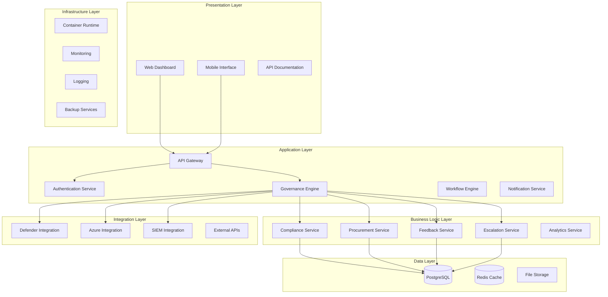
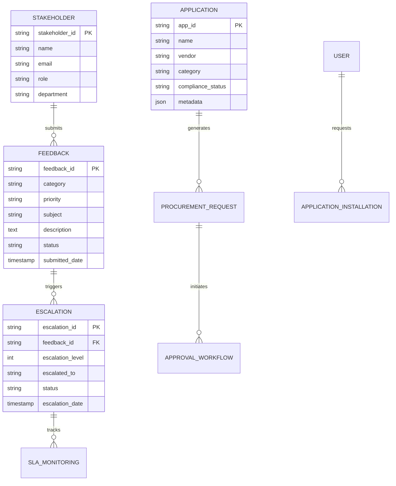
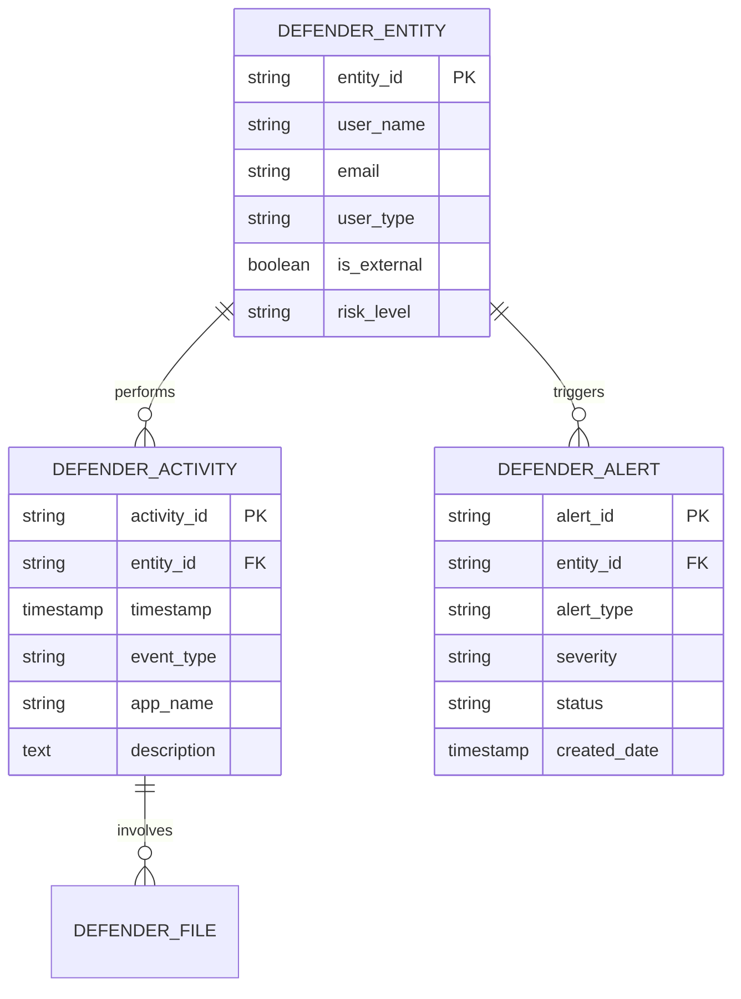
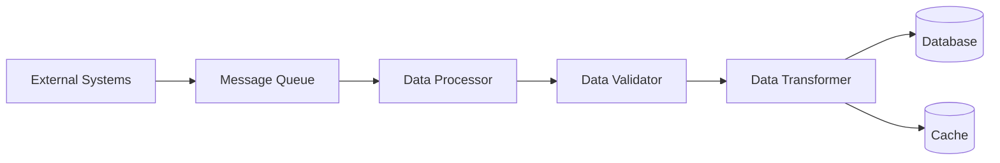
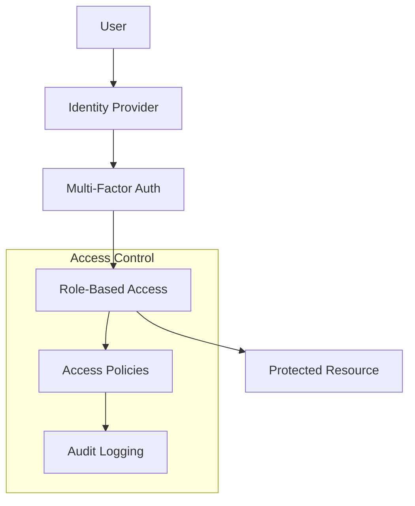
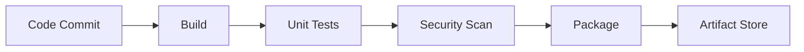
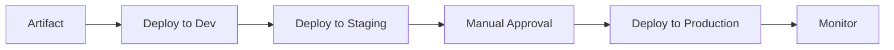

# A039: System Architecture and Components

## Executive Summary

This document provides a comprehensive technical architecture for the ICT Governance Framework system, defining all components, interfaces, and integration points. The architecture supports a unified governance platform that integrates multiple domains including compliance monitoring, application governance, infrastructure management, and stakeholder engagement.

## Table of Contents

1. [System Overview](#system-overview)
2. [Architecture Principles](#architecture-principles)
3. [System Components](#system-components)
4. [Component Interfaces](#component-interfaces)
5. [Integration Points](#integration-points)
6. [Data Architecture](#data-architecture)
7. [Security Architecture](#security-architecture)
8. [Deployment Architecture](#deployment-architecture)
9. [API Specifications](#api-specifications)
10. [Technology Stack](#technology-stack)

## System Overview

### High-Level Architecture



### System Context

The ICT Governance Framework system operates as a centralized platform that:
- Provides unified governance oversight across multiple domains
- Integrates with existing enterprise systems and cloud services
- Automates compliance monitoring and reporting
- Facilitates stakeholder engagement and feedback management
- Supports application lifecycle management and procurement

## Architecture Principles

### 1. Modularity and Separation of Concerns
- Each component has a single, well-defined responsibility
- Components are loosely coupled through well-defined interfaces
- Business logic is separated from presentation and data layers

### 2. Scalability and Performance
- Horizontal scaling capabilities for all components
- Caching strategies for frequently accessed data
- Asynchronous processing for long-running operations

### 3. Security by Design
- Zero-trust security model implementation
- End-to-end encryption for sensitive data
- Role-based access control (RBAC) throughout the system

### 4. Integration-First Approach
- API-first design for all components
- Standardized integration patterns
- Support for multiple authentication mechanisms

### 5. Observability and Monitoring
- Comprehensive logging and monitoring
- Health checks for all components
- Performance metrics and alerting

## System Components

### 1. Presentation Layer Components

#### 1.1 Web Dashboard (Next.js Application)
**Purpose**: Primary user interface for governance activities
**Technology**: Next.js 14, React 18, Tailwind CSS
**Location**: `ict-governance-framework/app/`

**Key Features**:
- Responsive dashboard with governance metrics
- Compliance monitoring interface
- Application procurement workflows
- Feedback and escalation management
- Real-time notifications and alerts

**Component Structure**:
```
app/
├── layout.js                 # Root layout component
├── page.js                   # Dashboard homepage
├── components/               # Reusable UI components
│   ├── FrameworkStatus.js    # Governance framework status
│   ├── GovernanceMetrics.js  # Key performance indicators
│   ├── OverviewCards.js      # Summary cards
│   ├── QuickActions.js       # Quick action buttons
│   └── compliance/           # Compliance-specific components
├── dashboard/                # Main dashboard pages
├── compliance/               # Compliance monitoring
├── application-procurement/  # App procurement workflows
├── feedback/                 # Feedback management
└── escalations/             # Escalation handling
```

#### 1.2 Mobile Interface
**Purpose**: Mobile-optimized access to governance functions
**Technology**: Progressive Web App (PWA)
**Status**: Planned for future implementation

#### 1.3 API Documentation
**Purpose**: Interactive API documentation for developers
**Technology**: OpenAPI/Swagger integration
**Status**: Planned for future implementation

### 2. Application Layer Components

#### 2.1 API Gateway
**Purpose**: Central entry point for all API requests
**Technology**: Express.js with middleware
**Location**: `ict-governance-framework/server.js`

**Responsibilities**:
- Request routing and load balancing
- Authentication and authorization
- Rate limiting and throttling
- Request/response transformation
- API versioning support

**Configuration**:
```javascript
// Core middleware stack
app.use(cors());
app.use(express.json());
app.use(authenticationMiddleware);
app.use(rateLimitingMiddleware);
app.use(loggingMiddleware);
```

#### 2.2 Authentication Service
**Purpose**: Centralized authentication and authorization
**Technology**: JWT tokens, OAuth 2.0, Azure AD integration
**Status**: Planned for implementation

**Features**:
- Multi-factor authentication (MFA)
- Single sign-on (SSO) integration
- Role-based access control (RBAC)
- Session management
- Audit logging

#### 2.3 Governance Engine
**Purpose**: Core governance logic and orchestration
**Technology**: Node.js with business logic modules
**Location**: Distributed across API modules

**Responsibilities**:
- Policy enforcement
- Workflow orchestration
- Compliance validation
- Risk assessment
- Governance reporting

#### 2.4 Workflow Engine
**Purpose**: Automated workflow processing
**Technology**: Node.js with state management
**Status**: Planned for implementation

**Features**:
- Approval workflows
- Escalation processes
- Automated notifications
- Process tracking
- SLA monitoring

#### 2.5 Notification Service
**Purpose**: Multi-channel notification delivery
**Technology**: Node.js with email/SMS providers
**Status**: Planned for implementation

### 3. Business Logic Layer Components

#### 3.1 Compliance Service
**Purpose**: Compliance monitoring and validation
**Technology**: Node.js with validation rules engine
**Location**: `ict-governance-framework/services/compliance-validation-service.js`

**Key Functions**:
- Regulatory compliance checking
- Policy validation
- Risk assessment
- Compliance reporting
- Audit trail management

**API Endpoints**:
- `GET /api/compliance/status` - Overall compliance status
- `POST /api/compliance/validate` - Validate compliance requirements
- `GET /api/compliance/reports` - Generate compliance reports

#### 3.2 Procurement Service
**Purpose**: Application procurement and lifecycle management
**Technology**: Node.js with approval workflows
**Location**: `ict-governance-framework/api/employee-app-store-api.js`

**Key Functions**:
- Application catalog management
- Procurement request processing
- Approval workflow management
- Vendor evaluation
- License management

**API Endpoints**:
- `GET /api/applications` - List available applications
- `POST /api/applications/request` - Submit procurement request
- `GET /api/procurement/requests` - List procurement requests
- `POST /api/applications/install` - Install approved application

#### 3.3 Feedback Service
**Purpose**: Stakeholder feedback collection and management
**Technology**: Node.js with PostgreSQL
**Location**: `ict-governance-framework/api/feedback.js`

**Key Functions**:
- Feedback submission processing
- Categorization and prioritization
- Response tracking
- Analytics and reporting

**Database Schema**:
```sql
CREATE TABLE feedback_submissions (
    id SERIAL PRIMARY KEY,
    feedback_id VARCHAR(50) UNIQUE NOT NULL,
    category VARCHAR(50) NOT NULL,
    priority VARCHAR(20) NOT NULL,
    subject VARCHAR(200) NOT NULL,
    description TEXT NOT NULL,
    status VARCHAR(20) DEFAULT 'Open',
    submitted_date TIMESTAMP DEFAULT CURRENT_TIMESTAMP
);
```

#### 3.4 Escalation Service
**Purpose**: Automated escalation management
**Technology**: Node.js with PostgreSQL
**Location**: `ict-governance-framework/api/escalations.js`

**Key Functions**:
- Escalation rule processing
- SLA monitoring
- Automated escalation triggers
- Escalation tracking and reporting

#### 3.5 Analytics Service
**Purpose**: Data analytics and reporting
**Technology**: Node.js with data processing libraries
**Status**: Planned for implementation

**Features**:
- Governance metrics calculation
- Trend analysis
- Predictive analytics
- Custom reporting
- Data visualization

### 4. Data Layer Components

#### 4.1 PostgreSQL Database
**Purpose**: Primary data storage
**Technology**: PostgreSQL 13+
**Location**: Database schema defined in `ict-governance-framework/db-schema.sql`

**Key Tables**:
- `feedback_submissions` - Stakeholder feedback
- `escalations` - Escalation tracking
- `defender_activities` - Security activities
- `feedback_categories` - Feedback categorization
- `sla_monitoring` - SLA tracking

#### 4.2 Redis Cache
**Purpose**: High-performance caching
**Technology**: Redis
**Status**: Planned for implementation

**Use Cases**:
- Session storage
- API response caching
- Real-time data caching
- Rate limiting counters

#### 4.3 File Storage
**Purpose**: Document and attachment storage
**Technology**: Azure Blob Storage or AWS S3
**Status**: Planned for implementation

### 5. Integration Layer Components

#### 5.1 Defender for Cloud Apps Integration
**Purpose**: Security monitoring and compliance
**Technology**: REST API integration
**Location**: `ict-governance-framework/api/defender-*.js`

**Integrated Services**:
- `defender-entities.js` - User entity management
- `defender-alerts.js` - Security alert processing
- `defender-files.js` - File activity monitoring
- `defender-activities.js` - Activity tracking

**API Integration Pattern**:
```javascript
async function fetchDefenderData(endpoint) {
  const url = `${process.env.DEFENDER_CLOUDAPPS_API_URL}/api/v1/${endpoint}`;
  const response = await axios.get(url, {
    headers: {
      'Authorization': `Token ${process.env.DEFENDER_CLOUDAPPS_API_TOKEN}`,
      'Content-Type': 'application/json',
    },
  });
  return response.data;
}
```

#### 5.2 Azure Integration
**Purpose**: Cloud infrastructure governance
**Technology**: Azure REST APIs, PowerShell
**Location**: `azure-automation/`

**Key Scripts**:
- `ICT-Governance-Framework.ps1` - Main governance framework
- `Continuous-Compliance-Monitoring.ps1` - Compliance monitoring
- `Automated-Remediation-Framework.ps1` - Automated remediation

#### 5.3 SIEM Integration
**Purpose**: Security information and event management
**Technology**: REST APIs, log forwarding
**Status**: Planned for implementation

#### 5.4 External API Integrations
**Purpose**: Third-party service integration
**Technology**: Various REST APIs
**Status**: Extensible framework for future integrations

## Component Interfaces

### 1. Internal Component Interfaces

#### 1.1 Service-to-Service Communication
**Protocol**: HTTP/HTTPS REST APIs
**Authentication**: JWT tokens
**Data Format**: JSON

**Standard Interface Pattern**:
```javascript
// Request format
{
  "requestId": "uuid",
  "timestamp": "ISO-8601",
  "data": { /* service-specific payload */ },
  "metadata": { /* request metadata */ }
}

// Response format
{
  "requestId": "uuid",
  "timestamp": "ISO-8601",
  "status": "success|error",
  "data": { /* response payload */ },
  "errors": [ /* error details */ ]
}
```

#### 1.2 Database Interfaces
**Protocol**: PostgreSQL native protocol
**Connection**: Connection pooling with pg library
**Transactions**: ACID compliance for critical operations

#### 1.3 Cache Interfaces
**Protocol**: Redis protocol
**Connection**: Connection pooling
**Patterns**: Cache-aside, write-through

### 2. External System Interfaces

#### 2.1 Defender for Cloud Apps API
**Protocol**: HTTPS REST API
**Authentication**: API Token
**Rate Limits**: Configurable per endpoint
**Data Sync**: Scheduled and event-driven

**Interface Specification**:
```javascript
// Entities endpoint
GET /api/v1/entities/
Authorization: Token {api_token}
Content-Type: application/json

// Response format
{
  "data": [
    {
      "_id": "entity_id",
      "userName": "user@domain.com",
      "email": "user@domain.com",
      "userType": "internal",
      "isExternal": false,
      "riskLevel": "low"
    }
  ]
}
```

#### 2.2 Azure Resource Manager API
**Protocol**: HTTPS REST API
**Authentication**: Azure AD OAuth 2.0
**Scope**: Resource management and monitoring

#### 2.3 Microsoft Graph API
**Protocol**: HTTPS REST API
**Authentication**: Azure AD OAuth 2.0
**Scope**: User and application management

### 3. User Interfaces

#### 3.1 Web Dashboard Interface
**Technology**: React components with REST API calls
**Authentication**: Session-based with JWT tokens
**Real-time Updates**: WebSocket connections (planned)

#### 3.2 Mobile Interface
**Technology**: Progressive Web App (PWA)
**Offline Support**: Service workers for offline functionality
**Push Notifications**: Web push notifications

## Integration Points

### 1. Data Integration Points

#### 1.1 Defender for Cloud Apps Data Sync
**Frequency**: Real-time and scheduled (hourly)
**Data Types**: Entities, alerts, files, activities
**Sync Strategy**: Incremental updates with full reconciliation

**Implementation**:
```javascript
// Scheduled sync endpoint
POST /api/defender-entities/sync
POST /api/defender-alerts/sync
POST /api/defender-files/sync
POST /api/defender-activities/sync
```

#### 1.2 Azure Resource Data Integration
**Frequency**: Continuous monitoring
**Data Types**: Resources, policies, compliance status
**Integration Method**: Azure Event Grid + PowerShell automation

#### 1.3 Application Catalog Integration
**Frequency**: Daily updates
**Data Types**: Application metadata, licensing, compliance status
**Integration Method**: Vendor APIs and manual curation

### 2. Process Integration Points

#### 2.1 Approval Workflow Integration
**Systems**: HR systems, IT service management
**Protocol**: REST API webhooks
**Data Exchange**: Approval requests and status updates

#### 2.2 Notification Integration
**Systems**: Email, SMS, Microsoft Teams
**Protocol**: SMTP, REST APIs
**Triggers**: Workflow events, compliance violations, escalations

#### 2.3 Audit Integration
**Systems**: Enterprise audit systems
**Protocol**: Syslog, REST APIs
**Data Types**: User activities, system changes, compliance events

### 3. Security Integration Points

#### 3.1 Identity Provider Integration
**Systems**: Azure AD, Active Directory
**Protocol**: SAML 2.0, OAuth 2.0, OpenID Connect
**Features**: SSO, MFA, user provisioning

#### 3.2 Security Monitoring Integration
**Systems**: SIEM, SOC tools
**Protocol**: Syslog, REST APIs
**Data Types**: Security events, threat intelligence, incident data

## Data Architecture

### 1. Data Models

#### 1.1 Core Governance Data Model


#### 1.2 Security Data Model


### 2. Data Flow Architecture

#### 2.1 Data Ingestion Flow


#### 2.2 Data Access Patterns
- **Read-Heavy Operations**: Cached responses for dashboard queries
- **Write-Heavy Operations**: Asynchronous processing for bulk updates
- **Real-Time Operations**: WebSocket connections for live updates
- **Analytical Operations**: Read replicas for reporting queries

### 3. Data Governance

#### 3.1 Data Quality Standards
- **Completeness**: Required fields validation
- **Accuracy**: Data validation rules
- **Consistency**: Cross-system data reconciliation
- **Timeliness**: SLA-based data freshness requirements

#### 3.2 Data Privacy and Security
- **Encryption**: AES-256 encryption for sensitive data
- **Access Control**: Role-based data access
- **Audit Trail**: Complete data access logging
- **Data Retention**: Configurable retention policies

## Security Architecture

### 1. Security Layers

#### 1.1 Network Security
- **Perimeter Security**: Web Application Firewall (WAF)
- **Network Segmentation**: VPC/VNet isolation
- **Traffic Encryption**: TLS 1.3 for all communications
- **DDoS Protection**: Cloud-based DDoS mitigation

#### 1.2 Application Security
- **Authentication**: Multi-factor authentication (MFA)
- **Authorization**: Role-based access control (RBAC)
- **Input Validation**: Comprehensive input sanitization
- **Output Encoding**: XSS prevention measures

#### 1.3 Data Security
- **Encryption at Rest**: Database and file encryption
- **Encryption in Transit**: TLS for all data transmission
- **Key Management**: Hardware security modules (HSM)
- **Data Masking**: PII protection in non-production environments

### 2. Security Controls

#### 2.1 Identity and Access Management


#### 2.2 Security Monitoring
- **SIEM Integration**: Real-time security event monitoring
- **Threat Detection**: Behavioral analytics and anomaly detection
- **Incident Response**: Automated response workflows
- **Vulnerability Management**: Regular security assessments

### 3. Compliance and Governance

#### 3.1 Regulatory Compliance
- **GDPR**: Data privacy and protection controls
- **SOX**: Financial reporting controls
- **ISO 27001**: Information security management
- **Industry Standards**: Sector-specific compliance requirements

#### 3.2 Security Governance
- **Security Policies**: Comprehensive security policy framework
- **Risk Management**: Continuous risk assessment and mitigation
- **Security Training**: Regular security awareness training
- **Incident Management**: Structured incident response procedures

## Deployment Architecture

### 1. Infrastructure Components

#### 1.1 Container Orchestration
**Technology**: Docker containers with Kubernetes orchestration
**Environment**: Multi-environment deployment (dev, staging, production)

```yaml
# Kubernetes deployment example
apiVersion: apps/v1
kind: Deployment
metadata:
  name: governance-api
spec:
  replicas: 3
  selector:
    matchLabels:
      app: governance-api
  template:
    metadata:
      labels:
        app: governance-api
    spec:
      containers:
      - name: api
        image: governance-api:latest
        ports:
        - containerPort: 4000
        env:
        - name: DATABASE_URL
          valueFrom:
            secretKeyRef:
              name: db-secret
              key: url
```

#### 1.2 Load Balancing and Scaling
- **Application Load Balancer**: Layer 7 load balancing
- **Auto Scaling**: CPU and memory-based scaling
- **Health Checks**: Comprehensive health monitoring
- **Circuit Breakers**: Fault tolerance patterns

#### 1.3 Database Deployment
- **Primary-Replica Setup**: Read/write separation
- **Connection Pooling**: Optimized database connections
- **Backup Strategy**: Automated backup and recovery
- **Monitoring**: Database performance monitoring

### 2. Environment Architecture

#### 2.1 Development Environment
- **Local Development**: Docker Compose for local setup
- **Feature Branches**: Isolated development environments
- **Testing**: Automated unit and integration testing
- **Code Quality**: Static analysis and security scanning

#### 2.2 Staging Environment
- **Production Mirror**: Identical to production configuration
- **Integration Testing**: End-to-end testing
- **Performance Testing**: Load and stress testing
- **Security Testing**: Penetration testing and vulnerability scanning

#### 2.3 Production Environment
- **High Availability**: Multi-zone deployment
- **Disaster Recovery**: Cross-region backup and recovery
- **Monitoring**: Comprehensive observability stack
- **Security**: Enhanced security controls and monitoring

### 3. CI/CD Pipeline

#### 3.1 Continuous Integration


#### 3.2 Continuous Deployment


## API Specifications

### 1. REST API Standards

#### 1.1 API Design Principles
- **RESTful Design**: Resource-based URLs and HTTP methods
- **Versioning**: URL-based versioning (e.g., `/api/v1/`)
- **Content Negotiation**: JSON as primary format
- **Error Handling**: Standardized error responses

#### 1.2 Authentication and Authorization
```http
# Authentication header
Authorization: Bearer {jwt_token}

# API key authentication (for service-to-service)
X-API-Key: {api_key}
```

#### 1.3 Standard Response Format
```json
{
  "status": "success|error",
  "data": {
    // Response payload
  },
  "metadata": {
    "timestamp": "2024-01-01T00:00:00Z",
    "requestId": "uuid",
    "pagination": {
      "page": 1,
      "limit": 50,
      "total": 1000
    }
  },
  "errors": [
    {
      "code": "ERROR_CODE",
      "message": "Human readable error message",
      "field": "field_name"
    }
  ]
}
```

### 2. Core API Endpoints

#### 2.1 Governance APIs
```http
# Get governance framework status
GET /api/v1/governance/status

# Get governance metrics
GET /api/v1/governance/metrics

# Update governance configuration
PUT /api/v1/governance/config
```

#### 2.2 Compliance APIs
```http
# Get compliance status
GET /api/v1/compliance/status

# Validate compliance requirements
POST /api/v1/compliance/validate

# Generate compliance report
GET /api/v1/compliance/reports/{reportId}
```

#### 2.3 Application Management APIs
```http
# List applications
GET /api/v1/applications

# Get application details
GET /api/v1/applications/{appId}

# Request application installation
POST /api/v1/applications/{appId}/install

# Submit procurement request
POST /api/v1/procurement/requests
```

#### 2.4 Feedback and Escalation APIs
```http
# Submit feedback
POST /api/v1/feedback

# Get feedback status
GET /api/v1/feedback/{feedbackId}

# Create escalation
POST /api/v1/escalations

# Get escalation details
GET /api/v1/escalations/{escalationId}
```

### 3. Integration APIs

#### 3.1 Defender for Cloud Apps Integration
```http
# Sync entities
POST /api/v1/defender-entities/sync

# Sync alerts
POST /api/v1/defender-alerts/sync

# Sync files
POST /api/v1/defender-files/sync

# Sync activities
POST /api/v1/defender-activities/sync
```

#### 3.2 Azure Integration
```http
# Get Azure resources
GET /api/v1/azure/resources

# Get compliance status
GET /api/v1/azure/compliance

# Trigger remediation
POST /api/v1/azure/remediate
```

### 4. Webhook APIs

#### 4.1 Event Notifications
```http
# Register webhook
POST /api/v1/webhooks

# Webhook payload format
{
  "eventType": "feedback.submitted",
  "timestamp": "2024-01-01T00:00:00Z",
  "data": {
    "feedbackId": "fb-123",
    "category": "policy",
    "priority": "high"
  }
}
```

## Technology Stack

### 1. Frontend Technologies

#### 1.1 Core Framework
- **Next.js 14**: React-based full-stack framework
- **React 18**: Component-based UI library
- **TypeScript**: Type-safe JavaScript development
- **Tailwind CSS**: Utility-first CSS framework

#### 1.2 UI Components and Libraries
- **Heroicons**: Icon library
- **Framer Motion**: Animation library
- **React CountUp**: Animated counters
- **Recharts**: Data visualization library

#### 1.3 State Management
- **React Hooks**: Built-in state management
- **Context API**: Global state management
- **SWR/React Query**: Server state management (planned)

### 2. Backend Technologies

#### 2.1 Core Framework
- **Node.js**: JavaScript runtime
- **Express.js**: Web application framework
- **TypeScript**: Type-safe development (planned migration)

#### 2.2 Database and Storage
- **PostgreSQL**: Primary relational database
- **Redis**: Caching and session storage (planned)
- **Azure Blob Storage**: File and document storage (planned)

#### 2.3 Integration Libraries
- **Axios**: HTTP client for API calls
- **pg**: PostgreSQL client library
- **cors**: Cross-origin resource sharing
- **dotenv**: Environment variable management

### 3. DevOps and Infrastructure

#### 3.1 Containerization
- **Docker**: Container runtime
- **Kubernetes**: Container orchestration (planned)
- **Helm**: Kubernetes package manager (planned)

#### 3.2 CI/CD Pipeline
- **GitHub Actions**: Continuous integration
- **Azure DevOps**: Deployment pipelines (planned)
- **Docker Registry**: Container image storage

#### 3.3 Monitoring and Observability
- **Application Insights**: Application performance monitoring (planned)
- **Azure Monitor**: Infrastructure monitoring (planned)
- **ELK Stack**: Logging and analytics (planned)

### 4. Security Technologies

#### 4.1 Authentication and Authorization
- **JWT**: JSON Web Tokens
- **Azure AD**: Identity provider integration
- **OAuth 2.0**: Authorization framework
- **RBAC**: Role-based access control

#### 4.2 Security Tools
- **HTTPS/TLS**: Transport layer security
- **Helmet.js**: Security headers middleware
- **Rate Limiting**: API rate limiting
- **Input Validation**: Request validation middleware

### 5. Integration Technologies

#### 5.1 API Integration
- **REST APIs**: Primary integration pattern
- **GraphQL**: Planned for complex queries
- **WebSockets**: Real-time communication (planned)
- **Message Queues**: Asynchronous processing (planned)

#### 5.2 Cloud Services
- **Azure Services**: Primary cloud platform
- **Microsoft Graph**: Microsoft 365 integration
- **Defender for Cloud Apps**: Security monitoring
- **Azure Policy**: Compliance enforcement

## Conclusion

This comprehensive system architecture provides a robust foundation for the ICT Governance Framework, ensuring scalability, security, and maintainability. The modular design allows for incremental development and deployment while maintaining system integrity and performance.

The architecture supports the organization's governance objectives by providing:
- Unified oversight across multiple governance domains
- Automated compliance monitoring and reporting
- Streamlined stakeholder engagement processes
- Comprehensive integration with existing enterprise systems
- Scalable and secure infrastructure foundation

Regular architecture reviews and updates will ensure the system continues to meet evolving business requirements and technology standards.

---

**Document Version**: 1.0  
**Last Updated**: 2024-01-01  
**Next Review**: 2024-04-01  
**Owner**: ICT Governance Framework Team