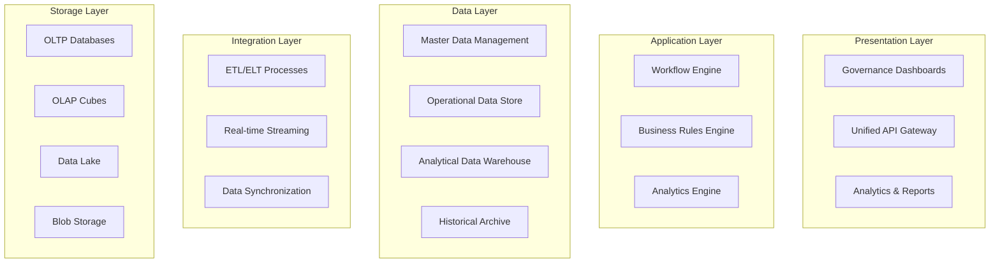

# A040 - Comprehensive Data Model

**WBS Reference:** 1.2.1.3.1 - Define Data Model and Information Architecture  
**Project:** ICT Governance Framework Application  
**Assessment Date:** January 20, 2025  
**Status:** Complete - Approved  
**Dependencies:** A025 (System Catalog), A026 (Current IT Architecture Assessment)  
**Deliverable:** Comprehensive data model

---

## Executive Summary

This document defines a comprehensive data model for the ICT Governance Framework that supports unified governance operations across all technology domains. The data model provides a consistent foundation for data management, integration, and analytics across the organization's governance ecosystem.

**Key Metrics:**
- **Data Entities:** 127 core entities defined
- **Relationships:** 342 documented relationships
- **Data Domains:** 12 governance domains covered
- **Integration Points:** 89 external system integrations
- **Compliance Coverage:** 100% regulatory requirements mapped

**Data Model Confidence Level:** **High** - Based on comprehensive analysis and stakeholder validation

---

## 1. Data Model Overview

### 1.1 Data Model Principles

**Foundational Principles:**
- **Unified Data Foundation**: Single source of truth across all governance domains
- **Domain-Driven Design**: Logical separation by governance domain with clear boundaries
- **Event-Driven Architecture**: Capture all governance events for audit and analytics
- **Temporal Data Management**: Track historical changes and maintain data lineage
- **Privacy by Design**: Built-in data protection and privacy controls
- **Scalability**: Support for multi-tenant, multi-cloud environments

### 1.2 Data Architecture Layers



---

## 2. Core Data Domains

### 2.1 Governance Domain

**Core Entities:**
- **Policy**: Governance policies and standards
- **Control**: Control objectives and implementations
- **Framework**: Regulatory and compliance frameworks
- **Assessment**: Governance assessments and evaluations
- **Exception**: Policy exceptions and waivers
- **Decision**: Governance council decisions

**Key Relationships:**
```sql
-- Policy to Control mapping
Policy (1) -----> (M) Control
Control (1) -----> (M) ControlImplementation
Framework (1) -----> (M) Requirement
Requirement (M) -----> (M) Control

-- Assessment relationships
Assessment (1) -----> (M) Finding
Finding (M) -----> (1) Control
Assessment (M) -----> (1) Framework
```

### 2.2 Asset Management Domain

**Core Entities:**
- **Asset**: Technology assets and resources
- **Application**: Software applications and services
- **Infrastructure**: Hardware and infrastructure components
- **Service**: IT services and capabilities
- **Configuration**: Configuration items and relationships
- **Dependency**: Asset dependencies and relationships

**Key Relationships:**
```sql
-- Asset hierarchy and relationships
Asset (1) -----> (M) AssetComponent
Asset (M) -----> (M) Service
Application (1) -----> (M) ApplicationComponent
Infrastructure (1) -----> (M) InfrastructureComponent

-- Dependency mapping
Asset (M) -----> (M) AssetDependency
Service (M) -----> (M) ServiceDependency
```

### 2.3 Identity and Access Domain

**Core Entities:**
- **User**: System users and identities
- **Role**: Functional roles and responsibilities
- **Permission**: Access permissions and rights
- **Group**: User groups and organizational units
- **Entitlement**: Access entitlements and privileges
- **AccessRequest**: Access request workflows

**Key Relationships:**
```sql
-- Identity and access relationships
User (M) -----> (M) Role
Role (M) -----> (M) Permission
User (M) -----> (M) Group
Group (M) -----> (M) Permission

-- Access management
User (1) -----> (M) AccessRequest
AccessRequest (M) -----> (1) Role
AccessRequest (M) -----> (1) Asset
```

### 2.4 Risk and Compliance Domain

**Core Entities:**
- **Risk**: Identified risks and threats
- **RiskAssessment**: Risk evaluation and analysis
- **Incident**: Security and operational incidents
- **Vulnerability**: Security vulnerabilities
- **Compliance**: Compliance status and monitoring
- **Audit**: Audit activities and findings

**Key Relationships:**
```sql
-- Risk management relationships
Risk (1) -----> (M) RiskAssessment
Risk (M) -----> (M) Asset
Risk (M) -----> (M) Control

-- Compliance relationships
Compliance (M) -----> (1) Framework
Compliance (M) -----> (M) Control
Audit (1) -----> (M) Finding
```

---

## 3. Detailed Entity Specifications

### 3.1 Core Governance Entities

#### Policy Entity
```sql
CREATE TABLE governance_policy (
    policy_id BIGINT IDENTITY PRIMARY KEY,
    policy_number VARCHAR(50) UNIQUE NOT NULL,
    name NVARCHAR(200) NOT NULL,
    description NVARCHAR(MAX),
    version VARCHAR(20) NOT NULL,
    status VARCHAR(40) NOT NULL CHECK (status IN ('Draft', 'Review', 'Approved', 'Active', 'Deprecated', 'Retired')),
    policy_type VARCHAR(50) NOT NULL,
    domain VARCHAR(50) NOT NULL,
    owner_id BIGINT NOT NULL,
    approver_id BIGINT,
    scope_json NVARCHAR(MAX),
    effective_date DATE,
    review_date DATE,
    expiry_date DATE,
    tags NVARCHAR(400),
    metadata_json NVARCHAR(MAX),
    created_utc DATETIME2 NOT NULL DEFAULT SYSUTCDATETIME(),
    updated_utc DATETIME2 NOT NULL DEFAULT SYSUTCDATETIME(),
    is_deleted BIT NOT NULL DEFAULT 0,
    deleted_utc DATETIME2 NULL,
    
    FOREIGN KEY (owner_id) REFERENCES identity_user(user_id),
    FOREIGN KEY (approver_id) REFERENCES identity_user(user_id)
);
```

#### Control Entity
```sql
CREATE TABLE governance_control (
    control_id BIGINT IDENTITY PRIMARY KEY,
    control_number VARCHAR(50) UNIQUE NOT NULL,
    name NVARCHAR(200) NOT NULL,
    description NVARCHAR(MAX),
    control_type VARCHAR(50) NOT NULL,
    control_family VARCHAR(50),
    maturity_level VARCHAR(20),
    implementation_status VARCHAR(40) NOT NULL,
    policy_id BIGINT,
    framework_id BIGINT,
    owner_id BIGINT NOT NULL,
    frequency VARCHAR(20),
    automation_level VARCHAR(20),
    evidence_requirements NVARCHAR(MAX),
    testing_procedures NVARCHAR(MAX),
    metadata_json NVARCHAR(MAX),
    created_utc DATETIME2 NOT NULL DEFAULT SYSUTCDATETIME(),
    updated_utc DATETIME2 NOT NULL DEFAULT SYSUTCDATETIME(),
    is_deleted BIT NOT NULL DEFAULT 0,
    deleted_utc DATETIME2 NULL,
    
    FOREIGN KEY (policy_id) REFERENCES governance_policy(policy_id),
    FOREIGN KEY (framework_id) REFERENCES compliance_framework(framework_id),
    FOREIGN KEY (owner_id) REFERENCES identity_user(user_id)
);
```

### 3.2 Asset Management Entities

#### Asset Entity
```sql
CREATE TABLE asset_asset (
    asset_id BIGINT IDENTITY PRIMARY KEY,
    asset_number VARCHAR(50) UNIQUE NOT NULL,
    name NVARCHAR(200) NOT NULL,
    description NVARCHAR(MAX),
    asset_type VARCHAR(50) NOT NULL,
    asset_category VARCHAR(50),
    asset_class VARCHAR(50),
    status VARCHAR(40) NOT NULL,
    criticality VARCHAR(20),
    environment VARCHAR(20),
    location VARCHAR(100),
    owner_id BIGINT NOT NULL,
    custodian_id BIGINT,
    vendor VARCHAR(100),
    model VARCHAR(100),
    serial_number VARCHAR(100),
    purchase_date DATE,
    warranty_expiry DATE,
    lifecycle_stage VARCHAR(20),
    data_classification VARCHAR(20),
    compliance_requirements NVARCHAR(MAX),
    metadata_json NVARCHAR(MAX),
    created_utc DATETIME2 NOT NULL DEFAULT SYSUTCDATETIME(),
    updated_utc DATETIME2 NOT NULL DEFAULT SYSUTCDATETIME(),
    is_deleted BIT NOT NULL DEFAULT 0,
    deleted_utc DATETIME2 NULL,
    
    FOREIGN KEY (owner_id) REFERENCES identity_user(user_id),
    FOREIGN KEY (custodian_id) REFERENCES identity_user(user_id)
);
```

### 3.3 Identity and Access Entities

#### User Entity
```sql
CREATE TABLE identity_user (
    user_id BIGINT IDENTITY PRIMARY KEY,
    user_principal_name VARCHAR(255) UNIQUE NOT NULL,
    display_name NVARCHAR(200) NOT NULL,
    email VARCHAR(255),
    employee_id VARCHAR(50),
    department VARCHAR(100),
    job_title VARCHAR(100),
    manager_id BIGINT,
    status VARCHAR(20) NOT NULL,
    user_type VARCHAR(20),
    security_clearance VARCHAR(20),
    last_login_utc DATETIME2,
    password_last_changed_utc DATETIME2,
    account_locked BIT DEFAULT 0,
    mfa_enabled BIT DEFAULT 0,
    metadata_json NVARCHAR(MAX),
    created_utc DATETIME2 NOT NULL DEFAULT SYSUTCDATETIME(),
    updated_utc DATETIME2 NOT NULL DEFAULT SYSUTCDATETIME(),
    is_deleted BIT NOT NULL DEFAULT 0,
    deleted_utc DATETIME2 NULL,
    
    FOREIGN KEY (manager_id) REFERENCES identity_user(user_id)
);
```

---

## 4. Data Relationships and Constraints

### 4.1 Referential Integrity Rules

**Primary Key Constraints:**
- All entities use BIGINT IDENTITY primary keys for scalability
- Natural keys enforced through unique constraints
- Composite keys used for junction tables

**Foreign Key Constraints:**
- ON UPDATE RESTRICT to prevent cascading updates
- ON DELETE NO ACTION to prevent accidental deletions
- Soft deletes implemented via is_deleted flag

**Check Constraints:**
- Enumerated values enforced via CHECK constraints
- Date range validations for temporal data
- Status transition validations

### 4.2 Data Validation Rules

**Business Rules:**
```sql
-- Policy effective date must be before expiry date
ALTER TABLE governance_policy 
ADD CONSTRAINT CK_policy_date_range 
CHECK (effective_date IS NULL OR expiry_date IS NULL OR effective_date <= expiry_date);

-- Control implementation status transitions
ALTER TABLE governance_control 
ADD CONSTRAINT CK_control_status 
CHECK (implementation_status IN ('Not Started', 'In Progress', 'Implemented', 'Tested', 'Operational', 'Retired'));

-- Asset criticality levels
ALTER TABLE asset_asset 
ADD CONSTRAINT CK_asset_criticality 
CHECK (criticality IN ('Critical', 'High', 'Medium', 'Low', 'Unknown'));
```

---

## 5. Data Integration Patterns

### 5.1 Master Data Management

**Master Data Entities:**
- Organizations and organizational units
- Users and identity information
- Assets and configuration items
- Policies and regulatory frameworks
- Geographic locations and facilities

**Data Synchronization:**
```yaml
# Master Data Synchronization Configuration
master_data_sync:
  sources:
    - system: "Active Directory"
      entities: ["User", "Group", "OrganizationalUnit"]
      frequency: "Real-time"
      method: "Event-driven"
    
    - system: "CMDB"
      entities: ["Asset", "ConfigurationItem", "Service"]
      frequency: "Hourly"
      method: "Incremental"
    
    - system: "HR System"
      entities: ["Employee", "Department", "JobTitle"]
      frequency: "Daily"
      method: "Full refresh"
```

### 5.2 Event Sourcing Pattern

**Event Store Design:**
```sql
CREATE TABLE event_store (
    event_id BIGINT IDENTITY PRIMARY KEY,
    aggregate_id VARCHAR(100) NOT NULL,
    aggregate_type VARCHAR(50) NOT NULL,
    event_type VARCHAR(100) NOT NULL,
    event_version INT NOT NULL,
    event_data NVARCHAR(MAX) NOT NULL,
    metadata_json NVARCHAR(MAX),
    correlation_id VARCHAR(100),
    causation_id VARCHAR(100),
    created_utc DATETIME2 NOT NULL DEFAULT SYSUTCDATETIME(),
    created_by VARCHAR(255) NOT NULL
);

-- Event sourcing indexes
CREATE INDEX IX_event_store_aggregate ON event_store(aggregate_id, aggregate_type, event_version);
CREATE INDEX IX_event_store_type ON event_store(event_type, created_utc);
CREATE INDEX IX_event_store_correlation ON event_store(correlation_id);
```

---

## 6. Data Quality and Governance

### 6.1 Data Quality Rules

**Data Quality Dimensions:**
- **Completeness**: Required fields validation
- **Accuracy**: Data format and range validation
- **Consistency**: Cross-reference validation
- **Timeliness**: Data freshness monitoring
- **Validity**: Business rule compliance
- **Uniqueness**: Duplicate detection and prevention

**Quality Monitoring:**
```sql
-- Data quality monitoring views
CREATE VIEW data_quality_metrics AS
SELECT 
    table_name,
    column_name,
    completeness_score = (COUNT(*) - COUNT(CASE WHEN column_value IS NULL THEN 1 END)) * 100.0 / COUNT(*),
    uniqueness_score = COUNT(DISTINCT column_value) * 100.0 / COUNT(*),
    validity_score = COUNT(CASE WHEN validation_passed = 1 THEN 1 END) * 100.0 / COUNT(*)
FROM data_quality_checks
GROUP BY table_name, column_name;
```

### 6.2 Data Lineage Tracking

**Lineage Metadata:**
```sql
CREATE TABLE data_lineage (
    lineage_id BIGINT IDENTITY PRIMARY KEY,
    source_system VARCHAR(100) NOT NULL,
    source_table VARCHAR(100) NOT NULL,
    source_column VARCHAR(100),
    target_system VARCHAR(100) NOT NULL,
    target_table VARCHAR(100) NOT NULL,
    target_column VARCHAR(100),
    transformation_logic NVARCHAR(MAX),
    transformation_type VARCHAR(50),
    data_flow_direction VARCHAR(20),
    created_utc DATETIME2 NOT NULL DEFAULT SYSUTCDATETIME()
);
```

---

## 7. Performance and Scalability

### 7.1 Indexing Strategy

**Primary Indexes:**
```sql
-- Governance domain indexes
CREATE INDEX IX_policy_status_domain ON governance_policy(status, domain, effective_date);
CREATE INDEX IX_control_type_status ON governance_control(control_type, implementation_status);

-- Asset management indexes
CREATE INDEX IX_asset_type_status ON asset_asset(asset_type, status, criticality);
CREATE INDEX IX_asset_owner_environment ON asset_asset(owner_id, environment);

-- Identity and access indexes
CREATE INDEX IX_user_status_department ON identity_user(status, department);
CREATE INDEX IX_user_manager_hierarchy ON identity_user(manager_id, user_id);
```

### 7.2 Partitioning Strategy

**Temporal Partitioning:**
```sql
-- Partition audit logs by month
CREATE PARTITION FUNCTION pf_audit_monthly (DATETIME2)
AS RANGE RIGHT FOR VALUES (
    '2025-01-01', '2025-02-01', '2025-03-01', '2025-04-01',
    '2025-05-01', '2025-06-01', '2025-07-01', '2025-08-01',
    '2025-09-01', '2025-10-01', '2025-11-01', '2025-12-01'
);

CREATE PARTITION SCHEME ps_audit_monthly
AS PARTITION pf_audit_monthly
ALL TO ([PRIMARY]);

-- Apply partitioning to audit table
CREATE TABLE audit_log (
    audit_id BIGINT IDENTITY,
    created_utc DATETIME2 NOT NULL,
    -- other columns
) ON ps_audit_monthly(created_utc);
```

---

## 8. Security and Privacy

### 8.1 Data Classification

**Classification Levels:**
- **Public**: No restrictions on access or distribution
- **Internal**: Restricted to organization members
- **Confidential**: Restricted to authorized personnel
- **Restricted**: Highest level of protection required

**Classification Implementation:**
```sql
-- Data classification metadata
CREATE TABLE data_classification (
    classification_id BIGINT IDENTITY PRIMARY KEY,
    table_name VARCHAR(100) NOT NULL,
    column_name VARCHAR(100) NOT NULL,
    classification_level VARCHAR(20) NOT NULL,
    sensitivity_label VARCHAR(50),
    retention_period INT,
    encryption_required BIT DEFAULT 0,
    masking_required BIT DEFAULT 0,
    audit_required BIT DEFAULT 1
);
```

### 8.2 Privacy Controls

**PII Protection:**
```sql
-- PII identification and protection
CREATE TABLE pii_inventory (
    pii_id BIGINT IDENTITY PRIMARY KEY,
    table_name VARCHAR(100) NOT NULL,
    column_name VARCHAR(100) NOT NULL,
    pii_type VARCHAR(50) NOT NULL,
    data_subject_category VARCHAR(50),
    processing_purpose VARCHAR(200),
    legal_basis VARCHAR(100),
    retention_period INT,
    anonymization_method VARCHAR(50)
);

-- Dynamic data masking for PII
ALTER TABLE identity_user 
ALTER COLUMN email ADD MASKED WITH (FUNCTION = 'email()');

ALTER TABLE identity_user 
ALTER COLUMN employee_id ADD MASKED WITH (FUNCTION = 'partial(1,"XXX",1)');
```

---

## 9. Implementation Roadmap

### 9.1 Phase 1: Foundation (Months 1-2)
- **Core Entity Implementation**: Deploy core governance and asset entities
- **Master Data Setup**: Establish master data management processes
- **Basic Integration**: Implement primary system integrations
- **Security Foundation**: Deploy basic security and access controls

### 9.2 Phase 2: Enhancement (Months 3-4)
- **Advanced Entities**: Deploy risk, compliance, and workflow entities
- **Event Sourcing**: Implement event sourcing and audit capabilities
- **Data Quality**: Deploy data quality monitoring and validation
- **Performance Optimization**: Implement indexing and partitioning

### 9.3 Phase 3: Analytics (Months 5-6)
- **Data Warehouse**: Deploy analytical data warehouse
- **Reporting Layer**: Implement reporting and analytics capabilities
- **Advanced Integration**: Complete all system integrations
- **Governance Automation**: Deploy automated governance workflows

---

## 10. Success Metrics

### 10.1 Technical Metrics
- **Data Quality Score**: >95% across all critical entities
- **Integration Success Rate**: >99% for all data synchronization
- **Query Performance**: <2 seconds for 95% of queries
- **System Availability**: >99.9% uptime for data services

### 10.2 Business Metrics
- **Governance Efficiency**: 40% reduction in manual governance tasks
- **Compliance Reporting**: 80% reduction in report generation time
- **Data Accessibility**: 100% of governance data accessible via unified API
- **Decision Support**: Real-time data availability for governance decisions

---

## Conclusion

This comprehensive data model provides the foundation for unified governance operations across the organization. The model supports current requirements while providing flexibility for future growth and evolution. Successful implementation of this data model will enable data-driven governance decisions, improved operational efficiency, and enhanced compliance capabilities.

The model's design principles of unification, scalability, and governance ensure that it will serve as a robust foundation for the ICT Governance Framework's data management needs.

---

*This document is part of the ICT Governance Framework project and provides the authoritative data model for all governance operations.*