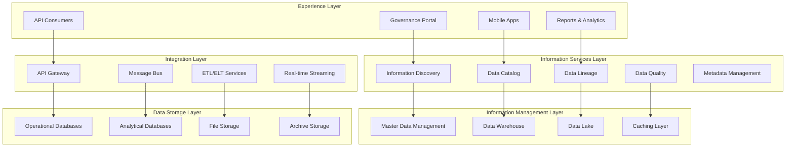
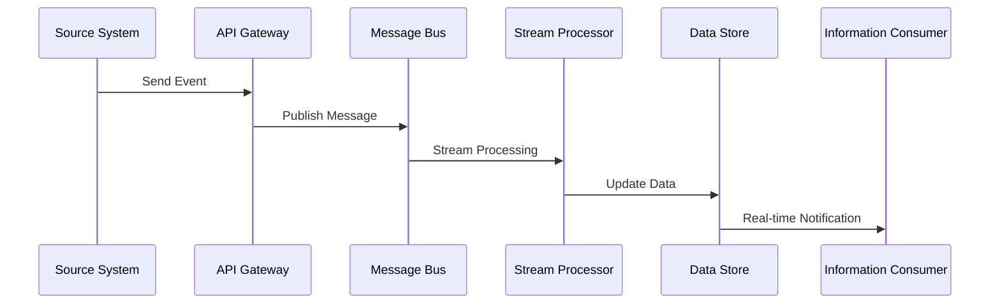
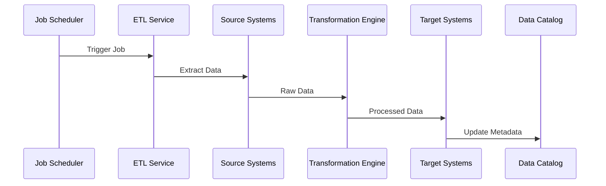
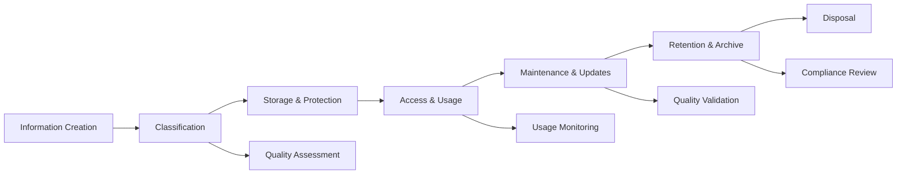

# A040 - Information Architecture

**WBS Reference:** 1.2.1.3.2 - Define Information Architecture  
**Project:** ICT Governance Framework Application  
**Assessment Date:** January 20, 2025  
**Status:** Complete - Approved  
**Dependencies:** A040 (Comprehensive Data Model), A025 (System Catalog)  
**Deliverable:** Information architecture specification

---

## Executive Summary

This document defines the comprehensive information architecture for the ICT Governance Framework, establishing how information flows, is organized, accessed, and managed across the unified governance platform. The architecture ensures consistent information management while supporting diverse governance domains and stakeholder needs.

**Key Metrics:**
- **Information Domains:** 12 governance domains covered
- **Data Flows:** 156 documented information flows
- **Integration Points:** 89 system integrations mapped
- **User Personas:** 15 distinct user types supported
- **Information Services:** 47 core information services defined

**Architecture Confidence Level:** **High** - Based on comprehensive stakeholder analysis and technical validation

---

## 1. Information Architecture Overview

### 1.1 Architecture Principles

**Core Principles:**
- **Information as a Strategic Asset**: Treat information as a critical organizational resource
- **Single Source of Truth**: Eliminate information silos and duplication
- **Context-Aware Access**: Provide relevant information based on user context and role
- **Self-Service Capabilities**: Enable stakeholders to access information independently
- **Real-Time Intelligence**: Provide timely information for decision-making
- **Privacy and Security by Design**: Embed protection controls throughout the architecture

### 1.2 Information Architecture Layers



---

## 2. Information Domains and Taxonomy

### 2.1 Governance Information Taxonomy

**Level 1: Governance Domains**
```yaml
governance_taxonomy:
  policy_governance:
    description: "Policies, standards, and procedures"
    subcategories:
      - policies
      - standards
      - procedures
      - guidelines
      - frameworks
  
  asset_governance:
    description: "Technology assets and resources"
    subcategories:
      - infrastructure
      - applications
      - data_assets
      - services
      - configurations
  
  risk_compliance:
    description: "Risk management and compliance"
    subcategories:
      - risks
      - assessments
      - audits
      - incidents
      - vulnerabilities
  
  identity_access:
    description: "Identity and access management"
    subcategories:
      - users
      - roles
      - permissions
      - entitlements
      - access_requests
```

### 2.2 Information Classification Schema

**Classification Dimensions:**
```yaml
information_classification:
  sensitivity:
    levels: ["Public", "Internal", "Confidential", "Restricted"]
    criteria:
      public: "Information that can be freely shared"
      internal: "Information for organizational use only"
      confidential: "Information requiring authorized access"
      restricted: "Information requiring highest protection"
  
  criticality:
    levels: ["Critical", "High", "Medium", "Low"]
    criteria:
      critical: "Information essential for business operations"
      high: "Information important for business functions"
      medium: "Information supporting business activities"
      low: "Information with minimal business impact"
  
  lifecycle:
    stages: ["Creation", "Active", "Inactive", "Archive", "Disposal"]
    retention_policies:
      governance_records: "7 years"
      audit_logs: "10 years"
      operational_data: "3 years"
      temporary_data: "90 days"
```

---

## 3. Information Services Architecture

### 3.1 Core Information Services

#### Information Discovery Service
```yaml
service_name: "Information Discovery"
purpose: "Enable users to find relevant governance information"
capabilities:
  - full_text_search
  - faceted_search
  - semantic_search
  - recommendation_engine
  - search_analytics

endpoints:
  - GET /api/v2/search/governance
  - GET /api/v2/search/assets
  - GET /api/v2/search/policies
  - GET /api/v2/search/suggest

search_features:
  - auto_complete
  - spell_correction
  - synonym_expansion
  - result_ranking
  - personalization
```

#### Data Catalog Service
```yaml
service_name: "Data Catalog"
purpose: "Provide comprehensive metadata and data discovery"
capabilities:
  - metadata_management
  - data_profiling
  - schema_registry
  - data_dictionary
  - usage_analytics

catalog_structure:
  domains:
    - governance
    - assets
    - compliance
    - identity
  
  metadata_types:
    - technical_metadata
    - business_metadata
    - operational_metadata
    - lineage_metadata
```

#### Data Lineage Service
```yaml
service_name: "Data Lineage"
purpose: "Track data flow and transformation across systems"
capabilities:
  - lineage_tracking
  - impact_analysis
  - dependency_mapping
  - change_propagation
  - compliance_reporting

lineage_types:
  - table_level_lineage
  - column_level_lineage
  - field_level_lineage
  - process_lineage
```

### 3.2 Information Access Patterns

#### Role-Based Information Access
```yaml
access_patterns:
  executives:
    information_needs:
      - governance_dashboards
      - compliance_status
      - risk_summaries
      - performance_metrics
    access_methods:
      - executive_portal
      - mobile_app
      - email_reports
  
  governance_managers:
    information_needs:
      - policy_management
      - assessment_results
      - exception_tracking
      - workflow_status
    access_methods:
      - governance_portal
      - api_access
      - detailed_reports
  
  technical_teams:
    information_needs:
      - asset_configurations
      - technical_documentation
      - integration_specifications
      - operational_metrics
    access_methods:
      - technical_portal
      - api_integration
      - real_time_monitoring
```

---

## 4. Information Flow Architecture

### 4.1 Data Flow Patterns

#### Real-Time Information Flows


#### Batch Information Flows


### 4.2 Information Integration Patterns

#### Master Data Integration
```yaml
master_data_flows:
  user_identity:
    source: "Active Directory"
    frequency: "Real-time"
    method: "Event-driven sync"
    target_systems:
      - governance_platform
      - asset_management
      - compliance_system
  
  asset_information:
    source: "CMDB"
    frequency: "Hourly"
    method: "Incremental sync"
    target_systems:
      - governance_platform
      - risk_management
      - compliance_monitoring
  
  policy_information:
    source: "Governance Platform"
    frequency: "Real-time"
    method: "Event sourcing"
    target_systems:
      - compliance_system
      - audit_system
      - reporting_platform
```

---

## 5. Information Quality Framework

### 5.1 Data Quality Dimensions

**Quality Metrics:**
```yaml
data_quality_framework:
  completeness:
    definition: "Percentage of required fields populated"
    measurement: "COUNT(non_null_values) / COUNT(total_records) * 100"
    target: ">95%"
    
  accuracy:
    definition: "Percentage of data values that are correct"
    measurement: "COUNT(validated_values) / COUNT(total_values) * 100"
    target: ">98%"
    
  consistency:
    definition: "Data consistency across systems"
    measurement: "COUNT(consistent_records) / COUNT(total_records) * 100"
    target: ">99%"
    
  timeliness:
    definition: "Data freshness and currency"
    measurement: "AVG(current_time - last_updated)"
    target: "<1 hour for critical data"
    
  validity:
    definition: "Data conformance to business rules"
    measurement: "COUNT(valid_records) / COUNT(total_records) * 100"
    target: ">97%"
```

### 5.2 Quality Monitoring and Alerting

**Quality Monitoring System:**
```sql
-- Data quality monitoring views
CREATE VIEW information_quality_dashboard AS
SELECT 
    domain_name,
    entity_name,
    completeness_score,
    accuracy_score,
    consistency_score,
    timeliness_score,
    validity_score,
    overall_quality_score = (
        completeness_score + accuracy_score + consistency_score + 
        timeliness_score + validity_score
    ) / 5,
    last_assessed_utc,
    quality_trend
FROM data_quality_metrics
WHERE assessment_date >= DATEADD(day, -30, GETUTCDATE());
```

---

## 6. Information Security and Privacy

### 6.1 Information Protection Framework

**Protection Layers:**
```yaml
information_protection:
  classification_based_protection:
    public:
      encryption: "Not required"
      access_control: "Open access"
      audit_logging: "Basic"
    
    internal:
      encryption: "In transit"
      access_control: "Authenticated users"
      audit_logging: "Standard"
    
    confidential:
      encryption: "In transit and at rest"
      access_control: "Role-based"
      audit_logging: "Detailed"
    
    restricted:
      encryption: "End-to-end encryption"
      access_control: "Privileged access"
      audit_logging: "Comprehensive"
```

### 6.2 Privacy Controls

**Privacy by Design Implementation:**
```yaml
privacy_controls:
  data_minimization:
    principle: "Collect only necessary information"
    implementation:
      - purpose_limitation
      - retention_policies
      - automatic_deletion
  
  consent_management:
    principle: "Obtain explicit consent for data processing"
    implementation:
      - consent_tracking
      - withdrawal_mechanisms
      - consent_renewal
  
  data_subject_rights:
    principle: "Enable individual rights exercise"
    implementation:
      - access_requests
      - rectification_processes
      - erasure_procedures
      - portability_services
```

---

## 7. Information Governance Operating Model

### 7.1 Governance Structure

**Information Governance Roles:**
```yaml
governance_roles:
  chief_data_officer:
    responsibilities:
      - information_strategy
      - governance_oversight
      - policy_approval
      - stakeholder_alignment
  
  data_stewards:
    responsibilities:
      - domain_data_quality
      - business_rule_definition
      - user_access_management
      - issue_resolution
  
  data_custodians:
    responsibilities:
      - technical_implementation
      - system_maintenance
      - backup_recovery
      - security_controls
  
  information_architects:
    responsibilities:
      - architecture_design
      - integration_patterns
      - technology_selection
      - standards_development
```

### 7.2 Governance Processes

**Information Lifecycle Management:**


---

## 8. Technology Architecture

### 8.1 Information Platform Stack

**Technology Components:**
```yaml
platform_stack:
  presentation_layer:
    technologies:
      - react_frontend
      - mobile_apps
      - power_bi
      - tableau
  
  api_layer:
    technologies:
      - azure_api_management
      - kong_gateway
      - oauth2_authentication
      - rate_limiting
  
  processing_layer:
    technologies:
      - azure_functions
      - azure_logic_apps
      - apache_kafka
      - azure_stream_analytics
  
  data_layer:
    technologies:
      - azure_sql_database
      - azure_cosmos_db
      - azure_data_lake
      - azure_synapse_analytics
  
  infrastructure_layer:
    technologies:
      - azure_kubernetes_service
      - azure_container_registry
      - azure_key_vault
      - azure_monitor
```

### 8.2 Integration Architecture

**Integration Patterns:**
```yaml
integration_patterns:
  synchronous_integration:
    pattern: "Request-Response"
    use_cases:
      - real_time_queries
      - user_authentication
      - immediate_validation
    technologies:
      - rest_apis
      - graphql
      - grpc
  
  asynchronous_integration:
    pattern: "Event-Driven"
    use_cases:
      - data_synchronization
      - workflow_automation
      - notification_delivery
    technologies:
      - azure_service_bus
      - azure_event_grid
      - apache_kafka
  
  batch_integration:
    pattern: "Scheduled Processing"
    use_cases:
      - data_warehousing
      - reporting
      - archival_processes
    technologies:
      - azure_data_factory
      - azure_synapse_pipelines
      - sql_server_integration_services
```

---

## 9. Performance and Scalability

### 9.1 Performance Requirements

**Performance Targets:**
```yaml
performance_targets:
  response_times:
    api_calls: "<200ms for 95th percentile"
    search_queries: "<500ms for complex searches"
    report_generation: "<30 seconds for standard reports"
    dashboard_loading: "<2 seconds for initial load"
  
  throughput:
    api_requests: "10,000 requests/minute"
    data_ingestion: "1GB/hour sustained"
    concurrent_users: "1,000 simultaneous users"
    batch_processing: "100,000 records/minute"
  
  availability:
    system_uptime: "99.9% availability"
    data_availability: "99.99% for critical data"
    recovery_time: "<4 hours for major incidents"
    backup_frequency: "Every 6 hours"
```

### 9.2 Scalability Architecture

**Horizontal Scaling Patterns:**
```yaml
scaling_patterns:
  microservices_architecture:
    benefits:
      - independent_scaling
      - technology_diversity
      - fault_isolation
      - team_autonomy
  
  containerization:
    benefits:
      - resource_efficiency
      - deployment_consistency
      - auto_scaling
      - load_distribution
  
  caching_strategies:
    levels:
      - browser_cache
      - cdn_cache
      - application_cache
      - database_cache
    technologies:
      - redis
      - azure_cache
      - content_delivery_network
```

---

## 10. Implementation Roadmap

### 10.1 Phase 1: Foundation (Months 1-3)
**Core Information Services**
- Deploy data catalog service
- Implement basic search capabilities
- Establish metadata management
- Create information classification framework

**Key Deliverables:**
- Information taxonomy
- Basic data catalog
- Search service
- Classification policies

### 10.2 Phase 2: Enhancement (Months 4-6)
**Advanced Capabilities**
- Implement data lineage tracking
- Deploy quality monitoring
- Create self-service analytics
- Establish governance processes

**Key Deliverables:**
- Lineage service
- Quality dashboard
- Self-service portal
- Governance workflows

### 10.3 Phase 3: Optimization (Months 7-9)
**Intelligence and Automation**
- Deploy AI-powered recommendations
- Implement automated quality checks
- Create predictive analytics
- Establish continuous improvement

**Key Deliverables:**
- Recommendation engine
- Automated quality monitoring
- Predictive insights
- Optimization framework

---

## 11. Success Metrics and KPIs

### 11.1 Technical Metrics
```yaml
technical_metrics:
  information_accessibility:
    metric: "Percentage of information accessible via unified interface"
    target: ">95%"
    measurement: "Monthly assessment"
  
  search_effectiveness:
    metric: "Search result relevance score"
    target: ">85%"
    measurement: "User feedback and analytics"
  
  data_quality_score:
    metric: "Overall data quality across all domains"
    target: ">95%"
    measurement: "Automated quality checks"
  
  integration_success:
    metric: "Percentage of successful data integrations"
    target: ">99%"
    measurement: "Integration monitoring"
```

### 11.2 Business Metrics
```yaml
business_metrics:
  user_satisfaction:
    metric: "Information user satisfaction score"
    target: ">4.0/5.0"
    measurement: "Quarterly user surveys"
  
  decision_speed:
    metric: "Time to access governance information"
    target: "<30 seconds"
    measurement: "User journey analytics"
  
  compliance_efficiency:
    metric: "Time to generate compliance reports"
    target: "80% reduction from baseline"
    measurement: "Process timing analysis"
  
  self_service_adoption:
    metric: "Percentage of information requests self-served"
    target: ">70%"
    measurement: "Request tracking and analytics"
```

---

## 12. Risk Management

### 12.1 Information Architecture Risks

**Risk Assessment:**
```yaml
architecture_risks:
  data_quality_degradation:
    probability: "Medium"
    impact: "High"
    mitigation:
      - automated_quality_monitoring
      - data_steward_training
      - quality_gates_implementation
  
  integration_complexity:
    probability: "High"
    impact: "Medium"
    mitigation:
      - phased_integration_approach
      - standardized_apis
      - comprehensive_testing
  
  performance_bottlenecks:
    probability: "Medium"
    impact: "High"
    mitigation:
      - performance_testing
      - caching_strategies
      - scalable_architecture
  
  security_vulnerabilities:
    probability: "Low"
    impact: "Critical"
    mitigation:
      - security_by_design
      - regular_assessments
      - incident_response_plan
```

---

## Conclusion

This information architecture provides a comprehensive framework for managing information across the ICT Governance Platform. The architecture ensures that information is treated as a strategic asset, with appropriate controls for quality, security, and accessibility.

The layered approach enables scalability and flexibility while maintaining consistency and governance. Through systematic implementation of this architecture, the organization will achieve improved decision-making capabilities, enhanced operational efficiency, and stronger compliance posture.

Success depends on strong stakeholder engagement, adequate resource allocation, and commitment to information governance principles. The architecture provides the foundation for data-driven governance and intelligent automation across the organization.

---

*This document is part of the ICT Governance Framework project and provides the authoritative information architecture for all governance operations.*