# Unified Governance Platform Integration

## Executive Summary

This document outlines the integration of siloed governance tools into a unified platform with a cohesive API ecosystem to improve oversight and automation capabilities across the ICT Governance Framework.

## Problem Statement

The current governance ecosystem consists of multiple siloed tools and systems:
- ICT Governance Framework (core governance)
- Azure IaC Governance (cloud-specific governance)
- Multi-cloud governance extensions (AWS/GCP)
- Employee App Store API (application governance)
- SIEM/Cloud App Security integration (security governance)
- Various automation and reporting tools

These silos create challenges in:
- **Unified Oversight**: Fragmented visibility across governance domains
- **Automation**: Limited cross-platform automation capabilities
- **Data Consistency**: Inconsistent data models and reporting
- **User Experience**: Multiple interfaces and authentication systems
- **Operational Efficiency**: Duplicated processes and manual integration

## Solution Architecture

### 1. Unified Governance Platform Architecture

```mermaid
graph TB
    subgraph "Unified Governance Platform"
        UGP[Unified Governance Portal]
        API[Unified API Gateway]
        AUTH[Centralized Authentication]
        DATA[Unified Data Layer]
        WORKFLOW[Workflow Engine]
        ANALYTICS[Analytics Engine]
    end
    
    subgraph "Governance Domains"
        ICT[ICT Governance]
        AZURE[Azure Governance]
        MULTI[Multi-Cloud Governance]
        APP[Application Governance]
        SEC[Security Governance]
        COMP[Compliance Governance]
    end
    
    subgraph "External Systems"
        SIEM[SIEM Systems]
        CAS[Cloud App Security]
        MDM[Mobile Device Management]
        ITSM[IT Service Management]
    end
    
    UGP --> API
    API --> AUTH
    API --> DATA
    API --> WORKFLOW
    API --> ANALYTICS
    
    API --> ICT
    API --> AZURE
    API --> MULTI
    API --> APP
    API --> SEC
    API --> COMP
    
    API --> SIEM
    API --> CAS
    API --> MDM
    API --> ITSM
```



### 2. Core Platform Components

#### 2.1 Unified API Gateway
- **Purpose**: Single entry point for all governance operations
- **Capabilities**: 
  - Request routing and load balancing
  - Authentication and authorization
  - Rate limiting and throttling
  - API versioning and documentation
  - Monitoring and analytics

#### 2.2 Centralized Authentication & Authorization
- **Purpose**: Single sign-on across all governance tools
- **Capabilities**:
  - Azure AD integration
  - Role-based access control (RBAC)
  - Multi-factor authentication
  - API key management
  - Audit logging

#### 2.3 Unified Data Layer
- **Purpose**: Consistent data model across all governance domains
- **Capabilities**:
  - Master data management
  - Data synchronization
  - Event sourcing
  - Data lineage tracking
  - Real-time data streaming

#### 2.4 Workflow Engine
- **Purpose**: Orchestrate cross-domain governance processes
- **Capabilities**:
  - Business process automation
  - Approval workflows
  - Event-driven automation
  - Integration orchestration
  - Process monitoring

#### 2.5 Analytics Engine
- **Purpose**: Unified reporting and analytics across all domains
- **Capabilities**:
  - Real-time dashboards
  - Cross-domain analytics
  - Predictive insights
  - Compliance reporting
  - Performance metrics

## 3. API Ecosystem Design

### 3.1 Unified API Structure

```yaml
# Unified Governance API Specification
openapi: 3.0.0
info:
  title: Unified Governance Platform API
  version: 2.0.0
  description: Comprehensive API for integrated governance operations

servers:
  - url: https://governance-api.company.com/v2
    description: Production API Gateway

paths:
  # Core Governance APIs
  /governance/policies:
    get:
      summary: List all governance policies across domains
      tags: [Core Governance]
  
  /governance/compliance:
    get:
      summary: Get unified compliance status
      tags: [Core Governance]
  
  /governance/metrics:
    get:
      summary: Get unified governance metrics
      tags: [Core Governance]
  
  # Infrastructure Governance APIs
  /infrastructure/resources:
    get:
      summary: List all infrastructure resources across clouds
      tags: [Infrastructure]
  
  /infrastructure/policies:
    get:
      summary: Get infrastructure governance policies
      tags: [Infrastructure]
  
  /infrastructure/compliance:
    get:
      summary: Get infrastructure compliance status
      tags: [Infrastructure]
  
  # Application Governance APIs
  /applications/catalog:
    get:
      summary: Get unified application catalog
      tags: [Applications]
  
  /applications/discovered:
    get:
      summary: Get applications discovered by security tools
      tags: [Applications]
  
  /applications/compliance:
    get:
      summary: Get application compliance status
      tags: [Applications]
  
  # Security Governance APIs
  /security/incidents:
    get:
      summary: Get security incidents across all systems
      tags: [Security]
  
  /security/policies:
    get:
      summary: Get security governance policies
      tags: [Security]
  
  /security/compliance:
    get:
      summary: Get security compliance status
      tags: [Security]
  
  # Workflow APIs
  /workflows/approvals:
    get:
      summary: Get pending approval requests
      tags: [Workflows]
  
  /workflows/processes:
    get:
      summary: Get active governance processes
      tags: [Workflows]
  
  # Analytics APIs
  /analytics/dashboards:
    get:
      summary: Get available analytics dashboards
      tags: [Analytics]
  
  /analytics/reports:
    get:
      summary: Generate unified governance reports
      tags: [Analytics]

components:
  securitySchemes:
    BearerAuth:
      type: http
      scheme: bearer
      bearerFormat: JWT
    
    ApiKeyAuth:
      type: apiKey
      in: header
      name: X-API-Key

security:
  - BearerAuth: []
  - ApiKeyAuth: []
```

### 3.2 Domain-Specific API Extensions

Each governance domain maintains its specialized APIs while integrating with the unified platform:

#### ICT Governance API Extensions
```yaml
/ict-governance/council/meetings:
  get:
    summary: Get ICT Governance Council meetings
/ict-governance/decisions:
  get:
    summary: Get governance decisions and approvals
/ict-governance/exceptions:
  get:
    summary: Get policy exceptions and waivers
```

#### Azure Governance API Extensions
```yaml
/azure/subscriptions:
  get:
    summary: Get Azure subscription governance status
/azure/policies:
  get:
    summary: Get Azure Policy compliance
/azure/resources:
  get:
    summary: Get Azure resource governance status
```

#### Multi-Cloud Governance API Extensions
```yaml
/multi-cloud/aws/compliance:
  get:
    summary: Get AWS governance compliance
/multi-cloud/gcp/compliance:
  get:
    summary: Get GCP governance compliance
/multi-cloud/policies:
  get:
    summary: Get cross-cloud governance policies
```

## 4. Implementation Plan

### Phase 1: Foundation (Months 1-3)

#### Month 1: Platform Infrastructure
- **Week 1-2**: Deploy unified API gateway infrastructure
  - Set up Azure API Management
  - Configure authentication and authorization
  - Implement basic routing and load balancing
  
- **Week 3-4**: Establish unified data layer
  - Deploy master database for governance data
  - Set up data synchronization mechanisms
  - Implement event streaming infrastructure

#### Month 2: Core API Development
- **Week 1-2**: Develop unified governance APIs
  - Implement core governance endpoints
  - Create unified data models
  - Set up API documentation and testing
  
- **Week 3-4**: Integrate existing systems
  - Connect ICT Governance Framework
  - Integrate Azure governance tools
  - Set up basic workflow engine

#### Month 3: Authentication & Security
- **Week 1-2**: Implement centralized authentication
  - Configure Azure AD integration
  - Set up role-based access control
  - Implement API security measures
  
- **Week 3-4**: Deploy monitoring and analytics
  - Set up API monitoring and logging
  - Implement basic analytics capabilities
  - Create initial dashboards

### Phase 2: Integration (Months 4-6)

#### Month 4: Application Governance Integration
- Integrate Employee App Store API
- Connect SIEM and Cloud App Security
- Implement application discovery workflows
- Set up application compliance tracking

#### Month 5: Multi-Cloud Integration
- Integrate AWS governance tools
- Connect GCP governance systems
- Implement cross-cloud policy management
- Set up multi-cloud compliance reporting

#### Month 6: Workflow Automation
- Deploy comprehensive workflow engine
- Implement cross-domain approval processes
- Set up automated compliance checking
- Create governance process orchestration

### Phase 3: Enhancement (Months 7-9)

#### Month 7: Advanced Analytics
- Implement predictive analytics
- Create executive dashboards
- Set up real-time monitoring
- Deploy compliance trend analysis

#### Month 8: User Experience
- Deploy unified governance portal
- Implement self-service capabilities
- Create mobile-responsive interfaces
- Set up personalized dashboards

#### Month 9: Optimization
- Performance tuning and optimization
- Advanced security implementations
- Scalability enhancements
- User training and adoption

## 5. Technical Implementation

### 5.1 Infrastructure as Code

```bicep
// Unified Governance Platform Infrastructure
param location string = resourceGroup().location
param environmentSuffix string = 'prod'

// API Management for Unified Gateway
resource apiManagement 'Microsoft.ApiManagement/service@2021-08-01' = {
  name: 'apim-governance-${environmentSuffix}'
  location: location
  sku: {
    name: 'Premium'
    capacity: 2
  }
  properties: {
    publisherEmail: 'governance@company.com'
    publisherName: 'Governance Team'
    customProperties: {
      'Microsoft.WindowsAzure.ApiManagement.Gateway.Security.Protocols.Tls10': 'false'
      'Microsoft.WindowsAzure.ApiManagement.Gateway.Security.Protocols.Tls11': 'false'
      'Microsoft.WindowsAzure.ApiManagement.Gateway.Security.Backend.Protocols.Tls10': 'false'
      'Microsoft.WindowsAzure.ApiManagement.Gateway.Security.Backend.Protocols.Tls11': 'false'
    }
  }
}

// Event Hub for Real-time Data Streaming
resource eventHubNamespace 'Microsoft.EventHub/namespaces@2021-11-01' = {
  name: 'evhns-governance-${environmentSuffix}'
  location: location
  sku: {
    name: 'Standard'
    tier: 'Standard'
    capacity: 2
  }
  properties: {
    isAutoInflateEnabled: true
    maximumThroughputUnits: 10
  }
}

// Service Bus for Workflow Orchestration
resource serviceBusNamespace 'Microsoft.ServiceBus/namespaces@2021-11-01' = {
  name: 'sb-governance-${environmentSuffix}'
  location: location
  sku: {
    name: 'Premium'
    tier: 'Premium'
    capacity: 1
  }
}

// Azure SQL Database for Unified Data Layer
resource sqlServer 'Microsoft.Sql/servers@2021-11-01' = {
  name: 'sql-governance-${environmentSuffix}'
  location: location
  properties: {
    administratorLogin: 'governanceadmin'
    administratorLoginPassword: '@Microsoft.KeyVault(SecretUri=${keyVault.properties.vaultUri}secrets/SqlAdminPassword)'
  }
}

resource sqlDatabase 'Microsoft.Sql/servers/databases@2021-11-01' = {
  parent: sqlServer
  name: 'governance-unified'
  location: location
  sku: {
    name: 'P2'
    tier: 'Premium'
  }
  properties: {
    collation: 'SQL_Latin1_General_CP1_CI_AS'
    maxSizeBytes: 268435456000 // 250 GB
  }
}

// Key Vault for Secrets Management
resource keyVault 'Microsoft.KeyVault/vaults@2021-11-01-preview' = {
  name: 'kv-governance-${environmentSuffix}'
  location: location
  properties: {
    enableRbacAuthorization: true
    tenantId: subscription().tenantId
    sku: {
      name: 'premium'
      family: 'A'
    }
    networkAcls: {
      defaultAction: 'Deny'
      bypass: 'AzureServices'
    }
  }
}

// Application Insights for Monitoring
resource appInsights 'Microsoft.Insights/components@2020-02-02' = {
  name: 'ai-governance-${environmentSuffix}'
  location: location
  kind: 'web'
  properties: {
    Application_Type: 'web'
    RetentionInDays: 90
  }
}

// Log Analytics Workspace
resource logAnalytics 'Microsoft.OperationalInsights/workspaces@2021-12-01-preview' = {
  name: 'law-governance-${environmentSuffix}'
  location: location
  properties: {
    sku: {
      name: 'PerGB2018'
    }
    retentionInDays: 90
  }
}
```

### 5.2 Unified Configuration Schema

```json
{
  "unifiedGovernancePlatform": {
    "version": "2.0.0",
    "platform": {
      "name": "Unified Governance Platform",
      "description": "Integrated governance platform for comprehensive oversight and automation"
    },
    "apiGateway": {
      "endpoint": "https://governance-api.company.com",
      "version": "v2",
      "authentication": {
        "type": "AzureAD",
        "tenantId": "your-tenant-id",
        "clientId": "your-client-id",
        "scopes": ["governance.read", "governance.write", "governance.admin"]
      },
      "rateLimit": {
        "requestsPerMinute": 1000,
        "burstLimit": 2000
      }
    },
    "domains": {
      "ictGovernance": {
        "enabled": true,
        "endpoint": "/ict-governance",
        "dataSource": "ICT_Governance_DB",
        "workflows": ["policy-approval", "exception-request", "council-decision"]
      },
      "azureGovernance": {
        "enabled": true,
        "endpoint": "/azure",
        "dataSource": "Azure_Policy_DB",
        "workflows": ["resource-compliance", "policy-deployment", "drift-remediation"]
      },
      "multiCloudGovernance": {
        "enabled": true,
        "endpoint": "/multi-cloud",
        "dataSources": ["AWS_Config_DB", "GCP_Asset_DB"],
        "workflows": ["cross-cloud-compliance", "policy-synchronization"]
      },
      "applicationGovernance": {
        "enabled": true,
        "endpoint": "/applications",
        "dataSource": "App_Store_DB",
        "workflows": ["app-discovery", "validation-request", "compliance-check"]
      },
      "securityGovernance": {
        "enabled": true,
        "endpoint": "/security",
        "dataSources": ["SIEM_DB", "CAS_DB"],
        "workflows": ["incident-response", "threat-assessment", "compliance-monitoring"]
      }
    },
    "dataLayer": {
      "masterDatabase": {
        "connectionString": "@Microsoft.KeyVault(SecretUri=https://kv-governance.vault.azure.net/secrets/MasterDbConnectionString)",
        "provider": "SqlServer",
        "encryption": "TDE"
      },
      "eventStreaming": {
        "eventHub": "evhns-governance-prod.servicebus.windows.net",
        "topics": ["governance-events", "compliance-events", "workflow-events"]
      },
      "caching": {
        "provider": "Redis",
        "connectionString": "@Microsoft.KeyVault(SecretUri=https://kv-governance.vault.azure.net/secrets/RedisConnectionString)",
        "ttl": 300
      }
    },
    "workflows": {
      "engine": "Azure Logic Apps",
      "orchestration": {
        "serviceBus": "sb-governance-prod.servicebus.windows.net",
        "queues": ["approval-requests", "compliance-checks", "notifications"]
      },
      "approvalRoutes": {
        "lowRisk": ["domain-owner"],
        "mediumRisk": ["domain-owner", "security-steward"],
        "highRisk": ["domain-owner", "security-steward", "governance-council"]
      }
    },
    "analytics": {
      "realTimeAnalytics": {
        "provider": "Azure Stream Analytics",
        "inputSources": ["governance-events", "compliance-events"],
        "outputTargets": ["dashboard-db", "alert-system"]
      },
      "reporting": {
        "provider": "Power BI",
        "datasets": ["governance-metrics", "compliance-status", "workflow-performance"],
        "refreshSchedule": "hourly"
      },
      "monitoring": {
        "applicationInsights": "ai-governance-prod",
        "logAnalytics": "law-governance-prod",
        "alerts": ["api-errors", "compliance-violations", "workflow-failures"]
      }
    },
    "integration": {
      "externalSystems": {
        "siem": {
          "type": "Microsoft Sentinel",
          "endpoint": "https://sentinel.azure.com",
          "authentication": "ManagedIdentity"
        },
        "cloudAppSecurity": {
          "type": "Microsoft Defender for Cloud Apps",
          "endpoint": "https://portal.cloudappsecurity.com",
          "authentication": "ApiKey"
        },
        "mdm": {
          "type": "Microsoft Intune",
          "endpoint": "https://graph.microsoft.com",
          "authentication": "ManagedIdentity"
        },
        "itsm": {
          "type": "ServiceNow",
          "endpoint": "https://company.service-now.com",
          "authentication": "OAuth2"
        }
      }
    },
    "security": {
      "encryption": {
        "atRest": "AES-256",
        "inTransit": "TLS 1.3",
        "keyManagement": "Azure Key Vault"
      },
      "authentication": {
        "provider": "Azure AD",
        "mfa": "required",
        "conditionalAccess": "enabled"
      },
      "authorization": {
        "model": "RBAC",
        "roles": ["governance-admin", "domain-owner", "steward", "viewer"],
        "permissions": "least-privilege"
      }
    }
  }
}
```

## 6. Benefits and Expected Outcomes

### 6.1 Improved Oversight
- **Unified Dashboard**: Single pane of glass for all governance activities
- **Real-time Visibility**: Live monitoring of compliance and governance status
- **Cross-domain Analytics**: Comprehensive insights across all governance domains
- **Executive Reporting**: Consolidated reporting for leadership and stakeholders

### 6.2 Enhanced Automation
- **Workflow Orchestration**: Automated cross-domain governance processes
- **Policy Enforcement**: Consistent policy application across all platforms
- **Compliance Monitoring**: Automated compliance checking and reporting
- **Incident Response**: Automated response to governance violations

### 6.3 Operational Efficiency
- **Reduced Silos**: Elimination of disconnected governance tools
- **Streamlined Processes**: Simplified governance workflows and approvals
- **Consistent Experience**: Unified user interface and authentication
- **Resource Optimization**: Reduced duplication and manual effort

### 6.4 Strategic Value
- **Better Decision Making**: Data-driven governance decisions
- **Risk Reduction**: Improved risk visibility and management
- **Compliance Assurance**: Enhanced compliance monitoring and reporting
- **Innovation Enablement**: Faster approval and deployment of new technologies

## 7. Success Metrics

### 7.1 Technical Metrics
- **API Response Time**: < 200ms for 95% of requests
- **System Availability**: 99.9% uptime
- **Data Consistency**: 100% data synchronization accuracy
- **Integration Coverage**: 100% of governance tools integrated

### 7.2 Operational Metrics
- **Process Efficiency**: 50% reduction in governance process time
- **User Satisfaction**: > 4.5/5.0 user satisfaction score
- **Automation Rate**: 80% of routine governance tasks automated
- **Compliance Rate**: > 95% compliance across all domains

### 7.3 Business Metrics
- **Cost Reduction**: 30% reduction in governance operational costs
- **Risk Mitigation**: 40% reduction in governance-related incidents
- **Decision Speed**: 60% faster governance decision-making
- **Innovation Velocity**: 25% faster technology adoption

## 8. Risk Mitigation

### 8.1 Technical Risks
- **Integration Complexity**: Phased implementation approach
- **Data Migration**: Comprehensive testing and rollback procedures
- **Performance Issues**: Load testing and capacity planning
- **Security Vulnerabilities**: Security-first design and regular assessments

### 8.2 Operational Risks
- **User Adoption**: Comprehensive training and change management
- **Process Disruption**: Parallel operation during transition
- **Skill Gaps**: Training programs and external expertise
- **Vendor Dependencies**: Multi-vendor strategy and contingency planning

## 9. Next Steps

### Immediate Actions (Next 30 Days)
1. **Stakeholder Alignment**: Present integration plan to ICT Governance Council
2. **Resource Planning**: Secure budget and team resources for implementation
3. **Vendor Evaluation**: Assess and select integration platform vendors
4. **Project Initiation**: Establish project governance and management structure

### Short-term Actions (Next 90 Days)
1. **Infrastructure Deployment**: Deploy unified platform infrastructure
2. **API Development**: Begin development of unified API gateway
3. **Data Model Design**: Create unified governance data model
4. **Security Implementation**: Implement authentication and authorization

### Medium-term Actions (Next 6 Months)
1. **System Integration**: Integrate all governance tools and systems
2. **Workflow Automation**: Implement cross-domain governance workflows
3. **User Interface Development**: Create unified governance portal
4. **Testing and Validation**: Comprehensive testing of integrated platform

## Conclusion

The Unified Governance Platform Integration addresses the critical challenge of siloed governance tools by creating a comprehensive, integrated platform that provides unified oversight, enhanced automation, and improved operational efficiency. Through systematic implementation of this integration plan, the organization will achieve a mature, scalable governance platform that supports current needs and future growth.

The success of this integration depends on strong stakeholder commitment, adequate resource allocation, and systematic execution of the implementation plan. With proper execution, this unified platform will transform governance operations and provide significant value to the organization.