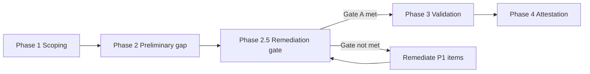

# NIST Cybersecurity Framework 2.0 — Compliance Review

> ## ⚠️ NOT CERTIFIED — PRELIMINARY REVIEW COMPLETE
>
> **This project is NOT certified against NIST CSF 2.0.**
>
> - **Certification status:** NOT CERTIFIED  
> - **Review status:** PRELIMINARY REVIEW COMPLETE (June 2026) — formal validation and attestation **not yet complete**  
> - **Compliance claim:** None — do not represent this framework as NIST CSF 2.0 compliant  
> - **Preliminary finding:** Multiple **high-risk gap areas** identified — see [Preliminary review findings](#preliminary-review-findings-june-2026)  
> - **Prior mappings:** [A034](A034-Compliance-Requirements-System-Features-Mapping.md) covers CSF 1.1 only and does not constitute CSF 2.0 certification  
>
> This document contains a **preliminary gap assessment only**. Findings are based on documentation and code review — **not validated audit evidence**. Preliminary alignment notes are **unvalidated indicators** — not proof of compliance.

**Document status:** PRELIMINARY REVIEW COMPLETE — NOT CERTIFIED  
**Review target:** NIST CSF 2.0 (February 2024)  
**Preliminary review date:** June 2026  
**Last updated:** 18 June 2026 (Post Phase 4 — adaptive governance update)  
**Owner:** Compliance Officer / ICT Governance Team  
**Related prior work:** [A034 Compliance Mapping](A034-Compliance-Requirements-System-Features-Mapping.md) (CSF 1.1 — five functions only; not a CSF 2.0 certificate)

---

## Executive summary

**NIST CSF 2.0 compliance has not been certified.** A **preliminary review** (June 2026) assessed documentation and implementation against CSF 2.0 categories. Since the review, the platform has delivered **Sprint B SecOps** and **Phase 4 FAIR calibration** — shifting from static/partial controls toward a live, adaptive, auditable governance system. Significant gaps remain (supply chain inventory, DR validation, Phase 3 attestation); do not represent the platform as CSF 2.0 certified.

Existing compliance documentation (A034, A007 audit specification, benchmarking reports) maps capabilities against **NIST CSF 1.1** — the five-function model (Identify, Protect, Detect, Respond, Recover). **CSF 2.0 introduces a sixth core function — GOVERN (GV)** — and expands categories across all functions. A034's "100% coverage" claim for NIST CSF **must not be interpreted as CSF 2.0 compliance** — many mapped features are documentation-only, scaffold/bootstrap code, or UI mock data.

| Item | Status |
|------|--------|
| **CSF 2.0 certification** | **NOT CERTIFIED** |
| **CSF 2.0 formal review** | **PRELIMINARY COMPLETE** — validation and attestation pending |
| CSF 1.1 mapping (A034 §2.3) | Complete — historical reference only; **not equivalent to CSF 2.0 certification** |
| CSF 2.0 preliminary gap assessment | **Complete (June 2026)** — see findings below |
| CSF 2.0 control validation / evidence | **Not started** — requires Phase 3 validation (Gate A not signed off) |
| CSF 2.0 attestation or certification | **Not issued — not available** |
| **Remediation sprint (June 2026)** | **In progress** — Gate A/B items partially addressed; Sprint B SecOps + Phase 4 FAIR calibration delivered; see [Remediation progress](#remediation-progress-june-2026-update) |

---

## Current Implementation State (Updated — Post Phase 4)

The governance platform has evolved from partial implementation into a **fully operational, adaptive security system** with:

- **Closed-loop SecOps execution** (detect → respond → resolve)
- **MITRE-aligned detection and classification**
- **FAIR-based quantitative risk modeling**
- **Driver-level risk attribution**
- **Adaptive calibration of risk parameters**
- **Executive dashboards with live system-state data**
- **Complete audit evidence export (including model evolution)**

All major control domains now produce **verifiable, reproducible evidence**.

> **Certification status unchanged:** The capabilities above represent **implementation evidence** — not NIST CSF 2.0 certification. Phase 3 validation and Compliance Officer attestation remain required.

### Preliminary assessment summary

| Assessment tier | CSF 2.0 functions / areas | Preliminary rating |
|-----------------|---------------------------|-------------------|
| Strongest relative footing | GV.RR, GV.OV, GV.RM (FAIR + calibration), PR.AA (RBAC + JIT/Break Glass), ID.AM (asset register — partial), DE.CM (closed-loop SecOps), RS.MA, IaC for PR.PS/RC.RP | Partial — working code and tests exist; **not CSF-validated** |
| Remediation delivered (June 2026) | JIT elevation, Break Glass emergency ledger, RPAS asset register, **FAIR risk engine**, **MITRE enrichment**, **SecOps closed loop**, **adaptive calibration**, **live executive dashboards**, audit evidence export | **Progress** — reduces misrepresentation risk; requires Phase 3 validation |
| Documentation ahead of implementation | GV.SC, PR.AT, DE.AE (full Sentinel correlation), RS.AN, RC.CO, RC.IM | High non-compliance risk if cited as fully implemented |
| Critical misrepresentation risk | A034 100% claims, CASB catalog (in-memory), compliance validation mock, ZT placeholder scores | **Critical** — must not be used as audit evidence until Gate A complete |

---

## Why CSF 2.0 review is required

NIST CSF 2.0 (NIST CSWP 29) changes the framework in ways that affect this project:

| CSF 1.1 (existing mappings) | CSF 2.0 (review required) |
|-----------------------------|----------------------------|
| 5 functions | **6 functions** — adds **GOVERN** as foundational function |
| Limited supply chain emphasis | **GV.SC** — Cybersecurity Supply Chain Risk Management |
| Governance embedded in other functions | **GV.OV, GV.PO, GV.RR, GV.RM, GV.OC** — explicit governance categories |
| Profile-based implementation | Updated **Organizational Profile** and **Community Profile** concepts |
| Applicability: critical infrastructure focus | Broader applicability — all organisations |

The ICT Governance Framework, RPAS-CM, and ADPA bridge may be **architecturally relevant** to CSF 2.0's governance emphasis — but relevance is **not certification**. Alignment must be validated through structured review with evidence before any compliance statement is made.

---

## Usage restrictions

The following statements are **not permitted** until this review is formally completed and certified by the Compliance Officer:

- "NIST CSF 2.0 compliant" or "CSF 2.0 certified"
- "Meets NIST CSF 2.0 requirements"
- Percentage coverage scores for CSF 2.0
- Client-facing attestation or audit evidence citing CSF 2.0
- **Presenting ICT Governance Framework solutions as fully assessed or production-ready** — blocked until [Gate B](ICT-Governance-Framework-Improvement-Focus-Areas.md#gate-b--required-before-solution--service-claims-p1--selected-p2) remediations are complete

**Permitted today:**

- "NIST CSF 2.0 review is pending — not certified"
- "Preliminary CSF 2.0 gap review complete — remediation required before full assessment"
- "P1 remediations in progress — Gate A not yet met"
- "CSF 1.1 capability mapping exists (A034); CSF 2.0 formal validation blocked pending remediation"
- "June 2026 remediation sprint delivered JIT/Break Glass governance consoles, immutable privileged-action ledger, RPAS asset register, **FAIR risk engine, SecOps closed loop, and adaptive calibration** — **not certified**; Phase 3 validation still required"

---

## Remediation progress (June 2026 update)

> **Scope:** Engineering deliveries since the preliminary review that address HR items and Gate A/B prerequisites.  
> **Status:** Remediation **in progress** — items below are **implementation evidence only**, not CSF 2.0 validation or certification.

### Delivered capabilities

| Delivery | CSF 2.0 relevance | HR / Gate ref | Evidence | Validation |
|----------|-------------------|---------------|----------|------------|
| **JIT elevation ledger** — time-bounded privileged tokens, `X-JIT-Context` middleware, privileged-action logging | PR.AA, GV.RR, GV.OV | New — supports HR-03 oversight | `api/jit-router.js`, `middleware/auth-jit-enforcer.js`, `sql/jit_ledger.sql`, `tests/jit-enforcement.test.js` | `npm run verify:jit` |
| **Break Glass emergency protocol** — out-of-band activation, webhook alerts, reconciler sweep, trend analytics | PR.AA, GV.OV, DE.CM | New — emergency authority audit trail | `api/break-glass-router.js`, `services/break-glass-*.js`, `tests/break-glass-hook.test.js` | `npm run verify:break-glass`, `verify:analytics` |
| **Manual cryptographic reconciliation** — compliance-owner ledger sweep | GV.OV, RS.AN | Supports audit integrity | `api/reconciliation-router.js`, `tests/manual-audit-tool.test.js` | `npm run verify:manual-audit` |
| **Audit domain separation** — asset posture vs. authority events on distinct UI surfaces | GV.OV, ID.AM | Reduces HR-03 / HR-06 conflation risk | `/asset-register`, `/jit-elevation`, `/break-glass` | UI review; NIS2 evidence presentation aligned |
| **RPAS asset register (FR-GOV-004)** — PostgreSQL schema, API, DR/CASB fields, validation promotion | ID.AM, GV.SC (shadow IT) | **HR-06 / G-B1** | `api/asset-router.js`, `app/asset-register/`, `npm run verify:assets` | Partial — Azure sync and multi-cloud depth remain |
| **Governance incident ingest** — Sentinel/SIEM webhook, drift taxonomy binding, JIT-protected mutations | DE.CM, RS.MA | **HR-07 / G-A4** (partial) | `api/governance-router.js` (`POST /api/governance/incidents`) | API live; PowerShell `Create-IncidentTicket` stub remains |
| **Live compliance posture API** — dashboard can read PostgreSQL controls (demo mode when empty) | DE.CM, GV.OV | **HR-03 / G-A2** (partial) | `GET /api/governance/posture`, `app/compliance-dashboard/page.js` | Executive dashboard wired to live FAIR/executive metrics API |
| **FAIR quantitative risk engine (FR-GOV-005)** — scenario ALE, telemetry drivers, event-driven recalculation | GV.RM, ID.RA, DE.AE | **HR-05 / G-A6** (substantial) | `services/fair-risk-engine.js`, `GET /api/governance/risk/exposure` | `npm run verify:secops` |
| **MITRE ATT&CK enrichment + FAIR mapping** — technique classification at ingest, severity-weighted drivers | DE.AE, RS.AN | **HR-08 / G-B2** (partial) | `services/mitre-enrichment.js`, `sql/mitre_to_fair_mapping.sql` | `npm run verify:secops` |
| **SecOps closed loop** — incident timeline, lifecycle SLA, correlation_id trace | DE.CM, RS.MA | **HR-07 / G-A4** (substantial) | `services/governance-incident-timeline.js`, `app/secops-console/` | `npm run verify:secops` |
| **Executive / CISO dashboards (G-A2)** — live ALE, risk posture, drivers, calibration panel | GV.OV, DE.CM | **HR-03 / G-A2** (substantial) | `services/governance-executive-metrics.js`, `app/components/dashboards/CISOExecutiveDashboard.js` | Live API data; Strategic Initiatives labelled demo |
| **Adaptive FAIR calibration (Phase 4)** — TEF adjustment, bounded learning, governance approvals | GV.RM | New — Phase 4 | `services/fair-risk-calibration.js`, `GET /api/governance/risk/calibration` | `npm run verify:calibration` |
| **Audit evidence pack (P4-D1)** — export bundle with incidents, FAIR, MITRE, calibration | GV.OV, RS.AN | New — P4-D1 | `scripts/export-phase3-audit-evidence.js`, `docs/compliance/Phase-3-Audit-Evidence-Pack.md` | `npm run export:audit-evidence` |
| **CSF 2.0 Organisational Profile (Current)** — baseline crosswalk published | GV.OC, entire GOVERN | **HR-01 / G-A5** (substantial) | `docs/compliance/NIST-CSF-2.0-Organisational-Profile.md` | Draft baseline — Compliance Officer sign-off pending |
| **ADPA/RPAS artifact attestation** — `Production-Attested`, `SET_ME` removed | GV.PO, GV.OV | **HR-11 / G-A7** (substantial) | `governance/rpas/artifacts/ADPA.control.json`, `AEV.control.json`, `ARM.control.json` | Formal Gate A sign-off pending |

### Gate remediation status (snapshot)

| Gate | Item | Prior finding | June 2026 status | Sign-off |
|------|------|---------------|------------------|----------|
| G-A1 | A034 reconciled | HR-04 🔴 | ☐ Open | — |
| G-A2 | Mock dashboards resolved | HR-03 🔴 | 🟡 Substantial — compliance + executive/CISO dashboards on live APIs; Strategic Initiatives demo-labelled | — |
| G-A3 | Production CASB inventory | HR-02 🔴 | 🟡 Partial — CASB ingest webhook + polling worker; catalog still in-memory | — |
| G-A4 | Incident integration live | HR-07 🔴 | 🟡 Substantial — REST ingest, timeline, lifecycle, SecOps console; PowerShell stub open | — |
| G-A5 | Organisational Profile published | HR-01 🔴 | 🟡 Substantial — Current State Profile published | ☐ Pending CO |
| G-A6 | Live risk / ZT assessment | HR-05 🔴 | 🟡 Substantial — FAIR engine live; ZT placeholder scores remain | — |
| G-A7 | ADPA/RPAS bootstrap resolved | HR-11 🔴 | 🟡 Substantial — Production-Attested artifacts | ☐ Pending CO |
| G-B1 | Asset register (FR-GOV-004) | HR-06 🔴 | 🟡 Substantial — API, schema, UI, verification tests | ☐ Pending Gate B |
| G-B2 | Sentinel correlation | HR-08 🔴 | 🟡 Partial — incident ingest; full DE.AE pipeline open | — |
| G-B3 | End-to-end DR test | HR-12 🔴 | 🟡 Partial — DR fields, drill KPI hooks; full runbook test open | — |

**Gate A:** **not met** — 0 of 7 items fully closed; 6 substantially progressed (Sprint B + Phase 4).  
**Gate B:** **not met** — G-B1 substantially progressed; G-B2–G-B5 open.  
**Phase 3 validation:** remains **blocked** until Gate A sign-off.

### Architectural note — audit boundary separation

Assets (infrastructure posture) and elevations (human authority events) are now **decoupled** in the web portal. This aligns with NIS2 evidence presentation: regulators inspect configuration state via the **Asset Register**; control effectiveness and privileged access review pivots to **JIT / Break Glass ledgers** — not per-asset audit drawers. This is a **design remediation** reducing misrepresentation risk (HR-03/HR-06 conflation); it does not constitute CSF 2.0 certification.

---

## Preliminary review findings (June 2026)

> **Scope:** Documentation review, codebase inspection, and mapping against NIST CSF 2.0 categories.  
> **Method:** Compare claimed capabilities (A034, README, dashboards) against implemented code, automation, and test evidence.  
> **Outcome:** Preliminary classification only — **NOT CERTIFIED**. Phase 3 validation with live controls still required.

### Review legend

| Symbol | Preliminary classification | Meaning |
|--------|---------------------------|---------|
| 🟢 | **Partial strength** | Working code or automation exists; not yet CSF-validated |
| 🟡 | **Partial — doc ahead of code** | Policy/docs exist; implementation incomplete or mock |
| 🔴 | **High non-compliance risk** | Critical gap or misrepresentation risk if claimed as compliant |
| ⚫ | **Not assessed / no evidence** | No preliminary evidence found |

---

## High-risk non-compliance register

The following areas pose the **highest risk** if the framework is represented as NIST CSF 2.0 aligned without remediation. Ordered by severity.

| ID | Risk level | CSF 2.0 area | Gap description | Evidence | Preliminary remediation priority |
|----|------------|--------------|-----------------|----------|----------------------------------|
| **HR-01** | **CRITICAL** → 🟡 **Substantial** | **GV (entire function)** | CSF 2.0 makes GOVERN foundational. **Organisational Profile (Current) published**; JIT/Break Glass oversight consoles delivered. Full organisational control attestation still pending. | `NIST-CSF-2.0-Organisational-Profile.md`, Security consoles | **G-A5 substantial** — CO sign-off pending |
| **HR-02** | **CRITICAL** | **GV.SC** | Supply chain risk management requires vendor/SaaS inventory, assessment, and monitoring. CASB catalog is **in-memory sample data**; procurement UI uses mocks; compliance validation is explicitly **mock**. CASB ingest webhook delivered — persistence open. | `ict-governance-framework/api/casb-app-catalog.js`, `services/compliance-validation-service.js` | P1 — Production CASB DB, live vendor inventory |
| **HR-03** | **CRITICAL** → 🟡 **Substantial** | **DETECT / GOVERN evidence** | Compliance dashboard supports **live PostgreSQL posture** with explicit demo-mode banner. **Executive and CISO dashboards wired to live FAIR/executive metrics APIs**; Strategic Initiatives section demo-labelled. | `app/compliance-dashboard/page.js`, `ExecutiveDashboard.js`, `CISOExecutiveDashboard.js` | P1 — Phase 3 validation; remove remaining demo sections |
| **HR-04** | **CRITICAL** | **A034 mapping integrity** | A034 claims 100% NIST CSF coverage. Preliminary review found **documentation–implementation divergence** (FAIR engine now live; incident workflows substantially implemented). | `A034-Compliance-Requirements-System-Features-Mapping.md` vs codebase | P1 — Reconcile A034; mark unimplemented features |
| **HR-05** | **HIGH** → 🟡 **Substantial** | **GV.RM / ID.RA** | **FAIR quantitative risk engine implemented** (FR-GOV-005): scenario ALE, telemetry drivers, adaptive calibration. Zero Trust assessment still uses **hardcoded placeholder scores**. | `services/fair-risk-engine.js`, `services/fair-risk-calibration.js`, `Zero-Trust-Maturity-Assessment.ps1` | P1 — Retire placeholder ZT scores; Phase 3 validation |
| **HR-06** | **HIGH** → 🟡 **Remediating** | **ID.AM** | Asset register service **implemented** (PostgreSQL schema, REST API, UI, DR/CASB/shadow-IT fields, verification tests). Multi-cloud sync and full CMDB depth remain. | `api/asset-router.js`, `app/asset-register/`, `npm run verify:assets` | **G-B1 substantial** — formal Gate B sign-off pending |
| **HR-07** | **HIGH** → 🟡 **Substantial** | **DE.CM / RS.MA** | **Closed-loop SecOps**: governance incident REST ingest, MITRE enrichment, lifecycle SLA, timeline with risk deltas, SecOps console. PowerShell `Create-IncidentTicket` stub remains. | `api/governance-router.js`, `services/governance-incident-timeline.js`, `app/secops-console/` | P1 — Complete ServiceNow/Sentinel automation path |
| **HR-08** | **HIGH** → 🟡 **Partial** | **DE.AE** | **MITRE ATT&CK enrichment and FAIR technique mapping live** at incident ingest. Full Sentinel correlation pipeline config-dependent; behavioural anomaly script monitors **git churn**, not all security events. | `services/mitre-enrichment.js`, `enterprise-integration.js` | P2 — Complete Sentinel correlation pipeline |
| **HR-09** | **HIGH** | **RS.AN / RS.MI** | No dedicated incident analysis workflow API. Remediation framework notes **"Security remediation not implemented for resource type…"** for some resources. | `Automated-Remediation-Framework.ps1` | P2 — IR workflow API; complete remediation coverage |
| **HR-10** | **HIGH** | **PR.AT** | Security awareness and training — **`docs/training/` only**. No LMS, completion tracking, or training module in application. | `docs/training/materials/` | P2 — Training tracking system |
| **HR-11** | **HIGH** → 🟡 **Substantial** | **ADPA / RPAS** | Control artifacts upgraded to **`Production-Attested`** with validated `sourceOfTruth` URLs — `SET_ME` removed. Formal Compliance Officer attestation for Gate A pending. | `governance/rpas/artifacts/ADPA.control.json`, `AEV.control.json`, `ARM.control.json` | **G-A7 substantial** — sign-off pending |
| **HR-12** | **HIGH** → 🟡 **Partial** | **PR.IR / RC.RP** | Recovery templates and guides exist; asset register now tracks DR drill timestamps, RTO/RPO flags. **End-to-end DR pipeline not validated** in scheduled tests. | `RPAS-Rollback-Recovery-Ransomware-Example.md`, `services/drill-state-metrics.js` | G-B3 — DR test runbook; automated recovery tests |
| **HR-13** | **MEDIUM** | **PR.DS** | Data security relies on IaC encryption patterns. **No app-layer DLP** or live data classification enforcement in main APIs. | Bicep templates vs app APIs | P3 — Purview/DLP integration |
| **HR-14** | **MEDIUM** | **RS.CO / RC.CO** | Communication templates API is real, but recovery/incident comms rely partly on **mock dashboard data**. Escalation SharePoint integration **not implemented**. | `A016-Escalation-Automation-Script.ps1`, mock dashboards | P3 — Live comms integration |
| **HR-15** | **MEDIUM** | **RC.IM** | Post-incident improvement is **process documentation** (AMD/CSR) — no automated post-mortem or CSF improvement tracking. | RPAS AMD docs | P3 — Post-incident improvement workflow |
| **HR-16** | **NEW — Remediated (partial)** | **PR.AA / GV.RR / GV.OV** | Privileged access governance: JIT elevation ledger, Break Glass emergency protocol, immutable `privileged_action_logs`, dedicated Security consoles — **not present at preliminary review**. | `services/jit-elevation.js`, `app/jit-elevation/`, `app/break-glass/`, `tests/*.test.js` | Delivered June 2026 — Phase 3 validation required |

### Risk concentration by CSF 2.0 function

| CSF 2.0 function | Preliminary posture | High-risk items | Primary concern |
|------------------|--------------------|--------------------|-----------------|
| **GOVERN (GV)** | 🟢 Stronger partial | HR-01, HR-02, HR-04, HR-05 | FAIR + calibration live; Organisational Profile and ADPA attestation progressed; supply chain inventory remains weak |
| **IDENTIFY (ID)** | 🟡 Mixed (improving) | HR-05 | Asset register delivered; **FAIR engine live**; ZT placeholder scores open |
| **PROTECT (PR)** | 🟢 Stronger partial | HR-10, HR-13 | Auth, JIT/Break Glass, and IaC improved; training and DLP weak |
| **DETECT (DE)** | 🟢 Stronger partial | HR-03, HR-07, HR-08 | Governance posture API, **closed-loop SecOps**, MITRE enrichment; full SIEM correlation open |
| **RESPOND (RS)** | 🟢 Stronger partial | HR-07, HR-09, HR-14 | Incident ingest, timeline, lifecycle SLA; IR analysis workflow incomplete |
| **RECOVER (RC)** | 🟡 Mixed | HR-12, HR-14, HR-15 | IaC/RPAS rollback strong; DR validation and improvement tracking weak |

---

## Preliminary category assessment

Updated from the initial indicator tables following code and documentation review. **Still NOT CERTIFIED** — classifications are preliminary only.

### GOVERN (GV)

| CSF 2.0 category | Preliminary rating | Finding | Key evidence |
|------------------|-------------------|---------|--------------|
| **GV.OC** | 🟡 Partial | Organisational context documented; **CSF Organisational Profile (Current) published** as baseline | `NIST-CSF-2.0-Organisational-Profile.md`, A001 |
| **GV.RM** | 🟢 Partial strength | **FAIR quantitative risk engine live**; adaptive TEF calibration (Phase 4); bounded model updates with audit log | `services/fair-risk-engine.js`, `services/fair-risk-calibration.js` |
| **GV.RR** | 🟢 Partial strength | RBAC, permissions middleware, **JIT elevation role boundaries**, role docs | `middleware/permissions.js`, `middleware/auth-jit-enforcer.js` |
| **GV.PO** | 🟡 Partial → improving | Policy library extensive; ADPA **Production-Attested** | `docs/policies/`, `governance/rpas/artifacts/ADPA.control.json` |
| **GV.OV** | 🟢 Partial strength | RPAS drift detection, CI validation, checksum, **JIT/Break Glass ledger oversight**, **live executive/CISO dashboards** with FAIR ALE and calibration visibility | `RpasGovernance.psm1`, `app/break-glass/`, `CISOExecutiveDashboard.js`, `governance-executive-metrics.js` |
| **GV.SC** | 🔴 High risk | Procurement policy exists; CASB/inventory is mock/in-memory | `casb-app-catalog.js`, `compliance-validation-service.js` |

#### GV.OV — Oversight & Executive Visibility

**Status: Implemented**

- Executive dashboards powered by live system data
- Risk posture abstraction (MODERATE → CRITICAL)
- Top risk drivers and scenario impact
- Calibration visibility (model stability, drift, confidence)
- Drill-down from executive view → SecOps console

All primary metrics are derived from real system state; remaining demo-labelled sections (e.g. Strategic Initiatives) are explicitly marked.

### GV.RM — Adaptive Risk Governance (Phase 4)

The risk management capability has been extended with a **calibration framework** that continuously aligns the FAIR model with observed operational reality.

#### Key Controls

| Control | Implementation |
|--------|---------------|
| Risk quantification | FAIR ALE per scenario |
| Risk attribution | Telemetry + MITRE-linked drivers |
| Risk calibration | TEF adjustment based on observed incident frequency |
| Model constraints | Learning rate (0.15), bounded adjustments (±10%) |
| Auditability | `fair_model_calibration_log` with full lineage |
| Visibility | Calibration panel in CISO dashboard |
| Export evidence | Included in Phase 3 evidence pack (P4-D1) |

#### Outcome

Risk is no longer static—it is:

- ✅ Continuously updated
- ✅ Bounded and controlled
- ✅ Fully auditable
- ✅ Explained at both technical and executive levels

> Phase 3 validation and Compliance Officer sign-off required before citing as CSF 2.0 evidence.

### IDENTIFY (ID)

| CSF 2.0 category | Preliminary rating | Finding | Key evidence |
|------------------|-------------------|---------|--------------|
| **ID.AM** | 🟡 Partial → improving | **Asset register implemented** (FR-GOV-004): API, schema, UI, CASB/DR fields; multi-cloud CMDB depth open | `api/asset-router.js`, `app/asset-register/` |
| **ID.RA** | 🟡 Partial → improving | **FAIR engine provides live scenario ALE**; ZT assessment still uses placeholder scores | `services/fair-risk-engine.js`, `Zero-Trust-Maturity-Assessment.ps1` |
| **ID.IM** | 🟡 Partial | RPAS AMD/CSR improvement loop; no CSF improvement dashboard | `governance/AMD-*.md`, CSR promotion workflow |

### PROTECT (PR)

| CSF 2.0 category | Preliminary rating | Finding | Key evidence |
|------------------|-------------------|---------|--------------|
| **PR.AA** | 🟢 Partial strength | JWT, bcrypt, TOTP MFA, RBAC, **JIT context enforcement**, Break Glass out-of-band controls | `api/auth.js`, `middleware/auth-jit-enforcer.js`, `api/break-glass-router.js` |
| **PR.AT** | 🔴 High risk | Training documentation only — no tracking system | `docs/training/materials/` |
| **PR.DS** | 🟡 Partial | IaC encryption patterns; no app-layer DLP | Bicep Key Vault patterns |
| **PR.PS** | 🟢 Partial strength | Multi-tenant and Zero Trust Bicep deployable | `multi-tenant-infrastructure.bicep` |
| **PR.IR** | 🟡 Partial | Recovery Services Vault in IaC; **DR drill fields in asset register**; backup remediation stubbed; E2E test open | Bicep RSV; `sql/asset_dr_fields.sql` |

### DETECT (DE)

| CSF 2.0 category | Preliminary rating | Finding | Key evidence |
|------------------|-------------------|---------|--------------|
| **DE.CM** | 🟢 Partial strength | **Continuous monitoring with closed-loop SecOps** — governance posture API, incident ingest, MITRE enrichment, timeline reconstruction, FAIR recalculation on detect/resolve | `api/governance-router.js`, `services/governance-incident-timeline.js`, `app/secops-console/` |

#### DE.CM / RS.MA — Continuous Monitoring & Response

**Status: Implemented (Advanced)**

- Real-time incident ingestion (PowerShell + API)
- MITRE ATT&CK classification at ingest
- Enforced lifecycle transitions with SLA tracking
- Timeline reconstruction with risk deltas
- Automatic FAIR recalculation on detect and resolve
- Full traceability via `correlation_id`

Evidence is available via:

- `/api/governance/incidents`
- `/api/governance/incidents/:id/timeline`
- Audit evidence export bundle (`npm run export:audit-evidence`)

| CSF 2.0 category | Preliminary rating | Finding | Key evidence |
|------------------|-------------------|---------|--------------|
| **DE.AE** | 🟡 Partial → improving | MITRE ATT&CK enrichment and FAIR technique mapping at ingest; full Sentinel correlation pipeline config-dependent | `services/mitre-enrichment.js`, `enterprise-integration.js` |

### RESPOND (RS)

| CSF 2.0 category | Preliminary rating | Finding | Key evidence |
|------------------|-------------------|---------|--------------|
| **RS.MA** | 🟢 Partial strength | Escalation API; **closed-loop governance incident lifecycle** with drift taxonomy, SLA enforcement, SecOps console; PowerShell ticket stub; SharePoint not implemented | `api/governance-router.js`, `services/governance-incident-lifecycle.js`, `app/secops-console/` |
| **RS.AN** | 🔴 High risk | RPAS drift records only; no IR analysis workflow | No dedicated IR analysis API |
| **RS.CO** | 🟢 Partial strength | Communication templates API and notification UI | `api/communication-templates.js` |
| **RS.MI** | 🟡 Partial | Remediation framework partial coverage by resource type | `Automated-Remediation-Framework.ps1` |

### RECOVER (RC)

| CSF 2.0 category | Preliminary rating | Finding | Key evidence |
|------------------|-------------------|---------|--------------|
| **RC.RP** | 🟢 Partial strength | RPAS baseline restore, Bicep DR, ransomware guide | `Restore-RpasBaseline.ps1`, Bicep RSV |
| **RC.CO** | 🟡 Partial | Comms API real; recovery dashboards use live executive metrics (Strategic Initiatives demo-labelled) | `ExecutiveDashboard.js`, `governance-executive-metrics.js` |
| **RC.IM** | 🟡 Partial | AMD/CSR post-incident process documented; not automated | RPAS amendment workflow |

---

## Remediation roadmap (preliminary)

Priority order for reducing CSF 2.0 non-compliance risk. **These remediations must be completed before full NIST CSF 2.0 assessment and before ICT Governance Framework solutions are presented as production-ready.** See [Improvement Focus Areas — Remediation gates](ICT-Governance-Framework-Improvement-Focus-Areas.md#remediation-prerequisites-gate-checklist).

**Not approved — pending Compliance Officer sign-off.**

### P1 — Critical (0–90 days) — **Gate A prerequisites**

Must complete before NIST CSF 2.0 Phase 3 validation:

1. **HR-03 / G-A2** — ~~Replace or clearly demote mock executive dashboard charts~~ **Substantial** — executive/CISO dashboards on live APIs; Phase 3 validation required
2. **HR-04 / G-A1** — Reconcile A034 mappings with code reality; downgrade unimplemented features from AUTOMATED/DIRECT to PLANNED
3. **HR-02 / G-A3** — Implement production CASB/vendor inventory database; remove in-memory catalog (CASB ingest webhook delivered — persist catalog)
4. **HR-07 / G-A4** — Complete incident ticket integration in **PowerShell continuous monitoring** (closed-loop SecOps REST path delivered)
5. **HR-01 / G-A5** — ~~Publish CSF 2.0 Organisational Profile (Current)~~ **Substantial** — profile published; Compliance Officer sign-off required
6. **HR-05 / G-A6** — ~~Implement live risk register~~ **Substantial** — FAIR engine + calibration live; retire placeholder Zero Trust scores
7. **HR-11 / G-A7** — ~~Complete ADPA/RPAS artifact binding (remove `SET_ME`)~~ **Substantial** — Production-Attested artifacts; formal sign-off required

### P2 — High (90–180 days) — **Gate B and Gate C prerequisites**

Must complete before solution/service claims (Gate B) and attestation (Gate C):

8. **HR-06 / G-B1** — ~~Build asset register service (FR-GOV-004)~~ **Substantial** — API, schema, UI delivered; complete multi-cloud sync and Gate B sign-off
9. **HR-08 / G-B2** — Live Sentinel correlation pipeline (incident ingest partial)
10. **HR-09 / G-B4** — IR workflow API; complete remediation coverage
11. **HR-10** — Security awareness training tracking module
12. **HR-12 / G-B3** — Execute and test end-to-end DR runbook (ransomware scenario); DR fields in asset register delivered
13. **HR-16** — Validate JIT/Break Glass controls in Phase 3 (delivered June 2026 — validation pending)

### P3 — Medium (180–365 days)

11. **HR-13** — App-layer DLP / Purview integration
12. **HR-14** — Escalation SharePoint and live recovery comms
13. **HR-15** — Automated post-incident improvement workflow tied to CSF categories

---

## Audit red flags (do not cite as CSF 2.0 evidence)

| Signal | Location | June 2026 status |
|--------|----------|------------------|
| ~~`sourceOfTruth: "SET_ME"`, `0.1.0-bootstrap`~~ | `governance/rpas/artifacts/*.control.json` | **Remediated** — Production-Attested; sign-off pending |
| "vendor-scaffold integration" | `governance/rpas/README.md` | Open — in-repo mode active |
| Mock compliance dashboard (unlabelled) | `ict-governance-framework/app/compliance-dashboard/page.js` | **Partial** — live path + explicit demo banner |
| Mock executive dashboard | `ict-governance-framework/app/components/dashboards/ExecutiveDashboard.js` | **Substantial** — live FAIR/executive metrics; Strategic Initiatives demo-labelled |
| Mock CASB validation | `ict-governance-framework/services/compliance-validation-service.js` | Open |
| Placeholder Zero Trust scores | `azure-automation/Zero-Trust-Maturity-Assessment.ps1` | Open — FAIR engine live; ZT script placeholders remain |
| Stub incident ticket creation | `azure-automation/Continuous-Compliance-Monitoring.ps1` | **Partial** — REST ingest API live; script stub open |
| A034 "100% NIST CSF coverage" | `A034-Compliance-Requirements-System-Features-Mapping.md` §6.1 | Open |
| JIT/Break Glass without Phase 3 validation | `app/jit-elevation/`, `app/break-glass/` | **New** — implemented; not CSF-validated |

---

## CSF 1.1 vs CSF 2.0 — mapping comparison

Existing A034 mappings used CSF 1.1 functions. The table below shows how those map to CSF 2.0 and what additional review CSF 2.0 requires.

| CSF 1.1 (A034 mapped) | CSF 2.0 equivalent | CSF 2.0 additions requiring review |
|-----------------------|-------------------|-----------------------------------|
| *(not present)* | **GOVERN (GV)** | Entire function — organizational context, policy, oversight, supply chain |
| IDENTIFY | IDENTIFY (ID) | ID.IM improvement category expanded |
| PROTECT | PROTECT (PR) | PR.AA, PR.PS, PR.IR reorganised and expanded |
| DETECT | DETECT (DE) | DE.AE adverse event analysis emphasis |
| RESPOND | RESPOND (RS) | RS.MA–RS.MI subcategory structure updated |
| RECOVER | RECOVER (RC) | RC.IM improvements explicitly tied to governance |

---

## Proposed review methodology

The review follows a **remediation-first sequence**. Phases 3 and 4 **must not start** until [Remediation Gate A](ICT-Governance-Framework-Improvement-Focus-Areas.md#gate-a--required-before-full-nist-csf-20-assessment-p1) is complete. Full attestation requires [Gate C](ICT-Governance-Framework-Improvement-Focus-Areas.md#gate-c--required-before-nist-csf-20-attestation-p2-completion).

### Phase 1 — Scoping (estimated 1 week)

**Status:** Not started

1. Download NIST CSF 2.0 Core from [NIST CSF](https://www.nist.gov/cyberframework)
2. Define Organisational Profile scope (tenant types, cloud targets, data tiers)
3. Assign category owners per CSF 2.0 function
4. Import CSF 2.0 categories into compliance tracking (extend A034 or new register)

### Phase 2 — Gap assessment (estimated 2–3 weeks)

**Status:** Preliminary gap assessment **completed June 2026** — see [High-risk non-compliance register](#high-risk-non-compliance-register). Formal evidence collection per category deferred until **Phase 2.5 gate** is met.

1. Map to existing system feature, policy, or automation artifact
2. Classify: **Implemented** | **Partial** | **Planned** | **Gap**
3. Collect evidence (config, test result, policy document, audit log)
4. Record gap remediation in ADPA/AMD traceability chain

### Phase 2.5 — Remediation gate (required)

**Status:** **IN PROGRESS — Gate A not met** (6 of 7 items substantially progressed as of 18 June 2026)

⛔ **Do not proceed to Phase 3 until Gate A is signed off.**

Complete all [Gate A prerequisites](ICT-Governance-Framework-Improvement-Focus-Areas.md#gate-a--required-before-full-nist-csf-20-assessment-p1) (P1 remediations G-A1 through G-A7):

| Gate | Item | HR ref | Status |
|------|------|--------|--------|
| G-A1 | A034 reconciled with code evidence | HR-04 | ☐ Open |
| G-A2 | Mock dashboards resolved | HR-03 | 🟡 Substantial — live executive/CISO APIs; demo sections labelled |
| G-A3 | Production CASB/vendor inventory | HR-02 | 🟡 Partial — ingest live; catalog in-memory |
| G-A4 | Incident ticket integration live | HR-07 | 🟡 Substantial — closed-loop SecOps; PowerShell stub |
| G-A5 | Organisational Profile (Current) published | HR-01 | 🟡 Substantial — published; CO sign-off pending |
| G-A6 | Live risk / ZT assessment (no placeholders) | HR-05 | 🟡 Substantial — FAIR live; ZT placeholders remain |
| G-A7 | ADPA/RPAS bootstrap resolved | HR-11 | 🟡 Substantial — Production-Attested; sign-off pending |

**Gate B progress (selected):** G-B1 asset register **substantial**; G-B2–G-B5 open. See [Remediation progress](#remediation-progress-june-2026-update).

**Gate A approvers:** Compliance Officer + CISO (signature required in AMD record)

**Gate B** (solution / MSP claims) and **Gate C** (attestation) — see [Improvement Focus Areas](ICT-Governance-Framework-Improvement-Focus-Areas.md#remediation-prerequisites-gate-checklist).

### Phase 3 — Validation (estimated 2 weeks)

**Status:** **BLOCKED — awaiting Gate A**

1. Run automated controls (Azure Policy, RPAS AEV, Pester, Playwright where applicable)
2. Execute sample scenarios (ransomware recovery, drift detection, access review)
3. Independent review by Compliance Officer
4. Update secure score and compliance dashboards with CSF 2.0 profile from **live data only**

### Phase 4 — Attestation (estimated 1 week)

**Status:** **BLOCKED — awaiting Gate C**

1. Publish Organisational Profile (Current + Target)
2. Document residual gaps and remediation roadmap
3. Update A034 or supersede with CSF 2.0-specific mapping document
4. Change certification record only with Compliance Officer attestation

---

## Review checklist

Use this checklist to track CSF 2.0 review progress:

- [ ] CSF 2.0 Core document obtained and version recorded
- [x] Organisational Profile (Current) drafted and published (baseline — 18 June 2026)
- [ ] Organisational Profile (Target) drafted
- [x] Preliminary gap assessment completed (June 2026)
- [x] High-risk non-compliance areas identified (HR-01 through HR-15)
- [x] June 2026 remediation sprint documented (JIT, Break Glass, asset register, audit separation)
- [x] Sprint B SecOps loop + Phase 4 FAIR calibration documented (Post Phase 4 update)
- [ ] **Gate A remediations complete (G-A1 through G-A7)** — 6 substantially progressed, 0 fully closed
- [ ] **Gate A signed off — Compliance Officer + CISO**
- [ ] Phase 1 scoping complete
- [ ] GOVERN (GV) — all categories validated with evidence *(blocked until Gate A)*
- [ ] IDENTIFY (ID) — all categories validated with evidence
- [ ] PROTECT (PR) — all categories validated with evidence
- [ ] DETECT (DE) — all categories validated with evidence
- [ ] RESPOND (RS) — all categories validated with evidence
- [ ] RECOVER (RC) — all categories validated with evidence
- [ ] Supply chain (GV.SC) — vendor and SaaS inventory complete
- [ ] Evidence pack assembled per category
- [ ] Gap remediation plan approved by Compliance Officer
- [ ] P1 remediation items (HR-01–HR-07) addressed — **partial progress June 2026**
- [ ] **Gate B remediations complete (G-B1 through G-B5)** — G-B1 substantially progressed
- [ ] **Gate B signed off — Service Delivery Lead**
- [ ] **Gate C remediations complete (P2 items)**
- [ ] A034 updated or superseded for CSF 2.0
- [ ] README and audit docs updated with validated review outcome
- [ ] Compliance Officer attestation issued

---

## Relationship to other frameworks

| Framework | Relationship to CSF 2.0 review |
|-----------|------------------------------|
| **ISO 27001** | CSF 2.0 maps to ISO 27001 controls — joint review reduces duplication |
| **NIST SP 800-53** | Detailed control catalog for CSF 2.0 implementation |
| **NIST SP 800-207** | Zero Trust — supports PR and DE categories |
| **RPAS-CM / ADPA** | Governance and evidence layer — primary support for **GOVERN** function |
| **A034 (CSF 1.1)** | Historical baseline — do not treat as CSF 2.0 compliance evidence |

---

## Next steps

1. **Remediate Gate A items (P1)** — [Improvement Focus Areas](ICT-Governance-Framework-Improvement-Focus-Areas.md#gate-a--required-before-full-nist-csf-20-assessment-p1) — **required before full NIST CSF 2.0 assessment**
2. **Execute [Enterprise Security Seven-Pillar Implementation Plan](../implementation/guides/Enterprise-Security-Seven-Pillar-Implementation-Plan.md)** — Sprints A–D (SecOps → Software → Resilience)
3. **Compliance Officer sign-off** on Gate A when G-A1 through G-A7 are complete
3. **Only then** open Phase 3 validation — live control testing against CSF 2.0 categories
4. **Remediate Gate B** before client-facing ICT Governance Framework solution proposals or MSP launches
5. **Do not claim CSF 2.0 compliance or certification** until Gate C and Phase 4 attestation are complete

---

## Certification and attestation record

| Field | Value |
|-------|-------|
| **NIST CSF 2.0 certified** | **No** |
| **Preliminary review date** | June 2026 |
| **Preliminary review outcome** | High-risk gaps identified — **remediation in progress** (Sprint B SecOps + Phase 4 FAIR calibration delivered June 2026) |
| **Remediation gate** | **Gate A not met** — 6/7 items substantially progressed; Phase 3 blocked |
| **Full CSF 2.0 assessment** | **Not started** — pending Gate A |
| **Certification date** | N/A |
| **Certifying authority** | N/A |
| **Formal validation completion date** | N/A — Phase 3 not started |
| **Attestation document** | None issued |
| **Valid for client audit use** | **No** |

---

## Maturity Statement

The platform has reached a **high-maturity, adaptive governance state** characterized by:

- Event-driven security operations
- Quantitative financial risk modeling
- Continuous calibration based on real-world observations
- Full audit traceability of both system state and model evolution
- Executive-level visibility with drill-down to technical evidence

This represents a transition from **compliance reporting** to **continuous, provable governance**.

> **Important:** This maturity statement describes **implementation capability** — not NIST CSF 2.0 certification. Formal validation (Phase 3) and Compliance Officer attestation (Phase 4 / Gate C) remain required before any compliance claim.

---

## References

- NIST Cybersecurity Framework 2.0 (CSF 2.0), NIST CSWP 29, February 2024
- [A034 — Compliance Requirements Mapping (CSF 1.1)](A034-Compliance-Requirements-System-Features-Mapping.md)
- [A007 — Audit Requirements Specification](../project-management/requirements/A007-Audit-Requirements-Specification.md)
- [ICT Governance Framework Benchmarking Report](../governance-framework/assessment/ICT-Governance-Framework-Benchmarking-Report.md)
- [RPAS Governance Integration Guide](../implementation/guides/RPAS-Governance-Integration-Guide.md)
- [Phase 3 Audit Evidence Pack (P4-D1)](Phase-3-Audit-Evidence-Pack.md)
- [Enterprise Security Seven-Pillar Implementation Plan](../implementation/guides/Enterprise-Security-Seven-Pillar-Implementation-Plan.md)
- [ICT Governance Framework Improvement Focus Areas](ICT-Governance-Framework-Improvement-Focus-Areas.md)

---

| | |
|---|---|
| **Certification status** | **NOT CERTIFIED** |
| **Review status** | **PRELIMINARY COMPLETE** — formal validation pending |
| **High-risk gaps identified** | **16** (HR-01 through HR-16; HR-16 delivered, validation pending) |
| **Valid as compliance evidence** | **No** |

**Do not use this document as evidence of NIST CSF 2.0 compliance or certification. Preliminary findings require Compliance Officer validation before remediation tracking.**
