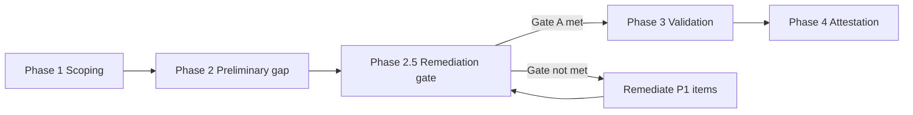

# NIST Cybersecurity Framework 2.0 — Compliance Review

> ## ⚠️ NOT CERTIFIED — PRELIMINARY REVIEW COMPLETE
>
> **This project is NOT certified against NIST CSF 2.0.**
>
> - **Certification status:** NOT CERTIFIED  
> - **Review status:** PRELIMINARY REVIEW COMPLETE (June 2026) — formal validation and attestation **not yet complete**  
> - **Compliance claim:** None — do not represent this framework as NIST CSF 2.0 compliant  
> - **Preliminary finding:** Multiple **high-risk gap areas** identified — see [Preliminary review findings](#preliminary-review-findings-june-2026)  
> - **Prior mappings:** [A034](A034-Compliance-Requirements-System-Features-Mapping.md) covers CSF 1.1 only and does not constitute CSF 2.0 certification  
>
> This document contains a **preliminary gap assessment only**. Findings are based on documentation and code review — **not validated audit evidence**. Preliminary alignment notes are **unvalidated indicators** — not proof of compliance.

**Document status:** PRELIMINARY REVIEW COMPLETE — NOT CERTIFIED  
**Review target:** NIST CSF 2.0 (February 2024)  
**Preliminary review date:** June 2026  
**Last updated:** June 2026  
**Owner:** Compliance Officer / ICT Governance Team  
**Related prior work:** [A034 Compliance Mapping](A034-Compliance-Requirements-System-Features-Mapping.md) (CSF 1.1 — five functions only; not a CSF 2.0 certificate)

---

## Executive summary

**NIST CSF 2.0 compliance has not been certified.** A **preliminary review** (June 2026) assessed documentation and implementation against CSF 2.0 categories. This review identified **significant high-risk gap areas** — particularly across the new **GOVERN** function, supply chain controls, live detection/response integrations, and areas where documentation or UI mock data overstates actual capability.

Existing compliance documentation (A034, A007 audit specification, benchmarking reports) maps capabilities against **NIST CSF 1.1** — the five-function model (Identify, Protect, Detect, Respond, Recover). **CSF 2.0 introduces a sixth core function — GOVERN (GV)** — and expands categories across all functions. A034's "100% coverage" claim for NIST CSF **must not be interpreted as CSF 2.0 compliance** — many mapped features are documentation-only, scaffold/bootstrap code, or UI mock data.

| Item | Status |
|------|--------|
| **CSF 2.0 certification** | **NOT CERTIFIED** |
| **CSF 2.0 formal review** | **PRELIMINARY COMPLETE** — validation and attestation pending |
| CSF 1.1 mapping (A034 §2.3) | Complete — historical reference only; **not equivalent to CSF 2.0 certification** |
| CSF 2.0 preliminary gap assessment | **Complete (June 2026)** — see findings below |
| CSF 2.0 control validation / evidence | **Not started** — requires Phase 3 validation |
| CSF 2.0 attestation or certification | **Not issued — not available** |

### Preliminary assessment summary

| Assessment tier | CSF 2.0 functions / areas | Preliminary rating |
|-----------------|---------------------------|-------------------|
| Strongest relative footing | GV.RR, GV.OV (RPAS scaffold), PR.AA, foundational DE.CM, RS.CO, IaC for PR.PS/RC.RP | Partial — evidence exists but not CSF-validated |
| Documentation ahead of implementation | GV.OC, GV.RM, GV.SC, ID.AM, ID.RA, PR.AT, DE.AE, RS.AN, RS.MI, RC.CO, RC.IM | High non-compliance risk if cited as implemented |
| Critical misrepresentation risk | Compliance dashboards (mock data), A034 100% claims, CASB catalog (in-memory), RPAS bootstrap (`SET_ME`) | **Critical** — must not be used as audit evidence |

---

## Why CSF 2.0 review is required

NIST CSF 2.0 (NIST CSWP 29) changes the framework in ways that affect this project:

| CSF 1.1 (existing mappings) | CSF 2.0 (review required) |
|-----------------------------|----------------------------|
| 5 functions | **6 functions** — adds **GOVERN** as foundational function |
| Limited supply chain emphasis | **GV.SC** — Cybersecurity Supply Chain Risk Management |
| Governance embedded in other functions | **GV.OV, GV.PO, GV.RR, GV.RM, GV.OC** — explicit governance categories |
| Profile-based implementation | Updated **Organizational Profile** and **Community Profile** concepts |
| Applicability: critical infrastructure focus | Broader applicability — all organisations |

The ICT Governance Framework, RPAS-CM, and ADPA bridge may be **architecturally relevant** to CSF 2.0's governance emphasis — but relevance is **not certification**. Alignment must be validated through structured review with evidence before any compliance statement is made.

---

## Usage restrictions

The following statements are **not permitted** until this review is formally completed and certified by the Compliance Officer:

- "NIST CSF 2.0 compliant" or "CSF 2.0 certified"
- "Meets NIST CSF 2.0 requirements"
- Percentage coverage scores for CSF 2.0
- Client-facing attestation or audit evidence citing CSF 2.0
- **Presenting ICT Governance Framework solutions as fully assessed or production-ready** — blocked until [Gate B](ICT-Governance-Framework-Improvement-Focus-Areas.md#gate-b--required-before-solution--service-claims-p1--selected-p2) remediations are complete

**Permitted today:**

- "NIST CSF 2.0 review is pending — not certified"
- "Preliminary CSF 2.0 gap review complete — remediation required before full assessment"
- "P1 remediations in progress — Gate A not yet met"
- "CSF 1.1 capability mapping exists (A034); CSF 2.0 formal validation blocked pending remediation"

---

## Preliminary review findings (June 2026)

> **Scope:** Documentation review, codebase inspection, and mapping against NIST CSF 2.0 categories.  
> **Method:** Compare claimed capabilities (A034, README, dashboards) against implemented code, automation, and test evidence.  
> **Outcome:** Preliminary classification only — **NOT CERTIFIED**. Phase 3 validation with live controls still required.

### Review legend

| Symbol | Preliminary classification | Meaning |
|--------|---------------------------|---------|
| 🟢 | **Partial strength** | Working code or automation exists; not yet CSF-validated |
| 🟡 | **Partial — doc ahead of code** | Policy/docs exist; implementation incomplete or mock |
| 🔴 | **High non-compliance risk** | Critical gap or misrepresentation risk if claimed as compliant |
| ⚫ | **Not assessed / no evidence** | No preliminary evidence found |

---

## High-risk non-compliance register

The following areas pose the **highest risk** if the framework is represented as NIST CSF 2.0 aligned without remediation. Ordered by severity.

| ID | Risk level | CSF 2.0 area | Gap description | Evidence | Preliminary remediation priority |
|----|------------|--------------|-----------------|----------|----------------------------------|
| **HR-01** | **CRITICAL** | **GV (entire function)** | CSF 2.0 makes GOVERN foundational. Governance exists as **policy docs + RPAS scaffold**, not as an implemented, attested organisational control system. No CSF Organisational Profile artefact. | `governance/rpas/README.md` (vendor-scaffold); no profile tooling | P1 — Define Organisational Profile; implement GOVERN metrics |
| **HR-02** | **CRITICAL** | **GV.SC** | Supply chain risk management requires vendor/SaaS inventory, assessment, and monitoring. CASB catalog is **in-memory sample data**; procurement UI uses mocks; compliance validation is explicitly **mock**. | `ict-governance-framework/api/casb-app-catalog.js`, `services/compliance-validation-service.js` | P1 — Production CASB DB, live vendor inventory |
| **HR-03** | **CRITICAL** | **DETECT / GOVERN evidence** | Compliance and executive dashboards display **mock data** — unusable as DETECT or GOVERN oversight evidence in an audit. | `app/compliance-dashboard/page.js`, `ExecutiveDashboard.js` | P1 — Wire to live telemetry or label as demo-only |
| **HR-04** | **CRITICAL** | **A034 mapping integrity** | A034 claims 100% NIST CSF coverage. Preliminary review found **documentation–implementation divergence** (FAIR, asset register, incident workflows mapped but not implemented in code). | `A034-Compliance-Requirements-System-Features-Mapping.md` vs codebase | P1 — Reconcile A034; mark unimplemented features |
| **HR-05** | **HIGH** | **GV.RM / ID.RA** | Risk management strategy requires live risk assessment. A034 cites FAIR/FR-GOV-005 — **no FAIR engine in code**. Zero Trust assessment uses **hardcoded placeholder scores**. | `Zero-Trust-Maturity-Assessment.ps1`, A034 §2.3 | P1 — Live risk register; remove placeholder scores |
| **HR-06** | **HIGH** | **ID.AM** | Asset management requires authoritative inventory. Azure resource enumeration exists but **no asset register service/schema** (FR-GOV-004 not implemented). | `azure-automation/ICT-Governance-Framework.psm1` vs A034 | P2 — Asset register API and schema |
| **HR-07** | **HIGH** | **DE.CM / RS.MA** | Continuous monitoring script calls `Create-IncidentTicket` but incident creation is a **stub** (`# Add incident creation logic here`). | `Continuous-Compliance-Monitoring.ps1` L599–617 | P1 — Wire to ServiceNow/Sentinel incidents |
| **HR-08** | **HIGH** | **DE.AE** | Adverse event analysis requires SIEM correlation. Sentinel adapter exists but is config-dependent; behavioural anomaly script monitors **git churn**, not security events. Dashboards use mock data. | `Test-RpasBehavioralAnomaly.ps1`, `enterprise-integration.js` | P2 — Live Sentinel correlation pipeline |
| **HR-09** | **HIGH** | **RS.AN / RS.MI** | No dedicated incident analysis workflow API. Remediation framework notes **"Security remediation not implemented for resource type…"** for some resources. | `Automated-Remediation-Framework.ps1` | P2 — IR workflow API; complete remediation coverage |
| **HR-10** | **HIGH** | **PR.AT** | Security awareness and training — **`docs/training/` only**. No LMS, completion tracking, or training module in application. | `docs/training/materials/` | P2 — Training tracking system |
| **HR-11** | **HIGH** | **ADPA / RPAS bootstrap** | Governance control artifacts at **`0.1.0-bootstrap`** with **`sourceOfTruth: "SET_ME"`** — not production-attested baselines. | `governance/rpas/artifacts/ADPA.control.json`, `AEV.control.json`, `ARM.control.json` | P2 — Complete ADPA binding; remove SET_ME |
| **HR-12** | **HIGH** | **PR.IR / RC.RP** | Recovery templates and guides exist (Bicep, ransomware example) but **end-to-end DR pipeline not validated** in tests. Backup remediation partially stubbed. | `RPAS-Rollback-Recovery-Ransomware-Example.md`, `Automated-Remediation-Framework.ps1` | P2 — DR test runbook; automated recovery tests |
| **HR-13** | **MEDIUM** | **PR.DS** | Data security relies on IaC encryption patterns. **No app-layer DLP** or live data classification enforcement in main APIs. | Bicep templates vs app APIs | P3 — Purview/DLP integration |
| **HR-14** | **MEDIUM** | **RS.CO / RC.CO** | Communication templates API is real, but recovery/incident comms rely partly on **mock dashboard data**. Escalation SharePoint integration **not implemented**. | `A016-Escalation-Automation-Script.ps1`, mock dashboards | P3 — Live comms integration |
| **HR-15** | **MEDIUM** | **RC.IM** | Post-incident improvement is **process documentation** (AMD/CSR) — no automated post-mortem or CSF improvement tracking. | RPAS AMD docs | P3 — Post-incident improvement workflow |

### Risk concentration by CSF 2.0 function

| CSF 2.0 function | Preliminary posture | High-risk items | Primary concern |
|------------------|--------------------|--------------------|-----------------|
| **GOVERN (GV)** | 🔴 Weak | HR-01, HR-02, HR-04, HR-05, HR-11 | New CSF 2.0 function — mostly documentation and scaffold |
| **IDENTIFY (ID)** | 🔴 Weak | HR-05, HR-06 | No live asset register or risk engine |
| **PROTECT (PR)** | 🟡 Mixed | HR-10, HR-13 | Auth/IaC strong; training and DLP weak |
| **DETECT (DE)** | 🔴 Weak | HR-03, HR-07, HR-08 | Mock UI data; stub incident creation |
| **RESPOND (RS)** | 🟡 Mixed | HR-07, HR-09, HR-14 | Templates exist; IR automation incomplete |
| **RECOVER (RC)** | 🟡 Mixed | HR-12, HR-14, HR-15 | IaC/RPAS rollback strong; validation and improvement weak |

---

## Preliminary category assessment

Updated from the initial indicator tables following code and documentation review. **Still NOT CERTIFIED** — classifications are preliminary only.

### GOVERN (GV)

| CSF 2.0 category | Preliminary rating | Finding | Key evidence |
|------------------|-------------------|---------|--------------|
| **GV.OC** | 🟡 Partial | Organisational context documented; no CSF Organisational Profile object | `ICT-Governance-Framework.md`, A001 |
| **GV.RM** | 🔴 High risk | Risk strategy documented; no live FAIR/risk engine | A034 FR-GOV-005 unimplemented |
| **GV.RR** | 🟢 Partial strength | RBAC, permissions middleware, role docs implemented | `middleware/permissions.js`, `api/user-permissions.js` |
| **GV.PO** | 🟡 Partial | Policy library extensive; Compliance-as-Code not fully wired | `docs/policies/`, ADPA `SET_ME` |
| **GV.OV** | 🟢 Partial strength | RPAS drift detection, CI validation, checksum | `RpasGovernance.psm1`, `rpas-governance.yml` |
| **GV.SC** | 🔴 High risk | Procurement policy exists; CASB/inventory is mock/in-memory | `casb-app-catalog.js`, `compliance-validation-service.js` |

### IDENTIFY (ID)

| CSF 2.0 category | Preliminary rating | Finding | Key evidence |
|------------------|-------------------|---------|--------------|
| **ID.AM** | 🔴 High risk | Azure enumeration possible; no asset register (FR-GOV-004) | `ICT-Governance-Framework.psm1` |
| **ID.RA** | 🔴 High risk | ZT assessment uses placeholder scores | `Zero-Trust-Maturity-Assessment.ps1` |
| **ID.IM** | 🟡 Partial | RPAS AMD/CSR improvement loop; no CSF improvement dashboard | `governance/AMD-*.md`, CSR promotion workflow |

### PROTECT (PR)

| CSF 2.0 category | Preliminary rating | Finding | Key evidence |
|------------------|-------------------|---------|--------------|
| **PR.AA** | 🟢 Partial strength | JWT, bcrypt, TOTP MFA, RBAC implemented | `api/auth.js`, `middleware/auth.js` |
| **PR.AT** | 🔴 High risk | Training documentation only — no tracking system | `docs/training/materials/` |
| **PR.DS** | 🟡 Partial | IaC encryption patterns; no app-layer DLP | Bicep Key Vault patterns |
| **PR.PS** | 🟢 Partial strength | Multi-tenant and Zero Trust Bicep deployable | `multi-tenant-infrastructure.bicep` |
| **PR.IR** | 🟡 Partial | Recovery Services Vault in IaC; backup remediation stubbed | Bicep RSV; remediation framework gaps |

### DETECT (DE)

| CSF 2.0 category | Preliminary rating | Finding | Key evidence |
|------------------|-------------------|---------|--------------|
| **DE.CM** | 🟡 Partial | Monitoring script and API exist; incident ticket stub; UI mocks | `Continuous-Compliance-Monitoring.ps1`, mock dashboards |
| **DE.AE** | 🔴 High risk | No live adverse-event correlation; git-churn anomaly only | `Test-RpasBehavioralAnomaly.ps1` |

### RESPOND (RS)

| CSF 2.0 category | Preliminary rating | Finding | Key evidence |
|------------------|-------------------|---------|--------------|
| **RS.MA** | 🟡 Partial | Escalation API and A016 script; SharePoint not implemented | `api/escalations.js`, `A016-Escalation-Automation-Script.ps1` |
| **RS.AN** | 🔴 High risk | RPAS drift records only; no IR analysis workflow | No dedicated IR analysis API |
| **RS.CO** | 🟢 Partial strength | Communication templates API and notification UI | `api/communication-templates.js` |
| **RS.MI** | 🟡 Partial | Remediation framework partial coverage by resource type | `Automated-Remediation-Framework.ps1` |

### RECOVER (RC)

| CSF 2.0 category | Preliminary rating | Finding | Key evidence |
|------------------|-------------------|---------|--------------|
| **RC.RP** | 🟢 Partial strength | RPAS baseline restore, Bicep DR, ransomware guide | `Restore-RpasBaseline.ps1`, Bicep RSV |
| **RC.CO** | 🟡 Partial | Comms API real; recovery dashboards use mock data | `ExecutiveDashboard.js` |
| **RC.IM** | 🟡 Partial | AMD/CSR post-incident process documented; not automated | RPAS amendment workflow |

---

## Remediation roadmap (preliminary)

Priority order for reducing CSF 2.0 non-compliance risk. **These remediations must be completed before full NIST CSF 2.0 assessment and before ICT Governance Framework solutions are presented as production-ready.** See [Improvement Focus Areas — Remediation gates](ICT-Governance-Framework-Improvement-Focus-Areas.md#remediation-prerequisites-gate-checklist).

**Not approved — pending Compliance Officer sign-off.**

### P1 — Critical (0–90 days) — **Gate A prerequisites**

Must complete before NIST CSF 2.0 Phase 3 validation:

1. **HR-03 / G-A2** — Replace or clearly demote mock compliance/executive dashboards; wire to live data or mark demo-only in UI
2. **HR-04 / G-A1** — Reconcile A034 mappings with code reality; downgrade unimplemented features from AUTOMATED/DIRECT to PLANNED
3. **HR-02 / G-A3** — Implement production CASB/vendor inventory database; remove in-memory catalog
4. **HR-07 / G-A4** — Complete incident ticket integration in continuous compliance monitoring
5. **HR-01 / G-A5** — Publish CSF 2.0 Organisational Profile (Current)
6. **HR-05 / G-A6** — Implement live risk register; retire placeholder Zero Trust scores
7. **HR-11 / G-A7** — Complete ADPA/RPAS artifact binding (remove `SET_ME`)

### P2 — High (90–180 days) — **Gate B and Gate C prerequisites**

Must complete before solution/service claims (Gate B) and attestation (Gate C):

8. **HR-06 / G-B1** — Build asset register service (FR-GOV-004)
9. **HR-08 / G-B2** — Live Sentinel correlation pipeline
10. **HR-09 / G-B4** — IR workflow API; complete remediation coverage
11. **HR-10** — Security awareness training tracking module
12. **HR-12 / G-B3** — Execute and test end-to-end DR runbook (ransomware scenario)

### P3 — Medium (180–365 days)

11. **HR-13** — App-layer DLP / Purview integration
12. **HR-14** — Escalation SharePoint and live recovery comms
13. **HR-15** — Automated post-incident improvement workflow tied to CSF categories

---

## Audit red flags (do not cite as CSF 2.0 evidence)

| Signal | Location |
|--------|----------|
| `sourceOfTruth: "SET_ME"`, `0.1.0-bootstrap` | `governance/rpas/artifacts/AEV.control.json`, `ADPA.control.json`, `ARM.control.json` |
| "vendor-scaffold integration" | `governance/rpas/README.md` |
| Mock compliance dashboard | `ict-governance-framework/app/compliance-dashboard/page.js` |
| Mock executive dashboard | `ict-governance-framework/app/components/dashboards/ExecutiveDashboard.js` |
| Mock CASB validation | `ict-governance-framework/services/compliance-validation-service.js` |
| Placeholder Zero Trust scores | `azure-automation/Zero-Trust-Maturity-Assessment.ps1` |
| Stub incident ticket creation | `azure-automation/Continuous-Compliance-Monitoring.ps1` |
| A034 "100% NIST CSF coverage" | `A034-Compliance-Requirements-System-Features-Mapping.md` §6.1 |

---

## CSF 1.1 vs CSF 2.0 — mapping comparison

Existing A034 mappings used CSF 1.1 functions. The table below shows how those map to CSF 2.0 and what additional review CSF 2.0 requires.

| CSF 1.1 (A034 mapped) | CSF 2.0 equivalent | CSF 2.0 additions requiring review |
|-----------------------|-------------------|-----------------------------------|
| *(not present)* | **GOVERN (GV)** | Entire function — organizational context, policy, oversight, supply chain |
| IDENTIFY | IDENTIFY (ID) | ID.IM improvement category expanded |
| PROTECT | PROTECT (PR) | PR.AA, PR.PS, PR.IR reorganised and expanded |
| DETECT | DETECT (DE) | DE.AE adverse event analysis emphasis |
| RESPOND | RESPOND (RS) | RS.MA–RS.MI subcategory structure updated |
| RECOVER | RECOVER (RC) | RC.IM improvements explicitly tied to governance |

---

## Proposed review methodology

The review follows a **remediation-first sequence**. Phases 3 and 4 **must not start** until [Remediation Gate A](ICT-Governance-Framework-Improvement-Focus-Areas.md#gate-a--required-before-full-nist-csf-20-assessment-p1) is complete. Full attestation requires [Gate C](ICT-Governance-Framework-Improvement-Focus-Areas.md#gate-c--required-before-nist-csf-20-attestation-p2-completion).

### Phase 1 — Scoping (estimated 1 week)

**Status:** Not started

1. Download NIST CSF 2.0 Core from [NIST CSF](https://www.nist.gov/cyberframework)
2. Define Organisational Profile scope (tenant types, cloud targets, data tiers)
3. Assign category owners per CSF 2.0 function
4. Import CSF 2.0 categories into compliance tracking (extend A034 or new register)

### Phase 2 — Gap assessment (estimated 2–3 weeks)

**Status:** Preliminary gap assessment **completed June 2026** — see [High-risk non-compliance register](#high-risk-non-compliance-register). Formal evidence collection per category deferred until **Phase 2.5 gate** is met.

1. Map to existing system feature, policy, or automation artifact
2. Classify: **Implemented** | **Partial** | **Planned** | **Gap**
3. Collect evidence (config, test result, policy document, audit log)
4. Record gap remediation in ADPA/AMD traceability chain

### Phase 2.5 — Remediation gate (required)

**Status:** **IN PROGRESS — Gate A not met**

⛔ **Do not proceed to Phase 3 until Gate A is signed off.**

Complete all [Gate A prerequisites](ICT-Governance-Framework-Improvement-Focus-Areas.md#gate-a--required-before-full-nist-csf-20-assessment-p1) (P1 remediations G-A1 through G-A7):

| Gate | Item | HR ref | Status |
|------|------|--------|--------|
| G-A1 | A034 reconciled with code evidence | HR-04 | ☐ Open |
| G-A2 | Mock dashboards resolved | HR-03 | ☐ Open |
| G-A3 | Production CASB/vendor inventory | HR-02 | ☐ Open |
| G-A4 | Incident ticket integration live | HR-07 | ☐ Open |
| G-A5 | Organisational Profile (Current) published | HR-01 | ☐ Open |
| G-A6 | Live risk / ZT assessment (no placeholders) | HR-05 | ☐ Open |
| G-A7 | ADPA/RPAS bootstrap resolved | HR-11 | ☐ Open |

**Gate A approvers:** Compliance Officer + CISO (signature required in AMD record)

**Gate B** (solution / MSP claims) and **Gate C** (attestation) — see [Improvement Focus Areas](ICT-Governance-Framework-Improvement-Focus-Areas.md#remediation-prerequisites-gate-checklist).

### Phase 3 — Validation (estimated 2 weeks)

**Status:** **BLOCKED — awaiting Gate A**

1. Run automated controls (Azure Policy, RPAS AEV, Pester, Playwright where applicable)
2. Execute sample scenarios (ransomware recovery, drift detection, access review)
3. Independent review by Compliance Officer
4. Update secure score and compliance dashboards with CSF 2.0 profile from **live data only**

### Phase 4 — Attestation (estimated 1 week)

**Status:** **BLOCKED — awaiting Gate C**

1. Publish Organisational Profile (Current + Target)
2. Document residual gaps and remediation roadmap
3. Update A034 or supersede with CSF 2.0-specific mapping document
4. Change certification record only with Compliance Officer attestation

---

## Review checklist

Use this checklist to track CSF 2.0 review progress:

- [ ] CSF 2.0 Core document obtained and version recorded
- [ ] Organisational Profile (Current) drafted
- [ ] Organisational Profile (Target) drafted
- [x] Preliminary gap assessment completed (June 2026)
- [x] High-risk non-compliance areas identified (HR-01 through HR-15)
- [ ] **Gate A remediations complete (G-A1 through G-A7)**
- [ ] **Gate A signed off — Compliance Officer + CISO**
- [ ] Phase 1 scoping complete
- [ ] GOVERN (GV) — all categories validated with evidence *(blocked until Gate A)*
- [ ] IDENTIFY (ID) — all categories validated with evidence
- [ ] PROTECT (PR) — all categories validated with evidence
- [ ] DETECT (DE) — all categories validated with evidence
- [ ] RESPOND (RS) — all categories validated with evidence
- [ ] RECOVER (RC) — all categories validated with evidence
- [ ] Supply chain (GV.SC) — vendor and SaaS inventory complete
- [ ] Evidence pack assembled per category
- [ ] Gap remediation plan approved by Compliance Officer
- [ ] P1 remediation items (HR-01–HR-07) addressed
- [ ] **Gate B remediations complete (G-B1 through G-B5)**
- [ ] **Gate B signed off — Service Delivery Lead**
- [ ] **Gate C remediations complete (P2 items)**
- [ ] A034 updated or superseded for CSF 2.0
- [ ] README and audit docs updated with validated review outcome
- [ ] Compliance Officer attestation issued

---

## Relationship to other frameworks

| Framework | Relationship to CSF 2.0 review |
|-----------|------------------------------|
| **ISO 27001** | CSF 2.0 maps to ISO 27001 controls — joint review reduces duplication |
| **NIST SP 800-53** | Detailed control catalog for CSF 2.0 implementation |
| **NIST SP 800-207** | Zero Trust — supports PR and DE categories |
| **RPAS-CM / ADPA** | Governance and evidence layer — primary support for **GOVERN** function |
| **A034 (CSF 1.1)** | Historical baseline — do not treat as CSF 2.0 compliance evidence |

---

## Next steps

1. **Remediate Gate A items (P1)** — [Improvement Focus Areas](ICT-Governance-Framework-Improvement-Focus-Areas.md#gate-a--required-before-full-nist-csf-20-assessment-p1) — **required before full NIST CSF 2.0 assessment**
2. **Compliance Officer sign-off** on Gate A when G-A1 through G-A7 are complete
3. **Only then** open Phase 3 validation — live control testing against CSF 2.0 categories
4. **Remediate Gate B** before client-facing ICT Governance Framework solution proposals or MSP launches
5. **Do not claim CSF 2.0 compliance or certification** until Gate C and Phase 4 attestation are complete

---

## Certification and attestation record

| Field | Value |
|-------|-------|
| **NIST CSF 2.0 certified** | **No** |
| **Preliminary review date** | June 2026 |
| **Preliminary review outcome** | High-risk gaps identified — remediation required before full assessment |
| **Remediation gate** | **Gate A not met** — Phase 3 blocked |
| **Full CSF 2.0 assessment** | **Not started** — pending Gate A |
| **Certification date** | N/A |
| **Certifying authority** | N/A |
| **Formal validation completion date** | N/A — Phase 3 not started |
| **Attestation document** | None issued |
| **Valid for client audit use** | **No** |

---

## References

- NIST Cybersecurity Framework 2.0 (CSF 2.0), NIST CSWP 29, February 2024
- [A034 — Compliance Requirements Mapping (CSF 1.1)](A034-Compliance-Requirements-System-Features-Mapping.md)
- [A007 — Audit Requirements Specification](../project-management/requirements/A007-Audit-Requirements-Specification.md)
- [ICT Governance Framework Benchmarking Report](../governance-framework/assessment/ICT-Governance-Framework-Benchmarking-Report.md)
- [RPAS Governance Integration Guide](../implementation/guides/RPAS-Governance-Integration-Guide.md)
- [ICT Governance Framework Improvement Focus Areas](ICT-Governance-Framework-Improvement-Focus-Areas.md)

---

| | |
|---|---|
| **Certification status** | **NOT CERTIFIED** |
| **Review status** | **PRELIMINARY COMPLETE** — formal validation pending |
| **High-risk gaps identified** | **15** (HR-01 through HR-15) |
| **Valid as compliance evidence** | **No** |

**Do not use this document as evidence of NIST CSF 2.0 compliance or certification. Preliminary findings require Compliance Officer validation before remediation tracking.**
