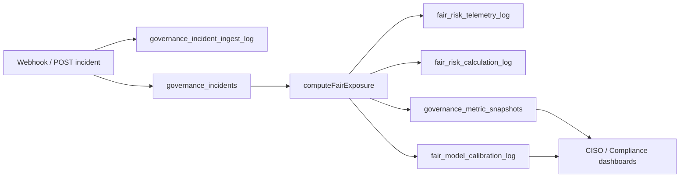

# Phase 3 Audit Evidence Pack — SecOps + FAIR Traceability

> ## ⚠️ NOT CERTIFIED — IMPLEMENTATION EVIDENCE ONLY
>
> This pack documents **repeatable queries and pass/fail criteria** for Phase 3 validation. It does **not** constitute NIST CSF 2.0 certification or external attestation.

**Version:** 1.1  
**Date:** 18 June 2026  
**Owner:** ICT Governance / Security Engineering  
**Related:** [Enterprise Security Seven-Pillar Implementation Plan](../implementation/guides/Enterprise-Security-Seven-Pillar-Implementation-Plan.md), [NIST CSF 2.0 Compliance Review](NIST-CSF-2.0-Compliance-Review.md)

---

## Purpose

Provide auditors and internal compliance reviewers with:

1. **Deterministic SQL queries** — same inputs → same evidence
2. **Pass/fail criteria** per control
3. **End-to-end trace walkthrough** — incident → FAIR → ALE delta
4. **Automated export** — `npm run export:audit-evidence`

This pack covers Sprint A mandatory controls: event-driven FAIR, `correlation_id`, ingest audit log, SLA enrichment.

---

## Prerequisites

Apply schemas and run verification before collecting evidence:

```bash
cd ict-governance-framework

npm run setup:governance
npm run setup:incident-secops
npm run setup:fair-risk
npm run setup:fair-calibration   # P4-D1 — calibration audit schema
npm run setup:enterprise          # optional — MDM/alerts only

npm run verify:secops             # 44 assertions
npm run verify:fair-risk          # 19 assertions
npm run verify:calibration        # 14 assertions
npm run export:audit-evidence     # Phase 3 evidence bundle v1.1 (JSON; includes calibration block)
```

API server on `:4000` for live dashboard screenshots (optional).

---

## Control chain (what auditors should verify)



Every hop must share the same `correlation_id` when the trigger is incident ingest.

---

## Auditor query set

### A. Critical incident trace

```sql
SELECT
  incident_id,
  correlation_id,
  severity,
  status,
  detected_at,
  acknowledged_at,
  resolved_at,
  sla_breached,
  asset_id,
  description
FROM governance_incidents
WHERE severity = 'CRITICAL'
ORDER BY detected_at DESC
LIMIT 5;
```

**Pass when:**

| Check | Condition |
|-------|-----------|
| Row exists | At least one CRITICAL incident (or synthetic test incident) |
| `correlation_id` | NOT NULL on ingest-created rows |
| `detected_at` | Populated |

---

### B. FAIR linkage (incident → ALE delta)

Replace `<correlation_id>` with a value from query A:

```sql
SELECT
  id,
  correlation_id,
  trigger_source,
  incident_id,
  ale_before_usd,
  ale_after_usd,
  (ale_after_usd - ale_before_usd) AS risk_delta_usd,
  recorded_at
FROM fair_risk_calculation_log
WHERE correlation_id = '<correlation_id>';
```

**Pass when:**

| Check | Condition |
|-------|-----------|
| Row exists | `trigger_source = 'incident'` |
| ALE delta | `ale_before_usd` and `ale_after_usd` both NOT NULL |
| Incident link | `incident_id` matches governance_incidents row |

---

### C. Telemetry lineage (multiplier drivers)

```sql
SELECT
  scenario_id,
  driver,
  raw_value,
  multiplier_applied,
  correlation_id,
  recorded_at
FROM fair_risk_telemetry_log
WHERE correlation_id = '<correlation_id>'
ORDER BY recorded_at;
```

**Pass when:**

| Check | Condition |
|-------|-----------|
| Drivers logged | At least one of: `unverified_shadow_it_assets`, `dr_at_risk_assets`, `open_critical_incidents`, `active_break_glass_tickets` |
| Multiplier | `multiplier_applied` between 0.1 and 5.0 (cap enforced) |

---

### D. Ingest proof (input → transformation)

```sql
SELECT
  id,
  correlation_id,
  incident_id,
  raw_payload,
  processed_fields,
  created_at
FROM governance_incident_ingest_log
WHERE correlation_id = '<correlation_id>';
```

**Pass when:**

| Check | Condition |
|-------|-----------|
| Raw preserved | `raw_payload` contains original tenant/severity/description |
| Transform visible | `processed_fields` shows normalized fields + `verifiedAssetId` |
| Incident FK | `incident_id` populated |

---

### E. Enterprise KPI snapshots

```sql
SELECT metric_code, current_value, last_context, last_updated
FROM governance_metric_snapshots
WHERE metric_code IN (
  'KPI-GOV-TOTAL-RISK-EXPOSURE',
  'KPI-GOV-RISK-DELTA-24H'
);
```

**Pass when:** Both metrics exist; `last_updated` recent after FAIR sweep.

---

### F. SLA enrichment (API-level)

```http
GET /api/governance/incidents?limit=10
Authorization: Bearer <token>
```

**Pass when** each incident includes:

- `sla_targets` (CRITICAL: ticketToAckMs = 300000, mttrMs = 3600000)
- `time_to_acknowledge_ms` (null until Acknowledged)
- `sla_ack_breached` / `sla_mttr_breached` booleans

---

### G. FAIR model calibration (governed model lifecycle)

```sql
SELECT
  calibration_target,
  scenario_id,
  technique,
  observed_frequency,
  expected_frequency,
  adjustment_factor,
  previous_value,
  new_value,
  window_days,
  applied_at,
  applied_by
FROM fair_model_calibration_log
ORDER BY applied_at DESC
LIMIT 20;
```

```sql
SELECT
  scenario_id,
  threat_event_frequency AS baseline_tef,
  tef_calibration_factor,
  (threat_event_frequency * tef_calibration_factor) AS adjusted_tef
FROM fair_risk_scenarios
ORDER BY scenario_id;
```

**Pass when:**

| Check | Condition |
|-------|-----------|
| Schema | `fair_model_calibration_log` exists; `tef_calibration_factor` on scenarios |
| Drift export | All 3 scenarios in export `calibration.scenarios` |
| Factor bounds | `tef_calibration_factor` between 0.5 and 2.0 |
| Audit trail | Each adjustment has `previous_value`, `new_value`, `adjustment_factor` |

Automated bundle: `calibration.summary.model_stability`, `calibration.recent_adjustments`.

---

## Pass/fail matrix (summary)

| Control ID | Control | Pass condition | Evidence source |
|------------|---------|----------------|-----------------|
| SEC-A1 | Incident ingest | `correlation_id` + ingest log row | A, D |
| SEC-A2 | FAIR event trigger | calculation log with `trigger_source=incident` | B |
| SEC-A3 | ALE causality | `ale_before` / `ale_after` delta recorded | B, API `fair_recalculation` |
| SEC-A4 | Telemetry lineage | drivers + multipliers per sweep | C |
| SEC-A5 | KPI propagation | TOTAL + DELTA-24H metrics updated | E |
| SEC-A6 | SLA measurability | targets exposed; breach flags computable | F |
| SEC-A7 | Repeatability | `verify:secops` + `verify:fair-risk` exit 0 | CLI output |
| SEC-A8 | Calibration governance | schema + drift + bounded factors + audit trail | G, export `calibration` |

**Overall Phase 3 evidence pass:** SEC-A1 through SEC-A8 all pass on the same `correlation_id` sample (SEC-A8 independent of correlation_id).

---

## Perfect audit trace walkthrough

Use this narrative when an auditor asks: *"Walk me through how this incident changed risk."*

### Step 1 — Detection and ingest

A CRITICAL security drift event arrives at `POST /api/governance/incidents` (Sentinel webhook or automation). The system assigns `correlation_id = <UUID>` and writes:

- `governance_incident_ingest_log.raw_payload` — exact incoming JSON
- `governance_incident_ingest_log.processed_fields` — normalized tenant, severity, asset correlation
- `governance_incidents` row with `status = Detected`

### Step 2 — Asset correlation

If `assetId` is present, `processed_fields.verifiedAssetId` reflects register lookup; description is extended with asset name and compliance state.

### Step 3 — FAIR recalculation (event-driven)

`computeFairExposure({ triggerSource: 'incident', correlationId, incidentId })` runs synchronously on ingest:

1. Reads current enterprise ALE (`ale_before_usd`)
2. Gathers telemetry (shadow IT, DR posture, open CRITICAL incidents, Break Glass)
3. Logs each driver to `fair_risk_telemetry_log` with same `correlation_id`
4. Updates scenario ALE values and KPI snapshots
5. Writes `fair_risk_calculation_log` with before/after

### Step 4 — Observable outcome

- API response includes `fair_recalculation.risk_delta_usd`
- CISO dashboard shows updated enterprise ALE and 24h delta
- Compliance dashboard FAIR panel reflects new scenario ALE

### Step 5 — Auditor replay

Given only `correlation_id`, queries B + C + D reconstruct the full chain without reading application logs.

**Example correlation_id:** obtain from latest test run:

```bash
npm run verify:secops
# or
npm run export:audit-evidence
```

---

## Evidence bundle checklist

Collect for Phase 3 review folder:

- [ ] `verify:secops` terminal output (44/44)
- [ ] `verify:fair-risk` terminal output (19/19)
- [ ] `verify:calibration` terminal output (14/14)
- [ ] `export:audit-evidence` JSON export (v1.1 — includes `calibration` block)
- [ ] SQL result screenshots for queries A–G on one `correlation_id`
- [ ] API response screenshot: `POST /incidents` showing `fair_recalculation`
- [ ] CISO dashboard screenshot: live ALE + top scenarios
- [ ] This document (version + date)

---

## Known gaps (not blocking evidence pack)

| Gap | Impact | Planned |
|-----|--------|---------|
| ~~`PATCH /incidents/:id`~~ | ~~Cannot state-drive lifecycle~~ | **Done** — `governance-incident-lifecycle.js` |
| PowerShell `Create-IncidentTicket` stub | ~~Automation path not live~~ | **Done** — `Invoke-GovernanceIncidentApi` in `Continuous-Compliance-Monitoring.ps1` |
| IR timeline `risk_updated` events | Sprint B enrichment | Sprint B |
| Incident → FAIR scenario FK | Sprint B | Sprint B |

SLA **lifecycle progression** is state-driven via `PATCH /api/governance/incidents/:incidentId`.

### Lifecycle verification

```http
GET /api/governance/incidents/:incidentId/timeline
Authorization: Bearer <token>
```

Returns unified `incident_detected`, `status_change`, and `risk_updated` events ordered by `recorded_at`.

```http
PATCH /api/governance/incidents/:incidentId
Authorization: Bearer <token>
Content-Type: application/json

{ "status": "Acknowledged" }
```

Allowed transitions: `Detected → Acknowledged → Remediating → Resolved`. FAIR recalculates on ingest (`incident`) and on `Resolved` (`incident_resolved`).

---

## NIST CSF 2.0 mapping (evidence only — not certification)

| CSF 2.0 | Evidence in this pack |
|---------|------------------------|
| GV.RM | FAIR calculation log, telemetry drivers, KPI snapshots, calibration log |
| DE.AE | Ingest log, incident correlation, `correlation_id` |
| RS.MA | Incident ledger, SLA targets, breach flags |
| ID.AM | Asset correlation in `processed_fields` |

---

## Revision history

| Version | Date | Change |
|---------|------|--------|
| 1.1 | 18 June 2026 | P4-D1 — `calibration` block in export; SEC-A8; query set G |
| 1.0 | 18 June 2026 | Initial pack — Sprint A mandatory controls |
