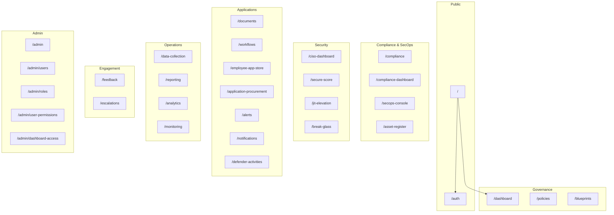

# ICT Governance Framework — Application Sitemap

**Application:** `ict-governance-framework` (Next.js App Router)  
**Base URL (dev):** `http://localhost:3000`  
**API proxy:** `/api/*` → Express on `http://localhost:4000`  
**Last updated:** June 2026  
**Auth:** Most routes expect login; several require RBAC permissions (noted below).

---

## 1. Public & authentication

| Path | Page | Notes |
|------|------|--------|
| `/` | Home | Framework overview; redirects unauthenticated users to `/auth` |
| `/auth` | Login | `?redirect=/path` supported |
| `/auth?mode=register` | Register | Same route, register mode |

---

## 2. Core dashboards

| Path | Page | Nav | Notes |
|------|------|-----|--------|
| `/dashboard` | Main dashboard | Governance → Dashboard | RBAC-gated; embeds **Executive**, **Operational**, **Compliance**, **Analytics** views as tabs (not separate URLs) |
| `/ciso-dashboard` | CISO executive dashboard | Security → CISO Dashboard | Live FAIR ALE, calibration, SecOps KPIs |
| `/secure-score` | Microsoft Secure Score | Security → Secure Score | Secure score trends and controls |
| `/compliance-dashboard` | Compliance posture | Compliance → Compliance Dashboard | Live PostgreSQL controls + demo banner when empty |

---

## 3. Governance, compliance & SecOps (live)

| Path | Page | Nav | Permission / notes |
|------|------|-----|---------------------|
| `/compliance` | Compliance overview | Compliance | `compliance.read` (typical) |
| `/secops-console` | SecOps console | Compliance / Security | Incident lifecycle, MITRE, FAIR timeline |
| `/asset-register` | RPAS asset register | Compliance | DR, CASB, validation posture |
| `/jit-elevation` | JIT elevation ledger | Security | Privileged access tickets |
| `/break-glass` | Break Glass console | Security | Emergency access + reconciliation |
| `/policies` | Policies | Governance | `governance.read` |
| `/blueprints` | Blueprints | Governance | `governance.read` |

---

## 4. Documents, workflows & procurement

| Path | Page | Nav | Permission |
|------|------|-----|------------|
| `/documents` | Document management | Applications | `document.read` |
| `/documents/new` | Create document | — | `document.read` / write |
| `/documents/[id]` | Document detail | — | Dynamic route (`/documents/123`, etc.) |
| `/workflows` | Approval workflows | Applications | `workflow.approve` |
| `/employee-app-store` | Employee app store | Applications | `app.procurement` |
| `/application-procurement` | Application procurement | Applications | `app.procurement` |

---

## 5. Operations, monitoring & feedback

| Path | Page | Nav | Permission |
|------|------|-----|------------|
| `/alerts` | Alerts | Applications | `alert.read` |
| `/notifications` | Notifications | Applications | Authenticated |
| `/defender-activities` | Defender activities | Applications | `system.audit` |
| `/data-collection` | Data collection | Operations | `data_collection_read` |
| `/reporting` | Reports | Operations | `reporting_read` |
| `/analytics` | Data analytics | Operations | `data_analytics_read` |
| `/monitoring` | System monitoring | — | Not in main nav; health/metrics UI |
| `/predictive-analytics` | Predictive analytics | — | Placeholder (“coming soon” style) |
| `/feedback` | Feedback | Engagement | Authenticated |
| `/escalations` | Escalation management | Engagement | Authenticated |

---

## 6. User account

| Path | Page | Nav | Notes |
|------|------|-----|--------|
| `/profile` | User profile | User menu | Personal info, security, activity |
| `/settings` | — | User menu link | **No page file** — link exists in header but route is not implemented (404) |

---

## 7. Administration

| Path | Page | Nav | Notes |
|------|------|-----|--------|
| `/admin` | Admin home | Admin | System stats |
| `/admin/users` | User management | Admin | CRUD users |
| `/admin/roles` | Role management | — | Role definitions |
| `/admin/user-permissions` | User permissions | — | Per-user permission assignment |
| `/admin/dashboard-access` | Dashboard access | — | Executive / operational / compliance / analytics access matrix |

---

## 8. In-app documentation

| Path | Page | Nav |
|------|------|-----|
| `/docs` | API / getting started docs | Docs |

---

## 9. Visual hierarchy (navigation map)

---

## 10. Summary counts

| Category | Routes |
|----------|--------|
| Static pages | **36** |
| Dynamic pages | **1** (`/documents/[id]`) |
| Missing (linked but no page) | **1** (`/settings`) |
| **Total navigable paths** | **37** + document IDs |

---

## 11. Dashboard views without dedicated URLs

These are **tabs inside `/dashboard`**, not standalone routes:

- Executive dashboard (`ExecutiveDashboard.js`)
- Operational dashboard (`OperationalDashboard.js`)
- Compliance view
- Analytics view

For board-level live metrics, prefer **`/ciso-dashboard`** (FAIR + calibration + SecOps).

---

## 12. API-only (not pages)

REST APIs are proxied to Express on `:4000` via `/api/*` (governance, risk, assets, auth, JIT, etc.). They are not browser pages.

Key governance API prefixes:

| Prefix | Purpose |
|--------|---------|
| `/api/governance/*` | Posture, incidents, executive metrics, MITRE |
| `/api/governance/risk/*` | FAIR exposure, calibration, telemetry |
| `/api/assets/*` | Asset register |
| `/api/auth/*` | Login, refresh, JIT elevation |
| `/api/auth/jit/*` | JIT ledger, Break Glass |

---

## Source of truth

Routes are derived from `ict-governance-framework/app/**/page.js` and navigation in `app/components/Header.js`. Regenerate or extend this document when new `page.js` files are added.
