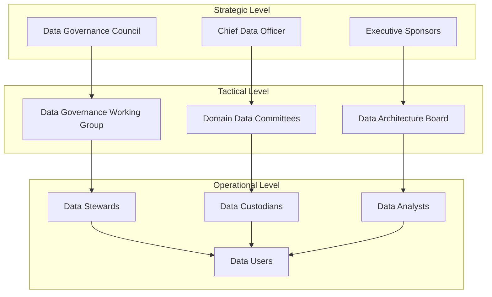
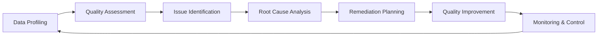
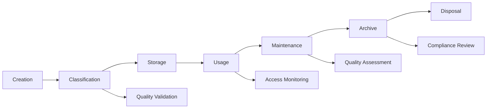

# A040 - Data Governance Framework

**WBS Reference:** 1.2.1.3.3 - Establish Data Governance Framework  
**Project:** ICT Governance Framework Application  
**Assessment Date:** January 20, 2025  
**Status:** Complete - Approved  
**Dependencies:** A040 (Data Model), A040 (Information Architecture)  
**Deliverable:** Data governance framework

---

## Executive Summary

This document establishes a comprehensive data governance framework for the ICT Governance Platform that ensures data is managed as a strategic asset with appropriate controls for quality, security, privacy, and compliance. The framework provides the policies, processes, roles, and technologies needed to govern data throughout its lifecycle.

**Key Metrics:**
- **Data Domains:** 12 governance domains covered
- **Governance Policies:** 23 core data policies defined
- **Data Steward Roles:** 47 stewardship assignments
- **Quality Standards:** 15 quality dimensions monitored
- **Compliance Frameworks:** 8 regulatory frameworks addressed

**Framework Maturity Level:** **Optimized** - Comprehensive governance with continuous improvement

---

## 1. Data Governance Overview

### 1.1 Framework Purpose and Scope

**Purpose:**
The Data Governance Framework establishes the organizational structure, policies, processes, and technologies required to ensure that data across the ICT Governance Platform is:
- **Accurate and Reliable**: High-quality data that supports decision-making
- **Secure and Protected**: Appropriate controls to protect sensitive information
- **Compliant**: Adherence to regulatory and organizational requirements
- **Accessible**: Available to authorized users when needed
- **Valuable**: Leveraged as a strategic organizational asset

**Scope:**
This framework applies to all data within the ICT Governance ecosystem, including:
- Governance and policy data
- Asset and configuration data
- Identity and access data
- Risk and compliance data
- Operational and performance data
- Analytical and reporting data

### 1.2 Governance Principles

**Core Principles:**
```yaml
governance_principles:
  data_as_asset:
    principle: "Data is a Strategic Asset"
    description: "Data is recognized and managed as a valuable organizational resource"
    implementation:
      - asset_valuation
      - investment_planning
      - roi_measurement
  
  accountability:
    principle: "Clear Data Accountability"
    description: "Defined roles and responsibilities for data management"
    implementation:
      - data_ownership
      - stewardship_assignments
      - responsibility_matrix
  
  quality_focus:
    principle: "Quality by Design"
    description: "Data quality is built into processes and systems"
    implementation:
      - quality_standards
      - validation_rules
      - continuous_monitoring
  
  privacy_protection:
    principle: "Privacy by Design"
    description: "Privacy controls are embedded throughout data lifecycle"
    implementation:
      - data_minimization
      - consent_management
      - rights_enablement
  
  transparency:
    principle: "Transparent Data Practices"
    description: "Clear visibility into data usage and governance"
    implementation:
      - data_catalog
      - lineage_tracking
      - usage_monitoring
```

---

## 2. Governance Organization and Roles

### 2.1 Data Governance Operating Model



### 2.2 Roles and Responsibilities

#### Strategic Level Roles

**Chief Data Officer (CDO)**
```yaml
role: "Chief Data Officer"
level: "Strategic"
responsibilities:
  - data_strategy_development
  - governance_program_oversight
  - stakeholder_alignment
  - policy_approval
  - investment_decisions
  - performance_monitoring

accountabilities:
  - overall_data_governance_success
  - regulatory_compliance
  - data_value_realization
  - risk_management

reporting_relationship: "Chief Information Officer"
```

**Data Governance Council**
```yaml
role: "Data Governance Council"
level: "Strategic"
composition:
  - chief_data_officer
  - domain_executives
  - legal_counsel
  - compliance_officer
  - security_officer

responsibilities:
  - governance_policy_approval
  - strategic_direction_setting
  - resource_allocation
  - conflict_resolution
  - performance_review

meeting_frequency: "Monthly"
decision_authority: "High"
```

#### Tactical Level Roles

**Data Stewards**
```yaml
role: "Data Steward"
level: "Tactical"
assignment: "Domain-specific"
responsibilities:
  - data_quality_management
  - business_rule_definition
  - access_control_management
  - issue_resolution
  - user_training
  - compliance_monitoring

domains:
  governance_steward:
    scope: "Policy and governance data"
    focus: "Policy accuracy and compliance"
  
  asset_steward:
    scope: "Asset and configuration data"
    focus: "Asset data completeness and accuracy"
  
  identity_steward:
    scope: "Identity and access data"
    focus: "Identity data privacy and security"
  
  risk_steward:
    scope: "Risk and compliance data"
    focus: "Risk data timeliness and validity"
```

**Data Custodians**
```yaml
role: "Data Custodian"
level: "Operational"
assignment: "System-specific"
responsibilities:
  - technical_data_management
  - system_administration
  - backup_and_recovery
  - security_implementation
  - performance_optimization
  - integration_management

technical_domains:
  database_custodian:
    scope: "Database systems"
    focus: "Database performance and availability"
  
  integration_custodian:
    scope: "Integration platforms"
    focus: "Data flow reliability and monitoring"
  
  analytics_custodian:
    scope: "Analytics platforms"
    focus: "Analytics data preparation and delivery"
```

---

## 3. Data Governance Policies

### 3.1 Core Data Policies

#### Data Classification Policy
```yaml
policy_name: "Data Classification Policy"
policy_id: "DGP-001"
version: "1.0"
effective_date: "2025-01-20"

classification_levels:
  public:
    definition: "Information that can be freely shared"
    handling_requirements:
      - no_special_protection_required
      - standard_backup_procedures
      - basic_access_logging
    
  internal:
    definition: "Information for organizational use only"
    handling_requirements:
      - authenticated_access_required
      - encryption_in_transit
      - standard_audit_logging
    
  confidential:
    definition: "Information requiring authorized access"
    handling_requirements:
      - role_based_access_control
      - encryption_at_rest_and_transit
      - detailed_audit_logging
      - data_loss_prevention
    
  restricted:
    definition: "Information requiring highest protection"
    handling_requirements:
      - privileged_access_management
      - end_to_end_encryption
      - comprehensive_audit_logging
      - data_loss_prevention
      - regular_access_reviews

classification_process:
  - data_owner_assessment
  - steward_validation
  - automated_classification_support
  - periodic_reclassification_review
```

#### Data Quality Policy
```yaml
policy_name: "Data Quality Policy"
policy_id: "DGP-002"
version: "1.0"
effective_date: "2025-01-20"

quality_dimensions:
  completeness:
    definition: "Required data fields are populated"
    target: ">95% for critical data"
    measurement: "Automated validation rules"
    
  accuracy:
    definition: "Data values are correct and valid"
    target: ">98% accuracy rate"
    measurement: "Validation against authoritative sources"
    
  consistency:
    definition: "Data is consistent across systems"
    target: ">99% consistency rate"
    measurement: "Cross-system validation checks"
    
  timeliness:
    definition: "Data is current and up-to-date"
    target: "<1 hour for critical data"
    measurement: "Data freshness monitoring"
    
  validity:
    definition: "Data conforms to business rules"
    target: ">97% validity rate"
    measurement: "Business rule validation"

quality_processes:
  - data_profiling
  - quality_monitoring
  - issue_identification
  - remediation_workflows
  - continuous_improvement
```

#### Data Privacy Policy
```yaml
policy_name: "Data Privacy Policy"
policy_id: "DGP-003"
version: "1.0"
effective_date: "2025-01-20"

privacy_principles:
  lawfulness:
    requirement: "Process data only with legal basis"
    implementation:
      - legal_basis_documentation
      - consent_management
      - legitimate_interest_assessments
  
  purpose_limitation:
    requirement: "Use data only for specified purposes"
    implementation:
      - purpose_documentation
      - usage_monitoring
      - purpose_change_controls
  
  data_minimization:
    requirement: "Collect only necessary data"
    implementation:
      - data_necessity_assessments
      - collection_limitations
      - retention_policies
  
  accuracy:
    requirement: "Maintain accurate personal data"
    implementation:
      - data_correction_processes
      - accuracy_monitoring
      - update_mechanisms

data_subject_rights:
  - right_of_access
  - right_of_rectification
  - right_of_erasure
  - right_of_portability
  - right_to_object
  - right_to_restrict_processing

privacy_controls:
  - privacy_impact_assessments
  - consent_management_system
  - data_subject_request_handling
  - breach_notification_procedures
```

### 3.2 Domain-Specific Policies

#### Governance Data Policy
```yaml
policy_name: "Governance Data Policy"
policy_id: "DGP-004"
domain: "Governance"

governance_data_requirements:
  policy_data:
    retention: "Permanent (with versioning)"
    access_control: "Role-based"
    audit_requirements: "Comprehensive"
    backup_frequency: "Daily"
    
  assessment_data:
    retention: "7 years"
    access_control: "Assessor and stakeholder access"
    audit_requirements: "Standard"
    backup_frequency: "Daily"
    
  decision_data:
    retention: "Permanent"
    access_control: "Council members and stakeholders"
    audit_requirements: "Comprehensive"
    backup_frequency: "Real-time replication"

data_integrity_controls:
  - digital_signatures
  - version_control
  - change_approval_workflows
  - tamper_evidence
```

---

## 4. Data Quality Management

### 4.1 Quality Framework

**Quality Management Approach:**


### 4.2 Quality Monitoring System

**Automated Quality Checks:**
```sql
-- Data quality monitoring framework
CREATE TABLE data_quality_rules (
    rule_id BIGINT IDENTITY PRIMARY KEY,
    rule_name VARCHAR(100) NOT NULL,
    rule_type VARCHAR(50) NOT NULL,
    target_table VARCHAR(100) NOT NULL,
    target_column VARCHAR(100),
    rule_expression NVARCHAR(MAX) NOT NULL,
    severity VARCHAR(20) NOT NULL,
    threshold_value DECIMAL(5,2),
    is_active BIT DEFAULT 1,
    created_utc DATETIME2 DEFAULT SYSUTCDATETIME()
);

-- Quality assessment results
CREATE TABLE data_quality_assessments (
    assessment_id BIGINT IDENTITY PRIMARY KEY,
    rule_id BIGINT NOT NULL,
    assessment_date DATETIME2 NOT NULL,
    total_records BIGINT NOT NULL,
    passed_records BIGINT NOT NULL,
    failed_records BIGINT NOT NULL,
    quality_score DECIMAL(5,2) NOT NULL,
    status VARCHAR(20) NOT NULL,
    
    FOREIGN KEY (rule_id) REFERENCES data_quality_rules(rule_id)
);

-- Quality issue tracking
CREATE TABLE data_quality_issues (
    issue_id BIGINT IDENTITY PRIMARY KEY,
    assessment_id BIGINT NOT NULL,
    issue_type VARCHAR(50) NOT NULL,
    severity VARCHAR(20) NOT NULL,
    description NVARCHAR(MAX),
    affected_records BIGINT,
    assigned_to VARCHAR(255),
    status VARCHAR(20) DEFAULT 'Open',
    created_utc DATETIME2 DEFAULT SYSUTCDATETIME(),
    resolved_utc DATETIME2,
    
    FOREIGN KEY (assessment_id) REFERENCES data_quality_assessments(assessment_id)
);
```

### 4.3 Quality Improvement Process

**Continuous Improvement Workflow:**
```yaml
quality_improvement_process:
  issue_detection:
    methods:
      - automated_monitoring
      - user_reporting
      - periodic_assessments
    
  root_cause_analysis:
    techniques:
      - data_lineage_analysis
      - process_review
      - system_investigation
      - stakeholder_interviews
    
  remediation_planning:
    considerations:
      - impact_assessment
      - resource_requirements
      - timeline_planning
      - risk_evaluation
    
  implementation:
    activities:
      - system_fixes
      - process_improvements
      - training_delivery
      - control_enhancements
    
  validation:
    verification:
      - quality_retesting
      - user_acceptance
      - performance_monitoring
      - compliance_validation
```

---

## 5. Data Security and Privacy

### 5.1 Security Framework

**Multi-Layered Security Approach:**
```yaml
security_layers:
  network_security:
    controls:
      - firewall_protection
      - network_segmentation
      - intrusion_detection
      - vpn_access
    
  application_security:
    controls:
      - authentication
      - authorization
      - input_validation
      - session_management
    
  data_security:
    controls:
      - encryption_at_rest
      - encryption_in_transit
      - data_masking
      - tokenization
    
  infrastructure_security:
    controls:
      - server_hardening
      - patch_management
      - vulnerability_scanning
      - security_monitoring
```

### 5.2 Privacy Protection Framework

**Privacy Controls Implementation:**
```yaml
privacy_controls:
  data_minimization:
    implementation:
      - collection_limitation
      - purpose_specification
      - use_limitation
      - retention_limitation
    
  consent_management:
    capabilities:
      - consent_capture
      - consent_tracking
      - consent_withdrawal
      - consent_renewal
    
  data_subject_rights:
    processes:
      - access_request_handling
      - rectification_procedures
      - erasure_implementation
      - portability_services
    
  privacy_monitoring:
    activities:
      - usage_tracking
      - compliance_monitoring
      - breach_detection
      - impact_assessment
```

### 5.3 Compliance Management

**Regulatory Compliance Framework:**
```yaml
compliance_frameworks:
  gdpr:
    scope: "EU personal data processing"
    requirements:
      - lawful_basis
      - data_subject_rights
      - privacy_by_design
      - breach_notification
    
  ccpa:
    scope: "California consumer data"
    requirements:
      - consumer_rights
      - opt_out_mechanisms
      - data_sale_restrictions
      - privacy_notices
    
  hipaa:
    scope: "Healthcare information"
    requirements:
      - administrative_safeguards
      - physical_safeguards
      - technical_safeguards
      - breach_notification
    
  sox:
    scope: "Financial reporting data"
    requirements:
      - internal_controls
      - audit_trails
      - data_integrity
      - access_controls
```

---

## 6. Data Lifecycle Management

### 6.1 Lifecycle Stages

**Data Lifecycle Framework:**


### 6.2 Lifecycle Policies

**Stage-Specific Policies:**
```yaml
lifecycle_policies:
  creation:
    requirements:
      - data_classification
      - quality_validation
      - metadata_capture
      - lineage_tracking
    
  storage:
    requirements:
      - appropriate_security_controls
      - backup_procedures
      - access_controls
      - monitoring_setup
    
  usage:
    requirements:
      - authorized_access_only
      - usage_monitoring
      - quality_maintenance
      - compliance_tracking
    
  maintenance:
    requirements:
      - regular_quality_checks
      - metadata_updates
      - access_reviews
      - compliance_validation
    
  archive:
    requirements:
      - retention_policy_compliance
      - secure_storage
      - limited_access
      - integrity_verification
    
  disposal:
    requirements:
      - secure_deletion
      - compliance_verification
      - audit_documentation
      - stakeholder_notification
```

---

## 7. Data Integration and Interoperability

### 7.1 Integration Governance

**Integration Standards:**
```yaml
integration_standards:
  data_formats:
    structured_data:
      - json
      - xml
      - csv
      - parquet
    
    unstructured_data:
      - pdf
      - docx
      - images
      - videos
  
  api_standards:
    rest_apis:
      - openapi_specification
      - oauth2_authentication
      - rate_limiting
      - versioning
    
    messaging:
      - event_driven_architecture
      - message_schemas
      - delivery_guarantees
      - error_handling
  
  metadata_standards:
    technical_metadata:
      - schema_definitions
      - data_types
      - constraints
      - relationships
    
    business_metadata:
      - business_definitions
      - ownership_information
      - usage_guidelines
      - quality_metrics
```

### 7.2 Master Data Management

**MDM Framework:**
```yaml
master_data_management:
  master_entities:
    - organizations
    - users
    - assets
    - policies
    - locations
  
  mdm_processes:
    data_identification:
      - entity_definition
      - attribute_identification
      - relationship_mapping
      - hierarchy_definition
    
    data_consolidation:
      - duplicate_detection
      - record_matching
      - data_merging
      - conflict_resolution
    
    data_governance:
      - stewardship_assignment
      - quality_monitoring
      - change_management
      - access_control
    
    data_distribution:
      - subscription_management
      - real_time_synchronization
      - batch_distribution
      - conflict_resolution
```

---

## 8. Analytics and Reporting Governance

### 8.1 Analytics Framework

**Governed Analytics Approach:**
```yaml
analytics_governance:
  data_preparation:
    standards:
      - data_quality_validation
      - transformation_documentation
      - lineage_tracking
      - version_control
    
  model_development:
    requirements:
      - model_documentation
      - validation_procedures
      - bias_testing
      - performance_monitoring
    
  deployment:
    controls:
      - approval_workflows
      - testing_procedures
      - monitoring_setup
      - rollback_procedures
    
  monitoring:
    activities:
      - performance_tracking
      - drift_detection
      - usage_monitoring
      - compliance_validation
```

### 8.2 Reporting Standards

**Reporting Governance:**
```yaml
reporting_standards:
  report_development:
    requirements:
      - business_requirement_documentation
      - data_source_validation
      - calculation_verification
      - user_acceptance_testing
    
  report_deployment:
    controls:
      - approval_workflows
      - access_control_setup
      - performance_testing
      - documentation_completion
    
  report_maintenance:
    activities:
      - regular_validation
      - performance_monitoring
      - user_feedback_collection
      - continuous_improvement
```

---

## 9. Technology and Tools

### 9.1 Data Governance Technology Stack

**Technology Components:**
```yaml
governance_technology_stack:
  data_catalog:
    primary: "Microsoft Purview"
    capabilities:
      - metadata_management
      - data_discovery
      - lineage_tracking
      - glossary_management
    
  data_quality:
    primary: "Azure Data Factory Data Flows"
    capabilities:
      - quality_profiling
      - validation_rules
      - monitoring_dashboards
      - remediation_workflows
    
  master_data_management:
    primary: "Azure SQL Database"
    capabilities:
      - entity_management
      - relationship_tracking
      - hierarchy_management
      - synchronization
    
  privacy_management:
    primary: "Microsoft Priva"
    capabilities:
      - privacy_risk_assessment
      - data_subject_requests
      - consent_management
      - compliance_monitoring
```

### 9.2 Automation and Orchestration

**Automated Governance Processes:**
```yaml
automation_framework:
  data_classification:
    automation_level: "Semi-automated"
    tools:
      - microsoft_purview_classifier
      - custom_classification_rules
      - machine_learning_models
    
  quality_monitoring:
    automation_level: "Fully automated"
    tools:
      - azure_data_factory_monitoring
      - custom_quality_rules
      - alerting_systems
    
  compliance_monitoring:
    automation_level: "Automated with manual review"
    tools:
      - compliance_dashboards
      - automated_assessments
      - exception_reporting
    
  access_management:
    automation_level: "Workflow-driven"
    tools:
      - azure_active_directory
      - privileged_identity_management
      - access_review_workflows
```

---

## 10. Implementation Roadmap

### 10.1 Phase 1: Foundation (Months 1-3)
**Governance Structure**
- Establish governance organization
- Define roles and responsibilities
- Create core policies and procedures
- Deploy basic technology infrastructure

**Key Deliverables:**
- Governance charter
- Role definitions
- Core policies
- Technology foundation

### 10.2 Phase 2: Core Capabilities (Months 4-6)
**Data Management**
- Implement data classification
- Deploy quality monitoring
- Establish master data management
- Create privacy controls

**Key Deliverables:**
- Classification framework
- Quality monitoring system
- MDM implementation
- Privacy controls

### 10.3 Phase 3: Advanced Capabilities (Months 7-9)
**Analytics and Automation**
- Deploy advanced analytics
- Implement automation workflows
- Create self-service capabilities
- Establish continuous improvement

**Key Deliverables:**
- Analytics platform
- Automation framework
- Self-service portal
- Improvement processes

### 10.4 Phase 4: Optimization (Months 10-12)
**Maturity and Excellence**
- Optimize governance processes
- Implement advanced analytics
- Create predictive capabilities
- Establish center of excellence

**Key Deliverables:**
- Optimized processes
- Predictive analytics
- Center of excellence
- Maturity assessment

---

## 11. Success Metrics and KPIs

### 11.1 Governance Effectiveness Metrics

**Strategic Metrics:**
```yaml
strategic_metrics:
  data_value_realization:
    metric: "Business value generated from data initiatives"
    target: "20% increase year-over-year"
    measurement: "Business case tracking and ROI analysis"
  
  governance_maturity:
    metric: "Data governance maturity score"
    target: "Level 4 (Optimized) within 18 months"
    measurement: "Annual maturity assessment"
  
  stakeholder_satisfaction:
    metric: "Data user satisfaction score"
    target: ">4.0/5.0"
    measurement: "Quarterly stakeholder surveys"
```

**Operational Metrics:**
```yaml
operational_metrics:
  data_quality:
    metric: "Overall data quality score"
    target: ">95%"
    measurement: "Automated quality monitoring"
  
  compliance_rate:
    metric: "Regulatory compliance score"
    target: "100% for critical requirements"
    measurement: "Compliance monitoring and audits"
  
  incident_resolution:
    metric: "Average time to resolve data issues"
    target: "<24 hours for critical issues"
    measurement: "Issue tracking system"
  
  access_efficiency:
    metric: "Time to provision data access"
    target: "<2 hours for standard requests"
    measurement: "Access request tracking"
```

### 11.2 Technical Performance Metrics

**System Performance:**
```yaml
technical_metrics:
  data_availability:
    metric: "Data system uptime"
    target: ">99.9%"
    measurement: "System monitoring"
  
  integration_success:
    metric: "Data integration success rate"
    target: ">99%"
    measurement: "Integration monitoring"
  
  query_performance:
    metric: "Average query response time"
    target: "<2 seconds for standard queries"
    measurement: "Performance monitoring"
  
  storage_efficiency:
    metric: "Data storage optimization"
    target: "15% reduction in storage costs"
    measurement: "Storage utilization analysis"
```

---

## 12. Risk Management and Compliance

### 12.1 Data Governance Risks

**Risk Assessment Framework:**
```yaml
governance_risks:
  data_quality_degradation:
    probability: "Medium"
    impact: "High"
    mitigation_strategies:
      - automated_quality_monitoring
      - proactive_quality_management
      - steward_training_programs
      - quality_improvement_processes
  
  privacy_violations:
    probability: "Low"
    impact: "Critical"
    mitigation_strategies:
      - privacy_by_design_implementation
      - regular_privacy_assessments
      - staff_training_programs
      - incident_response_procedures
  
  compliance_failures:
    probability: "Low"
    impact: "High"
    mitigation_strategies:
      - continuous_compliance_monitoring
      - regular_compliance_audits
      - policy_update_procedures
      - stakeholder_communication
  
  security_breaches:
    probability: "Medium"
    impact: "Critical"
    mitigation_strategies:
      - multi_layered_security_controls
      - regular_security_assessments
      - incident_response_planning
      - security_awareness_training
```

### 12.2 Compliance Monitoring

**Continuous Compliance Framework:**
```yaml
compliance_monitoring:
  automated_monitoring:
    capabilities:
      - policy_compliance_checking
      - regulatory_requirement_tracking
      - exception_identification
      - trend_analysis
    
  manual_assessments:
    frequency: "Quarterly"
    scope:
      - policy_effectiveness_review
      - process_compliance_audit
      - stakeholder_feedback_collection
      - improvement_opportunity_identification
    
  reporting:
    stakeholders:
      - data_governance_council
      - executive_leadership
      - regulatory_bodies
      - audit_committees
    
    frequency:
      - real_time_dashboards
      - monthly_summary_reports
      - quarterly_detailed_reports
      - annual_comprehensive_assessments
```

---

## Conclusion

This Data Governance Framework provides a comprehensive foundation for managing data as a strategic asset within the ICT Governance Platform. The framework establishes the organizational structure, policies, processes, and technologies needed to ensure data quality, security, privacy, and compliance.

The framework's success depends on:
- **Strong Leadership Commitment**: Executive support and resource allocation
- **Clear Accountability**: Well-defined roles and responsibilities
- **Stakeholder Engagement**: Active participation from data users and stewards
- **Continuous Improvement**: Regular assessment and optimization of governance processes
- **Technology Enablement**: Appropriate tools and automation to support governance activities

Through systematic implementation of this framework, the organization will achieve improved data quality, enhanced security and privacy protection, stronger regulatory compliance, and increased business value from data assets.

The framework provides the foundation for data-driven decision-making, operational efficiency, and strategic advantage in the digital economy.

---

*This document is part of the ICT Governance Framework project and provides the authoritative data governance framework for all data management activities.*