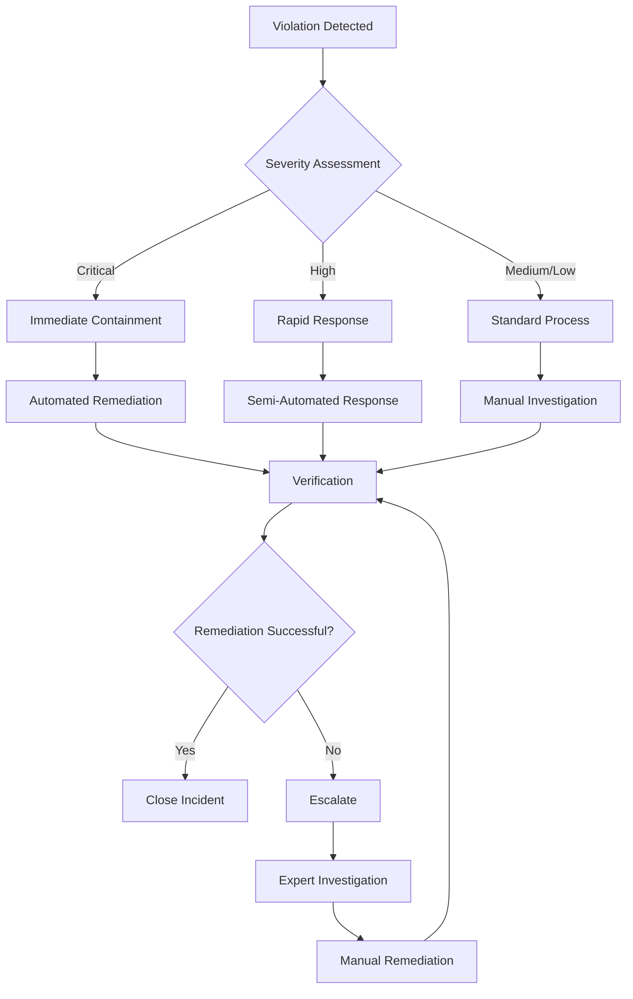

# Real-Time Compliance Monitoring and Alerting Framework

## Executive Summary

This framework establishes real-time monitoring and alerting capabilities for compliance violations and security incidents within the ICT Governance Framework. It provides immediate detection, automated response, and continuous monitoring to ensure rapid identification and remediation of governance violations.

## Framework Overview

### Purpose
- Enable real-time detection of compliance violations and security incidents
- Provide immediate alerting and automated response capabilities
- Establish continuous monitoring across all governance domains
- Define governance SLAs for incident response and remediation

### Scope
This framework covers:
- **Policy Compliance Monitoring**: Real-time tracking of policy adherence
- **Security Incident Detection**: Immediate identification of security violations
- **Regulatory Compliance**: Continuous monitoring of regulatory requirements
- **Governance Process Violations**: Detection of process deviations
- **Risk Threshold Breaches**: Monitoring of risk indicators and thresholds

## Real-Time Monitoring Architecture

### 1. Monitoring Infrastructure

#### 1.1 Data Collection Layer
```
┌─────────────────────────────────────────────────────────────┐
│                    Data Collection Sources                   │
├─────────────────────────────────────────────────────────────┤
│ • Azure Policy Compliance Events                           │
│ • Security Center Alerts                                   │
│ • Azure AD Sign-in Logs                                   │
│ • Application Access Logs                                 │
│ • Infrastructure Configuration Changes                     │
│ • Data Access and Classification Events                   │
│ • Network Security Events                                 │
│ • Endpoint Security Events                                │
│ • Cloud App Security Events                               │
│ • Custom Governance Events                                │
└─────────────────────────────────────────────────────────────┘
```

#### 1.2 Real-Time Processing Engine
```
┌─────────────────────────────────────────────────────────────┐
│                Real-Time Processing Pipeline                │
├─────────────────────────────────────────────────────────────┤
│ Event Ingestion → Stream Processing → Rule Engine →        │
│ Correlation → Enrichment → Alerting → Response             │
└─────────────────────────────────────────────────────────────┘
```

**Components:**
- **Event Ingestion**: Azure Event Hubs for high-throughput event collection
- **Stream Processing**: Azure Stream Analytics for real-time event processing
- **Rule Engine**: Custom rules for compliance violation detection
- **Correlation Engine**: Cross-domain event correlation and pattern detection
- **Enrichment Service**: Context addition and risk scoring
- **Alerting Service**: Multi-channel alert distribution
- **Response Automation**: Automated remediation and escalation

### 2. Critical Violation Detection

#### 2.1 High-Priority Compliance Violations

**Tier 1 - Critical Violations (Immediate Response Required)**
| Violation Type | Detection Method | Response Time SLA | Automated Actions |
|----------------|------------------|-------------------|-------------------|
| Unauthorized Access to Tier 1 Systems | Real-time log analysis | < 2 minutes | Account suspension, CISO notification |
| Data Exfiltration Attempt | Behavioral analytics | < 3 minutes | Session termination, investigation trigger |
| Policy Exception Abuse | Policy engine monitoring | < 5 minutes | Exception revocation, manager notification |
| Privileged Access Misuse | Privileged access monitoring | < 2 minutes | Access revocation, security team alert |
| Regulatory Compliance Breach | Compliance rule engine | < 5 minutes | Compliance team notification, audit trigger |

**Tier 2 - High Violations (Rapid Response Required)**
| Violation Type | Detection Method | Response Time SLA | Automated Actions |
|----------------|------------------|-------------------|-------------------|
| Shadow IT Detection | Cloud discovery monitoring | < 15 minutes | IT team notification, risk assessment |
| Configuration Drift | Infrastructure monitoring | < 10 minutes | Configuration remediation, change tracking |
| Failed Security Controls | Security control testing | < 15 minutes | Control re-enablement, security review |
| Anomalous User Behavior | User behavior analytics | < 10 minutes | Risk scoring update, monitoring increase |
| Vendor Access Violations | Third-party access monitoring | < 15 minutes | Access review, vendor notification |

#### 2.2 Detection Rules and Thresholds

**Identity and Access Violations**
```json
{
  "rule": "critical_system_access_violation",
  "description": "Unauthorized access to critical systems",
  "query": "SigninLogs | where AppDisplayName in ('ERP', 'Financial System', 'HR System') and ResultType != 0",
  "threshold": 1,
  "timeWindow": "5m",
  "severity": "Critical",
  "actions": ["immediate_alert", "account_investigation", "ciso_notification"]
}
```

**Data Protection Violations**
```json
{
  "rule": "bulk_data_download",
  "description": "Potential data exfiltration detected",
  "query": "CloudAppEvents | where ActionType == 'FileDownloaded' | summarize count() by AccountObjectId | where count_ > 100",
  "threshold": 1,
  "timeWindow": "10m",
  "severity": "Critical",
  "actions": ["session_termination", "data_protection_alert", "investigation_trigger"]
}
```

**Policy Compliance Violations**
```json
{
  "rule": "policy_exception_threshold_breach",
  "description": "Policy exception threshold exceeded",
  "query": "PolicyExceptions_CL | summarize count() by PolicyName_s | where count_ > 5",
  "threshold": 1,
  "timeWindow": "1h",
  "severity": "High",
  "actions": ["governance_team_alert", "exception_review_trigger"]
}
```

### 3. Real-Time Dashboard Configuration

#### 3.1 Executive Dashboard - Critical Violations
```json
{
  "dashboard": "executive_critical_violations",
  "refreshInterval": "30s",
  "panels": [
    {
      "title": "Critical Violations (Last 24h)",
      "type": "stat",
      "query": "ComplianceViolations_CL | where Severity_s == 'Critical' and TimeGenerated > ago(24h) | count",
      "threshold": 0,
      "color": "red"
    },
    {
      "title": "Mean Time to Detection",
      "type": "stat",
      "query": "ComplianceViolations_CL | where TimeGenerated > ago(7d) | extend DetectionTime = datetime_diff('minute', ViolationTime_t, DetectionTime_t) | summarize avg(DetectionTime)",
      "target": 5,
      "unit": "minutes"
    },
    {
      "title": "Compliance Status by Domain",
      "type": "pie",
      "query": "ComplianceStatus_CL | summarize count() by Domain_s, Status_s"
    }
  ]
}
```

#### 3.2 Operational Dashboard - Real-Time Monitoring
```json
{
  "dashboard": "operational_realtime_monitoring",
  "refreshInterval": "10s",
  "panels": [
    {
      "title": "Live Violation Stream",
      "type": "table",
      "query": "ComplianceViolations_CL | where TimeGenerated > ago(1h) | order by TimeGenerated desc | take 50",
      "autoRefresh": true
    },
    {
      "title": "Response Time Metrics",
      "type": "graph",
      "query": "IncidentResponse_CL | where TimeGenerated > ago(24h) | summarize avg(ResponseTime_d) by bin(TimeGenerated, 1h)"
    },
    {
      "title": "Active Investigations",
      "type": "stat",
      "query": "SecurityInvestigations_CL | where Status_s == 'Active' | count"
    }
  ]
}
```

## Governance SLAs

### 4. Service Level Agreements

#### 4.1 Detection SLAs
| Violation Severity | Detection Time SLA | Measurement Method |
|-------------------|-------------------|-------------------|
| Critical | < 2 minutes | Time from event occurrence to alert generation |
| High | < 5 minutes | Time from event occurrence to alert generation |
| Medium | < 15 minutes | Time from event occurrence to alert generation |
| Low | < 1 hour | Time from event occurrence to alert generation |

#### 4.2 Response SLAs
| Violation Severity | Initial Response SLA | Resolution SLA | Escalation Trigger |
|-------------------|---------------------|----------------|-------------------|
| Critical | < 5 minutes | < 2 hours | 15 minutes no response |
| High | < 15 minutes | < 8 hours | 1 hour no response |
| Medium | < 1 hour | < 24 hours | 4 hours no response |
| Low | < 4 hours | < 72 hours | 24 hours no response |

#### 4.3 Communication SLAs
| Stakeholder Group | Critical Violations | High Violations | Medium Violations |
|------------------|-------------------|-----------------|------------------|
| CISO | Immediate (< 2 min) | < 15 minutes | < 1 hour |
| Security Team | Immediate (< 2 min) | < 5 minutes | < 30 minutes |
| Governance Council | < 15 minutes | < 1 hour | < 4 hours |
| Domain Owners | < 5 minutes | < 30 minutes | < 2 hours |
| End Users (if affected) | < 30 minutes | < 2 hours | < 8 hours |

### 5. Continuous Compliance Monitoring

#### 5.1 Automated Compliance Checks
```yaml
compliance_checks:
  - name: "azure_policy_compliance"
    frequency: "5m"
    query: "PolicyInsights | where ComplianceState != 'Compliant'"
    action: "generate_violation_event"
    
  - name: "security_center_recommendations"
    frequency: "10m"
    query: "SecurityRecommendation | where RecommendationState == 'Active' and RecommendationSeverity == 'High'"
    action: "create_security_incident"
    
  - name: "identity_risk_detection"
    frequency: "1m"
    query: "IdentityRiskEvents | where RiskLevel == 'high'"
    action: "trigger_identity_investigation"
    
  - name: "data_classification_compliance"
    frequency: "15m"
    query: "InformationProtectionLogs_CL | where SensitivityLabel_s == '' and DataClassification_s == 'Confidential'"
    action: "data_protection_alert"
```

#### 5.2 Compliance Drift Detection
```json
{
  "drift_detection": {
    "baseline_comparison": {
      "frequency": "hourly",
      "comparison_window": "24h",
      "drift_threshold": "5%",
      "alert_threshold": "10%"
    },
    "trend_analysis": {
      "frequency": "daily",
      "analysis_window": "7d",
      "degradation_threshold": "3%",
      "improvement_tracking": true
    }
  }
}
```

## Alert Management

### 6. Multi-Channel Alerting

#### 6.1 Alert Channels
| Channel | Use Case | Response Time | Availability |
|---------|----------|---------------|--------------|
| Email | Standard notifications | < 1 minute | 99.9% |
| SMS | Critical alerts | < 30 seconds | 99.9% |
| Microsoft Teams | Team collaboration | < 30 seconds | 99.5% |
| Webhook | System integration | < 10 seconds | 99.9% |
| Mobile Push | Mobile notifications | < 30 seconds | 99.5% |
| Voice Call | Emergency escalation | < 60 seconds | 99.9% |

#### 6.2 Alert Routing Rules
```json
{
  "routing_rules": [
    {
      "condition": "severity == 'Critical' and domain == 'Security'",
      "channels": ["sms", "email", "teams", "voice_call"],
      "recipients": ["ciso", "security_team", "on_call_engineer"],
      "escalation_time": "5m"
    },
    {
      "condition": "severity == 'High' and domain == 'Compliance'",
      "channels": ["email", "teams"],
      "recipients": ["compliance_team", "domain_owner"],
      "escalation_time": "15m"
    },
    {
      "condition": "severity == 'Medium'",
      "channels": ["email"],
      "recipients": ["responsible_team"],
      "escalation_time": "1h"
    }
  ]
}
```

### 7. Automated Response and Remediation

#### 7.1 Response Automation Playbooks
```yaml
playbooks:
  - name: "critical_access_violation"
    trigger: "unauthorized_critical_system_access"
    actions:
      - suspend_user_account
      - revoke_active_sessions
      - notify_security_team
      - create_incident_ticket
      - collect_forensic_data
    
  - name: "data_exfiltration_response"
    trigger: "bulk_data_download_detected"
    actions:
      - terminate_user_session
      - block_file_downloads
      - notify_data_protection_team
      - initiate_investigation
      - preserve_audit_logs
    
  - name: "policy_violation_remediation"
    trigger: "policy_compliance_violation"
    actions:
      - apply_policy_enforcement
      - notify_policy_owner
      - schedule_compliance_review
      - update_risk_register
```

#### 7.2 Remediation Workflows


## Performance Metrics and KPIs

### 8. Monitoring Effectiveness Metrics

#### 8.1 Detection Metrics
| Metric | Target | Measurement | Frequency |
|--------|--------|-------------|-----------|
| Mean Time to Detection (MTTD) | < 5 minutes | Average time from violation to detection | Real-time |
| Detection Accuracy | > 95% | True positives / Total detections | Daily |
| False Positive Rate | < 5% | False positives / Total alerts | Daily |
| Coverage Rate | > 98% | Monitored assets / Total assets | Weekly |

#### 8.2 Response Metrics
| Metric | Target | Measurement | Frequency |
|--------|--------|-------------|-----------|
| Mean Time to Response (MTTR) | < 15 minutes | Average time from detection to response | Real-time |
| Mean Time to Resolution (MTTR) | < 4 hours | Average time from detection to resolution | Daily |
| Escalation Rate | < 10% | Escalated incidents / Total incidents | Weekly |
| Automated Resolution Rate | > 70% | Auto-resolved / Total incidents | Weekly |

#### 8.3 Compliance Metrics
| Metric | Target | Measurement | Frequency |
|--------|--------|-------------|-----------|
| Real-time Compliance Rate | > 98% | Compliant checks / Total checks | Real-time |
| SLA Adherence | > 95% | Met SLAs / Total SLAs | Daily |
| Governance Effectiveness | > 90% | Prevented violations / Total attempts | Weekly |
| Stakeholder Satisfaction | > 4.0/5.0 | Survey responses | Monthly |

## Implementation Roadmap

### 9. Phased Implementation

#### Phase 1: Foundation (Weeks 1-4)
- [ ] Deploy real-time monitoring infrastructure
- [ ] Configure critical violation detection rules
- [ ] Implement basic alerting channels
- [ ] Establish governance SLAs
- [ ] Create executive dashboard

#### Phase 2: Enhancement (Weeks 5-8)
- [ ] Deploy automated response playbooks
- [ ] Implement continuous compliance monitoring
- [ ] Configure advanced correlation rules
- [ ] Establish operational dashboards
- [ ] Integrate with existing SIEM/SOAR

#### Phase 3: Optimization (Weeks 9-12)
- [ ] Fine-tune detection algorithms
- [ ] Implement machine learning capabilities
- [ ] Deploy predictive analytics
- [ ] Establish advanced automation
- [ ] Complete stakeholder training

#### Phase 4: Excellence (Weeks 13-16)
- [ ] Implement self-healing capabilities
- [ ] Deploy advanced threat intelligence
- [ ] Establish continuous improvement
- [ ] Complete integration testing
- [ ] Go-live and monitoring

## Success Criteria

### 10. Implementation Success Metrics

#### 10.1 Technical Success Criteria
- [ ] 99.9% monitoring system availability
- [ ] < 2 minute detection time for critical violations
- [ ] < 5 minute response time for critical incidents
- [ ] > 95% alert accuracy rate
- [ ] > 70% automated resolution rate

#### 10.2 Business Success Criteria
- [ ] 50% reduction in compliance violation impact
- [ ] 75% improvement in incident response time
- [ ] 90% stakeholder satisfaction with monitoring
- [ ] 25% reduction in manual investigation effort
- [ ] 100% regulatory compliance maintenance

#### 10.3 Governance Success Criteria
- [ ] Real-time visibility into all governance domains
- [ ] Proactive violation prevention capabilities
- [ ] Automated compliance reporting
- [ ] Continuous governance improvement
- [ ] Enhanced risk management effectiveness

---

## Conclusion

This Real-Time Compliance Monitoring and Alerting Framework provides the foundation for immediate detection and response to compliance violations and security incidents. Through continuous monitoring, automated response, and clear governance SLAs, the organization can maintain high levels of compliance while reducing the impact of violations.

**Key Benefits:**
- **Immediate Detection**: Real-time identification of compliance violations
- **Rapid Response**: Automated response and remediation capabilities
- **Continuous Monitoring**: 24/7 compliance and security monitoring
- **Clear SLAs**: Defined response times and escalation procedures
- **Improved Governance**: Enhanced oversight and control capabilities

**Next Steps:**
1. Review and approve framework implementation plan
2. Allocate resources for phased deployment
3. Begin Phase 1 infrastructure deployment
4. Establish monitoring team and procedures
5. Initiate stakeholder training and communication

---

*Framework Owner: ICT Governance Office*  
*Technical Owner: Security Operations Team*  
*Document Version: 1.0*  
*Last Updated: 2024-12-19*  
*Next Review: Quarterly*