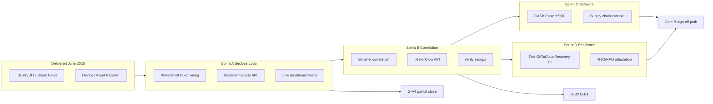

# Enterprise Security Architecture — Implementation Plan

**Purpose:** Executable plan to complete the seven-domain enterprise security map (five Zero Trust protection pillars + two operational engines) and close NIST CSF 2.0 Gate A/B remediation gaps.  
**Version:** 1.1  
**Date:** 18 June 2026  
**Owner:** ICT Governance / Security Engineering  
**Status:** Active — **not a certification or completion claim**

**Related documents:**

- [Improvement Focus Areas](../../compliance/ICT-Governance-Framework-Improvement-Focus-Areas.md)
- [NIST CSF 2.0 Compliance Review](../../compliance/NIST-CSF-2.0-Compliance-Review.md)
- [NIST CSF 2.0 Organisational Profile](../../compliance/NIST-CSF-2.0-Organisational-Profile.md)
- [Zero Trust Maturity Model](../../architecture/target-state/Zero-Trust-Maturity-Model.md)

---

## Executive summary

The framework’s June 2026 sprint delivered strong **Identity** and substantial **Devices** coverage (JIT/Break Glass, asset register). Three domains remain weak or unproven for audit:

| Gap | Domain | NIST CSF 2.0 | Gate |
|-----|--------|--------------|------|
| Missing 5th ZT pillar | **Data** (classification / DLP) | PR.DS | P3 / Focus Area 8 |
| Open-loop detection | **SecOps** (detect → ticket → resolve) | DE.*, RS.* | **G-A4, G-B2, G-B4** |
| Unmeasured recovery | **Resilience** (Git-to-cloud DR) | RC.RP | **G-B3** |
| Incomplete supply chain | **Software** (CASB / SBOM) | GV.SC | G-A3 |

**Engineering priority:** Complete the **active defense loop (SecOps)** first — highest gate leverage and builds on existing `POST /api/governance/incidents`. Then **Software supply chain persistence**, then **validated resilience**, then **Data/DLP** (backlog).

**Phase 3 readiness controls (Sprint A — implemented June 2026):**

| Control | Status | Evidence |
|---------|--------|----------|
| Event-driven FAIR on incident ingest | **Done** | `services/governance-incident-ingest.js` → `computeFairExposure({ triggerSource: 'incident' })` |
| Cross-domain `correlation_id` | **Done** | `governance_incidents`, ingest log, FAIR telemetry + calculation log |
| Incident ingest audit log | **Done** | `governance_incident_ingest_log` (raw_payload + processed_fields) |
| Full SLA definition (Ack + MTTR) | **Done** | `services/governance-sla.js`; env-tunable via `SLA_CRITICAL_*` |
| FAIR audit telemetry | **Done** | `fair_risk_telemetry_log`, `KPI-GOV-RISK-DELTA-24H` |
| CISO dashboard live ALE | **Done** | `CISOExecutiveDashboard.js` → `/api/governance/risk/exposure` |

**Verification:** `npm run verify:secops` (incident → ingest log → FAIR calc log) and `npm run verify:fair-risk` (19 tests). **Phase 3 evidence:** [Phase 3 Audit Evidence Pack](../../compliance/Phase-3-Audit-Evidence-Pack.md) + `npm run export:audit-evidence`.

**Sprint cadence:** Four two-week sprints (A–D), ~8 weeks total for core path. Sprint E (Data pillar) is backlog.

---

## The seven-domain enterprise security map

### Five protection pillars (Zero Trust)

| # | Pillar | System boundary | NIST primary | Current status | Target |
|---|--------|-----------------|--------------|----------------|--------|
| 1 | **Identity** | JIT elevation, Break Glass, RBAC | PR.AA, GV.RR | **Delivered** (June 2026) | Phase 3 validation |
| 2 | **Devices** | Multi-cloud asset register, DR posture | ID.AM | **Substantial** (G-B1) | Multi-cloud sync depth |
| 3 | **Software** | CASB catalog, SBOM, vulnerability gating | GV.SC | **Weak** (in-memory catalog) | PostgreSQL + console |
| 4 | **Network** | Segmentation, port exposure scanning | PR.PS | **Docs / IaC only** | Topology monitor (backlog) |
| 5 | **Data** | Purview / Macie classification, DLP | PR.DS | **IaC encryption only** | App-layer DLP ingest (backlog) |

### Two operational engines

| # | Engine | System boundary | NIST primary | Current status | Target |
|---|--------|-----------------|--------------|----------------|--------|
| 6 | **SecOps** | Sentinel correlation, auto-ticketing, IR workflow | DE.CM, DE.AE, RS.MA, RS.AN | **Partial** (ingest API; PowerShell stub) | Closed loop &lt; 5 min |
| 7 | **Resilience** | Git-to-cloud recovery orchestrator | RC.RP, RC.IM | **Partial** (script + DR fields) | Measured RTO/RPO in pipeline |

### Auditor-facing statement (when complete)

> Identity and devices are governed with ephemeral JIT authority and a live asset register. SecOps proves detect-to-ticket in under five minutes. Software supply chain and shadow IT are inventoried from live CASB feeds. Recovery is a measured engineering function with documented RTO/RPO — not a PDF-only plan.

---

## Dependencies and remediation gates



| Sprint | Closes (minimum) | Owner sign-off |
|--------|------------------|----------------|
| A | G-A4 (stub removed), G-A2 (substantial) | Engineering lead |
| B | G-B2, G-B4 | CISO + Engineering |
| C | G-A3 (substantial) | Compliance + Engineering |
| D | G-B3 | BC lead + Service Delivery |

---

## Sprint A — Close the detect → ticket loop (2 weeks)

**Focus Area:** 2 (Live detect & respond)  
**Gates:** G-A4, G-A2 (substantial — live executive metrics; Strategic Initiatives demo-only)  
**NIST:** DE.CM, RS.MA  
**Prerequisite:** `npm run setup:governance`, API running on `:4000`

### Objectives

1. Replace `Create-IncidentTicket` stub in PowerShell with live API calls.
2. Expose full incident lifecycle on the governance API.
3. Feed compliance / CISO views from real incident data (remove executive mock dependency where possible).

### Technical scope

| Component | Path | Action |
|-----------|------|--------|
| Incident stub | `azure-automation/Continuous-Compliance-Monitoring.ps1` L599–617 | Call `POST /api/governance/incidents` with `GOVERNANCE_WEBHOOK_SECRET` |
| Ingest API | `ict-governance-framework/api/governance-router.js` | Add `PATCH /incidents/:id` for status transitions |
| Schema | `ict-governance-framework/sql/governance.sql` | Optional: add `acknowledged_at`, `remediated_at`, `sla_breached` columns |
| Dashboard | `app/compliance-dashboard/page.js`, `ExecutiveDashboard.js` | Wire incident count / MTTR from `GET /api/governance/incidents` |
| Env | `.env.example` | Document `GOVERNANCE_API_URL`, `GOVERNANCE_WEBHOOK_SECRET` for automation |

### Incident lifecycle (target)

| Status | Meaning | SLA clock |
|--------|---------|-----------|
| `Detected` | Auto-created from monitoring or webhook | Starts |
| `Acknowledged` | Correlated to asset / assigned owner | &lt; 5 min for CRITICAL |
| `Remediating` | Playbook or human action in progress | — |
| `Resolved` | Control restored; `resolved_at` set | Stop |

### SLA targets (audit-facing — `services/governance-sla.js`)

| Severity | Detect → Ticket | Ticket → Ack | MTTR |
|----------|-----------------|--------------|------|
| **CRITICAL** | &lt; 5 min | &lt; 5 min | &lt; 60 min |
| HIGH | &lt; 15 min | &lt; 15 min | &lt; 4 h |
| MEDIUM | &lt; 1 h | &lt; 1 h | &lt; 24 h |
| LOW | &lt; 24 h | &lt; 24 h | &lt; 72 h |

`GET /api/governance/incidents` returns computed `time_to_acknowledge_ms`, `time_to_resolve_ms`, and `sla_*_breached` flags per row.

### Cross-system audit lineage (mandatory pattern)

Every automated outcome persists **input → transformation → output**:

| System | Table | Fields |
|--------|-------|--------|
| SecOps ingest | `governance_incident_ingest_log` | `raw_payload`, `processed_fields`, `correlation_id` |
| FAIR engine | `fair_risk_telemetry_log` | `driver`, `raw_value`, `multiplier_applied`, `correlation_id` |
| FAIR sweep | `fair_risk_calculation_log` | `ale_before_usd`, `ale_after_usd`, `trigger_source`, `incident_id` |
| DR (Sprint D) | TBD | `source_event`, `result_state`, `correlation_id` |
| CASB (Sprint C) | TBD | catalog change history |

Shared `correlation_id` (UUID) propagates: incident → FAIR recalc → telemetry drivers. Pass via `x-correlation-id` header or body `correlationId` on ingest.

### Sprint A checklist

#### Planning

- [ ] **A-P1** Sprint kickoff — confirm `GOVERNANCE_WEBHOOK_SECRET` in dev and test tenant
- [ ] **A-P2** Choose primary ticketing path for v1: **internal ledger** (PostgreSQL) with optional ServiceNow `external_ticket_id` field
- [ ] **A-P3** Define SLA: CRITICAL → ticket in DB within **5 minutes** of violation detect; Ack **&lt; 5 min**; MTTR **&lt; 60 min** (see `governance-sla.js`)

#### Backend

- [x] **A-B0** Event-driven FAIR recalculation on `POST /incidents` (`governance-incident-ingest.js`)
- [x] **A-B0a** `correlation_id` on incidents + `governance_incident_ingest_log`
- [x] **A-B0b** `fair_risk_calculation_log` — `ale_before` / `ale_after` per sweep
- [x] **A-B0c** SLA enrichment on `GET /incidents` (`time_to_acknowledge_ms`, `sla_mttr_breached`)
- [x] **A-B1** Implement `PATCH /api/governance/incidents/:incidentId` — body: `{ status, resolutionNotes? }`
- [x] **A-B2** Validate status enum: `Detected` → `Acknowledged` → `Remediating` → `Resolved`
- [x] **A-B3** Set `resolved_at` / `acknowledged_at` automatically on transition
- [x] **A-B3a** `incident_workflow_events` append-only log + FAIR on `Resolved` only
- [ ] **A-B4** Return `timeToAcknowledgeMs` / `timeToResolveMs` in `GET /api/governance/incidents` for dashboard widgets
- [ ] **A-B5** Migration script if new SLA columns added (`scripts/setup-incident-lifecycle.js`)

#### Automation

- [x] **A-A1** Add `Invoke-GovernanceIncidentApi` helper in `Continuous-Compliance-Monitoring.ps1`
- [x] **A-A2** Replace `Create-IncidentTicket` stub with REST `POST` to `/api/governance/incidents`
- [ ] **A-A3** Map violation severity → `CRITICAL|HIGH|MEDIUM|LOW` and drift taxonomy category
- [ ] **A-A4** Include `assetId` when violation references Azure resource ID (correlate via asset register)
- [ ] **A-A5** Log incident ID and round-trip latency to automation transcript

#### Frontend

- [ ] **A-F1** Compliance dashboard: incident summary card from live API (hide or zero when empty)
- [x] **A-F2** Executive dashboard: live ALE/incident trends, severity, compliance, risk drivers via `GET /api/governance/executive/metrics` (G-A2)
- [x] **A-F2** CISO dashboard: live SecOps KPIs, ALE/incident trends, risk drivers via `GET /api/governance/executive/metrics` (G-A2)
- [x] **A-F3** Strategic Initiatives widget labelled **Demo mode** (no PMO API); all risk/compliance charts live (G-A2)

#### Verification

- [ ] **A-V1** Add `ict-governance-framework/tests/secops-incident-loop.test.js`
- [x] **A-V1** `tests/secops-incident-loop.test.js` — correlation_id, ingest log, FAIR calc log
- [ ] **A-V2** Add `npm run verify:secops` — synthetic violation → POST → PATCH Resolved under 5 min (simulated clock)
- [x] **A-V2** `npm run verify:secops` — incident ingest → FAIR event trigger (12 assertions)
- [ ] **A-V3** Run `npm run verify:secops` in CI or document local gate command
- [ ] **A-V4** Manual: run `Continuous-Compliance-Monitoring.ps1` against test tenant; confirm row in `governance_incidents`

#### Documentation & gates

- [ ] **A-D1** Update [NIST CSF 2.0 Compliance Review](../../compliance/NIST-CSF-2.0-Compliance-Review.md) — HR-07 / G-A4 status
- [ ] **A-D2** Update Organisational Profile RS.MA evidence links
- [ ] **A-D3** Sprint A demo to Compliance Officer (evidence: test output + DB row screenshot)

### Sprint A exit criteria

- [x] Zero `# Add incident creation logic here` stub text in `Create-IncidentTicket`
- [ ] `npm run verify:secops` passes
- [ ] At least one dashboard chart uses live incident API data
- [ ] CRITICAL synthetic path completes in &lt; 5 minutes in test harness

---

## Sprint B — Adverse-event correlation & IR workflow (2 weeks)

**Focus Area:** 2 (continued)  
**Gates:** G-B2, G-B4  
**NIST:** DE.AE, RS.AN, RS.MI  
**Prerequisite:** Sprint A complete

### Objectives

1. Close Sentinel → drift taxonomy → asset register correlation path.
2. Deliver minimal IR workflow API (assign, escalate, link privileged actions).
3. Package Phase 3-ready evidence via `verify:secops` expansion.

### Technical scope

| Component | Action |
|-----------|--------|
| `governance-router.js` | Enhance `extractIncidentFields` for additional Sentinel entity shapes |
| New `api/incident-workflow-router.js` | `POST /assign`, `POST /escalate`, `GET /:id/timeline` |
| `privileged_action_logs` | Optional FK or query bridge from incident → JIT ticket |
| `app/secops-console/` (new) | Incident queue UI under Security nav (optional but recommended) |
| `Automated-Remediation-Framework.ps1` | Top 3 resource types — remove stub remediation paths |

### Sprint B checklist

#### Planning

- [ ] **B-P1** Document Sentinel webhook payload samples in `docs/implementation/guides/` (redacted)
- [ ] **B-P2** Map drift taxonomy categories to CSF DE.AE evidence matrix
- [ ] **B-P3** Define escalation path per RPAS-ESC for CRITICAL incidents

#### Backend — correlation

- [ ] **B-B1** Harden asset correlation: fuzzy match resource URI → `asset_register.asset_id`
- [ ] **B-B2** Auto-set status `Acknowledged` when asset correlation succeeds
- [ ] **B-B3** `GET /api/governance/incidents?severity=CRITICAL&status=Detected` for SOC queue
- [ ] **B-B4** Webhook auth: verify `x-governance-webhook-secret` on all ingest paths

#### Backend — IR workflow

- [ ] **B-B5** Create `incident_workflow_events` table (append-only): assign, escalate, comment, remediate
- [x] **B-B5a** Timeline enrichment: `risk_updated` events in `incident_workflow_events` + `GET /incidents/:id/timeline`
- [x] **B-B5b** MITRE ATT&CK enrichment at ingest + `fair_scenario_id` linkage (`mitre-enrichment.js`, `mitre_enrichment.sql`)
- [x] **B-B5c** Timeline `incident_detected` events include `mitre` block; root timeline response exposes `mitre` + `fair_scenario_id`
- [x] **B-B5d** `mitre_to_fair_mapping` table — tunable technique/tactic → scenario + `severity_weight`; FAIR sweep applies MITRE multiplier; `GET /mitre/mappings`
- [ ] **B-B6** `POST /api/governance/incidents/:id/assign` — `{ assigneeId, justification }`
- [ ] **B-B7** `POST /api/governance/incidents/:id/escalate` — RPAS-ESC metadata
- [ ] **B-B8** `GET /api/governance/incidents/:id/timeline` — incidents + workflow events + linked JIT actions

#### Automation

- [ ] **B-A1** Sentinel test webhook script (`scripts/send-test-sentinel-payload.js`)
- [ ] **B-A2** Complete remediation for **top 3** Azure resource types in `Automated-Remediation-Framework.ps1`
- [ ] **B-A3** End-to-end script: detect → ticket → acknowledge → resolve (PowerShell integration test)

#### Frontend (recommended)

- [x] **B-F1** Add `/secops-console` page — open incidents, SLA badge, link to asset register row
- [x] **B-F2** Header nav: Security → SecOps Console (+ Compliance menu)
- [ ] **B-F3** CISO dashboard: DE.AE widget — open critical count from live API

#### Verification

- [ ] **B-V1** Extend `verify:secops` — Sentinel-shaped payload → correlated asset → timeline
- [ ] **B-V2** `npm run verify:secops:correlation` (or flags on base command)
- [ ] **B-V3** Document measured p95 ingest latency in test output

#### Documentation & gates

- [ ] **B-D1** Update HR-08, HR-09 in NIST review
- [ ] **B-D2** Update G-B2, G-B4 gate table in Improvement Focus Areas
- [ ] **B-D3** CISO review of SecOps console for oversight (GV.OV)

### Sprint B exit criteria

- [ ] Sentinel test payload creates incident with asset correlation when `asset_id` exists
- [ ] IR timeline API returns assign + escalate events
- [ ] `verify:secops` correlation scenario passes
- [ ] No stub remediation path for top 3 resource types

---

## Sprint C — Software supply chain pillar (2 weeks)

**Focus Area:** 5 (Supply chain & application governance)  
**Gates:** G-A3 (substantial)  
**NIST:** GV.SC, Software ZT pillar  
**Prerequisite:** Sprint A complete (incidents link to shadow IT discoveries)

### Objectives

1. Persist CASB application catalog to PostgreSQL (remove in-memory mock).
2. Unify shadow IT discoveries with asset register (`asset_origin = CASB_Discovery`).
3. Deliver Supply Chain / Application governance console (extend asset register — do not duplicate inventory).

### Technical scope

| Component | Action |
|-----------|--------|
| `sql/casb_catalog.sql` (new) | `casb_applications`, `casb_app_risk_snapshots` |
| `api/casb-app-catalog.js` | Refactor to PostgreSQL pool |
| `services/compliance-validation-service.js` | Replace mock with live catalog queries |
| `app/supply-chain/` or asset register filter | Software pillar UI |
| CASB polling worker | Write through to persisted catalog |

### Sprint C checklist

#### Planning

- [ ] **C-P1** Schema design review — link `casb_applications.id` ↔ `asset_register.casb_source_id`
- [ ] **C-P2** Define GV.SC evidence fields: vendor, approval status, last risk score, data residency

#### Backend

- [ ] **C-B1** Create and apply `casb_catalog.sql` migration
- [ ] **C-B2** Refactor `casb-app-catalog.js` — CRUD against PostgreSQL
- [ ] **C-B3** CASB ingest webhook writes to catalog **and** asset register (existing path)
- [ ] **C-B4** Replace mock compliance validation with catalog + policy rule queries
- [ ] **C-B5** `GET /api/casb/supply-chain/summary` — counts by risk tier for dashboard

#### Frontend

- [ ] **C-F1** Supply chain view: filter asset register by `CASB_Discovery` + unverified posture
- [ ] **C-F2** Or dedicated `/supply-chain` console with vendor risk table
- [ ] **C-F3** Compliance dashboard: live supply chain widget (replaces mock if present)

#### Verification

- [ ] **C-V1** `npm run verify:casb-catalog` — ingest → persist → query → asset link
- [ ] **C-V2** Re-run `npm run verify:casb-ingest` against persisted catalog
- [ ] **C-V3** No `in-memory` / sample-only catalog path in production code path

#### Documentation & gates

- [ ] **C-D1** Update HR-02, G-A3 in NIST review
- [ ] **C-D2** Update Organisational Profile GV.SC section
- [ ] **C-D3** Reconcile A034 GV.SC mappings (G-A1 partial)

### Sprint C exit criteria

- [ ] CASB catalog survives API restart (PostgreSQL backed)
- [ ] Shadow IT app appears in both catalog and asset register
- [ ] `verify:casb-catalog` passes
- [ ] Compliance validation service has no mock return path in production

---

## Sprint D — Resilience & measured recovery (2 weeks)

**Focus Area:** 6 (Validated business continuity)  
**Gates:** G-B3  
**NIST:** RC.RP, RC.IM  
**Prerequisite:** Asset register DR fields (delivered); Sprint A recommended for incident logging during DR test

### Objectives

1. Execute `Test-GitToCloudRecovery.ps1` as a repeatable pipeline step.
2. Record measured RTO/RPO in asset register and attestation artefact.
3. Prove recovery is engineering function with cryptographic baseline verification.

### Technical scope

| Component | Path |
|-----------|------|
| DR orchestrator | `governance/rpas/scripts/Test-GitToCloudRecovery.ps1` |
| CI workflow | `.github/workflows/dr-recovery-validation.yml` (new, quarterly + manual) |
| Asset DR fields | `asset_register.last_dr_drill_timestamp`, `rto_seconds`, `rpo_flag_triggered` |
| Attestation | `generated-documents/` or `governance/rpas/status/dr-attestation-*.json` |

### Sprint D checklist

#### Planning

- [ ] **D-P1** Isolate test tenant / subscription for DR exercise
- [ ] **D-P2** Define pass/fail: RTO ≤ 4 h, RPO ≤ 1 h (per NFR docs)
- [ ] **D-P3** Schedule quarterly run + on-demand workflow_dispatch

#### Execution

- [ ] **D-E1** Run `Test-GitToCloudRecovery.ps1 -CsrId CSR-42 -TenantId tenant-01` — capture full log
- [ ] **D-E2** Record start/end timestamps; compute RTO
- [ ] **D-E3** Patch asset register DR status via API (`DR_Hydrated` or `Failed_Validation`)
- [ ] **D-E4** Update measurement-plan KPI if drill succeeds (`KPI-GOV-AUTOMATION-TARGET` or DR-specific metric)

#### Automation

- [ ] **D-A1** Add GitHub Actions workflow `dr-recovery-validation.yml`
- [ ] **D-A2** Workflow uploads attestation JSON as artefact
- [ ] **D-A3** Fail workflow if RTO/RPO thresholds exceeded
- [ ] **D-A4** Add `npm run verify:dr-recovery` wrapper invoking PowerShell script in smoke mode

#### Verification

- [ ] **D-V1** At least one successful attestation JSON in repo or CI artefact store
- [ ] **D-V2** Asset register shows updated drill timestamp for test assets
- [ ] **D-V3** `npm run verify:dr-recovery` documented in root README

#### Documentation & gates

- [ ] **D-D1** Update HR-12, G-B3 in NIST review
- [ ] **D-D2** Update Organisational Profile RC.RP section with measured values
- [ ] **D-D3** BC service tier materials reference attestation template only after D-V1

### Sprint D exit criteria

- [ ] One documented DR test with measured RTO/RPO
- [ ] CI or scheduled workflow exists for re-run
- [ ] G-B3 marked substantial pending Service Delivery sign-off

---

## Sprint E — Data pillar backlog (deferred, P3)

**Focus Area:** 8 (Security awareness & data protection depth)  
**NIST:** PR.DS  
**Gate:** None for Phase 3 — schedule after Sprints A–D

### Scope (high level)

- [ ] **E-1** Microsoft Purview / AWS Macie classification ingest webhook
- [ ] **E-2** `data_classification` table linked to tenant and asset
- [ ] **E-3** DLP violation events → `POST /api/governance/incidents` (reuse SecOps loop)
- [ ] **E-4** Data security console — classified assets, boundary violations
- [ ] **E-5** `verify:data-protection` harness

**Start Sprint E only after:** Sprint A SecOps loop proven (DLP events need a ticket target).

---

## Network pillar backlog (deferred)

| Item | Notes |
|------|-------|
| Network topology monitor | Requires authoritative asset + software inventory first |
| Micro-segmentation posture API | Integrate after Sprint C |
| Continuous port scanning | Azure Policy / Defender export → asset register enrichment |

---

## Master sprint checklist (program level)

Use this table for steering committee / bi-weekly reviews.

| ID | Milestone | Sprint | Target date | Status |
|----|-----------|--------|-------------|--------|
| M1 | SecOps stub removed; `verify:secops` green | A | Week 2 | ☐ |
| M2 | Live incident data on compliance/executive dashboard | A | Week 2 | ☐ |
| M3 | Sentinel correlation + IR timeline API | B | Week 4 | ☐ |
| M4 | SecOps console shipped | B | Week 4 | ☐ |
| M5 | CASB catalog PostgreSQL + supply chain view | C | Week 6 | ☐ |
| M6 | DR test attestation with RTO/RPO | D | Week 8 | ☐ |
| M7 | Gate A items G-A2–G-A4 substantially closed | A–C | Week 6 | ☐ |
| M8 | Gate B items G-B2–G-B4 substantially closed | B | Week 4 | ☐ |
| M9 | Gate B item G-B3 substantially closed | D | Week 8 | ☐ |
| M10 | Compliance Officer Gate A readiness review | Post-A–C | Week 7 | ☐ |
| M11 | Service Delivery Gate B readiness review | Post-D | Week 9 | ☐ |

---

## Verification commands (cumulative)

Run from `ict-governance-framework/` after database setup:

```bash
# Existing (June 2026 baseline)
npm run verify:jit
npm run verify:break-glass
npm run verify:assets
npm run setup:governance

# Sprint A+
npm run verify:secops              # planned — incident loop < 5 min

# Sprint B+
npm run verify:secops:correlation    # planned — Sentinel + asset bind

# Sprint C+
npm run verify:casb-catalog        # planned — persisted catalog

# Sprint D+
npm run verify:dr-recovery         # planned — smoke DR orchestrator
```

---

## Roles and RACI (sprints A–D)

| Activity | Engineering | SecOps / Azure auto | Compliance | CISO | Service Delivery |
|----------|-------------|---------------------|------------|------|------------------|
| API & schema | **R** | C | I | I | I |
| PowerShell automation | C | **R** | I | C | I |
| Dashboard / console UI | **R** | I | C | C | I |
| Sprint verification scripts | **R** | C | I | I | I |
| Gate evidence pack | C | C | **R** | **A** | **A** (Gate B) |
| NIST doc updates | C | I | **R** | A | I |

*R = Responsible, A = Accountable, C = Consulted, I = Informed*

---

## Risk register (implementation)

| Risk | Mitigation |
|------|------------|
| ServiceNow integration delays Sprint A | v1 uses internal PostgreSQL ledger; `external_ticket_id` reserved |
| Sentinel webhook shape drift | `extractIncidentFields` + fixture tests in `verify:secops` |
| Executive dashboard still mock after Sprint A | Explicit Demo Mode labels until Sprint B CISO widgets live |
| DR test impacts shared dev tenant | Isolated subscription; smoke mode for CI |
| Scope creep into Network/DLP | Sprint E and Network backlog frozen until M6 complete |
| Static FAIR parameters drift from reality | Phase 4 calibration loop (`fair_model_calibration_log`, `npm run verify:calibration`) |

---

## Phase 4 — FAIR model calibration (post G-A2)

**Focus:** Adaptive risk model (GV.RM)  
**Prerequisite:** G-A2 closed, MITRE → FAIR mapping live

### Objectives

1. Observe incident frequency vs FAIR baseline TEF per scenario.
2. Apply damped calibration factors with full audit trail.
3. Optionally tune MITRE `severity_weight` from observed technique frequency.

### Deliverables

| Component | Path |
|-----------|------|
| Schema | `sql/fair_model_calibration.sql` — `tef_calibration_factor`, `fair_model_calibration_log` |
| Service | `services/fair-risk-calibration.js` |
| API | `GET /api/governance/risk/calibration`, `GET .../calibration/log`, `POST .../calibrate` |
| FAIR engine | `computeScenarioAle` applies `tef_calibration_factor` |
| Verification | `npm run verify:calibration` (11 assertions) |

### Checklist

- [x] **P4-B1** Calibration schema + audit log table
- [x] **P4-B2** Observed vs expected frequency algorithm (damped learning rate)
- [x] **P4-B3** MITRE severity_weight auto-tuning (optional pass)
- [x] **P4-B4** API endpoints + post-calibration FAIR sweep
- [x] **P4-V1** `npm run verify:calibration` passes
- [x] **P4-F1** CISO dashboard: calibration status widget (last run, drift, stability, MITRE confidence)
- [x] **P4-D1** Phase 3 audit evidence export includes `calibration` block + SEC-A8 checks
- [x] **P4-P1** Board-ready CISO dashboard: risk posture, board summary, driver labels, drill-downs
- [x] **P4-G1** Calibration governance: approval thresholds, locks, rollback, API + dashboard pending indicator

---

## References

- `azure-automation/Continuous-Compliance-Monitoring.ps1` — incident stub L599–617
- `ict-governance-framework/api/governance-router.js` — incident ingest
- `ict-governance-framework/sql/governance.sql` — `governance_incidents` schema
- `governance/rpas/scripts/Test-GitToCloudRecovery.ps1` — G-B3 orchestrator
- [Real-Time Monitoring Implementation Summary](../summaries/Real-Time-Monitoring-Implementation-Summary.md)

---

| | |
|---|---|
| **Certification** | This plan does **not** constitute NIST CSF 2.0 certification |
| **Next action** | Begin **Sprint A** — assign owner and target start date |
| **Tracking** | Update gate tables in [Improvement Focus Areas](../../compliance/ICT-Governance-Framework-Improvement-Focus-Areas.md) at each sprint close |
