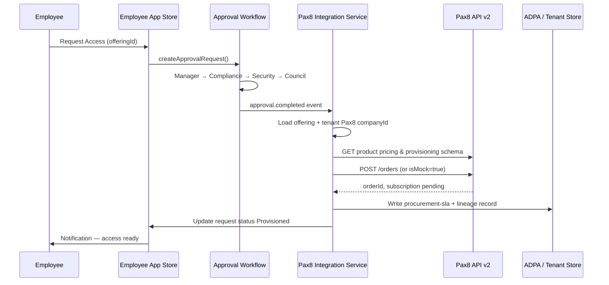
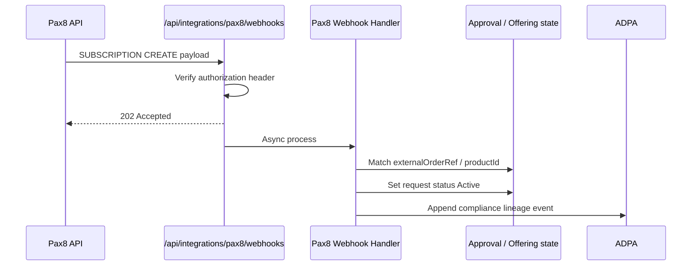

# Pax8 Employee Store Mapping — Integration Design

**Document ID:** INT-PAX8-STORE-001  
**Version:** 1.0.0  
**Date:** June 2026  
**Status:** Design — not implemented  
**Audience:** Architecture, procurement, MSP delivery, development

> Pax8 is **not integrated** in the repository today. This guide defines how Pax8 Marketplace / Storefront maps to the ICT Governance Framework employee store, vendor registry, and marketplace offerings — including the **Request Access approved → Pax8 order** flow.

**Related:**

- [Employee ICT Self-Service Application Procurement](Employee-ICT-Self-Service-Application-Procurement-Implementation-Guide.md)
- [Centralized Application Procurement Policy](../../policies/governance/Centralized-Application-Procurement-Registration-Policy.md)
- [ISO Software pillar crosswalk](../../compliance/ISO/crosswalks/ISO-27001-Seven-Pillar-Crosswalk.md)
- Pax8 developer docs: [Ordering](https://devx.pax8.com/docs/ordering-details) · [Webhooks](https://devx.pax8.com/docs/how-to-use-webhook-apis) · [Subscription webhooks](https://devx.pax8.com/docs/provision-notification)

---

## 1. Executive summary

The framework exposes software through **three tiers**:

| Tier | Route | Employee action | Pax8 surface |
|------|-------|-----------------|--------------|
| **A — Pre-approved** | `/employee-app-store` | **Install Now** | Client Storefront core bundle |
| **B — Catalog + gate** | `/employee-app-store` | **Request Access** | Client Storefront extended catalog |
| **C — Net-new** | `/application-procurement` | Procurement wizard | Pax8 Marketplace + Public Storefront leads |

**Pax8 fulfills licenses** after governance gates pass. **This platform owns governance** (vendor onboarding, compliance scores, approval workflow, ADPA lineage). Do not expose Pax8 self-serve purchase for Tier B SKUs without an internal approval record — that would bypass `requiresApproval`.

---

## 2. Three-tier product matrix

### Tier A — Pre-approved (Install Now)

**Framework rules:** `isApproved: true`, `requiresApproval: false`, vendor `status: active`, offering `status: published`.

| Framework app (mock) | Offering ID | Pax8 category | Example Pax8 products | Employee UX |
|----------------------|-------------|---------------|----------------------|-------------|
| Microsoft Office 365 | `off-microsoft-office365` | Productivity | Microsoft 365 Business Standard/Premium | Install Now |
| (baseline) | — | Communications | Teams (included in M365) | Included |
| (baseline) | — | Continuity | OneDrive (included in M365) | Included |
| Azure Conditional Access | `ms-ca-policy` | Security / Identity | Entra ID / Conditional Access (org policy) | Auto / IT-provisioned |

**Pax8 curation:** Single **Storefront Bundle 1** — org-wide baseline only. Optional mandated Defender baseline if policy requires it (security pillar, not employee choice).

---

### Tier B — Catalog + approval (Request Access)

**Framework rules:** `isApproved: true`, `requiresApproval: true`, vendor `active`, offering `published`.

| Framework app (mock) | Vendor ID | Pax8 category | Example Pax8 products | Employee UX |
|----------------------|-----------|---------------|----------------------|-------------|
| Slack | `vendor-slack` | Communications | Slack (if partner carries) | Request Access |
| Adobe Creative Cloud | `vendor-adobe` | Productivity | Adobe CC | Request Access |
| Salesforce | `vendor-salesforce` | Sales & marketing | Salesforce editions | Request Access |
| Zoom | `vendor-zoom` | Communications | Zoom | Request Access |
| — | `vendor-microsoft` | Productivity | Power BI, Power Apps | Request Access |
| — | `vendor-microsoft` | Security | Defender Suite, Purview Suite add-ons | Request Access |

**Pax8 curation:** **Storefront Bundle 2** — visible in employee catalog; **purchase disabled** in Pax8 UI or orders only triggered by this platform after approval.

**Live repo note:** Only `vendor-microsoft` is `active` in `data/vendor-registry.json`. Slack, Adobe, Salesforce, Zoom remain `onboarding` — they are filtered out of the employee store when the vendor API is used.

---

### Tier C — Net-new (Application procurement)

**Framework rules:** Application not in employee catalog; `/application-procurement` + `ProcurementWizard`; vendor must reach `active` before submission.

| Framework example (mock) | Pax8 source | Outcome |
|--------------------------|-------------|---------|
| Figma | Marketplace browse | Approve → onboard vendor → publish offering → Tier B |
| Notion | Marketplace browse | Same |
| Jira | Marketplace browse | Same |
| (unknown SaaS) | Public Storefront lead | Lead → procurement ticket → Tier C |

**Pax8 curation:** Full Marketplace, Opportunity Explorer, Custom Products, Integrations Hub. Not employee-facing until promoted to Tier A/B.

---

## 3. Pax8 Storefront vs framework surfaces

| Pax8 surface | Buying model | Maps to framework |
|--------------|--------------|-------------------|
| **Client Storefront** (private) | Self-serve for curated SKUs (partner-controlled) | Tier A (+ controlled Tier B after approval) |
| **Public Storefront** | View-only + contact form → lead | Tier C intake (not employee store) |
| **Marketplace** (partner admin) | Quote, order, bundle, provision | Procurement + catalog sync source |

| Capability | Pax8 | Framework |
|------------|------|-----------|
| License commerce & billing | ✅ | ❌ (by design) |
| Multi-vendor catalog | ✅ | Partial (`marketplace-offerings.json`) |
| Compliance / CASB scores | ❌ | ✅ |
| Multi-step approval workflow | ❌ | ✅ |
| Vendor onboarding checklist | Partner process | ✅ `vendor-registry-service` |
| ISO / control lineage | ❌ | ✅ ADPA + compliance escalations |

---

## 4. Field mapping — Pax8 → `vendor-registry`

**Target file:** `ict-governance-framework/data/vendor-registry.json`  
**Service:** `ict-governance-framework/services/vendor-registry-service.js`

### 4.1 Current vendor schema

```json
{
  "vendorId": "vendor-microsoft",
  "displayName": "Microsoft Corporation",
  "legalName": "Microsoft Corporation",
  "website": "https://www.microsoft.com",
  "contact": { "email": "vendor-security@microsoft.com" },
  "status": "active | onboarding",
  "onboarding": {
    "checklist": [ { "stepId": "...", "label": "...", "required": true } ],
    "completedStepIds": [],
    "completedAt": null,
    "completedBy": null
  },
  "createdAt": "...",
  "createdBy": "system"
}
```

### 4.2 Pax8 → vendor-registry mapping

| Pax8 source | Pax8 field (conceptual) | Framework field | Transform / notes |
|-------------|-------------------------|-----------------|-------------------|
| Vendor catalog | `vendor.id` (UUID) | `pax8.vendorId` *(proposed)* | Store Pax8 UUID; keep `vendorId` as stable internal slug |
| Vendor catalog | `vendor.name` | `displayName` | e.g. `Microsoft` |
| Vendor catalog | Legal entity name | `legalName` | From Pax8 vendor detail if available |
| Vendor catalog | Vendor website | `website` | |
| Vendor / partner contacts | Security or support email | `contact.email` | |
| Partner relationship | Vendor available in partner catalog | `onboarding.completedStepIds` includes `catalog-approved` | Auto-complete when synced from Pax8 |
| Internal governance | Security attestation on file | `security-attestation` step | Manual or CASB-linked |
| Internal governance | DPA reviewed | `data-processing` step | Legal workflow |
| Internal governance | SLA agreed | `support-sla` step | Links to procurement SLA service |
| Derived | All required steps complete | `status: active` | `completeVendorOnboardingStep()` |

### 4.3 Proposed extension block (integration design)

Add to each vendor record when Pax8 sync is enabled:

```json
{
  "integrations": {
    "pax8": {
      "vendorUuid": "d6489ab3-3e13-4fe1-84ac-08d4d8c4b802",
      "lastSyncedAt": "2026-06-23T00:00:00.000Z",
      "syncSource": "pax8-marketplace",
      "storefrontSegmentIds": ["segment-contoso-health"]
    }
  }
}
```

| Proposed field | Purpose |
|----------------|---------|
| `integrations.pax8.vendorUuid` | Pax8 vendor UUID for webhook filters and catalog API |
| `integrations.pax8.storefrontSegmentIds` | Client Storefront segments (industry / tenant) |
| `integrations.pax8.lastSyncedAt` | Drift detection vs Pax8 catalog |

---

## 5. Field mapping — Pax8 → `marketplace-offerings`

**Target file:** `ict-governance-framework/data/marketplace-offerings.json`  
**Service:** `ict-governance-framework/services/marketplace-offering-service.js`

### 5.1 Current offering schema

```json
{
  "offeringId": "off-microsoft-office365",
  "name": "Microsoft Office 365",
  "vendorId": "vendor-microsoft",
  "category": "productivity",
  "status": "draft | published",
  "governanceMapping": {
    "supportedControls": [],
    "limitations": []
  },
  "createdAt": "...",
  "createdBy": "system"
}
```

### 5.2 Pax8 → marketplace-offerings mapping

| Pax8 source | Pax8 field | Framework field | Transform / notes |
|-------------|------------|-----------------|-------------------|
| Product catalog | `product.id` (UUID) | `integrations.pax8.productId` *(proposed)* | Required for `POST /orders` |
| Product catalog | `product.name` | `name` | |
| Product catalog | Vendor UUID | `vendorId` | Resolve via `integrations.pax8.vendorUuid` → internal `vendorId` |
| Product catalog | Category / subcategory | `category` | Map Pax8 → framework: `productivity`, `identity`, `communication`, `design`, `crm`, `security` |
| Storefront curation | On Client Storefront? | `status` | On storefront + governance OK → `published` |
| Storefront curation | Bundle tier | `employeeStore.tier` *(proposed)* | `A` (Install Now) or `B` (Request Access) |
| Pricing API | `billingTerm` options | `integrations.pax8.billingTerms` *(proposed)* | `Monthly`, `Annual`, etc. |
| Pricing API | Unit price | `integrations.pax8.unitPriceHint` *(proposed)* | Display only; fetch at order time |
| Dependencies API | Parent product required | `integrations.pax8.dependencies` *(proposed)* | e.g. M365 prerequisite |
| Provisioning schema | Required provisioning fields | `integrations.pax8.provisioningSchema` *(proposed)* | Collect before order |
| Governance | CASB / compliance score | `governanceMapping.supportedControls` | Link to monitoring rules |
| Governance | ISO / NIST impact | `governanceMapping.limitations` | From compliance lineage |
| Employee store | Pre-approved flag | `employeeStore.requiresApproval` *(proposed)* | `false` = Tier A, `true` = Tier B |

### 5.3 Proposed `employeeStore` block

```json
{
  "offeringId": "off-microsoft-office365",
  "name": "Microsoft Office 365",
  "vendorId": "vendor-microsoft",
  "category": "productivity",
  "status": "published",
  "employeeStore": {
    "visible": true,
    "tier": "A",
    "requiresApproval": false,
    "installAction": "provision",
    "complianceMinimumScore": 80
  },
  "integrations": {
    "pax8": {
      "productId": "3fa85f64-5717-4562-b3fc-2c963f66afa6",
      "sku": "M365_BUSINESS_STANDARD",
      "defaultBillingTerm": "Monthly",
      "defaultQuantity": 1,
      "provisioningDetailsTemplate": {}
    }
  },
  "governanceMapping": {
    "supportedControls": ["identity-mfa-enforcement"],
    "limitations": []
  }
}
```

### 5.4 Pax8 category → framework `category`

| Pax8 marketplace category | Framework `category` |
|---------------------------|---------------------|
| Productivity | `productivity` |
| Communications | `communication` |
| Security and continuity | `security` |
| Infrastructure | `infrastructure` |
| Networking | `network` |
| Operations | `operations` |
| Human Resources | `hr` |
| Sales and marketing | `crm` |
| Engineering and development | `development` |
| Accounting and finance | `finance` |
| Legal | `legal` |
| Industry-specific | `industry` |

---

## 6. Field mapping — employee app catalog (UI layer)

**UI:** `ict-governance-framework/app/employee-app-store/page.js`  
**API:** `ict-governance-framework/api/employee-app-store-api.js`

Today the UI uses **mock** `applications[]`. Target state: **merge** vendor registry + marketplace offerings + compliance scores.

| UI field | Source (target) | Notes |
|----------|-----------------|-------|
| `id` | `offeringId` | e.g. `off-microsoft-office365` |
| `name` | `offerings.name` | |
| `vendorId` | `offerings.vendorId` | |
| `category` | `offerings.category` | Title-case for display |
| `isApproved` | `offerings.status === 'published'` && vendor `active` | |
| `requiresApproval` | `employeeStore.requiresApproval` | |
| `complianceScore` | CASB / `compliance-validation-service` | |
| `cloudAppSecurityScore` | Defender for Cloud Apps | |
| `installationType` | Derived from Pax8 product type | Cloud / Desktop |
| Install vs Request button | `requiresApproval` + vendor `active` | See §2 |

**Procurement requests** (`employee-app-store-api.js` `createApprovalRequest`):

| Approval request field | Pax8 order field |
|----------------------|------------------|
| `applicationId` | Resolve → `integrations.pax8.productId` |
| `estimatedUsers` | `lineItems[].quantity` |
| `userId` | Map → `orderedByUserEmail` (requester) |
| `department` | Store in order metadata / ADPA tenant record |
| `id` (requestId) | `externalOrderRef` / idempotency key *(proposed)* |
| Tenant | Map → Pax8 `companyId` *(per-tenant binding)* |

---

## 7. Webhook and API flow — Request Access approved → Pax8 subscription

### 7.1 Design principles

1. **Governance first** — Pax8 order only after final approval step in framework workflow.
2. **Idempotent orders** — use `requestId` as idempotency key; never double-provision.
3. **Acknowledge fast** — return HTTP 200/201/202 to Pax8 inbound webhooks before heavy work ([Pax8 provision notification guidance](https://devx.pax8.com/docs/provision-notification)).
4. **Mock in non-prod** — use Pax8 `?isMock=true` on order creation in test environments.

### 7.2 Outbound flow (framework → Pax8)

Triggered when approval workflow reaches **Final Approval** (or policy-defined step) for a Tier B request.



### 7.3 Outbound API sketch

**Service (proposed):** `ict-governance-framework/services/pax8-integration-service.js`

```javascript
// Pseudocode — not implemented
async function fulfillApprovedAccessRequest(approvalRequest) {
  const offering = marketplaceOfferings.getOffering(approvalRequest.applicationId);
  const pax8 = offering.integrations?.pax8;
  if (!pax8?.productId) throw new Error('Offering not Pax8-linked');

  const tenant = await resolveTenant(approvalRequest.tenantId);
  const companyId = tenant.integrations.pax8.companyId;
  if (!companyId) throw new Error('Tenant missing Pax8 companyId');

  const quantity = approvalRequest.estimatedUsers || 1;
  const billingTerm = pax8.defaultBillingTerm || 'Monthly';

  const orderPayload = {
    companyId,
    orderedBy: 'Pax8 Partner',
    orderedByUserEmail: approvalRequest.requesterEmail,
    lineItems: [{
      productId: pax8.productId,
      lineItemNumber: 1,
      quantity,
      billingTerm,
      provisioningDetails: buildProvisioningDetails(pax8, approvalRequest)
    }]
  };

  const mock = process.env.PAX8_ORDER_MOCK === 'true';
  const order = await pax8Client.createOrder(orderPayload, { isMock: mock });

  await recordFulfillment({
    requestId: approvalRequest.id,
    pax8OrderId: order.id,
    status: mock ? 'mock-provisioned' : 'ordered'
  });

  return order;
}
```

**Prerequisites (per [Ordering Products](https://devx.pax8.com/docs/ordering-details)):**

| Step | Action |
|------|--------|
| 1 | Tenant has active Pax8 **company** (`companyId`) with Admin, Billing, Technical contacts |
| 2 | Product `productId` synced to offering |
| 3 | Fetch current **pricing** and **dependencies** immediately before order |
| 4 | Collect **provisioningDetails** if product requires them |
| 5 | Submit `POST /orders` (Bearer token from partner API credentials) |

### 7.4 Tier A — Install Now (optional automation)

Tier A may use the **same order API** with `quantity: 1` and auto-approval, or rely on existing enterprise agreement seats (no incremental Pax8 order). Policy decision:

| Model | When to use |
|-------|-------------|
| **EA / existing subscription** | Assign license in Entra — no Pax8 order |
| **Per-seat Pax8** | `Install Now` → auto `POST /orders` with pre-approved template |
| **Hybrid** | M365 via EA; add-ons via Tier B workflow |

### 7.5 Inbound flow (Pax8 → framework)

Subscribe to Pax8 **SUBSCRIPTION** webhooks to reconcile provisioned state.

**Webhook registration (partner):** `POST https://api.pax8.com/api/v2/webhooks`

```json
{
  "displayName": "ICT Governance — subscription lifecycle",
  "url": "https://{your-api-host}/api/integrations/pax8/webhooks",
  "active": true,
  "webhookTopics": [{
    "topic": "SUBSCRIPTION",
    "filters": [{ "action": "CREATE", "conditions": [] }]
  }]
}
```



| Inbound event | Framework action |
|---------------|------------------|
| `SUBSCRIPTION` CREATE | Mark procurement request **Active**; notify employee |
| `SUBSCRIPTION` UPDATE | Sync seat quantity vs `estimatedUsers` |
| `SUBSCRIPTION` CANCEL | Trigger offboarding / CASB deprovision workflow |
| Provision notification (vendor products) | Only if CBA acts as Pax8 provisioner — typically N/A for MSP buying Microsoft/Slack |

### 7.6 Proposed API routes

| Method | Route | Purpose |
|--------|-------|---------|
| `POST` | `/api/integrations/pax8/webhooks` | Inbound Pax8 subscription / order events |
| `POST` | `/api/integrations/pax8/sync/vendors` | Pull Pax8 vendor catalog → vendor-registry |
| `POST` | `/api/integrations/pax8/sync/products` | Pull products → marketplace-offerings |
| `POST` | `/api/procurement/requests/:id/fulfill` | Manual retry — approved → Pax8 order |
| `GET` | `/api/procurement/requests/:id/pax8-status` | Order + subscription status |

---

## 8. Tenant binding (per client / ADPA tenant)

Each ADPA tenant (e.g. `tenant-contoso-health`) needs Pax8 company context:

```json
{
  "tenantId": "tenant-contoso-health",
  "integrations": {
    "pax8": {
      "companyId": "uuid-contoso-in-pax8",
      "companyStatus": "Active",
      "storefrontUrl": "https://store.partner.com/contoso",
      "defaultBillingTerm": "Monthly"
    }
  }
}
```

| Field | Source |
|-------|--------|
| `companyId` | Pax8 Companies API — create or import per client |
| `companyStatus` | Must be **Active** before orders ([ordering docs](https://devx.pax8.com/docs/ordering-details)) |
| `storefrontUrl` | Partner Client Storefront segment link |

---

## 9. Environment variables (proposed)

| Variable | Purpose |
|----------|---------|
| `PAX8_API_BASE_URL` | `https://api.pax8.com` |
| `PAX8_CLIENT_ID` | OAuth client (partner API) |
| `PAX8_CLIENT_SECRET` | OAuth secret |
| `PAX8_WEBHOOK_AUTH_HEADER` | Expected header name from Pax8 webhook config |
| `PAX8_WEBHOOK_SHARED_SECRET` | Validate inbound webhooks |
| `PAX8_ORDER_MOCK` | `true` — use `isMock=true` on orders in dev |
| `PAX8_DEFAULT_ORDERED_BY_EMAIL` | Fallback for `orderedByUserEmail` |

Store secrets in `.env` (local) / Key Vault (production). **Do not commit** credentials.

---

## 10. Implementation phases

| Phase | Deliverable | Tier |
|-------|-------------|------|
| **P1** | Extend vendor/offering JSON schema with `integrations.pax8` + `employeeStore` | Schema |
| **P2** | Catalog sync job (Pax8 products → `marketplace-offerings.json`) | B, C |
| **P3** | Replace employee store mock with offerings API + vendor filter | A, B |
| **P4** | Approval workflow persistence + `fulfillApprovedAccessRequest()` | B |
| **P5** | Inbound SUBSCRIPTION webhook + status reconciliation | B |
| **P6** | Tier A policy (EA vs auto-order) + Entra license assignment | A |
| **P7** | Procurement wizard → net-new → Pax8 catalog search | C |

**Gate alignment:** Complete [Improvement Focus Areas](../../compliance/ICT-Governance-Framework-Improvement-Focus-Areas.md) **G-A3** (production vendor catalog) before client-facing Pax8 fulfillment claims.

---

## 11. Security and compliance

| Risk | Mitigation |
|------|------------|
| Pax8 self-serve bypasses approval | Disable direct purchase on Tier B SKUs; orders only via integration service |
| Webhook spoofing | Validate Pax8 `sharedSecret` header; IP allowlist if available |
| Duplicate provisioning | Idempotency on `requestId`; store `pax8OrderId` |
| Shadow IT | CASB ingest still authoritative; store is not the only control |
| Audit | Log orders to ADPA `procurement-slas/` + compliance lineage |

---

## 12. Storefront bundle recommendation (CBA / MSP)

| Bundle | Pax8 Storefront | Framework tier | Example SKUs |
|--------|-----------------|----------------|--------------|
| **Bundle 1 — Baseline** | Client Storefront (auto-provision segment) | Tier A | M365 Business Standard, Teams, mandated Defender |
| **Bundle 2 — Department** | Client Storefront (browse; order gated) | Tier B | Slack, Zoom, Adobe, Power BI, Salesforce |
| **Bundle 3 — Catalogue** | Marketplace only (procurement) | Tier C | All other Pax8 products |
| **Public** | Public Storefront | Lead → Tier C | Prospects; not employee self-serve |

---

## 13. Related code (current)

| Asset | Path |
|-------|------|
| Vendor registry | `ict-governance-framework/services/vendor-registry-service.js` |
| Marketplace offerings | `ict-governance-framework/services/marketplace-offering-service.js` |
| Employee store UI | `ict-governance-framework/app/employee-app-store/page.js` |
| Approval API (mock) | `ict-governance-framework/api/employee-app-store-api.js` |
| Procurement UI | `ict-governance-framework/app/application-procurement/page.js` |
| Procurement SLA | `ict-governance-framework/services/compliance-procurement-sla-service.js` |
| Vendor API | `ict-governance-framework/api/vendor-registry-router.js` |
| Offerings API | `ict-governance-framework/api/marketplace-offerings-router.js` |

---

**Last updated:** June 2026  
**Next review:** When Pax8 integration Phase P1 starts or Pax8 Agent Store launches (Summer 2026)
