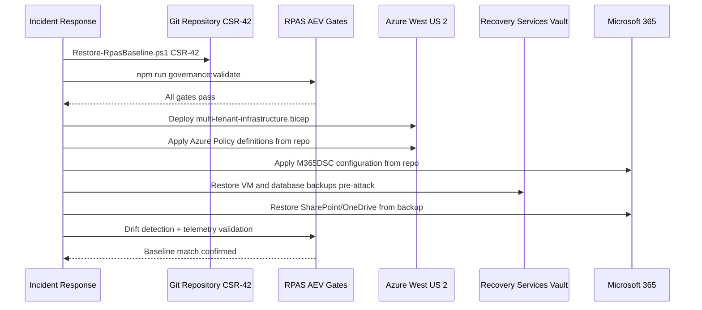

# Example: Ransomware Attack and Full State Recovery

This walkthrough illustrates how **Business Continuity Services** and the **RPAS Rollback & Recovery Service** respond to a ransomware incident — from detection through full ICT estate recovery from Git, with governed content continuation.

## Scenario overview

| Field | Value |
|-------|-------|
| **Client** | Contoso Health — Enterprise Healthcare tenant |
| **Classification** | Government/Healthcare — GDPR, HIPAA, ISO 27001 |
| **Service tier** | Premium (geo-redundant, RTO ≤ 4 h, RPO ≤ 1 h) |
| **Last certified baseline** | CSR-42 (RPAS v2.3.0) |
| **Primary region** | Azure East US |
| **Recovery region** | Azure West US 2 |
| **Source of truth** | Git repository (this framework) |

## Pre-incident state (normal operations)

Before the attack, Contoso Health operates at **Stage 4** continuity maturity:

- **Content backup** — Recovery Services Vault with daily backups, 90-day retention
- **Infrastructure in Git** — Bicep templates, Azure Policy, M365DSC tenant config
- **RPAS-governed baseline** — CSR-42 certified; governance checksum verified in CI
- **Telemetry** — Sentinel, CASB, and continuous compliance monitoring active
- **Entity baseline** — ADPA-documented golden state for tenant `contoso-health-prod`

---

## Phase 1 — Attack and detection (T+0 to T+15 min)

### What happens

1. A user opens a phishing email and executes a macro that deploys ransomware on their endpoint.
2. The malware encrypts local files and spreads to synced **SharePoint Online** and **OneDrive** libraries via the M365 sync client.
3. Ransomware attempts lateral movement toward an Azure VM running a line-of-business application in the tenant resource group.

### How the framework detects it

| Signal source | Detection | Time |
|---------------|-----------|------|
| **Cloud App Security / Defender for Cloud Apps** | Ransomware activity policy — mass file rename/encrypt pattern | T+3 min |
| **Microsoft Sentinel** | Anomaly correlation — bulk delete + encryption extension pattern | T+5 min |
| **Continuous compliance monitoring** | Security drift — unexpected privileged access on VM | T+8 min |
| **Real-time violations dashboard** | Critical violation raised; multi-channel alert (Teams, SMS) | T+5 min |

**Classification:** Critical — Security drift + Application drift (Shadow IT/ransomware pattern)

### Immediate containment (human decision — G1)

Per RPAS **G1 — Authority Boundary**, automated systems **detect and advise**; humans **decide**; orchestration **executes**:

1. Security team confirms the alert (Decision Point — RPAS-HIL)
2. Isolate affected VM network segment via Azure automation
3. Revoke active user sessions and enforce MFA reset
4. Block suspicious IP ranges at Application Gateway WAF
5. Suspend write access to affected SharePoint sites (CASB governance action)

An **AMD amendment record** is opened: `AMD-2026-06-17-0001 (Security Incident — Ransomware Containment)`

---

## Phase 2 — Assess damage and select recovery baseline (T+15 to T+45 min)

### Drift assessment

The RPAS drift engine classifies the incident:

| Drift type | Finding |
|------------|---------|
| **Security drift** | Encrypted files, compromised endpoint, lateral movement attempt |
| **Configuration drift** | VM and M365 state no longer match CSR-42 baseline |
| **Governance drift** | Live estate diverges from Git-defined golden state |
| **Observability drift** | Elevated alert volume — expected during incident |

```powershell
# Generate governance drift report against committed baseline
./governance/rpas/scripts/New-RpasDriftReport.ps1

# Validate current checksum integrity
npm run governance:validate
```

### Recovery decision

The incident response team selects **full state recovery** rather than incremental repair:

- Encrypted content cannot be trusted in-place
- Configuration state is unknown
- **Last known-good governed state** = CSR-42 certified Git commit

> RPAS principle ([RPAS-OPM](governance/RPAS-OPM.md)): *Rollback is not failure — rollback is governance working correctly.*

---

## Phase 3 — RPAS rollback to certified baseline (T+45 to T+90 min)

### Step 1: Restore the governance baseline from Git

The RPAS Rollback & Recovery Service restores the **cryptographically verified CSR baseline**:

```powershell
# Restore repository to last SAFE-certified CSR promotion commit
./governance/rpas/scripts/Restore-RpasBaseline.ps1 -CsrId CSR-42
```

This script:

1. Locates the Git commit tagged `SAFE (RPAS): Promoted baseline to CSR-42`
2. Checks out that commit (time travel to last certified state)
3. Verifies governance checksum matches `governance/rpas/governance_checksum.json`

### Step 2: Run AEV validation gates

Before any redeployment, all Atomic Execution & Validation gates must pass:

```bash
npm run governance:register
npm run governance:validate
```

| Gate | Check | Result |
|------|-------|--------|
| **Gate 1** | Required RPAS files present | Pass |
| **Gate 2** | Project binding valid | Pass |
| **Gate 3** | ADPA / ARM / AEV artifacts intact | Pass |
| **Gate 4** | Governance checksum integrity | Pass |
| **Gate 5** | Proof-of-life deployment scenario | Pending → run in recovery region |

### Step 3: Record the rollback decision

An ADPA decision record captures:

- **Artifact ID:** ADPA-RANSOMWARE-RECOVERY-001
- **Change reference:** AMD-2026-06-17-0001
- **Reviewed by:** CISO + Infrastructure Lead
- **Recovery target:** CSR-42 @ commit `<hash>`
- **Evidence template:** `governance/rpas/templates/aev-metadata.template.json`

---

## Phase 4 — Full ICT recovery from Git to recovery region (T+90 min to T+3 h)

Because Contoso Health codifies infrastructure in Git (Stage 3 maturity), recovery is **reproducible deployment** to a clean region — not manual rebuild.

### Recovery sequence



| Step | Action | Command / artifact |
|------|--------|------------------|
| 1 | Deploy clean tenant infrastructure to recovery region | `blueprint-templates/infrastructure-blueprints/multi-tenant-infrastructure.bicep` |
| 2 | Apply governance policies | `Azure-IaC-Governance/`, Azure Policy from repo |
| 3 | Restore M365 tenant configuration | M365DSC config from Git ([integration guide](../../architecture/integration/Integrating%20Microsoft365DSC.md)) |
| 4 | Restore VM and database content | Recovery Services Vault — point-in-time restore (pre-encryption snapshot) |
| 5 | Restore SharePoint / OneDrive | M365 backup / versioning — last clean backup within RPO window |
| 6 | Redeploy application platform | `ict-governance-framework/` via CI/CD pipeline |
| 7 | Reapply tenant config | `ict-governance-framework/config/sample-tenant-config.json` pattern |

### Multi-cloud note

If the recovery target were AWS or GCP instead of a secondary Azure region, the same Git repository applies — only the IaC target modules change. ADPA baselines remain the authority; cloud-specific templates deploy the equivalent governed estate.

---

## Phase 5 — Verify, certify, and resume operations (T+3 h to T+4 h)

### Post-recovery validation

```powershell
# Confirm no governance drift against restored baseline
./governance/rpas/scripts/New-RpasDriftReport.ps1

# Confirm architectural topology matches manifest
./governance/rpas/scripts/Test-RpasDependencyDrift.ps1

# Continuous compliance scan
./azure-automation/Continuous-Compliance-Monitoring.ps1
```

| Validation | Expected outcome |
|------------|------------------|
| Governance checksum | Matches CSR-42 committed hash |
| Azure Policy compliance | ≥ 95% compliant within 30 min |
| M365DSC scan | Tenant config matches Git definition |
| Content integrity | Restored files pass malware scan; no encryption extensions |
| Telemetry | Critical violations cleared; normal baseline resumed |
| Secure score | Within ±5 points of pre-incident baseline |

### Content continuation service resumes

Once validated:

- DNS and Application Gateway traffic fail over to recovery region
- Users regain access to restored SharePoint, applications, and dashboards
- RPAS governance dashboard shows **certified recovery state** with full audit lineage
- Real-time monitoring confirms ongoing compliance (30-min drift detection SLA)

**RTO achieved:** ~3.5 hours (target ≤ 4 hours)  
**RPO achieved:** 45 minutes (last clean backup; target ≤ 1 hour)

---

## Phase 6 — Post-incident governance (T+4 h onward)

### Amendment and lessons learned

1. **AMD closure** — `AMD-2026-06-17-0001` updated with recovery evidence and timestamps
2. **CSR review** — Determine if CSR-43 promotion required (post-incident hardening)
3. **ADPA update** — Architecture decision record for improved email filtering / endpoint controls
4. **Drift taxonomy review** — Classify as Security drift + Application drift; update playbooks
5. **Client report** — Audit-ready evidence package: detection logs, rollback commit hash, AEV gate results, restore timestamps, compliance scan reports

### What the client receives

| Deliverable | Description |
|-------------|-------------|
| **Recovery attestation** | RPAS AEV gate results proving governed recovery |
| **Lineage report** | Git commit hash, CSR-42 reference, AMD record chain |
| **Compliance evidence** | Pre/post secure score, policy compliance, M365DSC scan |
| **Timeline report** | Detection → containment → rollback → restore → validation |
| **Updated baseline** | Optional CSR-43 with hardening controls codified in Git |

---

## Why RPAS rollback beats ad-hoc recovery

| Ad-hoc recovery | RPAS Rollback & Recovery Service |
|-----------------|----------------------------------|
| Restore "latest backup" — may include compromised state | Restore **last CSR-certified known-good baseline** |
| Manual rebuild — inconsistent configuration | **Git-to-cloud** redeploy — identical governed estate |
| No audit trail | **Append-only AMD/ADPA evidence** for regulators |
| Hope configuration is correct | **AEV gates prove** integrity before go-live |
| Single-region dependency | **Multi-cloud / multi-region** recovery from same repo |
| Recovery completes but compliance unknown | **Telemetry validates** ongoing compliance post-recovery |

---

## Related resources

- [Business Continuity Services (README)](../../../README.md#business-continuity-services)
- [RPAS Governance Integration Guide](RPAS-Governance-Integration-Guide.md)
- [Restore-RpasBaseline.ps1](../../../governance/rpas/scripts/Restore-RpasBaseline.ps1)
- [Drift taxonomy](../../../governance/rpas/scripts/drift-taxonomy.md)
- [Real-time monitoring summary](../summaries/Real-Time-Monitoring-Implementation-Summary.md)
- [Shadow IT as infrastructure drift](../../compliance/monitoring/Shadow-IT-as-Infrastructure-Drift.md)
- [IaC integration guide](../../architecture/integration/ICT-Governance-IaC-Integration.md)

---

**Document type:** Implementation example  
**Scenario version:** 1.0  
**Aligned baseline:** CSR-42 / RPAS v2.3.0
