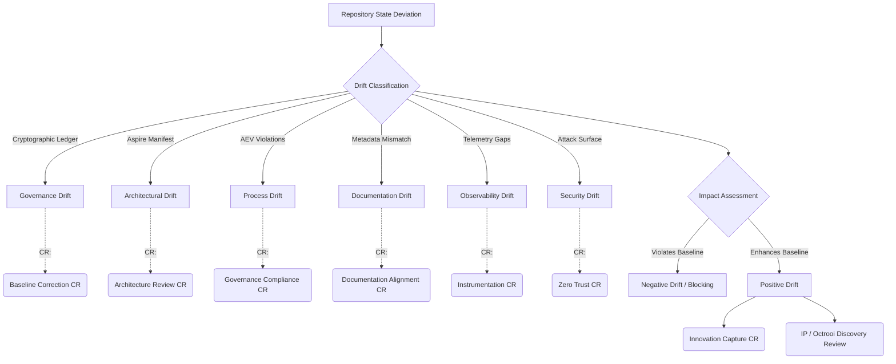

# 🧭 RPAS-CM Drift Taxonomy

This document defines the formal classification of structural and behavioral drift within the ADPA framework.

```mermaid
graph TD
    A[Repository State Deviation] --> B{Drift Classification}
    
    B -->|Cryptographic Ledger| C[Governance Drift]
    B -->|Aspire Manifest| D[Architectural Drift]
    B -->|AEV Violations| E[Process Drift]
    B -->|Metadata Mismatch| F[Documentation Drift]
    B -->|Telemetry Gaps| G[Observability Drift]
    B -->|Attack Surface| H[Security Drift]
    
    C -.->|CR:| C1(Baseline Correction CR)
    D -.->|CR:| D1(Architecture Review CR)
    E -.->|CR:| E1(Governance Compliance CR)
    F -.->|CR:| F1(Documentation Alignment CR)
    G -.->|CR:| G1(Instrumentation CR)
    H -.->|CR:| H1(Zero Trust CR)
    
    B --> I{Impact Assessment}
    I -->|Violates Baseline| J[Negative Drift / Blocking]
    I -->|Enhances Baseline| K[Positive Drift]
    
    K --> L(Innovation Capture CR)
    K --> M(IP / Octrooi Discovery Review)
```