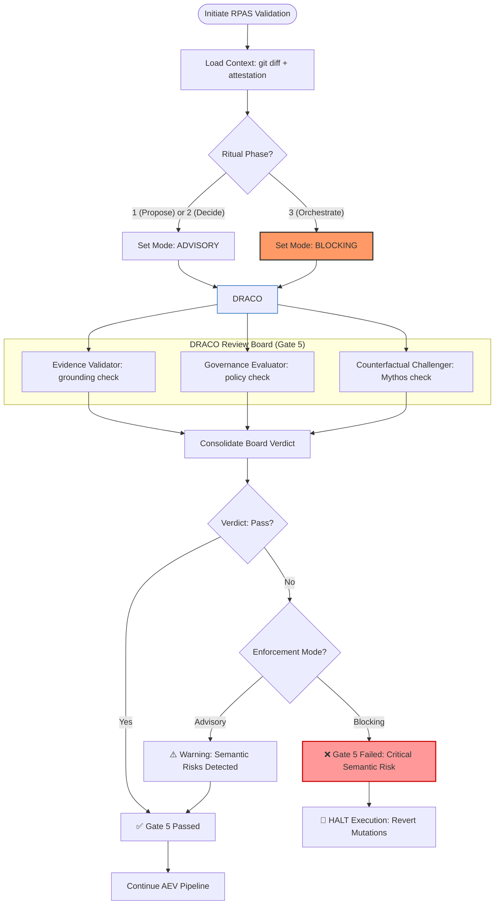

# ✅ **RPAS‑CM Gate 5 Control‑Flow (DRACO)**

The following diagram illustrates the **Semantic Integrity** validation flow during the RPAS lifecycle. It highlights the transition from **Advisory** (Phases 1-2) to **Blocking** (Phase 3) enforcement.

---

## **Key Governance Invariants**

1.  **Authority Sovereignty**: AI cannot block human decisions (Gate 5 = Advisory during Phase 2).
2.  **Execution Immunity**: AI cannot execute ambiguous or unauthorized logic (Gate 5 = Blocking during Phase 3).
3.  **Mythos Prevention**: The Counterfactual Challenger specifically audits for "Shadow Initiative" that was NOT requested in the attestation.

---
**Baseline**: RPAS-CM v2.3.0
**Owner**: DRACO AI Review Board
