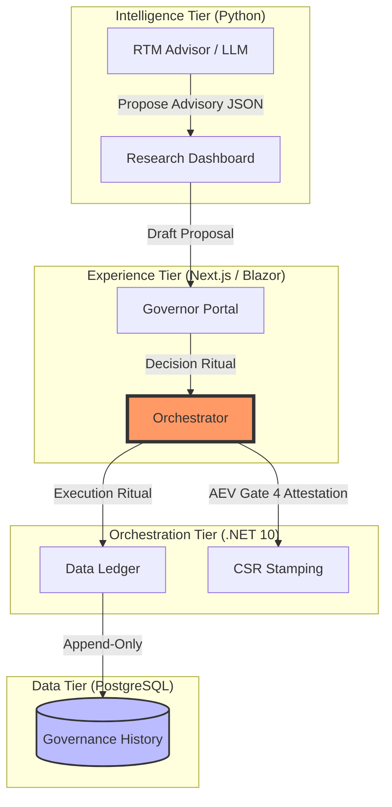
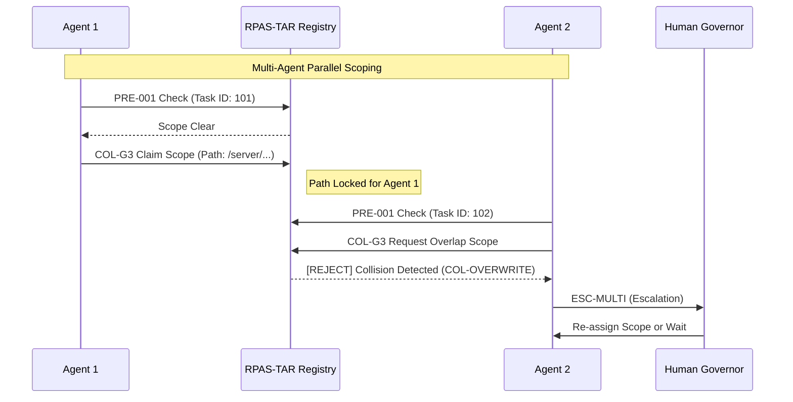

# 📊 **RPAS‑TAR‑COL Collision Matrix**

## **Collision Matrix Overview**

This matrix maps the **Collision‑Prevention (CP)** measures of the **TAR‑COL‑001** protocol against the primary failure modes in multi‑agent and multi‑tier environments.

| Scenario | Mode | Source | TAR Rule | CP Measure |
| :--- | :--- | :--- | :--- | :--- |
| **COL‑OVERWRITE** | Physical | Concurrent file edits | T3 (Authority) | CP2 (Execution Lock) |
| **COL‑DEPENDENCY** | Mechanical | Missing prerequisites | T5 (Ritual) | CP5 (Topology Check) |
| **COL‑SCOPE** | Logical | Ambiguous scope | T4 (Responsibility) | COL-G1 (Task Allocation) |
| **COL‑RACE** | Runtime | Shared resource contention | T3 (Authority) | COL-G3 (Pessimistic Lock) |
| **COL‑INTENT** | Semantic | Divergent interpretations | T1 (Traceability) | CP4 (DRACO Validation) |
| **COL‑AUTHORITY** | Governance | Tier boundary breach | T4 (Responsibility) | CP1 (Tier Prevention) |

***

## **Authority Boundary Diagram (Mermaid)**

***

## **Collision Prevention Flow (Multi-Agent)**

***

## **Enforcement Guarantees**

1.  **Zero-Mutation Outside Rituals**: No component can modify the ledger without a valid `DecisionID` and `AmendmentID`.
2.  **Explicit Authority**: The Experience Tier is physically prohibited from executing state changes.
3.  **Auditability**: Every change in the matrix is attributable to a specific CSR epoch and actor.
